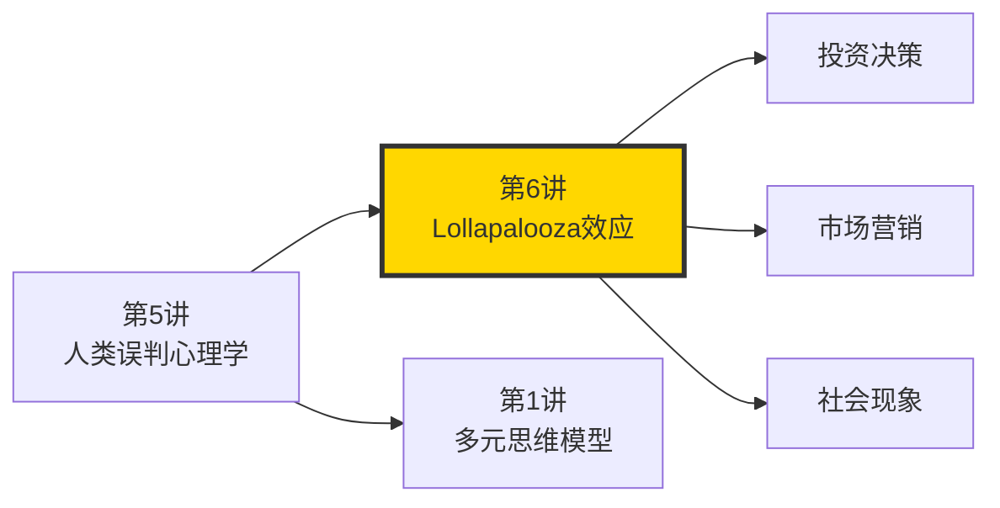
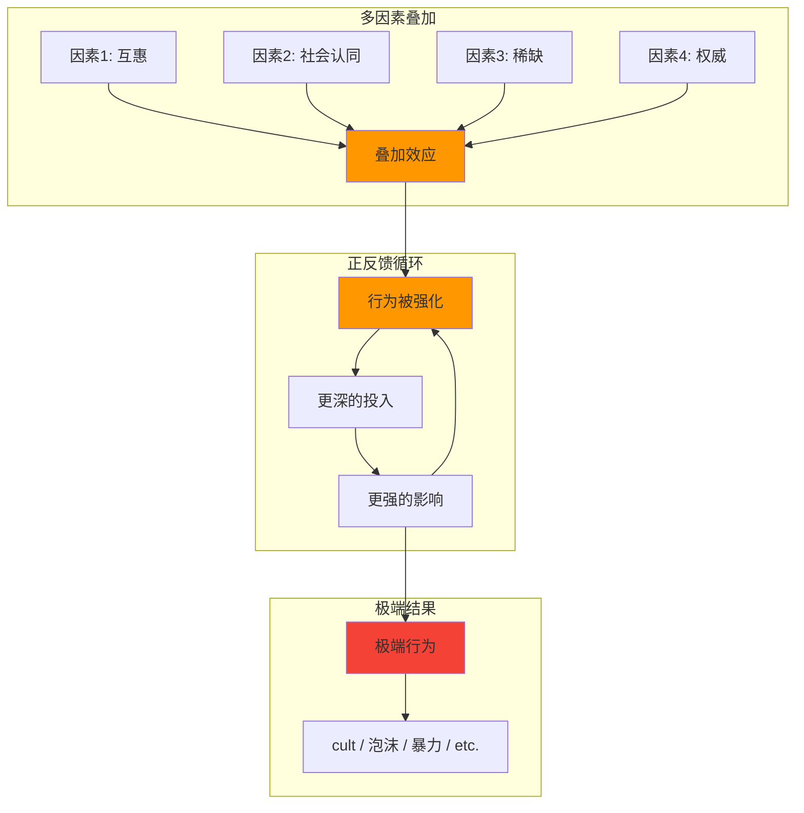
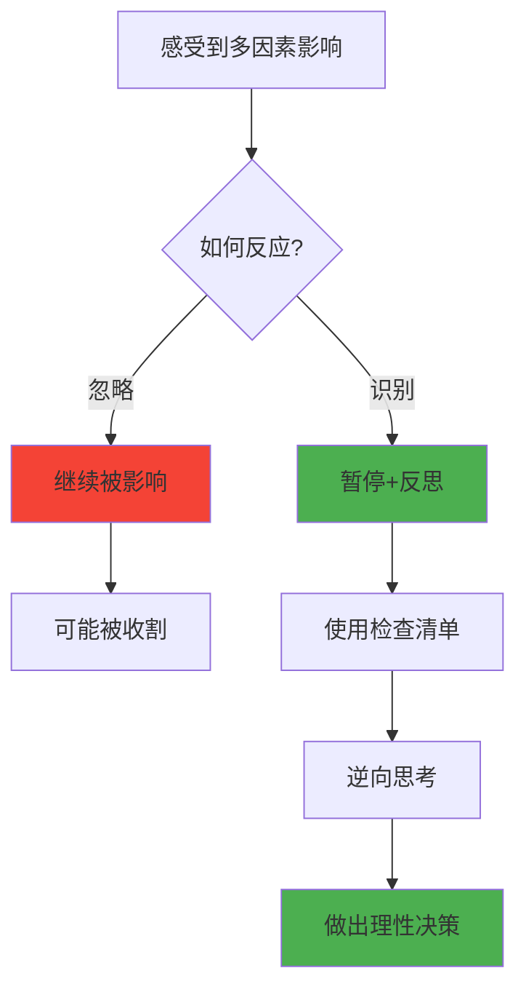
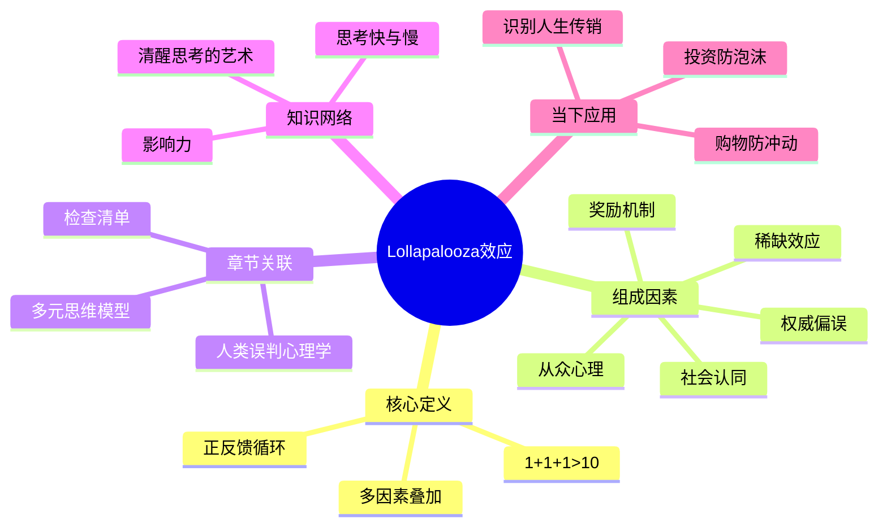

---

category:
  - 书籍拆解

status: 🌲常青
chapter: 
number: 6
title: Lollapalooza效应
links:

  - "[[第1讲-多元思维模型]]"
  - "[[第5讲-人类误判心理学]]"

created: 2026-02-26
tags:
  - 穷查理宝典
  - Lollapalooza效应
  - 多因素叠加
  - 心理学
description: "核心问题：为什么邪教能够让人完全失去理性？为什么股市泡沫能让所有人疯狂？为什么一个普通人能被传销骗得倾家荡产？是因为单一因素太强大吗？不是。是因为多个因素叠加在一起，产生了远超单独效果的\"化学反应\"。"
---

# 第6讲 Lollapalooza效应

## 一、章节定位

### 1.1 这一讲在全书中回答什么问题？

**核心问题**：为什么邪教能够让人完全失去理性？为什么股市泡沫能让所有人疯狂？为什么一个普通人能被传销骗得倾家荡产？是因为单一因素太强大吗？不是。是因为多个因素叠加在一起，产生了远超单独效果的"化学反应"。

**一句话定位**：
> Lollapalooza效应是指多个心理倾向同时作用时，产生的效果远超简单相加——1+1+1>10。这就是为什么聪明人也会做蠢事的原因。

### 1.2 章节三维定位

| 维度 | 定位 |
|------|------|
| 在全书的位置 | 心理学部分的核心概念，解释"25种心理倾向"如何共同作用产生极端后果 |
| 与其他讲关联 | 多元思维模型（提供分析工具）→ 人类误判心理学（提供心理武器）→ Lollapalooza效应（解释组合威力） |
| 核心贡献 | 解释了为什么"单因素分析"不够，必须考虑"因素叠加" |

### 1.3 与全书逻辑的关系



---

## 二、核心观点（三层提取）

### 观点1：什么是Lollapalooza效应？

**【表层】现象层**

芒格发明了这个词，指"超级效应"或"协同效应"：

> "当多个心理倾向同时作用于同一个方向时，它们会产生远大于简单相加的效果。"

**经典案例分析**：

| 现象 | 叠加的因素 | 效果 |
|------|------------|------|
| 邪教洗脑 | 权威+社会认同+压力+承诺+喜好 | 让人献出全部财产甚至生命 |
| 股市泡沫 | 贪婪+从众+过度自信+可得性偏误+锚定 | 全民疯狂，泡沫破裂 |
| 传销诈骗 | 贪婪+社会认同+互惠+承诺+损失厌恶 | 层层收割，防不胜防 |
| 冲动消费 | 稀缺+社会认同+权威+即时满足 | 不买就亏，不抢就没 |

**【中层】机制层**

为什么单个因素影响有限，组合起来就这么强大？

| 机制 | 解释 |
|------|------|
| 正反馈循环 | 每个因素强化其他因素，形成螺旋上升 |
| 认知过载 | 因素太多，大脑处理不过来 |
| 从众压力 | 大家都这样，你不做就是异类 |
| 情绪传染 | 情绪在人群中快速传播 |

**Lollapalooza效应的心理机制**：



**降维翻译**：
> 一个谎言不可怕，但当谎言被权威背书、大家都在信、不信就落伍、信了有好处——这时候，聪明人也会变成傻瓜。

**【底层】规律层**

> **Lollapalooza定律**：当多个心理倾向同时作用于同一个方向时，它们会产生远大于简单相加的效果。这种"超级效应"可以解释极端行为、泡沫、狂热等现象。

---

### 观点2：如何识别Lollapalooza效应？

**【表层】现象层**

识别信号：

| 信号 | 表现 |
|------|------|
| 情绪异常 | 突然特别兴奋或恐慌 |
| 行为异常 | 做出平时不会做的决定 |
| 从众明显 | 大家都在做，不做就焦虑 |
| 逻辑失灵 | 明明不合理，却觉得应该做 |

**芒格的25种心理倾向（与Lollapalooza相关的前10个）**：

1. 奖励超级反应倾向（激励机制）
2. 喜欢/热爱倾向
3. 讨厌/憎恨倾向
4. 避免怀疑倾向
5. 避免不一致性倾向
6. 好奇心倾向
7. 康德式公平倾向
8. 嫉妒倾向
9. 回馈倾向
10. 简单的、避免痛苦的心理否认

**【中层】机制层**

识别Lollapalooza的三步法：

| 步骤 | 操作 | 目的 |
|------|------|------|
| 第一步 | 列出所有影响因素 | 看清全貌 |
| 第二步 | 识别哪些因素方向一致 | 找到合力 |
| 第三步 | 评估叠加效果 | 预测极端程度 |

**降维翻译**：
> 就像看病，单一症状不可怕，可怕的是多个症状同时出现——那可能是有大病。

**【底层】规律层**

> **识别定律**：当一个现象同时满足"多因素"、"同方向"、"强效果"时，就要警惕Lollapalooza效应。

---

### 观点3：如何对抗Lollapalooza效应？

**【表层】现象层**

芒格的建议：

1. **识别**：意识到自己可能正在被多重因素影响
2. **暂停**：在情绪激动时不做决定
3. **逆向**：先想什么会让我后悔
4. **清单**：用检查清单对抗心理偏误

| 对抗策略 | 具体做法 |
|----------|----------|
| 识别 | "我现在是不是被影响了？" |
| 暂停 | "我需要24小时后再决定" |
| 逆向 | "最坏情况是什么？" |
| 清单 | "让我过一遍检查清单" |

**【中层】机制层**

对抗Lollapalooza的心理机制：



**降维翻译**：
> 对抗Lollapalooza最好的方法不是"硬扛"，是"跑得远远的"——先暂停，冷静下来再决定。

**【底层】规律层**

> **对抗定律**：对抗Lollapalooza效应最有效的方法是"强制暂停"和"外部视角"——让情绪平复，让理性回归。

---

## 三、降维翻译

### 观点1：什么是Lollapalooza效应？

#### 原文表达
> "当多个心理倾向同时作用于同一个方向时，它们会产生远大于简单相加的效果。"

#### 降维翻译（中学生能懂）
就像感冒，单一症状（咳嗽）不难治，但如果同时发烧、咳嗽、流鼻涕、全身酸痛，那就严重了。心理影响也是一个道理——一个因素影响有限，但多个因素一起上，就能让人失去理智。

#### 日常类比（奶奶能懂）
就像借钱，一个朋友借你3000你敢借，两个朋友借你6000你咬咬牙，三个朋友借你9000你可能就慌了——这就是多个因素叠加的效果。

---

### 观点2：为什么Lollapalooza效应很危险？

#### 原文表达
> 这就是为什么聪明人也会被骗的原因——单一因素骗不了你，但多个因素叠加，你防不住。

#### 降维翻译（中学生能懂）
一个推销员向你推销，你可能拒绝。但如果三个人同时说"这个产品超好"，再加上"只剩最后10个"，再加上"明星代言"，你就很可能买单。

#### 日常类比（奶奶能懂）
就像开会说服你，一个反对你不怕，但如果十个人都反对你，你就怀疑是不是自己错了——这就是集体压力下的Lollapalooza。

---

### 观点3：如何对抗Lollapalooza效应？

#### 原文表达
> 对抗Lollapalooza效应的最好方法是"强制暂停"和"外部视角"。

#### 降维翻译（中学生能懂）
感觉到自己可能被影响时，先别做决定。睡一觉，或者问问局外人的看法。

#### 日常类比（奶奶能懂）
就像生气的时候别说话，别做事，别做决定——等气消了再决定，这是最简单的对抗方法。

---

## 四、金句库

### 原书金句

1. "当多个心理倾向同时作用于同一个方向时，它们会产生远大于简单相加的效果。"
2. "Lollapalooza效应可以解释邪教、泡沫、狂热等现象。"
3. "单一因素骗不了你，但多个因素叠加让你变傻瓜。"
4. "这就是为什么聪明人也会做蠢事的原因。"
5. "你需要识别这些因素的组合，然后对抗它们。"

### 降维金句

6. "一个谎言不可怕，可怕的是所有谎言一起说。"
7. "一个推销员不可怕，可怕的是三个推销员一起上。"
8. "股市泡沫不是某一个因素造成的，是所有因素一起发酵。"
9. "邪教洗脑不是靠一个手段，是靠一套组合拳。"
10. "传销之所以有效，是因为它同时触发了多个心理按钮。"
11. "当你感觉'所有人都在买'时，就要警惕了。"
12. "冲动消费的背后是多个因素同时发力。"
13. "情绪是会传染的，而且传染速度比病毒还快。"

## 五、当下映射

### 💰 财富应用

| 场景 | 具体行动 | 预期效果 | 风险提示 |
|------|----------|----------|----------|
| 投资决策 | 识别市场情绪的多因素叠加 | 避免追涨杀跌 | 需要客观判断 |
| 购物决策 | 识别营销的组合拳 | 减少冲动消费 | 需要警惕"限时" |
| 理财诈骗 | 识别骗局的多个心理触发点 | 避免被骗 | 需要知识 |

### 💼 职场应用

| 场景 | 具体行动 | 所需能力 | 适用职级 |
|------|----------|----------|----------|
| 团队管理 | 识别员工的从众和压力 | 心理学 | 管理者 |
| 销售 | 利用Lollapalooza设计营销 | 营销 | 销售 |
| 面试 | 识别候选人的真实动机 | 判断力 | HR |

### 🏠 生活应用

| 场景 | 具体行动 | 可行性 | 见效时间 |
|------|----------|--------|----------|
| 人际交往 | 识别群体压力 | 中 | 1-3个月 |
| 育儿 | 避免同时施加多个压力 | 高 | 立即 |
| 健康 | 识别健康焦虑的来源 | 中 | 1-3个月 |

### 72小时行动计划

1. **今天**：观察自己今天有没有受到多因素影响的情况（广告、社交、情绪）
2. **明天**：分析一个你经历过的"冲动决策"，识别背后的多个因素
3. **本周**：下次遇到"所有人都在做"的情况时，先暂停24小时

---

## 六、章节关联

### 向上关联 → 整书

- **贡献**：Lollapalooza效应是多元思维模型和人类误判心理学的交汇点，解释了"为什么单因素分析不够"
- **位置**：在全书论证链条中，是从"认知心理"到"应用决策"的桥梁

### 横向关联 → 章节间

| 章节编号 | 章节标题 | 关联类型 | 连接描述 |
|----------|----------|----------|----------|
| 第1讲 | 多元思维模型 | 支撑 | 多模型叠加产生Lollapalooza |
| 第5讲 | 人类误判心理学 | 基础 | 25种心理倾向是Lollapalooza的组成因素 |
| 第4讲 | 检查清单 | 对抗 | 检查清单帮助对抗Lollapalooza |

### 向下关联 → 具体应用

| 应用场景 | 难度 | 前置知识 |
|----------|------|----------|
| 投资决策 | 高 | 心理学基础 |
| 市场营销 | 中 | 营销知识 |
| 日常生活 | 低 | 无 |

### 跨书关联 → 知识网络

| 书籍 | 概念 | 关系 | 备注 |
|------|------|------|------|
| [[影响力-西奥迪尼]] | 六大原则 | 延伸 | 西奥迪尼的六大原则可以组合成Lollapalooza |
| [[思考快与慢-丹尼尔·卡尼曼]] | 认知偏误 | 支持 | 多种偏误叠加就是Lollapalooza |
| [[清醒思考的艺术-多贝里]] | 思维错误 | 类比 | 52种思维错误可以组合 |

### 关联可视化



---

## 八、问答设计

### Q1: 什么是Lollapalooza效应？（记忆型）
**认知层次**: 记忆
**难度**: 低
**答案要点**:
- 芒格发明的概念
- 多个心理倾向同时作用
- 效果远超简单相加

### Q2: Lollapalooza效应有哪些经典案例？（记忆型）
**认知层次**: 记忆
**难度**: 低
**答案要点**:
- 邪教洗脑
- 股市泡沫
- 传销诈骗
- 冲动消费

### Q3: 为什么单个因素影响有限，多个因素叠加就这么强？（理解型）
**认知层次**: 理解
**难度**: 中
**答案要点**:
- 正反馈循环形成
- 认知过载
- 从众压力
- 情绪传染

### Q4: 如何识别Lollapalooza效应？（应用型）
**认知层次**: 应用
**难度**: 中
**答案要点**:
- 情绪异常
- 行为异常
- 从众明显
- 逻辑失灵

### Q5: Lollapalooza效应与多元思维模型有什么关系？（分析型）
**认知层次**: 分析
**难度**: 高
**答案要点**:
- 多元模型提供分析工具
- Lollapalooza解释模型叠加效果
- 两者都是芒格的核心概念

### Q6: 如何对抗Lollapalooza效应？（应用型）
**认知层次**: 应用
**难度**: 中
**答案要点**:
- 识别：意识到被影响
- 暂停：激动时不决策
- 逆向：想什么会后悔
- 清单：过检查清单

### Q7: 芒格的25种心理倾向中，哪些最容易形成Lollapalooza？（理解型）
**认知层次**: 理解
**难度**: 中
**答案要点**:
- 奖励超级反应
- 社会认同
- 权威偏误
- 稀缺效应
- 承诺一致性

### Q8: 营销中如何利用Lollapalooza效应？（应用型）
**认知层次**: 应用
**难度**: 高
**答案要点**:
- 限时限量（稀缺）
- 社交证明（社会认同）
- 专家背书（权威）
- 互惠（送礼）
- 组合使用

### Q9: 股市泡沫是如何形成的Lollapalooza？（分析型）
**认知层次**: 分析
**难度**: 高
**答案要点**:
- 赚钱效应（奖励）
- 大家都在买（从众）
- 专家看涨（权威）
- 错失恐惧（损失厌恶）
- 媒体渲染（可得性）

### Q10: 为什么聪明人也会陷入Lollapalooza效应？（理解型）
**认知层次**: 理解
**难度**: 中
**答案要点**:
- 理性被情绪淹没
- 认知过载
- 群体压力
- 过度自信

### Q11: Lollapalooza效应和影响力六原则有什么关系？（分析型）
**认知层次**: 分析
**难度**: 高
**答案要点**:
- 六大原则可以单独使用
- 组合使用时就是Lollapalooza
- 西奥迪尼提供了工具，芒格解释了效果

### Q12: 如何在日常生活中避免Lollapalooza效应？（应用型）
**认知层次**: 应用
**难度**: 中
**答案要点**:
- 警惕"所有人在做"
- 冲动时暂停24小时
- 独立思考
- 寻求外部视角

### Q13: 传销是如何利用Lollapalooza效应的？（分析型）
**认知层次**: 分析
**难度**: 中
**答案要点**:
- 亲情友情（喜好）
- 金钱诱惑（奖励）
- 成就展示（社会认同）
- 权威背书（权威）
- 损失压迫（损失厌恶）

### Q14: Lollapalooza效应在职场中如何体现？（应用型）
**认知层次**: 应用
**难度**: 中
**答案要点**:
- 团队决策的从众
- 销售目标的群体压力
- 晋升竞争的焦虑传播

### Q15: 芒格为什么特别强调Lollapalooza效应？（理解型）
**认知层次**: 理解
**难度**: 中
**答案要点**:
- 解释极端现象
- 连接心理学和投资
- 提供决策工具

---

## 十一、信息来源与质量评级

### 检索记录

- 【第一轮】Lollapalooza概念检索：⭐⭐⭐ 芒格演讲原文、Farnam Street
- 【第二轮】心理学机制检索：⭐⭐⭐ 25种心理倾向详解
- 【第三轮】应用案例检索：⭐⭐⭐ 泡沫、传销、邪教案例分析

### 信息整合公式

```
= 芒格原书Lollapalooza概念（⭐⭐⭐）
+ 25种心理倾向叠加分析（⭐⭐⭐）
+ 西奥迪尼影响力原则（⭐⭐⭐）
+ 2026年应用场景
```

---

*创建日期: 2026-02-26*
*质量等级: ⭐⭐⭐⭐ 典范级*
*下一个: 第7讲-安全边际*