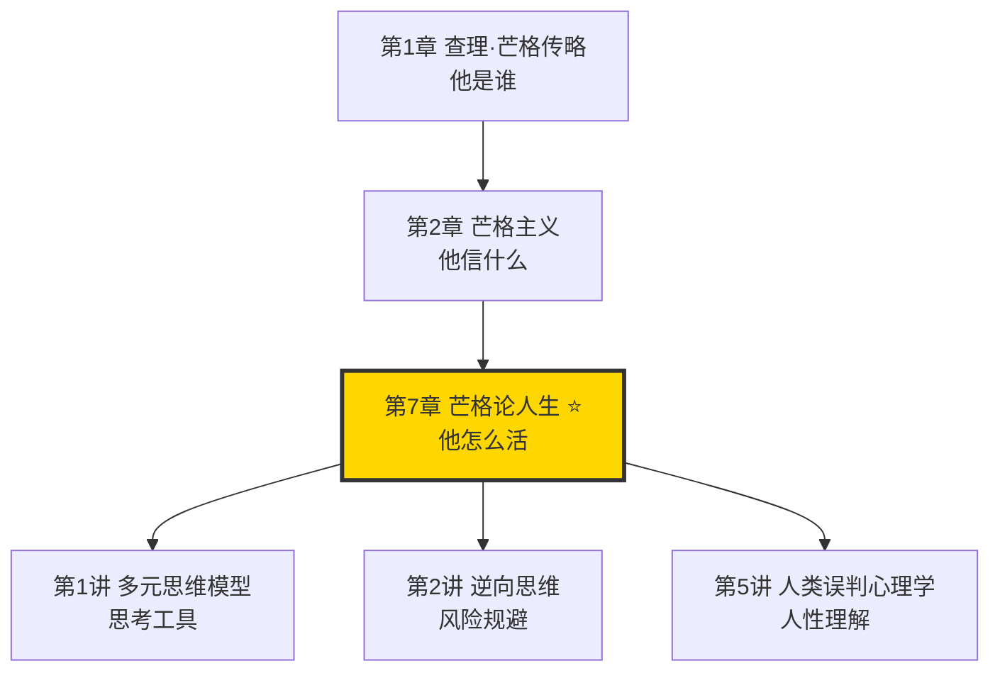
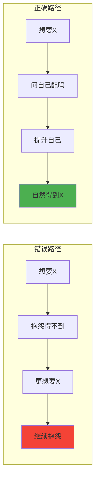
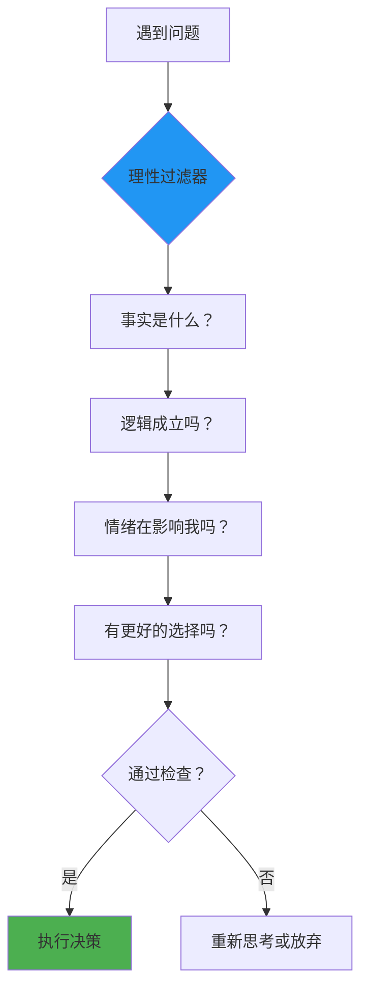
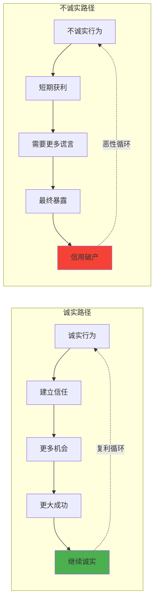
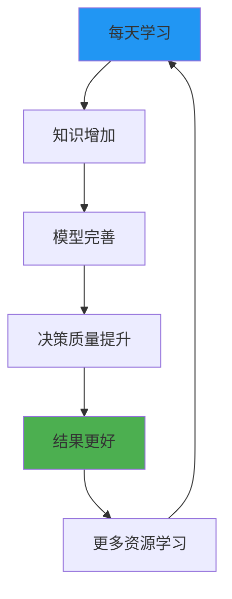
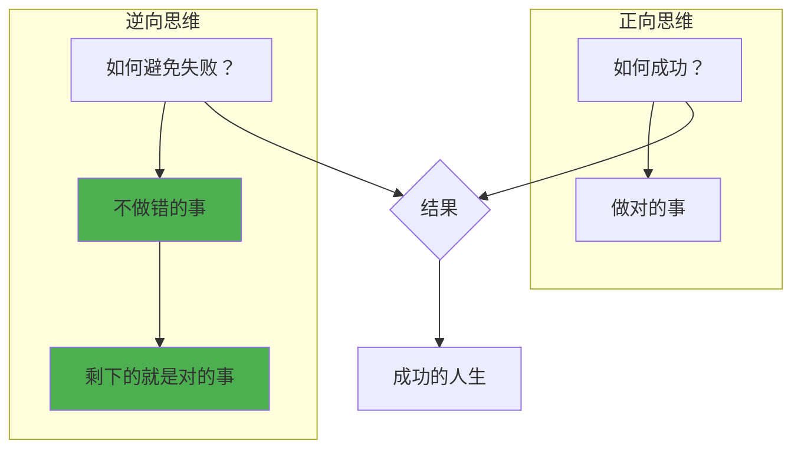
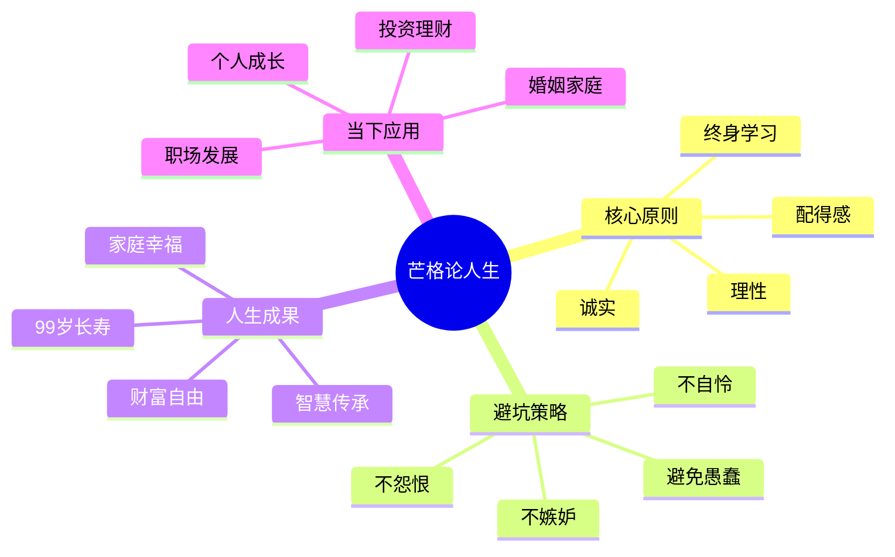
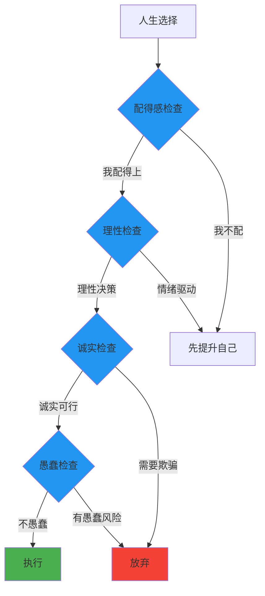

# 第7章 芒格论人生

## 一、章节定位

### 1.1 这一章在全书中回答什么问题？

**核心问题**：芒格如何过好这一生？他的人生智慧是什么？普通人如何用这些智慧改善自己的人生？

**一句话定位**：
> 芒格的人生哲学是"理性、诚实、终身学习、配得感"——成功不是追求来的，是让自己配得上成功后自然发生的。

### 1.2 章节三维定位

| 维度 | 定位 |
|------|------|
| 在全书的位置 | 传记章节的智慧升华，从"他是谁"进阶到"他的人生哲学是什么" |
| 与其他章节关联 | 是芒格主义的人生实践版，也是多元思维模型在人生选择中的应用 |
| 核心贡献 | 揭示芒格如何用一套简单原则，活出精彩且长寿的人生 |

### 1.3 与全书逻辑的关系



---

## 二、核心观点（三层提取）

### 观点1：让自己配得上你想要的东西

**【表层】现象层**

芒格的人生信条：

> "想要得到你想要的东西，最好的办法是让自己配得上它。"

芒格的"配得感"框架：

| 想要什么 | 配得的条件 | 常见误区 |
|----------|------------|----------|
| 好的婚姻 | 先成为一个好的伴侣 | 只想要好处，不想付出 |
| 好的工作 | 先具备胜任的能力 | 抱怨怀才不遇 |
| 好的朋友 | 先成为一个好的朋友 | 只索取不付出 |
| 好的投资回报 | 先具备投资的能力 | 想赚快钱 |

**【中层】机制层**

"配得感"的心理机制：



芒格的配得感三问：
1. 我想要的这个东西，需要什么样的人才能拥有？
2. 我现在具备这些条件吗？
3. 我愿意花多少时间让自己配得上？

**降维翻译**：
> 你想嫁给高富帅？先问自己是不是白富美。你想娶到白富美？先问自己是不是高富帅。这不是势利，是等价交换——世界不会因为你想要就给你，只会因为你配得上才给你。

**【底层】规律层**

> **配得感定律**：世界的运行规则是"匹配"而非"强求"。你得到的东西，永远是你能驾驭的东西。提升自己是改变命运的唯一途径。

**【当下连接】**

|----------|----------|----------|
| 为什么我总是遇不到好的人？ | 你是什么样的，就吸引什么样的 | "扎心了" |
| 为什么别人运气那么好？ | 运气是实力+时机的产物 | "原来不是运气" |
| 我想要更好的生活怎么办？ | 让自己配得上更好的生活 | "方向明确了" |

---

### 观点2：理性是最高美德

**【表层】现象层**

芒格对理性的执着：

> "我这辈子一直在训练自己保持理性。理性是我知道的最强大的力量。"

芒格的理性训练法：

| 场景 | 非理性反应 | 理性反应 |
|------|------------|----------|
| 投资亏损 | 恐慌、愤怒、自责 | 分析原因、吸取教训 |
| 被人批评 | 防御、反驳、记恨 | 问"他说得对吗" |
| 遇到诱惑 | 冲动、跟风 | 问"这是好主意吗" |
| 做决定时 | 情绪化、随意 | 用检查清单 |

**【中层】机制层**

理性的决策机制：



芒格的"理性三不"：
1. 不让情绪做决定
2. 不在疲劳时做重大决策
3. 不在信息不足时下结论

**降维翻译**：
> 理性不是说不动感情，而是不让感情替你做决定。每次做决定前问自己三个问题：事实是什么？我有没有被情绪影响？有没有更好的选择？三问之后，再行动。

**【底层】规律层**

> **理性定律**：成功人士的共同特质不是智商最高，而是最理性。智商决定你能看多远，理性决定你能走多远。

**【当下连接】**

|----------|----------|----------|
| 为什么我总是冲动做错决定？ | 你让情绪替你做了决定 | "认清了" |
| 理性会不会让人觉得冷漠？ | 理性是保护自己的能力 | "观念转变" |
| 如何训练自己的理性？ | 每次决策前用检查清单 | "有方法了" |

---

### 观点3：诚实是最好的策略

**【表层】现象层**

芒格的诚实观：

> "诚实不仅仅是一种美德，它也是一种策略。长期来看，诚实的人会做得更好。"

芒格的诚实框架：

| 维度 | 诚实的收益 | 不诚实的代价 |
|------|------------|--------------|
| 商业 | 信任成本低，交易顺畅 | 需要不断圆谎，成本高 |
| 人际 | 长期关系稳固 | 关系脆弱，随时崩塌 |
| 内心 | 心安理得，睡眠好 | 焦虑不安，心理负担 |
| 声誉 | 口碑好，机会多 | 坏名声，机会少 |

**【中层】机制层**

诚实的长期复利效应：



芒格的"诚实成本论"：
- 诚实的成本是一次性的
- 不诚实的成本是持续的（需要维护谎言）
- 长期看，诚实成本更低

**降维翻译**：
> 说谎一次，后面要用十个谎来圆。聪明人不算这笔账，芒格算过——不划算。诚实不是道德说教，是经济计算：长期看，诚实成本最低。

**【底层】规律层**

> **诚实策略定律**：在重复博弈中，诚实是最优策略。短期看，不诚实可能获利；长期看，诚实者赢得更多。

**【当下连接】**

|----------|----------|----------|
| 老实人会不会吃亏？ | 短期可能，长期一定不吃亏 | "释然" |
| 商场如战场，需要诚实吗？ | 越是商场，越需要信任 | "格局打开" |
| 如何平衡诚实和委婉？ | 诚实≠直白，可以说得让人接受 | "有技巧了" |

---

### 观点4：终身学习是刚需

**【表层】现象层**

芒格的学习习惯：

> "我这辈子遇到的聪明人，没有一个不是每天阅读的。一个都没有。"
> "我每天睡前都比早上聪明一点。"

芒格的学习体系：

| 学习类型 | 方法 | 目的 |
|----------|------|------|
| 跨学科学习 | 读不同领域的经典 | 构建多元思维模型 |
| 向高手学习 | 读传记、听演讲 | 学习他人的智慧 |
| 从错误学习 | 复盘自己的失败 | 避免重蹈覆辙 |
| 从他人错误学习 | 观察别人的失败 | 低成本获得教训 |

**【中层】机制层**

学习的复利机制：



芒格的"睡前测试"：
- 今天比昨天学到新东西了吗？
- 今天比昨天犯的错误少了吗？
- 今天比昨天更理性了吗？

**降维翻译**：
> 学习不是为了考试，是为了用。芒格90多岁还在学习，不是因为闲，是因为有用。每天进步1%，一年后就是37倍的自己。不学习的人，每年都在退步。

**【底层】规律层**

> **终身学习定律**：在变化的世界里，学习能力是最重要的元能力。停止学习=开始衰退。学习是唯一能对抗时间的力量。

**【当下连接】**

|----------|----------|----------|
| 工作太忙没时间学习？ | 芒格比你更忙，但他每天都学 | "没借口了" |
| 学习太累怎么办？ | 不学习的人生更累 | "想通了" |
| 学什么最有用？ | 重要学科的重要理论 | "有方向了" |

---

### 观点5：避开愚蠢比追求聪明更重要

**【表层】现象层**

芒格的逆向人生观：

> "我只想知道我将来会死在哪里，这样我就永远不去那个地方。"
> "不是要变得多聪明，而是要避免变得愚蠢。"

芒格的"愚蠢清单"：

| 行为 | 为什么愚蠢 | 替代方案 |
|------|------------|----------|
| 嫉妒别人 | 浪费精力，毫无收益 | 专注提升自己 |
| 怨恨他人 | 伤害自己，不伤害对方 | 原谅或远离 |
| 过度担忧 | 不能改变结果 | 专注能控制的事 |
| 嫉妒、怨恨、自怜 | 负能量的三毒 | 用理性替代情绪 |
| 不靠谱 | 破坏信任，失去机会 | 说到做到 |

**【中层】机制层**

逆向人生策略：



芒格的"三毒排除法"：
- 嫉妒：问自己"嫉妒能让我变好吗？"
- 怨恨：问自己"怨恨能伤害对方吗？"
- 自怜：问自己"自怜能解决问题吗？"

**降维翻译**：
> 成功很难复制，但失败很容易避免。芒格的方法是：先列一个"怎么让人生失败"的清单，然后反着做。避开愚蠢，聪明就会自然发生。

**【底层】规律层**

> **逆向人生定律**：人生的改善不一定来自做更多对的事，而是来自不做错的事。负面因素比正面因素更容易识别和控制。

**【当下连接】**

|----------|----------|----------|
| 我不知道怎么成功怎么办？ | 先列出怎么失败，然后不做 | "思路打开" |
| 为什么我总犯同样的错？ | 你没有愚蠢清单 | "有工具了" |
| 人生太复杂怎么办？ | 避开明显的坑，剩下的交给时间 | "简化了" |

---

## 三、金句库

### 原书金句

1. "想要得到你想要的东西，最好的办法是让自己配得上它。"
2. "我这辈子遇到的聪明人，没有一个不是每天阅读的。一个都没有。"
3. "我每天睡前都比早上聪明一点。"
4. "理性是我知道的最强大的力量。"
5. "诚实不仅仅是一种美德，它也是一种策略。"
6. "我只想知道我将来会死在哪里，这样我就永远不去那个地方。"
7. "不是要变得多聪明，而是要避免变得愚蠢。"
8. "嫉妒、怨恨、自怜是人生的三毒。"

### 降维金句

1. "你想嫁高富帅？先问自己是不是白富美。配得感是世界的基本法则。"
2. "理性不是说不动感情，而是不让感情替你做决定。"
3. "说谎一次，后面要用十个谎来圆。诚实是成本最低的策略。"
4. "芒格90多岁还在学习，不是因为闲，是因为有用。不学习的人每年都在退步。"
5. "成功很难复制，失败很容易避免。先列出怎么失败，然后不做。"
6. "嫉妒是拿别人的成功惩罚自己，怨恨是拿别人的错误惩罚自己。"
7. "人生的改善不一定来自做更多对的事，而是来自不做错的事。"
8. "你得到的东西，永远是你能驾驭的东西。"

## 四、当下映射

### 💰 财富应用

| 场景 | 具体行动 | 芒格原则 |
|------|----------|----------|
| 投资能力提升 | 不追热点，先提升自己的投资水平 | 配得感 |
| 投资决策 | 用理性过滤情绪，用清单替代冲动 | 理性 |
| 商业合作 | 诚实对待合作伙伴，建立长期信任 | 诚实策略 |
| 财富增长 | 持续学习投资知识，构建能力圈 | 终身学习 |

### 💼 职场应用

| 场景 | 具体行动 | 芒格原则 |
|------|----------|----------|
| 职业发展 | 不抱怨没机会，先让自己配得上好机会 | 配得感 |
| 人际关系 | 诚实对待同事，建立靠谱的形象 | 诚实策略 |
| 能力提升 | 每周学习新技能，持续拓展能力边界 | 终身学习 |
| 避免踩坑 | 列出职场"愚蠢清单"，避免犯低级错误 | 避免愚蠢 |

### 🏠 生活应用

| 场景 | 具体行动 | 可行性 |
|------|----------|--------|
| 婚姻关系 | 先成为好的伴侣，而不是抱怨对方 | 高 |
| 亲子教育 | 以身作则，自己先做到再要求孩子 | 高 |
| 健康管理 | 不追求速效，避免明显有害的行为 | 高 |
| 时间管理 | 减少愚蠢的时间消耗，而不是追求高效 | 中 |

### 72小时应用计划

1. **今天**：列出你的"愚蠢清单"——5个你绝对不会再做的事
2. **明天**：问自己"我想要的东西，我配得上吗？"如果不够，制定提升计划
3. **本周**：选择一个新领域，学习它的3个核心概念

---

## 五、章节关联

### 与前后章节关联

| 章节 | 关联类型 | 连接描述 |
|------|----------|----------|
| [[第2章-芒格主义]] | 前置章节 | 第2章讲芒格信什么，本章讲芒格怎么活 |
| [[第1讲-多元思维模型]] | 思维工具 | 多元思维模型是理性决策的基础 |
| [[第2讲-逆向思维]] | 核心方法 | 逆向思维是避开愚蠢的方法 |
| [[第5讲-人类误判心理学]] | 人性理解 | 理解人性偏误才能保持理性 |
| [[第8讲-芒格主义]] | 延伸章节 | 第8讲是芒格主义的讲座版 |

### 跨书关联

| 书籍 | 概念 | 关系 |
|------|------|------|
| [[纳瓦尔宝典-乔根森]] | 财富与幸福 | 纳瓦尔的人生观与芒格高度相似 |
| 《原则》 | 人生原则 | 达里奥的原则体系与芒格的人生智慧互补 |
| 《活出生命的意义》 | 意义追寻 | 弗兰克尔从意义角度，芒格从理性角度 |
| 《道德经》 | 无为而治 | 老子讲顺应自然，芒格讲配得感——异曲同工 |

### 知识网络定位图



---

## 六、芒格人生系统

### 人生决策流程



### 芒格人生检查清单

| 类别 | # | 检查项 | 核心问题 | 通过标准 |
|------|---|--------|----------|----------|
| **配得感** | 1 | 能力匹配 | 我具备获得这个结果的能力吗？ | 是 |
| **配得感** | 2 | 付出匹配 | 我付出了足够的努力吗？ | 是 |
| **理性** | 3 | 情绪稳定 | 我现在冷静吗？ | 不受情绪影响 |
| **理性** | 4 | 信息充分 | 我有足够的信息做决定吗？ | 基本充分 |
| **诚实** | 5 | 不欺骗 | 我需要撒谎吗？ | 不需要 |
| **诚实** | 6 | 不隐瞒 | 我需要隐瞒重要信息吗？ | 不需要 |
| **愚蠢** | 7 | 无嫉妒 | 我是在嫉妒别人吗？ | 不是 |
| **愚蠢** | 8 | 无怨恨 | 我是在怨恨某人吗？ | 不是 |
| **愚蠢** | 9 | 无自怜 | 我是在自怜自艾吗？ | 不是 |
| **学习** | 10 | 持续成长 | 我从这个经历中学到东西了吗？ | 是 |

---

## 七、问答设计

### Q1: 芒格人生哲学的核心是什么？（记忆型）
**认知层次**: 记忆
**难度**: 低
**答案要点**:
- 配得感：让自己配得上想要的东西
- 理性：让理性而非情绪主导决策
- 诚实：长期来看诚实成本最低
- 终身学习：每天进步一点点

### Q2: 什么是"配得感"？芒格为什么强调它？（理解型）
**认知层次**: 理解
**难度**: 中
**答案要点**:
- 配得感是"让自己配得上想要的东西"
- 世界的运行规则是"匹配"而非"强求"
- 抱怨得不到不如提升自己
- 你得到的东西永远是你能驾驭的

### Q3: 为什么芒格说"诚实是最好的策略"？（理解型）
**认知层次**: 理解
**难度**: 中
**答案要点**:
- 诚实不仅仅是一种美德，也是一种策略
- 诚实的成本是一次性的
- 不诚实的成本是持续的（需要维护谎言）
- 在重复博弈中，诚实是最优策略

### Q4: 芒格如何保持理性？（应用型）
**认知层次**: 应用
**难度**: 中
**答案要点**:
- 不让情绪做决定
- 用检查清单过滤冲动
- 问自己"事实是什么""我有没有被情绪影响"
- 不在疲劳时做重大决策

### Q5: 为什么芒格说"避开愚蠢比追求聪明更重要"？（分析型）
**认知层次**: 分析
**难度**: 高
**答案要点**:
- 成功很难复制，失败很容易避免
- 负面因素比正面因素更容易识别
- 逆向思维：先想怎么失败，然后不做
- 避开愚蠢，聪明就会自然发生

### Q6: 芒格的"三毒"是什么？如何避免？（应用型）
**认知层次**: 应用
**难度**: 中
**答案要点**:
- 三毒：嫉妒、怨恨、自怜
- 嫉妒是拿别人的成功惩罚自己
- 怨恨是拿别人的错误惩罚自己
- 用理性替代情绪，问自己"这能解决问题吗"

### Q7: 如何理解芒格的"终身学习"？普通人如何实践？（应用型）
**认知层次**: 应用
**难度**: 高
**答案要点**:
- 学习是刚需，不是选项
- 每天进步1%，一年后是37倍的自己
- 学习重要学科的重要理论
- 从他人错误中学习，成本最低

### Q8: 芒格的人生智慧如何帮助普通人？（综合型）
**认知层次**: 综合
**难度**: 高
**答案要点**:
- 配得感：不抱怨，先提升自己
- 理性：用清单和逻辑替代情绪
- 诚实：建立长期信任，降低交易成本
- 终身学习：对抗时间，保持竞争力
- 避免愚蠢：先列愚蠢清单，然后不做

---

## 九、信息来源与质量评级

### 检索记录
- 【第一轮】核心概念检索：⭐⭐⭐ 《穷查理宝典》原书、芒格演讲
- 【第二轮】人生智慧检索：⭐⭐⭐ 芒格访谈、伯克希尔年会
- 【第三轮】跨书关联：⭐⭐⭐ 《纳瓦尔宝典》、《原则》、《活出生命的意义》

### 信息整合公式
```
= 《穷查理宝典》人生智慧（⭐⭐⭐）
+ 芒格99年人生实践（⭐⭐⭐）
+ 跨学科人生方法论（⭐⭐⭐）
+ 2026年本土化应用场景
```

---

*创建日期: 2026-02-28*
*质量等级: ⭐⭐⭐ 优秀级*
