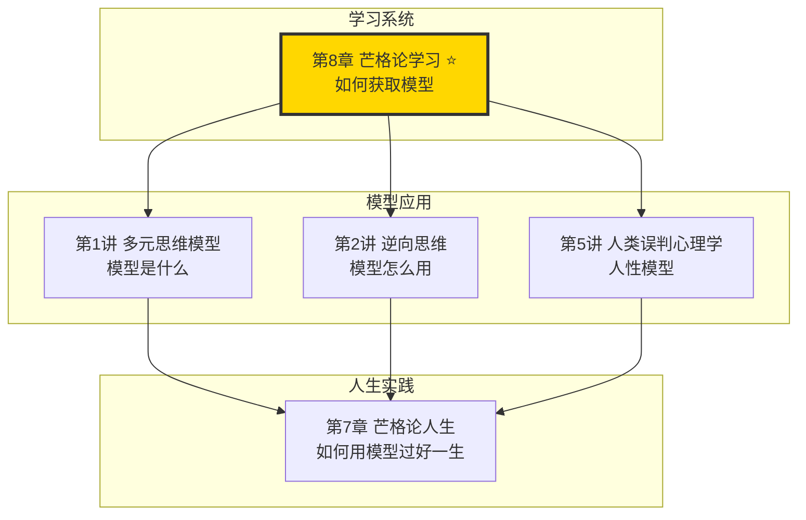
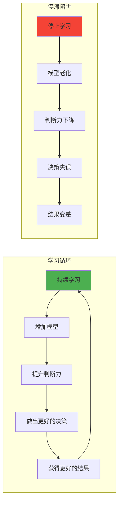
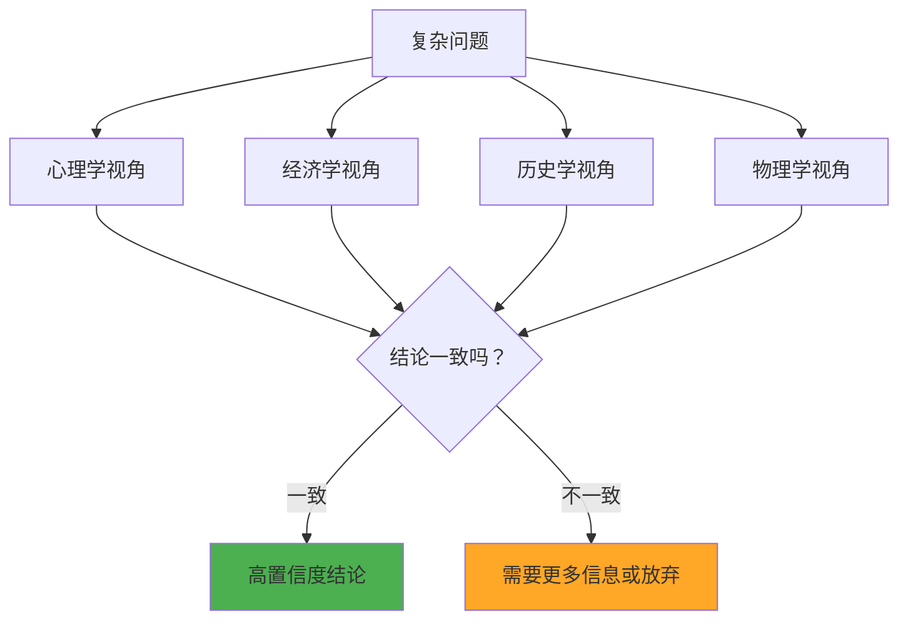
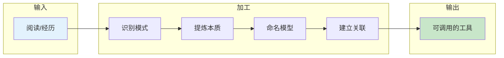
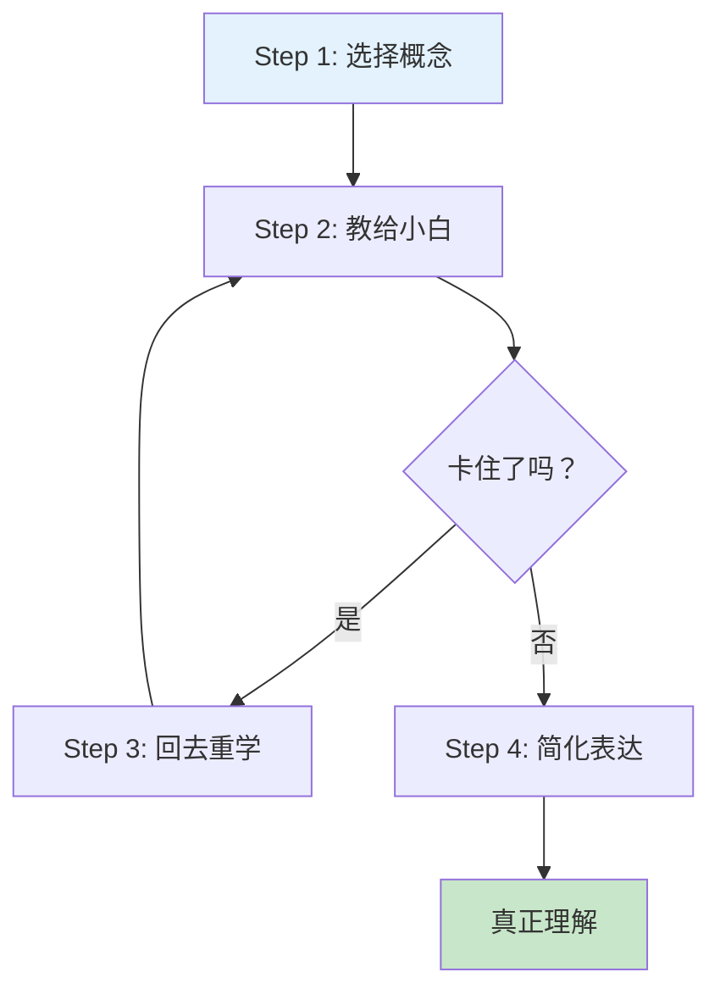
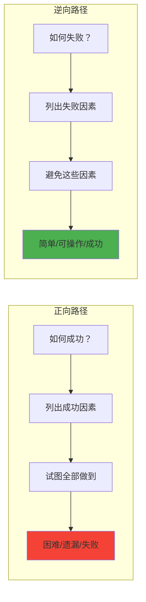

# 第8章 芒格论学习

## 一、章节定位

### 1.1 这一章在全书中回答什么问题？

**核心问题**：芒格如何持续学习？为什么他99岁还在学习？普通人如何建立高效的学习系统？

**一句话定位**：
> 芒格的学习方法不是"多读书"，而是"用多元思维模型武装大脑"——学习的关键不是输入量，而是模型的数量和连接的密度。

### 1.2 章节三维定位

| 维度 | 定位 |
|------|------|
| 在全书的位置 | 全书方法论的"元能力"章节，解释芒格如何获得80-90个思维模型 |
| 与其他章节关联 | 是多元思维模型的"获取路径"，也是芒格论人生的基础能力 |
| 核心贡献 | 揭示芒格"终身学习"背后的方法论，打破"学习=读书"的迷思 |

### 1.3 与全书逻辑的关系



---

## 二、核心观点（三层提取）

### 观点1：终身学习是成功者的标配

**【表层】现象层**

芒格的原话：

> "我这辈子遇到的聪明人，没有一个不是每天都在学习的，一个都没有。"

芒格的学习档案：

| 年龄 | 学习状态 | 典型行为 |
|------|----------|----------|
| 20多岁 | 律师时期 | 自学投资、建筑学 |
| 40多岁 | 投资时期 | 研究心理学、经济学 |
| 60多岁 | 成名之后 | 持续阅读、演讲分享 |
| 90多岁 | 晚年 | 仍在更新思维模型库 |
| 99岁 | 去世前 | 巴菲特说"他还在学习" |

芒格的阅读量：
- 每周阅读量：被家人称为"长着两条腿的书橱"
- 阅读范围：传记、历史、科学、哲学、商业
- 阅读方法：不是"读完"，而是"抽取模型"

**【中层】机制层**

终身学习的复利效应：



芒格的"学习三原则"：

1. **持续**：不是突击学习，而是每天进步一点点
2. **跨学科**：不是在一个领域深耕，而是横向扩展
3. **模型化**：不是记住知识，而是提炼模型

**降维翻译**：
> 聪明人没有秘密，他们只是每天多学一点。一年下来多学365点，十年下来多学3650点。你以为他们天生聪明？不，他们只是在复利学习。

**【底层】规律层**

> **学习复利定律**：知识的积累不是线性的，而是指数的。每天学习1%，一年后你比现在强37倍（1.01^365 ≈ 37.8）。停止学习的人，每天相对退步1%，一年后只剩原来的3%（0.99^365 ≈ 0.03）。

**【当下连接】**

|----------|----------|----------|
| 为什么35岁就被淘汰？ | 你三年没学新东西了 | "扎心了" |
| 学习太累怎么办？ | 不是突击，是每天学一点 | "原来不用卷" |
| 学了记不住怎么办？ | 你学的不是模型，是碎片 | "方向错了" |

---

### 观点2：跨学科学习是打破"锤子综合症"的唯一方法

**【表层】现象层**

芒格的跨学科学习法：

> "你必须知道重要学科的重要理论，并经常使用它们——要全部都用上，而不是只用几种。"

芒格的学科地图：

| 学科 | 核心模型 | 学习难度 | 应用频率 |
|------|----------|----------|----------|
| 心理学 | 25种误判倾向 | ⭐⭐⭐ | 每天 |
| 经济学 | 机会成本、边际效应 | ⭐⭐ | 每天 |
| 物理学 | 临界点、惯性 | ⭐⭐⭐ | 每周 |
| 生物学 | 演化论、适者生存 | ⭐⭐ | 每周 |
| 数学 | 概率论、复利 | ⭐⭐⭐ | 每天 |
| 历史 | 人性重复、周期规律 | ⭐ | 每月 |

**【中层】机制层**

跨学科学习的"交叉验证"机制：



芒格的"T型学习法"：

```
       【横向：多元视野】
  心理学  经济学  物理学  生物学  历史
      ↓     ↓     ↓     ↓     ↓
      ═══════════════════════════
                ↑
       【纵向：能力圈】
        在1-2个领域深挖
```

**降维翻译**：
> 你不需要成为每个领域的博士，你只需要从每个领域"偷"走最厉害的几招。心理学偷3招，经济学偷3招，物理学偷3招……80个模型就是80招绝技，够你用一辈子。

**【底层】规律层**

> **跨学科定律**：单一学科的视角永远有盲区。多个学科的视角交叉验证，才能接近真相。芒格说"80-90个模型能载你走完90%的路程"，剩下10%需要更多模型或运气。

**【当下连接】**

|----------|----------|----------|
| 我不是学霸，能跨学科吗？ | 你只需要每个学科的"大概念" | "原来不用读博士" |
| 跨学科会不会样样稀松？ | 横向够广 + 纵向够深 = T型人才 | "明白了" |
| 哪里去找这些模型？ | 从经典书籍、高手分享、自己提炼 | "有方向了" |

---

### 观点3：把知识变成模型，把模型变成工具

**【表层】现象层**

芒格的学习定义：

> "学习的目的不是记住知识，而是获得可以随时调用的思维模型。"

知识 vs 模型的区别：

| 维度 | 知识 | 模型 |
|------|------|------|
| 形态 | 散点信息 | 结构化框架 |
| 记忆 | 需要重复 | 一旦理解就记住 |
| 应用 | 需要检索 | 自动激活 |
| 例子 | "复利是利息生利息" | "复利思维=小变化×时间=大结果" |

芒格的模型化过程：

1. **读**：阅读经典书籍、传记、案例
2. **抽**：抽取可复用的模式
3. **命**：给模型起个好记的名字
4. **连**：和已有模型建立关联
5. **用**：在决策中反复使用

**【中层】机制层**

从知识到模型的转化机制：



芒格的模型命名艺术：

| 原本的知识 | 芒格命名的模型 | 为什么好记 |
|------------|----------------|------------|
| 单一视角导致的认知偏差 | 锤子综合症 | 画面感极强 |
| 多因素叠加的极端效应 | Lollapalooza效应 | 有趣好记 |
| 决策者和风险承担者分离的后果 | 代理人问题 | 直指本质 |
| 做减法比做加法更容易 | 逆向思维 | 简单有力 |

**降维翻译**：
> 知识是食材，模型是菜谱。你不需要记住所有食材，你只需要掌握菜谱。有了菜谱，什么食材都能做出好菜。

**【底层】规律层**

> **模型化定律**：大脑不擅长记住散点信息，但擅长记住结构。把知识变成模型，就是把"需要记忆"的东西变成"需要理解"的东西。理解一次，终身可用。

**【当下连接】**

|----------|----------|----------|
| 为什么书读了就忘？ | 你在读知识，不是在提炼模型 | "原来如此" |
| 如何检验自己学会了？ | 能用自己的话讲清楚，能举一反三 | "有检验标准了" |
| 模型太多记不住怎么办？ | 常用的模型会自动记住，不常用的本来就不重要 | "不用焦虑了" |

---

### 观点4：费曼技巧——能教别人才算真懂

**【表层】现象层**

芒格的学习检验标准：

> "如果你不能简单地解释它，你就没有真正理解它。"（虽然这句话常被归于费曼，但芒格的方法本质上是一样的）

芒格的教学实践：
- 每年在伯克希尔年会上回答股东提问
- 在 USC、斯坦福等大学发表演讲
- 通过《穷查理宝典》分享思维模型
- 巴菲特说"听芒格讲15分钟，胜过读10本书"

**【中层】机制层**

费曼技巧的四步法：



芒格的"教学检验法"：

1. **假装教学**：想象你要把这个概念讲给一个中学生听
2. **发现卡点**：哪里讲不清楚，就是哪里没懂
3. **回去补课**：重新学习那个卡点
4. **再次尝试**：直到能流畅地讲清楚

**降维翻译**：
> 学习的最高境界不是"我懂了"，而是"我能让你也懂"。如果你讲不清楚，说明你只是"以为自己懂了"，不是"真的懂了"。

**【底层】规律层**

> **费曼定律**：理解深度的最佳检验标准是"教学能力"。能教会别人，说明你已经把知识内化为自己的模型；教不会别人，说明你还在"背诵"而非"理解"。

**【当下连接】**

|----------|----------|----------|
| 如何检验学习效果？ | 试着教给别人 | "有方法了" |
| 我没有学生怎么办？ | 假装教给中学生，或者写成文章 | "可以自己练习" |
| 教别人会不会浪费时间？ | 教学是最好的复习，双赢 | "原来不是浪费时间" |

---

### 观点5：逆向学习——先知道什么会让你变蠢

**【表层】现象层**

芒格的逆向学习法：

> "告诉我会死在哪里，我就永远不去那里。"

应用于学习的逆向思维：

| 正向问题 | 逆向问题 |
|----------|----------|
| 如何学好？ | 什么会让你学不好？ |
| 如何变聪明？ | 什么会让你变蠢？ |
| 如何提升判断力？ | 什么会损害判断力？ |

芒格列出的"变蠢清单"：

1. 只从一个角度看问题
2. 只和同意自己的人交流
3. 不承认自己会犯错
4. 被情绪左右决策
5. 不学习新东西
6. 相信"这次不一样"
7. 过度自信

**【中层】机制层**

逆向学习的心理机制：



芒格的"避免愚蠢"学习法：

1. 先列出所有会让你"学不好"的行为
2. 逐一避免这些行为
3. 剩下的就是"学得好"的路径

**降维翻译**：
> 与其研究"学霸是怎么学习的"，不如研究"学渣是怎么学习的"，然后反着来。避免变蠢，就自然变聪明了。

**【底层】规律层**

> **逆向学习定律**：对于复杂系统（包括学习），正向思考往往遗漏关键因素，逆向思考更容易找到"必须避免"的错误。不做蠢事的人，最终会超过做聪明事的人。

**【当下连接】**

|----------|----------|----------|
| 为什么我学了还是没用？ | 你可能在犯"变蠢清单"里的错误 | "需要反思" |
| 如何避免学习陷阱？ | 先列出所有会让你学不好的行为 | "有清单了" |
| 逆向思维好难，怎么做？ | 从"反面案例"开始分析 | "有切入点" |

---

## 三、金句库

### 原书金句

1. "我这辈子遇到的聪明人，没有一个不是每天都在学习的，一个都没有。"
2. "你必须知道重要学科的重要理论，并经常使用它们。"
3. "学习的目的不是记住知识，而是获得可以随时调用的思维模型。"
4. "如果你不能简单地解释它，你就没有真正理解它。"
5. "告诉我会死在哪里，我就永远不去那里。"
6. "80或90个重要模型能载你走完90%的路程。"
7. "我这辈子一直在训练自己保持理性。"
8. "手里只有一把锤子的人，看什么都像是钉子。"

### 降维金句

1. **终身学习**："聪明人没有秘密，他们只是每天多学一点"
2. **跨学科学习**："你不需要成为每个领域的博士，只需要从每个领域'偷'走最厉害的几招"
3. **模型化学习**："知识是食材，模型是菜谱"
4. **费曼技巧**："学习的最高境界不是'我懂了'，而是'我能让你也懂'"
5. **逆向学习**："与其研究学霸怎么学，不如研究学渣怎么学，然后反着来"

## 五、系统关联

### 与《Ultralearning》的关联（方法论呼应）

| 《穷查理宝典》 | 《Ultralearning》 |
|----------------|-------------------|
| 多元思维模型 | 元学习（先画地图） |
| 跨学科学习 | 直接性（做中学） |
| 费曼技巧 | 检索练习（测试自己） |
| 逆向思考 | 实验（走出舒适区） |

**关联金句**：
> 芒格的"模型化学习"是 Ultralearning 中的"元学习"，
> 芒格的"费曼技巧"是 Ultralearning 中的"检索练习"，
> 两者结合 = 最强学习系统

### 与《第1讲 多元思维模型》的关联

| 第8章 芒格论学习 | 第1讲 多元思维模型 |
|------------------|-------------------|
| 如何获取模型 | 模型是什么 |
| 学习方法 | 应用方法 |
| 输入端 | 输出端 |

**关联金句**：
> 第8章告诉你"如何获得80-90个模型"，
> 第1讲告诉你"这80-90个模型是什么"，
> 先学方法，再用方法

### 与《第7章 芒格论人生》的关联

| 第8章 芒格论学习 | 第7章 芒格论人生 |
|------------------|------------------|
| 获得智慧的方法 | 应用智慧的领域 |
| 元能力 | 人生实践 |
| "怎么学" | "学来干什么" |

**关联金句**：
> 学习是芒格人生的"输入端"，
> 人生智慧是学习的"输出端"，
> 没有持续学习，就没有持续成长

---

## 八、直接应用

### 72小时内应用

1. 选择一个最近学到的概念，试着讲给别人听（费曼技巧）
2. 列出你的"变蠢清单"——什么行为会让你学不好（逆向学习）
3. 从一个陌生学科中找到1个核心模型（跨学科学习）

### 微应用设计

| 读书笔记 | 芒格式笔记 |
|----------|------------|
| 摘抄金句 | 提炼模型 |
| 写读后感 | 用模型分析一个案例 |
| 收藏起来 | 用费曼技巧讲给别人听 |

---

## 九、检索测试

### 1天后回顾
- [ ] 复述芒格学习的五个核心观点
- [ ] 说出三个降维金句

### 7天后复述
- [ ] 闭卷写出本章的思维导图
- [ ] 用费曼技巧讲给一个人听

---

*拆解日期：2026-02-28*
*拆解模式：标准模式*
