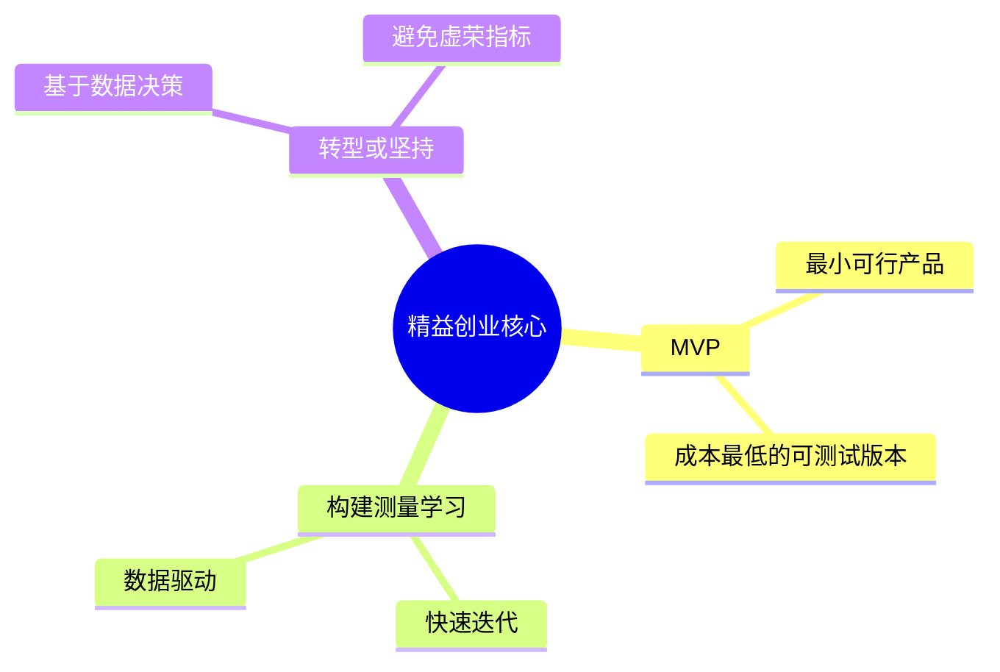

# 《精益创业》拆解记录

## 这本书要解决什么问题？

**核心困境**：为什么90%的创业公司会失败？为什么那么多精心策划的产品没人要？

埃里克·里斯的回答：创业不是在做计划，而是在做实验。用最小的成本、最快的速度验证假设，失败了就快速转型。

**一句话定位**：
> 创业不是把产品做出来再卖，而是用最小可行产品测试市场，快速学习，要么成功要么快速失败。

### 作者站在什么位置说这些话？

| 维度 | 定位 |
|------|------|
| 主领域 | 创业方法论、产品管理、敏捷开发 |
| 跨界领域 | 精益生产、设计思维、实验科学 |
| 作者背景 | IMVU联合创始人、硅谷创业教父、精益创业运动发起人 |
| 理论谱系 | 丰田精益生产理念在创业领域的应用 |

### 和其他书有什么关系？

| 关联书籍 | 关联关系 | 共同底层逻辑 |
|----------|----------|--------------|
| [[从0到1-彼得蒂尔-拆解记录]] | 方法论互补 | 蒂尔讲垄断创新，里斯讲快速验证 |
| [[纳瓦尔宝典-乔根森-拆解记录]] | 财富创造 | 纳瓦尔讲专长知识+杠杆，里斯讲MVP验证 |
| [[原则-拆解记录]] | 系统化思维 | 达利欧讲原则+进化，里斯讲构建-测量-学习 |

### 知识网络图

---

## 作者的核心论点

### MVP——最小可行产品

Dropbox用视频演示验证需求，产品还没做就获得7.5万用户。Zappos去实体店拍照上传，有人买再去实体店买来发货。Airbnb用气垫床和早餐测试"共享住宿"概念。

MVP不是功能最全的产品，而是成本最低的可测试版本。它可以是一张图、一个视频、一个着陆页。

> **MVP定律**：创业不是关于产品，而是关于学习。最快的学习方式是做最小可行实验，而不是做最完美的产品。

想象你要开一家餐厅：传统方式是花100万装修，做完整菜单，开业后发现没人来；精益方式是先摆个小摊，炒几个菜试试，看有没有人买，有人买再开店。MVP就是那个小摊——先用最少钱看看你的想法对不对。

这个观点打碎了我对"产品"的假设。我一直以为要先做完美的产品再发布，但精益创业告诉我：先做最小的实验，验证假设再迭代。

### 构建-测量-学习循环

传统方式：详细计划 → 花大价钱开发 → 推向市场。每次循环以月或年为单位。

精益方式：快速构建 → 测量数据 → 学习调整 → 再构建。每次循环以周为单位。

| 传统方式 | 精益方式 |
|----------|----------|
| 靠感觉做决策 | 靠数据做决策 |
| 失败后才意识到方向错误 | 快速失败，快速转型 |

> **验证循环定律**：创业成功的关键不是第一次就做对，而是能以最快速度迭代到正确方向。

想象你在玩电子游戏：传统方式是不尝试就直接打BOSS，结果打不过，重来又打不过；精益方式是先打小怪升级，测量能力，学习技巧，再去打BOSS。构建-测量-学习循环就是那个"升级过程"——每次都学一点，最后打BOSS就容易了。

### 转型或坚持——基于数据的决策

成功转型案例：Instagram最初是签到应用Burbn，分析数据发现用户最爱分享照片，转型为照片分享平台。YouTube最初是视频约会网站，用户没兴趣，转型为通用视频平台。Slack最初是游戏公司的内部工具，发现更有价值，转型为协作软件。

关键决策指标：

| 指标类型 | 虚荣指标（误导） | 可执行指标（真实） |
|----------|-----------------|-----------------|
| 用户量 | 总用户数（下载量） | 活跃用户数（日活/周活） |
| 使用情况 | 访问次数 | 使用时长、功能使用率 |
| 商业价值 | 浏览量 | 转化率、留存率、付费率 |

> **转型定律**：创业不是坚持原方案，而是坚持解决问题。当数据显示方向不对，快速转型的能力比坚持的勇气更重要。

想象你在开车去目的地：传统方式是一直往前开，不管是不是走错了，开到头发现错了；精益方式是开一段就看看GPS，发现走错了，立即转弯。转型不是承认失败，而是"GPS说方向错了，我换条路"。

### 验证性学习——创业即实验

核心转变：从"我知道用户需要什么" → 到"我假设用户需要什么"。从"我要做这个产品" → 到"我要验证这个假设"。从"执行我的计划" → 到"做实验验证我的想法"。

验证性学习的本质：不是证明你是对的，而是发现市场的真实情况。即使是"失败"的实验，只要学到了东西，就是成功。

> **验证性学习定律**：创业不是赌博，是科学实验。每次实验都在回答一个问题，累积的答案 = 对市场的理解。

想象你在做科学实验：传统创业是我相信这个实验会成功，直接做，失败了也不知道为什么；精益创业是我假设会成功，先做小实验验证，对了继续，错了调整。验证性学习就是"科学实验方法"——不是靠运气，是靠验证。

---

## 这本书的局限

| 批评点 | 谁在批评 | 怎么说 |
|--------|---------|--------|
| 方法论局限性 | HBR文章 | 过度依赖客户反馈，忽视战略思考 |
| 适用性争议 | 学术研究 | 不适用于所有行业，快速迭代可能损害品牌价值 |
| MVP概念被滥用 | Reforge博客 | 很多创业者把"烂产品"当MVP |

**一句话总结局限性**：
> 精益创业是方法论，不是教条。用来验证假设，不是用来逃避战略思考。

---

## 最值得记住的话

**原书说的**：
1. "创业管理就是要在不确定的情况下建立新企业。"
2. "MVP不是做最烂的产品，而是做能验证假设的最小产品。"
3. "转型不是失败，是基于新认知的战略调整。"
4. "我们不是在制造产品，我们是在学习如何建立可持续的业务。"
5. "失败不是问题，缓慢失败才是问题。"

**翻译成人话**：
1. 不是把产品做完美再卖，而是用最小成本测试市场
2. 创业不是赌博，是做实验
3. 失败不可怕，可怕的是慢慢失败
4. 数据不会撒谎，但你的假设可能会
5. 最快的失败是最好的成功

---

## 讲给没读过的人听

为什么90%的创业公司会失败？

因为他们把创业当赌博，不是当实验。他们花大钱做完美产品，推向市场才发现没人要。

精益创业的思路不同：先做最小可行产品（MVP），快速验证假设，要么成功要么快速失败。

Dropbox用视频演示就获得7.5万用户，产品还没做。Zappos去实体店拍照上传，有人买再去买来发货。Airbnb用气垫床和早餐测试概念。

核心是"构建-测量-学习"循环：快速构建 → 测量数据 → 学习调整 → 再构建。循环越快，学习越快。

转型不是承认失败，是用更聪明的方式赢。Instagram最初是签到应用，发现用户最爱分享照片，就转型了。

创业不是赌博，是科学实验。

---

## 用来检验理解的问题

**基础回忆**：
1. Q: 什么是MVP？
   A: 最小可行产品——成本最低的可测试版本，用来验证假设，不是功能最全的产品。

2. Q: "构建-测量-学习"循环是什么？
   A: 快速构建 → 测量数据 → 学习调整 → 再构建。每次循环都是一次实验。

**理解验证**：
1. Q: 虚荣指标和可执行指标的区别是什么？
   A: 虚荣指标让你感觉良好但无法指导决策（如总用户数）；可执行指标能指导行动（如活跃用户数、留存率）。

2. Q: 为什么说"最快的失败是最好的成功"？
   A: 快速失败意味着快速学习。慢速失败只是浪费资源。精益创业追求快速迭代，快速验证。

---

## 和其他书的对话

蒂尔教你如何找到方向，里斯教你如何验证方向。从0到1讲战略选择，精益创业讲执行方法。两者结合：方向+验证=创业成功。

纳瓦尔告诉你什么是专长知识，里斯告诉你如何验证专长知识。知道自己擅长什么+验证市场需要=创业成功。

达利欧教你建立原则系统，里斯教你建立实验系统。原则导航方向，实验验证假设。两者结合：系统化思维+科学实验方法。

---

*拆解日期：2026-02-15*
*下次回访：1周后回顾「讲给没读过的人听」和「检验问题」*