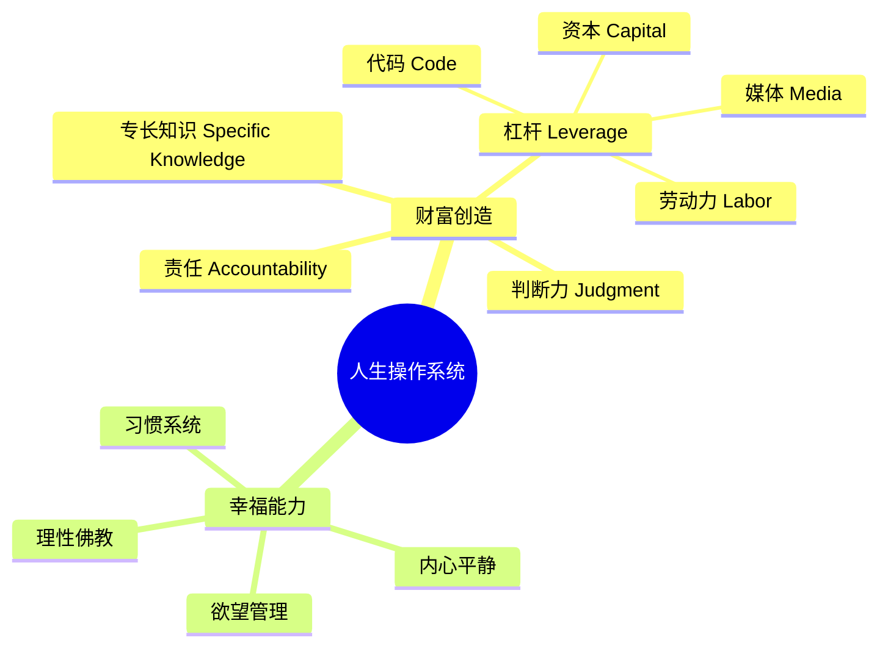

# 《纳瓦尔宝典》读书笔记

## 这本书要解决什么问题？

**核心困境**：不是问"如何变富？"，而是问"如何同时拥有财富与幸福？"

大多数书只讲财富（如《富爸爸穷爸爸》）或只讲幸福（如《幸福的陷阱》）。《纳瓦尔宝典》解决的是：财富与幸福如何兼得的系统问题。

**一句话定位**：
> 把自己产品化，用专长知识+杠杆创造财富，用欲望管理获得幸福。

### 作者站在什么位置说这些话？

| 维度 | 定位 |
|------|------|
| 主领域 | 人生哲学 → 财富创造 + 幸福能力 |
| 跨界领域 | 投资学、决策理论、进化心理学、佛教哲学 |
| 思想者背景 | 纳瓦尔·拉维坎特，AngelList创始人，Uber/Twitter早期投资人，硅谷顶级天使投资人 |
| 编者 | 埃里克·乔根森，将纳瓦尔推文、播客、访谈整理成书 |

### 和其他书有什么关系？

| 关联书籍 | 关联关系 | 共同底层逻辑 |
|----------|----------|--------------|
| [[富爸爸穷爸爸-清崎]] | 互补 | 清崎讲"什么是资产"，纳瓦尔讲"如何创造资产" |
| [[反脆弱-塔勒布]] | 互补 | 塔勒布讲"从混乱中获益"，纳瓦尔讲"拥有反脆弱收入" |
| [[穷查理宝典]] | 延伸 | 芒格提供"多元思维模型"，纳瓦尔提供"如何用模型创富" |
| [[黑天鹅-塔勒布]] | 应对 | 塔勒布识别极端事件，纳瓦尔提供"不确定中创富"方法 |

### 知识网络图

---

## 作者的核心论点

### 财富不是目标，是副产品

大多数人追求"变富"，但不知道什么是真正的财富。纳瓦尔的定义：财富 = 你睡觉时也能赚钱的资产。

三者的区别：财富（股权、知识产权、投资组合）睡觉时赚钱；金钱（工资、奖金）工作时赚钱；地位（职级、头衔）你上升意味着别人下降（零和游戏）。

为什么出卖时间无法致富？时间是有限的，收入有上限。资产可复制，收入无上限。你必须拥有股权——一块生意的一部分。

> **纳瓦尔财富定律**：财富创造 = 专长知识 × 杠杆 × 判断力 × 复利

这个观点打碎了我对"高薪"的迷信——高薪只是出租时间，停工就断粮。真正的财富来自拥有资产，不是出卖时间。

### 三种杠杆——代码、资本、劳动力

纳瓦尔的经典分类：劳动力杠杆（让别人为你工作，最古老最难管理）；资本杠杆（用钱生钱，需要本金需要许可）；代码/媒体杠杆（写一次无限复制，最强大无需许可）。

| 杠杆类型 | 获得方式 | 可复制性 | 门槛 |
|----------|----------|----------|------|
| 劳动力 | 需要别人跟随你 | 难 | 高 |
| 资本 | 需要别人给你钱 | 中 | 高 |
| 代码 | 只需一台电脑 | 无限 | 中 |
| 媒体 | 只需创作内容 | 无限 | 低 |

> **杠杆定律**：在互联网时代，代码和媒体是无需许可的杠杆——这是普通人第一次拥有无限杠杆的机会。

想象你要搬1000块砖：自己搬（没杠杆）；雇10个人帮你搬（劳动力杠杆，需要付钱）；写个程序让机器人帮你搬（代码杠杆，一次编写无限使用）；拍个视频教全世界的人搬砖（媒体杠杆，一次创作无限传播）。方法C和D是新时代的杠杆，无需任何人许可。

### 专长知识——别人学不来的护城河

专长知识是社会无法培训你的知识。如果社会能培训你，社会就能培训别人来取代你。专长知识来源于你的DNA、成长背景、好奇心和痴迷。

| 特征 | 可培训技能 | 专长知识 |
|------|------------|----------|
| 来源 | 学校、证书、培训 | DNA、背景、痴迷 |
| 可替代性 | 高 | 低（只有你有） |
| 感觉 | 像工作 | 像玩 |

> **专长知识定律**：专长知识无法被教授，但可以被学习——通过追随你的好奇心。

你做起来像玩、别人看起来像工作的事 = 你的专长知识。不要追逐热门技能，追随你的好奇心。

### 判断力——方向比速度更重要

努力的作用被大大高估了。判断力的作用被大大低估了。智慧 = 知道个人行为的长期后果。

在杠杆时代，判断力为什么更重要？无杠杆时代决策错误的影响有限；杠杆时代决策错误被杠杆放大成灾难。

> **判断力定律**：在杠杆时代，一个正确的决策可以让你赢一切；一个错误的决策可以让你输一切。

最终结果 = 方向（判断力） × 速度（努力） × 杠杆。如果方向错误，努力×杠杆 = 灾难。

下次遇到职业选择，我不会再问"哪个更努力"，而是问"哪个方向更正确"。

### 幸福是可学习的技能

纳瓦尔的定义：幸福 = 内心的平静，不是外在的刺激。欲望 = 你和自己签的合约：在得到你想要的东西之前，你不会快乐。

想象你总是在追兔子：追到了，你开心一会儿；然后你又看到更大的兔子；你永远在追，永远不满足。幸福不是追到兔子，而是不需要追兔子。

> **幸福定律**：幸福是内生的，它来自内心平和，而不是外在认可。

真正的赢家是退出游戏的人。

---

## 这本书的局限

| 批评点 | 谁在批评 | 怎么说 |
|--------|---------|--------|
| 特权盲视 | 底层读者 | 纳瓦尔作为硅谷天使投资人，有资本承担风险；普通人有房贷家庭压力，无法轻易"发现专长知识" |
| 幸存者偏差 | 统计学者 | 只看到"用这套方法成功的人"，没有"用这套方法失败的人"的数据 |
| 原创性争议 | 思想史研究者 | 很多思想来自塔勒布、芒格、佛教、斯多葛哲学，纳瓦尔只是整合和重新表达 |
| 实用性质疑 | 普通读者 | "找到你的专长知识"说起来容易，很多人根本不知道自己痴迷什么 |

**纳瓦尔的回应**：
> 他的论点是：专长知识+杠杆**提高**好运的概率，不是"保证成功"。把它当作"思维框架"，不是"成功配方"。

**一句话总结局限性**：
> 核心公式（专长知识×杠杆）提高成功概率，但不保证成功。把它当作框架，不要当作配方。

---

## 最值得记住的话

**原书说的**：
1. "你不会通过出租时间变富。你必须拥有股权——一块生意的一部分。"
2. "专长知识是你无法被培训的知识。如果社会能培训你，社会就能培训别人来取代你。"
3. "把自己产品化。"
4. "欲望就是你和自己的约定：在得到你想要的东西之前，你不会快乐。"
5. "努力工作的作用被大大高估了。判断力被低估了。"
6. "幸福是内生的。它来自于内心平和，而不是外在认可。"

**翻译成人话**：
1. 你睡觉时赚钱，才是真正的富
2. 别人学不来的，才是你的护城河
3. 能无限复制的，才是真正的杠杆
4. 方向比速度重要100倍——特别是在运用杠杆以后
5. 欲望越少，痛苦越少
6. 代码和媒体是无需许可的杠杆——历史上从未有过这样的机会
7. 真正的赢家不是赢在游戏里的人，而是退出游戏的人

---

## 讲给没读过的人听

为什么有些人越努力越穷，有些人睡觉时也在赚钱？区别在于：一个在出租时间，一个在拥有资产。

纳瓦尔说：财富 = 你睡觉时也能赚钱的资产。如果你停工3个月，收入会降到多少？如果答案是"零"，那你在出租时间，不是拥有资产。

怎么破局？找到你的专长知识——你做起来像玩、别人看起来像工作的事。然后用杠杆规模化——代码或媒体，一次创作无限复制。最后用判断力选择正确方向——方向错误，努力×杠杆 = 灾难。

但财富只是硬币的一面。另一面是幸福。纳瓦尔的定义：幸福 = 内心的平静，不是外在的刺激。欲望是你和自己签的不开心合约。越少欲望，越少痛苦。

财富不是目标，是副产品。幸福不是天赋，是技能。两者都可以学习。

---

## 用来检验理解的问题

**基础回忆**：
1. Q: 纳瓦尔如何定义"财富"？
   A: 你睡觉时也能赚钱的资产。区别于金钱（工作时赚钱）和地位（零和游戏）。

2. Q: 四种杠杆是什么？哪种最适合普通人？
   A: 劳动力、资本、代码、媒体。代码和媒体最适合普通人——无需许可，门槛低，无限复制。

**理解验证**：
1. Q: 为什么"判断力在杠杆时代更重要"？
   A: 杠杆会放大决策结果。一个正确决策可以赢一切，一个错误决策可以输一切。

2. Q: "专长知识"和"可培训技能"的区别是什么？
   A: 专长知识来源于DNA、背景、痴迷，社会无法培训；可培训技能别人也能学，容易被替代。

**实际应用**：
1. Q: 如何发现你的专长知识？
   A: 回忆小时候你痴迷做什么；找到你做起来像玩、别人看起来像工作的事；问3个朋友"你觉得我最擅长什么"。

---

## 和其他书的对话

清崎告诉你什么是资产，纳瓦尔告诉你如何创造资产。清崎是旧时代的财商启蒙（买房、买股票），纳瓦尔是新时代的财富操作系统（专长知识+杠杆）。共同底层：被动收入是财富的核心。

塔勒布说黑天鹅不可预测，纳瓦尔说但你可以拥有反脆弱收入。塔勒布教你不死，纳瓦尔教你活着的时候顺便变富。共同底层：建立不依赖单一来源的收入系统。

芒格给你一把锤子，纳瓦尔告诉你去哪里敲。穷查理是工具箱，纳瓦尔是使用说明书。共同底层：清晰的思维是财富的前提。

---

*拆解日期：2026-02-14*
*下次回访：1周后回顾「讲给没读过的人听」和「检验问题」*