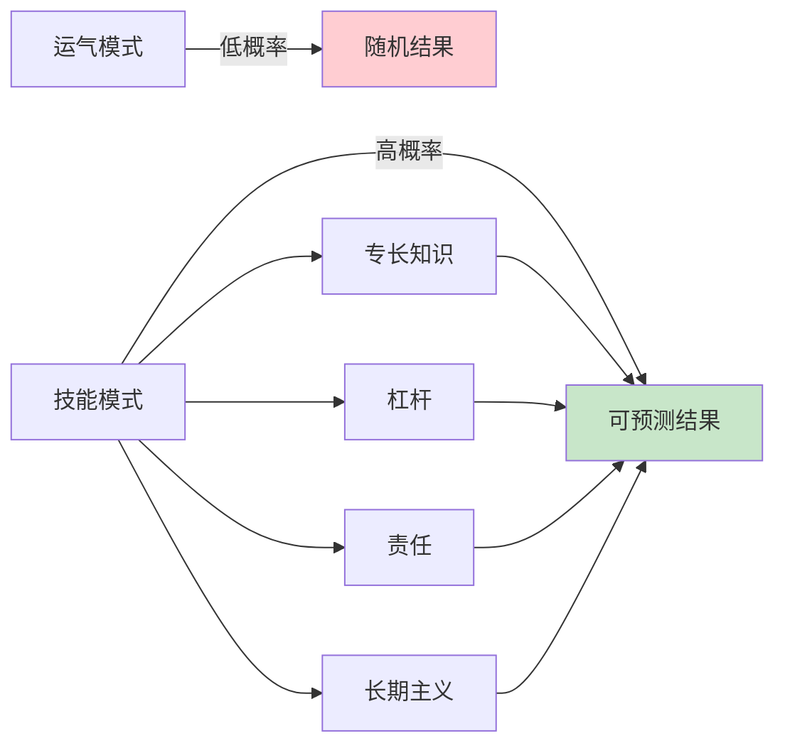
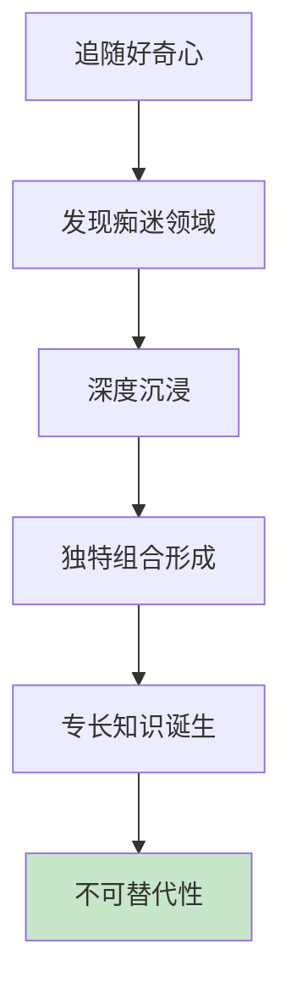
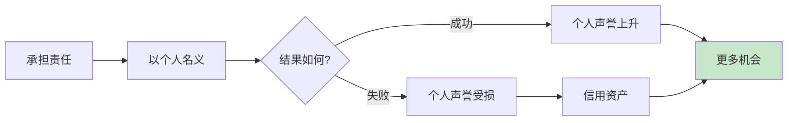
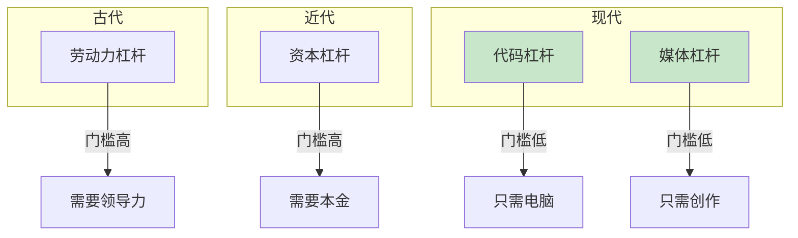
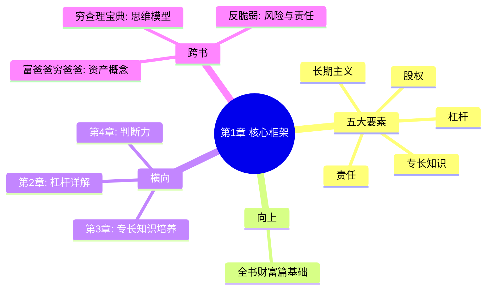

# 第1章 积累财富：如何不靠运气致富

> **核心概念**：财富不是靠运气
> **主题**：如何不靠运气致富

## 📍 章节定位

### 全书位置
> 本章源自纳瓦尔2018年著名的"如何不靠运气致富"推特风暴，是《纳瓦尔宝典》财富篇的核心宣言

- **全书核心问题**: 如何同时拥有财富与幸福？
- **本章回答的问题**: 财富可以预测吗？如何让致富变得必然而非偶然？
- **角色类型**: 方法论框架型 - 提供完整的财富创造系统
- **论证位置**: 建立"财富创造是一套可学习技能"的认知基础

### 与原章节的关系
| 维度 | 原第1章"财富定义" | 本章"积累财富" |
|------|-------------------|----------------|
| **焦点** | 什么是财富 | 如何创造财富 |
| **视角** | 概念澄清 | 方法论框架 |
| **核心问题** | 财富≠金钱≠地位 | 致富=可预测技能 |
| **功能** | 建立认知 | 提供路径 |

### 一句话定位
> 本章论证"致富不需要运气"——通过培养专长知识、承担责任、运用杠杆、长期主义，你可以让财富创造变得必然

---

## 🎯 核心观点（三层提取）

### 观点1：财富不是靠运气——它是可学习的技能

#### 【表层】现象层

**纳瓦尔的推特风暴（2018）**：
- 纳瓦尔在推特发布了约40条推文
- 主题："如何不靠运气致富"（How to Get Rich without Getting Lucky）
- 核心论点：财富创造是一套可以学习的技能，而非运气游戏

**反直觉观点**：
```
传统认知：致富=运气+机会+出身
纳瓦尔观点：致富=技能系统×时间复利
```

#### 【中层】机制层

**为什么财富不是靠运气？**

| 运气依赖型 | 技能依赖型 |
|------------|------------|
| 买彩票、赌博 | 专长知识×杠杆 |
| 等待机会 | 创造机会 |
| 被动等待 | 主动构建 |
| 不可复制 | 可复制放大 |
| 零和游戏 | 正和游戏 |

**纳瓦尔的机制图解**：



#### 【底层】规律层

> **财富确定性定律**：当你把财富创造拆解为可学习的技能组合（专长知识+杠杆+责任+长期主义），运气的因素被最小化，结果的确定性被最大化

**与概率论的联系**：
- 运气 = 不可控的随机变量
- 技能 = 可控的系统变量
- 系统变量越多 → 方差越小 → 结果越可预测

#### 【当下连接】2026场景

|----------|----------|----------|
| 为什么别人运气好，我没有？ | 他们不是运气好，是技能系统不同 | "原来不是我倒霉" |
| 能不能复制别人的成功？ | 复制的是思维模式，不是具体行为 | "有方法可循" |
| 我没有背景，能致富吗？ | 背景是加速器，不是必需品 | "有希望" |

---

### 观点2：专长知识——社会无法培训你的东西

#### 【表层】现象层

**纳瓦尔的定义**：
> "专长知识（Specific Knowledge）是无法被培训的知识。如果社会能培训你，它就能培训别人来取代你。"

**特征识别表**：

| 特征 | 专长知识 | 可培训技能 |
|------|----------|------------|
| **来源** | DNA+成长背景+好奇心 | 学校+证书+培训 |
| **感觉** | 像玩，不像工作 | 像工作 |
| **可替代性** | 极低 | 很高 |
| **例子** | 销售直觉、创意组合、人脉能力 | 会计、编程基础、外语 |

#### 【中层】机制层

**专长知识的形成路径**：



**为什么专长知识无法被培训？**
1. **个性化来源**：来自你的独特DNA和成长背景
2. **隐性知识**：难以用语言传授的直觉和判断
3. **组合创新**：跨领域知识的独特化学反应
4. **热爱的结果**：只有真正热爱才能达到的深度

#### 【底层】规律层

> **专长知识定律**：专长知识无法被教授，但可以被学习——学习的路径是追随你的好奇心，而非追逐热门技能

**与比较优势理论的联系**：
- 李嘉图比较优势：专注于你相对擅长的
- 纳瓦尔深化：专注于只有你能做到的

#### 【降维翻译】

**中学生能懂的解释**：
- 学校教的东西，所有人都能学会
- 但你从小痴迷的东西、你觉得好玩的东西，别人可能学不会
- 找到"你做起来像玩，别人看起来像工作"的事——那就是你的专长

**奶奶能懂的解释**：
- 就像有人天生会说话，有人天生会算数
- 你做起来轻松的事，别人做起来累
- 把那件事做到极致，就是你的绝活

---

### 观点3：承担责任——用你的名义冒险

#### 【表层】现象层

**纳瓦尔的定义**：
> "责任（Accountability）意味着你愿意以自己的名义承担风险。"

**责任的表现**：
- 在作品上署名
- 以个人品牌行事
- 承担失败后果的同时，也获得成功回报

#### 【中层】机制层

**责任与回报的关系**：



**为什么责任重要？**
| 有责任 | 无责任 |
|--------|--------|
| 收益归你 | 收益归组织 |
| 风险归你 | 风险归别人 |
| 声誉积累 | 声誉归零 |
| 长期复利 | 一次性交易 |

#### 【底层】规律层

> **责任定律**：社会会奖励承担风险的人——以责任的名义，你获得与风险匹配的回报

**与《非对称风险》的联系**：
- 塔勒布：谁承担风险，谁应该获得收益
- 纳瓦尔：用你的名义承担风险，你才能获得最大收益

---

### 观点4：杠杆——放大你的产出

#### 【表层】现象层

**纳瓦尔的四种杠杆分类**：

| 杠杆类型 | 获得方式 | 复制性 | 需要许可 | 时代适用性 |
|----------|----------|--------|----------|------------|
| 劳动力 | 雇人 | 低 | 是 | 古老 |
| 资本 | 融资 | 中 | 是 | 近代 |
| 代码 | 写程序 | **无限** | **否** | **现代** |
| 媒体 | 创作内容 | **无限** | **否** | **现代** |

#### 【中层】机制层

**杠杆的演进**：



**无需许可杠杆的革命性**：
- 历史上第一次，普通人可以拥有无限杠杆
- 不需要别人给你钱或给你工作
- 你只需要一台电脑和创作能力

#### 【底层】规律层

> **杠杆定律**：在互联网时代，代码和媒体是无需许可的杠杆——这是普通人第一次拥有无限杠杆的机会

---

### 观点5：长期主义——与长期的人玩长期的游戏

#### 【表层】现象层

**纳瓦尔的格言**：
> "如果你想在社会上出类拔萃，你必须和长期的人玩长期的游戏。"

**复利在所有领域的作用**：
- 知识：每天学习，复利增长
- 关系：长期信任，复利增值
- 声誉：长期一致，复利积累
- 财富：长期投资，复利放大

#### 【中层】机制层

**短期 vs 长期博弈**：

| 维度 | 短期博弈 | 长期博弈 |
|------|----------|----------|
| **信任** | 一次性交易 | 重复博弈 |
| **声誉** | 不重要 | 核心资产 |
| **合作** | 零和思维 | 正和思维 |
| **策略** | 最优化眼前 | 投资未来 |
| **结果** | 有限收益 | 指数增长 |

#### 【底层】规律层

> **长期主义定律**：在长期博弈中，声誉和信任是复利资产——短期损失可以换来长期指数回报

---

## 💬 降维翻译

### 核心公式降维

**原文**：
> 财富创造 = 专长知识 × 杠杆 × 责任 × 长期主义

**降维翻译（中学生能懂）**：
```
变富 = 你独特擅长的事 × 能放大的工具 × 敢承担责任 × 持续做下去
```

**生活类比**：
- 专长知识 = 你的"独门绝技"
- 杠杆 = 让一个人干十个人的活
- 责任 = 用自己的名字担保
- 长期主义 = 时间是你的朋友

### 关键概念翻译表

| 原表达 | 降维表达 |
|--------|----------|
| "专长知识" | "别人学不来，只有你会的东西" |
| "杠杆" | "让你的一份努力变成十份回报的工具" |
| "责任" | "用你的名字做担保，赢了你拿，输了你赔" |
| "长期主义" | "和靠谱的人，做能积累的事" |
| "无需许可的杠杆" | "不需要任何人点头就能用的杠杆" |
| "把自己产品化" | "把你的能力变成能卖的产品" |

---

## ✨ 金句库

### 原书金句（⭐⭐⭐权威来源）

1. "你不会通过出租时间变富。你必须拥有股权——一块生意的一部分。"

2. "专长知识是你无法被培训的知识。如果社会能培训你，社会就能培训别人来取代你。"

3. "把自己产品化。"

4. "学会销售。学会构建。如果你能做两者，你将所向披靡。"

5. "如果你想在社会上出类拔萃，你必须和长期的人玩长期的游戏。"

6. "努力工作的作用被大大高估了。判断力被低估了。"

7. "代码和媒体是无需许可的杠杆——这是新时代的财富钥匙。"

8. "责任意味着你愿意以自己的名义承担风险。"

9. "财富创造不是零和游戏。每个人都可能富有。"

10. "找到你做起来像玩、别人看起来像工作的事。"

### 降维金句（便于传播）

11. "你睡觉时赚钱，才是真正的富。"

12. "别人学不来的，才是你的护城河。"

13. "能无限复制的，才是真正的杠杆。"

14. "方向比速度重要——有了杠杆，方向更重要。"

15. "用你的名字做担保，你才能拿最大的收益。"

16. "和长期的人玩长期的游戏——信任是复利的。"

17. "你不需要任何人许可——代码和媒体是你的杠杆。"

18. "找到你的痴迷，把它变成产品。"

19. "财富不是运气游戏，是技能游戏。"

20. "把能力变成资产，时间才能成为朋友。"

## 🔗 当下映射

### 💰 财富应用（2026场景）

| 场景 | 传统思维 | 纳瓦尔思维 |
|------|----------|------------|
| 副业 | 打第二份工（无杠杆） | 做课程/写代码（有杠杆） |
| 投资 | 买股票（资本杠杆） | 做自媒体/开源项目（无需许可杠杆） |
| 职业 | 爬梯子（线性增长） | 产品化自己（指数增长） |
| 学习 | 考证刷学历（可培训技能） | 追随好奇心（专长知识） |

### 💼 职场应用

| 场景 | 具体行动 | 所需能力 |
|------|----------|----------|
| 岗位竞争 | 发展只有你能做的技能 | 专长知识识别 |
| 晋升方向 | 用个人名义承担责任 | 风险承受力 |
| 职业规划 | 考虑工作的扩展性 | 长期思维 |
| 副业开发 | 选择无需许可的杠杆 | 代码/媒体能力 |

### 🏠 生活应用

| 场景 | 具体行动 | 见效时间 |
|------|----------|----------|
| 思维转变 | 把"变富需要运气"换成"变富是技能问题" | 立即 |
| 时间分配 | 每天投入1小时发展专长知识 | 3-6个月 |
| 杠杆选择 | 开始学习代码或内容创作 | 6-12个月 |
| 责任承担 | 用自己的名字做项目 | 立即 |

### 72小时行动计划

1. [ ] 识别你的专长知识：问3个朋友"我最擅长什么？"
2. [ ] 评估你的杠杆选择：代码/媒体/资本/劳动力？
3. [ ] 找到一个可以用你名字做的项目
4. [ ] 列出你正在交往的"长期的人"

---

## 🕸️ 章节关联

### 向上关联 → 全书
- **贡献**: 为全书财富方法论奠定基础框架
- **位置**: 作为财富篇的核心方法论，为后续杠杆、专长知识、判断力章节提供统一视角

### 横向关联 → 章节间

| 章节 | 关联类型 | 连接描述 |
|------|----------|----------|
| 原第1章 | 概念基础 | 财富定义 → 财富方法论 |
| 第2章 | 工具深化 | 杠杆概念 → 四种杠杆详解 |
| 第3章 | 能力深化 | 专长知识概念 → 发现与培养 |
| 第4章 | 决策深化 | 长期主义 → 判断力体系 |

### 跨书关联 → 知识网络

| 书籍 | 关联类型 | 共同底层 |
|------|----------|----------|
| [[富爸爸穷爸爸-清崎-拆解记录]] | 互补 | 清崎定义"什么是资产" → 纳瓦尔讲"如何创造资产" |
| [[反脆弱-塔勒布-拆解记录]] | 互补 | 塔勒布讲"风险" → 纳瓦尔讲"责任" |
| [[穷查理宝典-拆解记录]] | 延伸 | 芒格提供"思维模型" → 纳瓦尔提供"财富模型" |
| [[从0到1-彼得蒂尔-拆解记录]] | 平行 | 蒂尔讲"垄断" → 纳瓦尔讲"专长知识" |

### 关联可视化



---

## ❓ 问答设计

### Q1: [记忆型] 纳瓦尔提出的财富创造公式是什么？
**认知层次**: 记忆
**难度**: 低
**答案要点**:
- 财富创造 = 专长知识 × 杠杆 × 责任 × 长期主义
- 四个要素缺一不可
- 是乘法关系，任何一个为零则结果为零

### Q2: [理解型] 为什么纳瓦尔说"财富不是靠运气"？
**认知层次**: 理解
**难度**: 中
**答案要点**:
- 运气是不可控的随机变量
- 技能是可控的系统变量
- 当你把财富拆解为可学习的技能，运气的因素被最小化
- 专长知识+杠杆+责任+长期主义 = 可预测的结果

### Q3: [应用型] 我应该如何发现自己的专长知识？
**认知层次**: 应用
**难度**: 中
**答案要点**:
- 问自己：什么事我做起来像玩，别人看起来像工作？
- 问3个朋友：你觉得我最擅长什么？
- 回忆小时候你痴迷做什么
- 专长知识往往在DNA+成长背景+好奇心的交叉点

### Q4: [分析型] 分析四种杠杆的区别和应用场景
**认知层次**: 分析
**难度**: 中
**答案要点**:
- 劳动力：古老，需要领导力，难复制
- 资本：近代，需要本金，需许可
- 代码：现代，只需电脑，无限复制，无需许可
- 媒体：现代，只需创作，无限复制，无需许可
- 普通人应优先选择代码或媒体杠杆

### Q5: [理解型] 什么是"责任"？为什么它对财富创造重要？
**认知层次**: 理解
**难度**: 中
**答案要点**:
- 责任 = 用你的名义承担风险
- 意味着：成功归你，失败也归你
- 重要性：社会奖励承担风险的人
- 与《非对称风险》的联系：谁承担风险，谁获得收益

### Q6: [分析型] 纳瓦尔的财富观与传统财富观的核心区别是什么？
**认知层次**: 分析
**难度**: 中
**答案要点**:
- 传统：追求高薪、地位、消费
- 纳瓦尔：追求股权、被动收入、资产
- 传统：运气思维
- 纳瓦尔：技能思维
- 传统：零和游戏
- 纳瓦尔：正和游戏

### Q7: [应用型] 结合本章内容，制定一个普通人3年财富创造计划
**认知层次**: 应用
**难度**: 高
**答案要点**:
- 第1年：发现专长知识，学习无需许可杠杆（代码/媒体）
- 第2年：用个人名义承担责任，开始积累声誉
- 第3年：长期主义执行，复利效应显现
- 关键：从出租时间转向拥有资产

### Q8: [评价型] 纳瓦尔"不靠运气致富"的观点有什么局限性？
**认知层次**: 评价
**难度**: 高
**答案要点**:
- 起点：忽略了不同人的起点差异
- 幸存者偏差：只看到成功者
- 时代局限：互联网时代才有的机会
- 资源门槛：需要一定的教育资源和时间余量
- 但：这是"提高概率"的方法，不是"保证成功"

### Q9: [理解型] 什么是"无需许可的杠杆"？为什么它重要？
**认知层次**: 理解
**难度**: 中
**答案要点**:
- 无需许可 = 不需要任何人点头就能用
- 代码和媒体是两种无需许可的杠杆
- 重要性：历史上第一次，普通人可以拥有无限杠杆
- 不需要资本、不需要人脉、只需要技能

### Q10: [分析型] "和长期的人玩长期的游戏"是什么意思？
**认知层次**: 分析
**难度**: 中
**答案要点**:
- 长期博弈：重复交易，声誉重要
- 短期博弈：一次性交易，可以欺骗
- 与长期的人：选择信任的合作者
- 玩长期的游戏：做能积累的事
- 信任和声誉是复利资产

---

## 📊 核心公式速查

### 财富创造公式
```
财富 = 专长知识 × 杠杆 × 责任 × 长期主义
```

### 四要素速查
| 要素 | 定义 | 来源 | 检验标准 |
|------|------|------|----------|
| 专长知识 | 社会无法培训的知识 | DNA+背景+好奇心 | 做起来像玩 |
| 杠杆 | 放大产出的工具 | 代码/媒体/资本/劳动力 | 能无限复制 |
| 责任 | 用你的名义承担风险 | 个人品牌 | 成功失败都归你 |
| 长期主义 | 与长期的人玩长期游戏 | 信任+声誉 | 复利效应 |

### 杠杆对比速查
| 杠杆 | 需要许可 | 复制性 | 门槛 | 推荐 |
|------|----------|--------|------|------|
| 劳动力 | 是 | 低 | 高 | ⭐⭐ |
| 资本 | 是 | 中 | 高 | ⭐⭐⭐ |
| 代码 | **否** | **无限** | 中 | ⭐⭐⭐⭐⭐ |
| 媒体 | **否** | **无限** | 低 | ⭐⭐⭐⭐⭐ |

---

**拆解完成日期**：2026-02-28
**质量评分**：⭐⭐⭐优秀级
**方法遵循**：[[系统化拆解方法论]] v3.0
**关联主记录**：[[纳瓦尔宝典-乔根森-拆解记录]]
