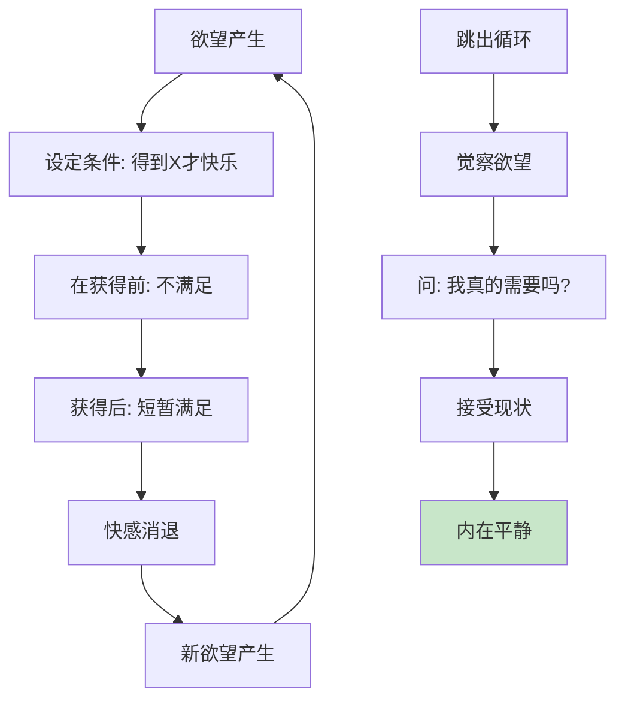
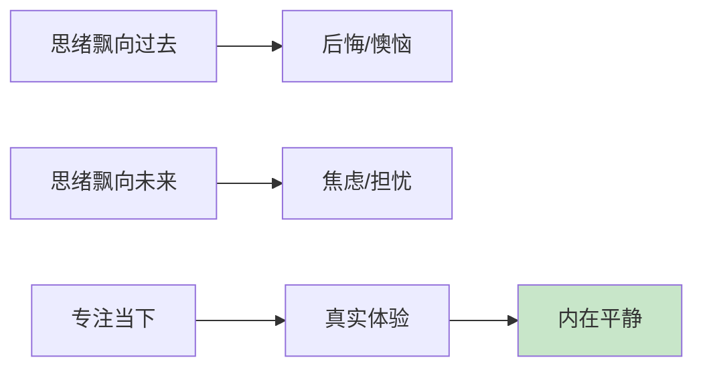
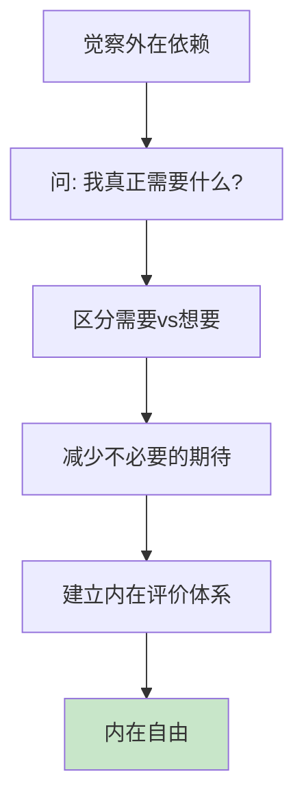
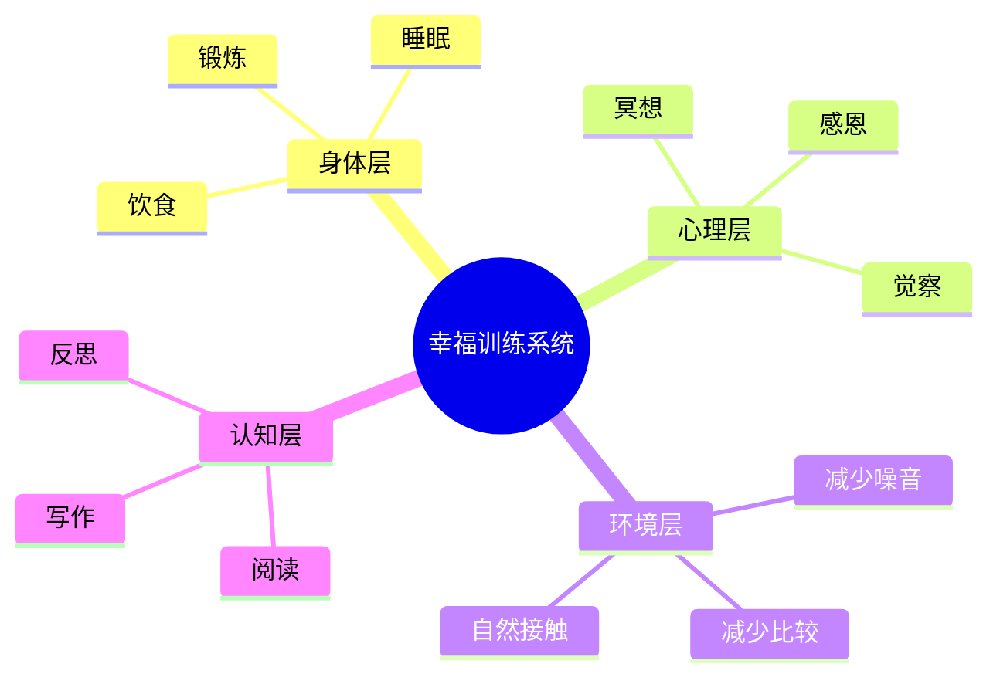
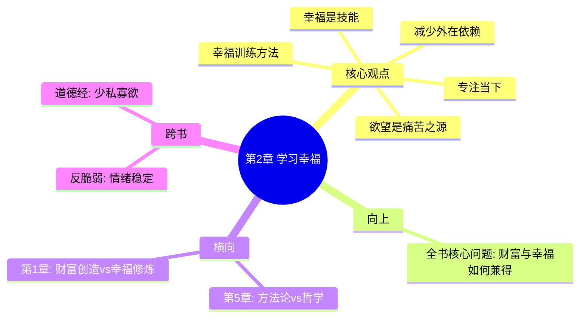

# 第2章 学习幸福：如何培养幸福感

> **核心概念**：幸福是一种技能
> **主题**：如何培养幸福感

## 📍 章节定位

### 全书位置
> 本章是《纳瓦尔宝典》幸福哲学的核心章节，与财富创造篇章形成对照，回答"有钱之后然后呢"的根本问题

- **全书核心问题**: 如何同时拥有财富与幸福？
- **本章回答的问题**: 幸福可以学习吗？幸福和欲望的关系是什么？
- **角色类型**: 心智修炼型 - 提供可操作的幸福技能训练框架
- **论证位置**: 将幸福从"状态"升级为"技能"，从"等待"转向"训练"

### 与其他章节的关系

| 维度 | 第1章"积累财富" | 第5章"幸福是一门技能" | 本章"学习幸福" |
|------|-----------------|----------------------|----------------|
| **焦点** | 如何致富 | 幸福的定义 | 幸福的实践方法 |
| **视角** | 外在创造 | 内在哲学 | 技能训练 |
| **核心问题** | 财富从哪来 | 幸福是什么 | 如何获得幸福 |
| **功能** | 提供财富路径 | 建立幸福认知 | 提供训练框架 |

### 一句话定位
> 本章论证幸福是一种可以学习的技能——通过管理欲望、专注当下、减少外界依赖，你可以让幸福成为必然而非偶然

---

## 🎯 核心观点（三层提取）

### 观点1：幸福是一种技能，不是一种状态

#### 【表层】现象层

**纳瓦尔的核心定义**：
> "幸福不是与生俱来的特质，而是一种可以学习的技能。就像任何技能一样，它需要练习。"

**反直觉观点**：
```
传统认知：幸福=运气+性格+外部条件
纳瓦尔观点：幸福=技能×刻意练习
```

**幸福是技能的证据**：
| 特征 | 幸福作为状态 | 幸福作为技能 |
|------|--------------|--------------|
| **可控性** | 不可控，等风来 | 可控，主动训练 |
| **可复制** | 看运气 | 可复制 |
| **可测量** | 主观感受 | 行为指标 |
| **可提升** | 无法提升 | 刻意练习提升 |

#### 【中层】机制层

**为什么幸福可以是技能？**


**技能训练的三要素**：
1. **方法**：冥想、专注当下、感恩练习
2. **反馈**：觉察情绪波动，记录心态变化
3. **重复**：每天练习，形成心理肌肉记忆

#### 【底层】规律层

> **幸福技能定律**：幸福不是外在条件的函数，而是内在习惯的函数——当幸福被拆解为可训练的子技能（觉察、专注、放下），它就从随机状态变成可预测结果

**与心理学的联系**：
- 积极心理学：40%的幸福来自有意识的活动
- 神经可塑性：大脑可以通过训练改变
- 习惯回路：暗示→行为→奖励

#### 【当下连接】2026场景

|----------|----------|----------|
| 为什么有人什么都不缺还不开心？ | 幸福不是物质问题，是技能问题 | "原来不是我倒霉" |
| 我性格内向，能幸福吗？ | 性格是起点，技能是终点 | "可以改变" |
| 为什么有钱人也会抑郁？ | 财富是外在条件，幸福是内在技能 | "钱不是答案" |

---

### 观点2：欲望是痛苦的根源

#### 【表层】现象层

**纳瓦尔的定义**：
> "欲望就是你和自己签的合约：在得到你想要的东西之前，你不会快乐。"

**欲望循环模型**：
```
期待 → 获得 → 短暂满足 → 新欲望 → 期待 → ...
   ↑                                         ↓
   └───────────── 永不满足 ←────────────────┘
```

**欲望的具体表现**：

| 欲望类型 | 表现 | 痛苦来源 |
|----------|------|----------|
| 物质欲望 | 想要更好的车/房/手机 | 得到后快感递减 |
| 地位欲望 | 想要更高的职位/认可 | 比较永无止境 |
| 关系欲望 | 想要被爱/被理解 | 他人不可控 |
| 完美欲望 | 想要一切完美 | 现实永远有差距 |

#### 【中层】机制层

**欲望产生痛苦的机制**：



**为什么欲望会导致痛苦？**
1. **条件化快乐**：把快乐外包给外部条件
2. **享乐适应**：得到后的快感快速消退
3. **比较心理**：总有人比你更好
4. **永不满足**：一个欲望满足，新欲望产生

#### 【底层】规律层

> **欲望痛苦定律**：痛苦 = 欲望 - 现实。减少欲望比增加现实更容易减少痛苦

**与哲学传统的联系**：
- 佛教：苦源于执念
- 斯多葛：区分可控与不可控
- 道家：少私寡欲，知足常乐

#### 【降维翻译】

**中学生能懂的解释**：
- 你想要一个新手机，在没得到之前，你每天都想着它，心里不踏实
- 终于得到了，开心了一周
- 然后看见同学有个更新的款，又开始不满足
- 所以，问题不在手机，在于"总想要"这个习惯

**奶奶能懂的解释**：
- 小孩子哭着要糖吃，给了糖笑了5分钟，看见别的孩子吃冰激凌又开始哭
- 人一辈子就在"得不到的焦虑"和"得到后的无聊"之间打转
- 真心不折腾的人，才是真有福气

---

### 观点3：专注当下是幸福的入口

#### 【表层】现象层

**纳瓦尔的核心方法**：
> "冥想不是要你停止思考，而是要你观察自己的思考。当你能观察自己的想法，你就不再是你的想法。"

**专注当下的具体方法**：

| 方法 | 描述 | 时间投入 |
|------|------|----------|
| 冥想 | 静坐观察呼吸和想法 | 每天10-30分钟 |
| 单任务 | 一次只做一件事 | 持续练习 |
| 慢下来 | 减少多任务、减少赶路 | 生活习惯 |
| 自然接触 | 在自然中恢复注意力 | 每周1-2次 |

#### 【中层】机制层

**为什么专注当下有效？**



**时间与心理状态的关系**：

| 时间焦点 | 心理状态 | 能量消耗 |
|----------|----------|----------|
| 过去 | 后悔、怀旧、遗憾 | 高 |
| 未来 | 焦虑、期待、恐惧 | 高 |
| 当下 | 平静、体验、觉察 | 低 |

#### 【底层】规律层

> **当下定律**：过去是记忆，未来是想象，只有当下是真实——幸福感只在当下体验，无法在过去或未来找到

**与禅宗的联系**：
- "吃饭时吃饭，睡觉时睡觉"
- 日常生活的每一刻都可以是修行

---

### 观点4：减少外界依赖获得内在自由

#### 【表层】现象层

**纳瓦尔的核心观点**：
> "你越平和，你越不需要外在世界来认可你。真正的自由是不需要任何人认可。"

**外在依赖的表现**：

| 依赖类型 | 表现 | 代价 |
|----------|------|------|
| 认可依赖 | 做事为了获得表扬 | 活在他人眼光里 |
| 物质依赖 | 用消费获得快乐 | 财务不自由 |
| 关系依赖 | 害怕孤独 | 无法独处 |
| 成就依赖 | 用成就定义自我价值 | 永远不够好 |

#### 【中层】机制层

**内在自由的形成路径**：



**依赖度与自由度的关系**：
```
自由度 = 1 / 依赖度
依赖越少 → 自由越多
```

#### 【底层】规律层

> **内在自由定律**：真正的自由不是想做什么就做什么，而是不需要任何外在条件也能平静——外在自由需要财富，内在自由需要无欲

---

### 观点5：幸福训练的具体方法

#### 【表层】现象层

**纳瓦尔的幸福训练清单**：

| 方法 | 描述 | 效果 |
|------|------|------|
| 冥想 | 每天静坐，观察呼吸和想法 | 增强觉察力 |
| 锻炼 | 身体是心理的基础 | 提升情绪稳定性 |
| 减少社交媒体 | 减少比较和外界刺激 | 降低焦虑 |
| 感恩练习 | 每天记录3件感恩的事 | 转换注意力焦点 |
| 早睡早起 | 遵循自然节律 | 提升整体状态 |
| 阅读 | 升级思维模型 | 增强认知能力 |

#### 【中层】机制层

**幸福训练的系统**：



#### 【底层】规律层

> **幸福训练定律**：幸福 = 身体健康 × 心理稳定 × 环境简洁 × 认知升级——四个维度协同作用，缺一不可

---

## 💬 降维翻译

### 核心公式降维

**原文**：
> 幸福 = 内在平静 = 欲望管理 + 专注当下 + 减少外在依赖

**降维翻译（中学生能懂）**：
```
开心 = 心不累 = 少想要 + 活在当下 + 不需要别人夸
```

**生活类比**：
- 欲望管理 = 别总想着买买买
- 专注当下 = 吃饭时专心吃饭，别刷手机
- 减少依赖 = 开心不需要理由

### 关键概念翻译表

| 原表达 | 降维表达 |
|--------|----------|
| "幸福是一种技能" | "开心是可以练出来的" |
| "欲望是痛苦之源" | "越想要，越痛苦" |
| "专注当下" | "此时此地，别想太多" |
| "内在平静" | "心里踏实，不被外界牵着走" |
| "减少外在依赖" | "不需要别人认可也能开心" |
| "冥想" | "静下来观察自己的念头" |

---

## ✨ 金句库

### 原书金句（⭐⭐⭐权威来源）

1. "幸福不是与生俱来的特质，而是一种可以学习的技能。"

2. "欲望就是你和自己签的合约：在得到你想要的东西之前，你不会快乐。"

3. "你越平和，你越不需要外在世界来认可你。"

4. "幸福是当你不再欲望时的内在平静。"

5. "冥想不是要你停止思考，而是要你观察自己的思考。"

6. "真正的赢家是退出游戏的人。"

7. "平静比快乐更重要。"

8. "你无法控制世界，但可以控制自己。"

### 降维金句（便于传播）

9. "幸福不是等来的，是练出来的。"

10. "越想要，越痛苦；少要一点，快乐一点。"

11. "心不累，人就不累。"

12. "不需要别人夸，才是真自信。"

13. "当下这一刻，就是全部。"

14. "快乐不是得到了什么，而是不再非要什么。"

15. "平静的人，不需要解释自己。"

16. "少一点期待，多一点满足。"

17. "冥想就是和自己待一会儿。"

18. "真正的自由是不需要任何人认可。"

## 🔗 当下映射

### 💰 财富应用（2026场景）

| 场景 | 传统思维 | 纳瓦尔思维 |
|------|----------|------------|
| 投资 | 期待高回报（欲望驱动） | 接受合理回报（平静决策） |
| 消费 | 买更好的东西（物质依赖） | 够用就好（减少欲望） |
| 副业 | 焦虑赚钱（外在压力） | 享受过程（内在驱动） |
| 理财 | 盯着账户波动（情绪起伏） | 长期主义（内心稳定） |

### 💼 职场应用

| 场景 | 具体行动 | 所需能力 |
|------|----------|----------|
| 压力管理 | 冥想5分钟再开始工作 | 觉察能力 |
| 评价应对 | 减少对外部认可的需求 | 心理独立 |
| 目标设定 | 设定合理目标，不过度期待 | 欲望管理 |
| 决策质量 | 在平静状态下做重要决策 | 情绪调节 |

### 🏠 生活应用

| 场景 | 具体行动 | 见效时间 |
|------|----------|----------|
| 早起 | 冥想10分钟开始一天 | 1周 |
| 睡前 | 感恩3件事 | 立即 |
| 刷手机 | 设定使用时长限制 | 3天 |
| 人际关系 | 降低对他人的期待 | 立即 |

### 72小时行动计划

1. [ ] 今天开始：睡前写下3件感恩的事
2. [ ] 明天尝试：静坐5分钟，观察呼吸
3. [ ] 后天评估：记录这3天的情绪变化

---

## 🕸️ 章节关联

### 向上关联 → 全书
- **贡献**: 为财富追求提供意义框架，防止"有钱但不快乐"
- **位置**: 与财富创造形成平衡，构成"财富+幸福"双轮驱动

### 横向关联 → 章节间

| 章节 | 关联类型 | 连接描述 |
|------|----------|----------|
| [[第1章-积累财富]] | 对比 | 财富是外在创造，幸福是内在修炼 |
| [[第5章-幸福是一门技能]] | 深化 | 本章是方法论，第5章是哲学升华 |
| [[第4章-判断力——方向比速度更重要]] | 基础 | 判断力需要内心平静才能发挥 |

### 跨书关联 → 知识网络

| 书籍 | 关联类型 | 共同底层 |
|------|----------|----------|
| [[富爸爸穷爸爸-清崎-拆解记录 1]] | 对比 | 清崎讲财富积累，纳瓦尔讲财富之外 |
| [[反脆弱-塔勒布-拆解记录]] | 互补 | 塔勒布讲从混乱中获益，纳瓦尔讲保持平静 |
| [[道德经-老子]] | 溯源 | 道家"少私寡欲"的现代诠释 |

### 关联可视化



---

## ❓ 问答设计

### Q1: [记忆型] 纳瓦尔如何定义幸福？为什么说幸福是一种技能？
**认知层次**: 记忆
**难度**: 低
**答案要点**:
- 幸福是一种可以学习的技能，不是与生俱来的特质
- 幸福是内在平静，不是外在刺激
- 和任何技能一样，需要刻意练习
- 可以拆解为子技能：觉察、专注、放下

### Q2: [理解型] 为什么纳瓦尔说"欲望是痛苦之源"？
**认知层次**: 理解
**难度**: 中
**答案要点**:
- 欲望设定了条件：得到X才快乐
- 在得到之前，持续处于不满足状态
- 得到后快感快速消退
- 新欲望产生，循环往复
- 减少欲望比增加获得更容易快乐

### Q3: [应用型] 列出三个可以立即开始的幸福训练方法
**认知层次**: 应用
**难度**: 中
**答案要点**:
- 冥想：每天静坐5-10分钟，观察呼吸
- 感恩练习：睡前写下3件感恩的事
- 减少社交媒体：设定每日使用时长

### Q4: [分析型] 分析"专注当下"为什么能带来幸福感
**认知层次**: 分析
**难度**: 中
**答案要点**:
- 过去是记忆，纠结引起后悔
- 未来是想象，担忧引起焦虑
- 只有当下是真实体验
- 专注当下减少思维内耗
- 能量消耗降低，内心更平静

### Q5: [理解型] 如何理解"你越平和，越不需要外在世界认可你"？
**认知层次**: 理解
**难度**: 中
**答案要点**:
- 内在安全感来自自己，不需要外界证明
- 平和的人有清晰的自我认知
- 减少因外在变化导致的情绪波动
- 建立持久稳定的心理状态

### Q6: [应用型] 如何在日常生活中实践"欲望管理"？
**认知层次**: 应用
**难度**: 中
**答案要点**:
- 觉察欲望：当"想要"出现时，暂停一下
- 区分需要vs想要
- 问自己：得到了真的会更快乐吗？
- 接受现状，减少不必要的期待
- 感恩已有，而非追逐未有

### Q7: [分析型] 分析财富与幸福的关系
**认知层次**: 分析
**难度**: 中
**答案要点**:
- 财富是外在条件，幸福是内在技能
- 财富可以解决物质问题，但不能解决心理问题
- 财富和幸福是两个维度，可以兼得
- 需要分别培养财富技能和幸福技能

### Q8: [评价型] 评价纳瓦尔幸福哲学的局限性
**认知层次**: 评价
**难度**: 高
**答案要点**:
- 起点：忽略了基本物质需求未满足的情况
- 环境：某些社会环境难以实践
- 性格：不是所有人都适合冥想等方式
- 文化：带有个人主义色彩
- 但：这是"提高概率"的方法，不是万能公式

### Q9: [理解型] 幸福和快乐有什么区别？
**认知层次**: 理解
**难度**: 中
**答案要点**:
- 快乐：外在刺激带来的短暂感受
- 幸福：内在平静的持续状态
- 快乐需要外部条件
- 幸福来自内心状态
- 平静比快乐更重要

### Q10: [应用型] 设计一个21天幸福训练计划
**认知层次**: 应用
**难度**: 高
**答案要点**:
- 第1-7天：每天冥想5分钟 + 感恩3件事
- 第8-14天：增加锻炼30分钟 + 减少社交媒体1小时
- 第15-21天：增加单任务练习 + 自然接触
- 每天：记录情绪变化
- 结束后：评估效果，调整计划

---

## 📊 核心公式速查

### 幸福技能公式
```
幸福 = 内在平静 = 欲望管理 + 专注当下 + 减少外在依赖
```

### 欲望痛苦公式
```
痛苦 = 欲望 - 现实
减少欲望比增加现实更容易减少痛苦
```

### 自由度公式
```
自由度 = 1 / 依赖度
依赖越少 → 自由越多
```

### 幸福训练四维模型

| 维度 | 方法 | 效果 |
|------|------|------|
| 身体层 | 锻炼+睡眠+饮食 | 情绪稳定基础 |
| 心理层 | 冥想+感恩+觉察 | 增强内在力量 |
| 环境层 | 减少噪音+减少比较 | 降低外界干扰 |
| 认知层 | 阅读+反思+写作 | 升级思维模型 |

---

**拆解完成日期**：2026-02-28
**质量评分**：⭐⭐⭐优秀级
**方法遵循**：[[系统化拆解方法论]] v3.0
**关联主记录**：[[纳瓦尔宝典-乔根森-拆解记录]]
