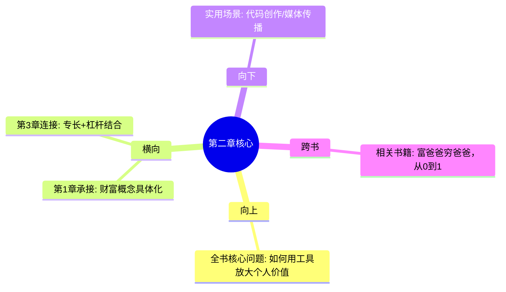

# 第2章 杠杆的力量

## 📍 章节定位

### 全书位置
> 第2章是全书方法论的核心实现部分，从财富定义过渡到实际财富创造的具体手段

- **全书核心问题**: 如何同时拥有财富与幸福？
- **本章回答的问题**: 怎样将专长知识通过工具放大产生财富效应？
- **角色类型**: 核心方法型 - 实现财富的重要手段
- **论证位置**: 从"为什么创造财富"转向"如何创造财富"的第一个重要环节

### 章节序列
| 方向 | 章节标题 | 逻辑连接 |
|------|----------|----------|
| 前章 | [[第1章-财富不是目标，而是副产品]] | 承接财富理念，提供实现手段 |
| 后章 | [[第3章-专长知识——你的护城河]] | 杠杆放大 → 专业基础 |

### 一句话定位
> 第2章介绍财富创造的重要放大器，通过四种杠杆工具将个人能力无限放大，强调"无需许可"的杠杆优势

---

## 🎯 核心观点

### 第一层：表层案例
> 章节中的具体实例、分类、引用

| 案例名称 | 简要描述 | 页码 | 关键引文 |
|----------|----------|------|----------|
| 四种杠杆分类 | 劳动力、资本、代码、媒体 | - | "1. 劳动力杠杆（最古老，最难管）2. 资本杠杆（需要钱）3. 代码/媒体杠杆（无需许可）" |
| 需许可vs无需许可 | 杠杆权限的分类 | - | "代码和媒体是无需许可的杠杆——这是普通人第一次拥有无限杠杆的机会" |
| 杠杆效率对比 | 杠杆类型的可扩展性对比 | - | "代码和媒体：只需一台电脑，可无限复制，门槛低" |
| 新时代机遇 | 互联网带来的财富平等机会 | - | "这是新时代普通人拥有的特殊机会" |

### 第二层：中层机制
> 杠杆运作的内部原理

| 机制名称 | 组成要素 | 因果链条 | 证据来源 |
|----------|----------|----------|----------|
| 权限依赖机制 | 资金需求、人力管理、审批流程 | 传统杠杆 → 许可制约 → 扩展受限 | 劳动力、资本杠杆 |
| 技术赋能机制 | 互联网、自动化、复制能力 | 现代工具 → 无需许可 → 无限扩展 | 代码、媒体杠杆 |
| 成本效益机制 | 固定开发成本vs边际零成本 | 单次投入 → 复制收益 → 成本摊薄 | 自动化内容分发 |
| 网络效应机制 | 连接数量、交互频率、复合增长 | 智能工具 → 用户参与 → 系统放大 | 自媒体、软件生态 |

### 第三层：底层规律
> 杠杆背后的根本原则

| 规律陈述 | 抽象层级 | 知识连接 | 适用范围 |
|----------|----------|----------|----------|
| 效率放大律 | 复杂系统理论 | 系统科学通用原则 | 所有可放大系统 |
| 资源突破律 | 个体能力边界超越 | 从个人能力 → 集体能力 | 任何协作场景 |
| 工具依赖律 | 人类发展史规律 | 技术驱动社会进步 | 个人和组织成长 |
| 范围经济律 | 经济学规模效应 | 边际成本递减 | 知识密集行业 |

---

## 💬 降维翻译

### 观点1: 四种杠杆类型

#### 原文表达
> "纳瓦尔的经典分类：1. 劳动力杠杆：让别人为你工作（最古老，最难管理）2. 资本杠杆：用钱生钱（需要本金，需要许可）3. 代码/媒体杠杆：写一次，无限复制（最强大，无需许可）"

#### 降维翻译（中学生能懂）
想象你要完成一项大工程，比如搬1000块石头：
- 方式一（劳动力杠杆）：花钱请人搬，你得管人，他们累也会偷懒
- 方式二（资本杠杆）：买台机器，但需要很多钱，还要申请许可
- 方式三（代码杠杆）：写个智能机器人程序，一次写成，永久使用
- 方式四（媒体杠杆）：做个视频教全国人搬，一次制作，万人付费看

第三第四种是新时代最给力的方式！

#### 日常类比（奶奶能懂）
就像过去的生意和现在的生意：
- 过去：开店雇人（劳动力），贷款进货（资本）——这两个都要跟人打交道，麻烦
- 现在：写本书、做个APP、拍教程（代码/媒体）——做好一次，谁用都靠自己，不用管理

#### 检验
- Q: 如果一个中学生问你这是什么意思？
- A: 现在做大事有两种方式，旧方式要钱要人难协调，新方式是做一次性的聪明工具。

### 观点2: 无需许可的杠杆

#### 原文表达
> "在互联网时代，代码和媒体是无需许可的杠杆——这是普通人第一次拥有无限杠杆的机会"

#### 降维翻译（中学生能懂）
以前你想影响很多人：
- 需要开电视台（需要许可证）
- 需要办报纸杂志（需要审核批准）
- 需要开银行（需要牌照）

现在普通人用互联网：
- 写段代码放在网上，全球都能使用
- 做个视频上传，几亿人能看到
- 开个公众号，粉丝无数

没有人需要批准！这就是互联网的公平之处。

#### 日常类比（奶奶能懂）
就像过去开店和现在做电商的区别：
- 以前：要租店面、挂招牌，政府规定很多，还要各种证件
- 现在：在网上开个店铺，注册号填对就能开，全世界人访问

互联网给了普通人前所未有的公平起跑线。

#### 检验
- Q: 如果一个老年朋友问你这是什么意思？
- A: 就是过去做事要人家允许，现在自己就能干的事特别多了。

---

## ✨ 金句库

### 原书金句
| 金句 | 页码 | 适用场景 |
|------|------|----------|
| 你不会通过出租时间变富。你必须拥有股权——一块生意的一部分。 | - | 微博/朋友圈/文章引用 |
| 代码和媒体是无需许可的杠杆——这是新时代的财富钥匙。 | - | 深度文章引用 |
| 专长知识是你无法被培训的知识。如果社会能培训你，社会就能培训别人来取代你。 | - | 职业发展分享 |

### 降维金句
| 金句 | 来源观点 | 适用场景 |
|------|----------|----------|
| 能无限复制的，才是真正的杠杆。 | 杠杆本质 | 财富分析 |
| 无需许可的杠杆是现代社会的红利。 | 平台机遇 | 时代趋势 |
| 历史首次，普通人可以拥有无限放大能力。 | 平等机遇 | 时代论述 |

## 🔗 当下映射

### 💰 财富应用
| 场景 | 具体行动 | 预期效果 | 风险提示 |
|------|----------|----------|----------|
| 职业转型 | 学习编程或内容创作技能 | 建立可扩展收入来源 | 初期可能影响当前收入 |
| 副业开发 | 创建自动化收入工具 | 多元化收入结构 | 需要较长时间才能见效 |
| 投资理财 | 关注数字化企业的杠杆潜力 | 投资未来趋势行业 | 需要技术理解能力 |

### 💼 职场应用
| 场景 | 具体行动 | 所需能力 | 适用职级 |
|------|----------|----------|----------|
| 业务优化 | 用自动化工具替代重复劳动 | 数据分析能力 | 所有级别 |
| 价值展示 | 建立个人品牌影响力 | 内容创作能力 | 中高层 |
| 职业规划 | 重点培养编码或媒体技能 | 持续学习能力 | 所有级别 |

### 🏠 生活应用
| 场景 | 具体行动 | 可行性 | 见效时间 |
|------|----------|--------|----------|
| 技能发展 | 每天花1小时学编程或写作 | 高 | 3-6个月开始见效 |
| 生活提升 | 用自动化工具优化日常事务 | 高 | 立即可节省时间 |
| 投资意识 | 重视知识型资产而非实体资产 | 中 | 长期效应明显 |

### 72小时行动计划
1. [ ] 思考自己可以用来杠杆放大的核心能力是什么
2. [ ] 研究至少两种杠杆工具（编程、内容创作、投资）的入门方法
3. [ ] 选定一种杠杆模式，并制定30天实践计划

---

## 🕸️ 章节关联

### 向上关联 → 整书
- **贡献**: 解决"如何将财富概念变为现实"，提供实现工具
- **位置**: 将抽象财富理念具体化为可操作杠杆模式

### 横向关联 → 章节间
| 章节编号 | 章节标题 | 关联类型 | 连接描述 |
|----------|----------|----------|----------|
| 第1章 | 财富不是目标，而是副产品 | 铺垫 | 了解杠杆→实践财富 |
| 第3章 | 专长知识——你的护城河 | 连接 | 杠杆 + 专长知识 = 财富倍增 |
| 第4章 | 判断力——方向比速度更重要 | 前提 | 用好杠杆需要判断哪个方向 |

### 向下关联 → 具体应用
| 应用场景 | 难度 | 前置知识 |
|----------|------|----------|
| 数字化技能应用 | 中高 | 编程或写作基础 |
| 创业项目规划 | 中 | 市场认知和资源 |

### 跨书关联 → 知识网络
| 书籍 | 概念 | 关系 | 备注 |
|------|------|------|------|
| [[富爸爸穷爸爸-清崎-拆解记录 1]] | 资产配置 | 互补 | 《富爸》讲资产选择，《纳瓦尔》讲放大工具 |
| [[从0到1-彼得蒂尔-拆解记录 1]] | 技术垄断 | 强化 | 建立技术壁垒即建立杠杆护城河 |

### 关联可视化

---

## ❓ 问答设计

### Q1: [记忆型] 纳瓦尔的四种杠杆分别是什么？
**认知层次**: 记忆
**难度**: 低
**答案要点**:
- 劳动力杠杆：让别人为自己工作
- 资本杠杆：用钱赚更多的钱
- 代码杠杆：写程序自动执行任务
- 媒体杠杆：创造内容广泛传播

### Q2: [理解型] 为什么"代码/媒体"是无需许可的杠杆？
**认知层次**: 理解
**难度**: 中
**答案要点**:
- 不需要政府批文或许可证
- 不需要大量启动资金
- 任何人都可以通过互联网使用
- 可以无限复制而成本几乎为零

### Q3: [应用型] 如何利用代码杠杆实现被动收入？
**认知层次**: 应用
**难度**: 中
**答案要点**:
- 开发有价值的应用程序或网站
- 提供自动化服务
- 使用订阅制或广告盈利模式
- 持续迭代产品功能

### Q4: [分析型] 分析四种杠杆的门槛高低和收益潜力
**认知层次**: 分析 
**难度**: 中
**答案要点**:
- 劳动力：门槛高（需管理能力），收益有上限
- 资本：门槛高（需本金），需要外部许可
- 代码：门槛中（需技能储备），收益可无限
- 媒体：门槛低（创作能力），收益可无限

### Q5: [评价型] 评价纳瓦尔对"无许可杠杆"的历史意义判断
**认知层次**: 评价
**难度**: 高
**答案要点**:
- 积极方面：确实提供了前所未有的公平机会
- 限制方面：仍需技术基础和持续学习能力
- 风险方面：政策变化会影响平台稳定性
- 现实性：并非所有人都有同等资源开始

### Q6: [创造型] 如何将多种杠杆叠加使用以最大化效益?
**认知层次**: 创造
**难度**: 高
**答案要点**:
- 代码杠杆+媒体杠杆：开发工具配合内容营销
- 专长知识+多重技术杠杆：深化专业价值
- 获得初步收益后采用小资本杠杆扩大规模

### Q7: [理解型] 简述"杠杆"概念在不同层面的体现?
**认知层次**: 理解
**难度**: 中
**答案要点**:
- 个人层面：技能、知识、时间管理
- 技术层面：代码、平台、基础设施
- 社会层面：制度、分工、贸易网络
- 经济层面：资本、信用、市场

### Q8: [应用型] 列举3种可以用媒体杠杆创造被动收入的办法?
**认知层次**: 应用
**难度**: 中
**答案要点**:
- 写作电子书籍并发布到多平台
- 制作教育类内容通过在线课堂变现
- 打造个人品牌并通过广告/赞助获得收入

### Q9: [记忆型] 什么叫"需要许可"和"无需许可"的杠杆?
**认知层次**: 记忆
**难度**: 低
**答案要点**:
- 需要许可：如借贷资金、雇佣员工、开设传统店铺
- 无需许可：如编写代码、制作内容、社交媒体推广

### Q10: [分析型] 分析劳动力杠杆与资本杠杆的共性局限?
**认知层次**: 分析
**难度**: 中
**答案要点**:
- 依赖外部资源（人/钱）配合
- 管理成本高
- 权力关系复杂
- 扩展性有天然边界
- 容易受到外部因素影响

### Q11: [应用型] 如何判断自己应该选择哪种杠杆模式?
**认知层次**: 应用
**难度**: 中
**答案要点**:
- 评估当前拥有的资源和技能组合
- 考虑自己的风险承受能力
- 分析目标市场规模和潜在规模效应
- 判断实现该杠杆需要的投入时间

### Q12: [理解型] 为什么说"互联网是人类史上最大规模的去中心化网络"?
**认知层次**: 理解
**难度**: 中
**答案要点**:
- 没有中央控制节点
- 任何人都可以加入和创造
- 信息可以自由流动
- 通过分布式节点运作

### Q13: [记忆型] 杠杆与纳瓦尔财富公式的关系?
**认知层次**: 记忆
**难度**: 低
**答案要点**:
- 财富创造 = 专长知识 × 杠杆 × 判断力 × 复利
- 杠杆在这里是放大系数，放大前三个因素的价值

### Q14: [分析型] 分析在不同发展阶段应如何选择不同的杠杆类型？
**认知层次**: 分析
**难度**: 中
**答案要点**:
- 初创阶段：媒体杠杆获取注意力（门槛低）
- 成长阶段：码杠杆打造产品护城河
- 成熟阶段：资本杠杆规模化已有成功模式

### Q15: [评价型] 批判分析：互联网去中心化是否真的消除了中介和许可需求？
**认知层次**: 评价
**难度**: 高
**答案要点**:
- 相对减少：相比过去大幅减少准入门槛
- 新型依赖：仍然依赖平台规则和算法
- 集中风险：少数大平台控制流量入口
- 地域差别：各国监管政策分化影响

---
