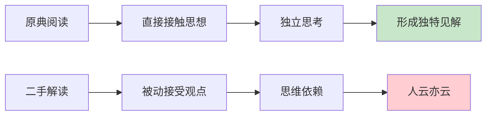
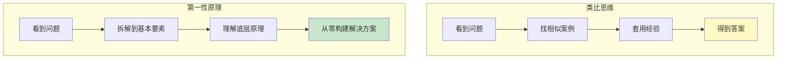
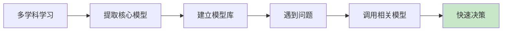
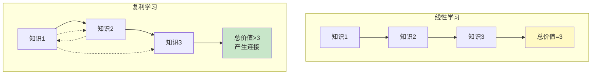
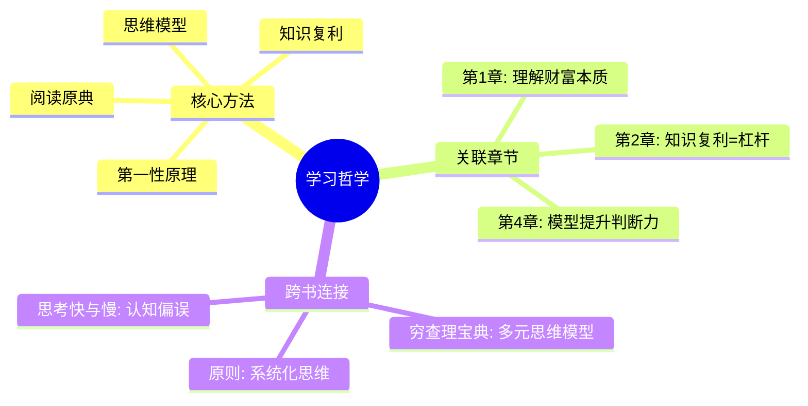

# 第3章 学习哲学

## 📍 章节定位

### 全书位置
> 第3章解决"如何建立自己的人生哲学"，是连接财富创造与幸福生活的认知桥梁

- **全书核心问题**: 如何同时拥有财富与幸福？
- **本章回答的问题**: 如何学习？如何思考？如何建立自己的知识体系？
- **角色类型**: 认知基础型 - 提供思维框架
- **论证位置**: 在财富公式(W=S×K×L×J×T)中，学习哲学是提升判断力(J)和专长知识(S)的底层方法

### 章节序列

| 方向 | 章节标题 | 逻辑连接 |
|------|----------|----------|
| 前章 | [[第2章-杠杆的力量]] | 有了工具，需要知道如何思考才能正确使用 |
| 后章 | [[第4章-判断力——方向比速度更重要]] | 学习哲学 + 判断力 = 高质量决策 |

### 一句话定位
> 第3章阐述纳瓦尔的学习观：读原典而非解读，用第一性原理思考，建立属于自己的思维模型系统

---

## 🎯 核心观点

### 观点1：阅读——读原典，而非二手解读

#### 【表层】现象层
> 纳瓦尔对阅读的独特态度

| 案例名称 | 简要描述 | 关键引文 |
|----------|----------|----------|
| 原典优先 | 直接读经典原著 | "读原始资料，不要读评论" |
| 基础书籍 | 阅读那些经得起时间考验的书 | "读那些存在了100年以上的书" |
| 精选原则 | 宁可少读，不可滥读 | "我不会读完一本不喜欢的书" |
| 反教材 | 不读教科书式的总结 | "教材是被消化的知识，吃别人嚼过的东西" |

#### 【中层】机制层

**阅读金字塔**：

| 层级 | 阅读类型 | 特点 | 推荐度 |
|------|----------|------|--------|

#### 【底层】规律层
> **信息衰减定律**：信息每经过一次转述，就会丢失精度和上下文，增加转述者的偏见

**关键洞见**：
- 一本书存在100年 = 经过数百万读者的筛选
- 热门畅销书 ≠ 值得读的书
- 解读书籍的人有自己的偏见和局限
- **阅读的目的是建立自己的思维模型，不是记住别人的观点**

#### 【降维翻译】

**中学生能懂的解释**：
想象你要学做菜：
- 方法A：看美食博主的"3分钟学会xxx"短视频（快餐，学不到本质）
- 方法B：读一本50年前的经典烹饪教科书（讲原理，学了能举一反三）
- 方法C：亲自实践，失败、调整、再试（真正的学习）

**纳瓦尔的建议**：直接读B类书，不要只看A类内容。

**日常类比（奶奶能懂）**：
- 听别人讲故事，不如自己看书
- 看电影解说，不如自己看电影
- 吃别人嚼过的，永远不知道原味

#### 【当下连接】

|----------|----------|----------|
| 书读不完怎么办？ | 不读完也行，读值得读的 | "原来可以不读完" |
| 知识焦虑怎么办？ | 读经典，少读热点 | "少即是多" |
| 怎么选书？ | 选经得起时间考验的书 | "时间是最好的过滤器" |

---

### 观点2：第一性原理——从根本假设开始思考

#### 【表层】现象层

| 案例名称 | 简要描述 | 关键引文 |
|----------|----------|----------|
| 物理学思维 | 像物理学家一样思考 | "把问题分解到最基本的真理，然后从那里开始推理" |
| 反对类比 | 不要用类比来推理 | "类比思维是懒惰的思考方式" |
| 追问本质 | 不断问"为什么" | "问5次为什么，找到根本原因" |
| 独立验证 | 不要相信，要验证 | "任何观点都要亲自验证" |

#### 【中层】机制层

**两种思维对比**：

| 维度 | 类比思维 | 第一性原理 |
|------|----------|------------|
| 起点 | 别人怎么做 | 最基本的事实是什么 |
| 过程 | 参考和模仿 | 拆解和重建 |
| 结果 | 改进和优化 | 颠覆和创新 |
| 风险 | 路径依赖 | 思考成本高 |
| 适用 | 渐进改进 | 颠覆创新 |

#### 【底层】规律层
> **思维独立定律**：真正的创新来自回到基本原理重新思考，而不是在别人思路上修修补补

**关键洞见**：
- 马斯克造火箭：不是"怎么造更好的火箭"，而是"火箭最基本的成本是什么"
- 特斯拉电池：不是"怎么买更便宜的电池"，而是"电池由什么组成，成本能降到多少"
- 纳瓦尔财富观：不是"怎么赚更多钱"，而是"财富的本质是什么"

#### 【降维翻译】

**中学生能懂的解释**：
做数学题有两种方法：
- 方法A：背题型、背公式、看到类似的就套（类比思维）
- 方法B：理解公式的推导过程，知道为什么这样算（第一性原理）

方法A考试快，方法B遇到新题型不慌。

**日常类比（奶奶能懂）**：
- 别人说"这样种庄稼长得好" → 你问"为什么？是土壤？是水？是阳光？"
- 知道了原理，换块地你也能种好
- 不知道原理，换个地方就不会了

#### 【当下连接】

| 场景 | 类比思维 | 第一性原理思维 |
|------|----------|----------------|
| 投资 | 别人买什么我买什么 | 这个资产的价值本质是什么？ |
| 职业 | 热门职业是什么 | 我能提供的独特价值是什么？ |
| 学习 | 别人怎么学我怎么学 | 知识的底层逻辑是什么？ |

---

### 观点3：建立自己的思维模型系统

#### 【表层】现象层

| 案例名称 | 简要描述 | 关键引文 |
|----------|----------|----------|
| 多元模型 | 从多学科汲取核心模型 | "手里有锤子，看什么都是钉子" |
| 芒格影响 | 受查理·芒格思维模型启发 | "芒格的多元思维模型改变了我" |
| 跨学科 | 打破学科边界 | "物理学、经济学、心理学、生物学都有通用模型" |
| 实践验证 | 在真实世界检验模型 | "模型必须在实践中有效" |

#### 【中层】机制层

**核心思维模型举例**：

| 模型名称 | 来源学科 | 核心内容 | 应用场景 |
|----------|----------|----------|----------|
| 复利效应 | 金融学 | 小变化持续积累产生指数增长 | 学习、投资、关系 |
| 边际效用递减 | 经济学 | 拥有越多，每增加一单位价值越低 | 消费决策 |
| 反馈回路 | 系统论 | 输出影响输入，形成循环 | 习惯养成 |
| 概率思维 | 统计学 | 用概率而非确定性思考 | 决策判断 |
| 机会成本 | 经济学 | 选择A意味着放弃B的价值 | 资源分配 |
| 幸存者偏差 | 统计学 | 只看到成功的，忽略失败的 | 学习榜样 |

#### 【底层】规律层
> **认知效率定律**：掌握少数核心模型，能解决多数问题

**关键洞见**：
- 芒格说：80%的重要结果来自20%的核心模型
- 专家和新手的区别：专家有结构化的模型库
- 思维模型 = 大脑的"快捷方式"
- **不是记住更多知识，而是掌握更好的思维框架**

#### 【降维翻译】

**中学生能懂的解释**：
想象你的大脑是一个工具箱：
- 普通人：只有一把锤子（遇到什么都用锤子敲）
- 高手：有锤子、螺丝刀、扳手、锯子……（根据问题选工具）
- 大师：知道什么时候用哪个工具，还能组合使用

思维模型就是你的"认知工具"。

**日常类比（奶奶能懂）**：
- 老农民看天：知道云的形状、风的方向、虫子的行为 → 预测天气
- 这不是迷信，是积累了大量"模型"：某种云=要下雨，某种虫子飞=要变天
- 模型多了，判断就准了

---

### 观点4：知识的复利

#### 【表层】现象层

| 案例名称 | 简要描述 | 关键引文 |
|----------|----------|----------|
| 知识积累 | 知识会复利增长 | "知识有复利效应" |
| 连接效应 | 新知识连接旧知识 | "新知识让旧知识更有价值" |
| 长期主义 | 长期学习带来指数回报 | "每天学一点，几年后差距巨大" |
| 跨界融合 | 不同领域知识产生化学反应 | "A领域的知识可能解决B领域的问题" |

#### 【中层】机制层

**知识复利的三个维度**：

| 维度 | 机制 | 效果 |
|------|------|------|
| 深度 | 在一个领域深耕 | 专家级洞察力 |
| 广度 | 跨多个领域学习 | 连接创新的能力 |
| 连接 | 新旧知识建立联系 | 认知效率提升 |

#### 【底层】规律层
> **知识网络效应**：知识不是孤立的点，而是互相连接的网。节点越多，连接越多，价值指数增长

**关键洞见**：
- 第100本书比第1本书容易读（有背景知识）
- 跨领域知识产生创新（乔布斯：科技+艺术=苹果）
- 长期学习者和非学习者的差距是指数级的
- **"我可以读得更快，因为我不用从头学起"——纳瓦尔**

#### 【降维翻译】

**中学生能懂的解释**：
学英语：
- 第1个单词：完全陌生，花1分钟记住
- 第1000个单词：发现和之前学的词有关系，更快记住
- 第10000个单词：能猜出意思，因为理解了规律

这就是知识复利：学得越多，学得越快。

**日常类比（奶奶能懂）**：
- 交朋友：认识1个人，可能认识他朋友的朋友
- 知识也一样：学了1个概念，能帮理解10个相关概念
- 越学越轻松，越学越有意思

---

## 💬 金句库

### 原书金句

| 金句 | 适用场景 |
|------|----------|
| "读原始资料，不要读评论。" | 阅读建议 |
| "读那些存在了100年以上的书。" | 选书标准 |
| "我不会读完一本不喜欢的书。" | 阅读自由 |
| "把问题分解到最基本的真理，然后从那里开始推理。" | 思维方法 |
| "类比思维是懒惰的思考方式。" | 思考警示 |
| "知识有复利效应。" | 学习动力 |
| "手里有锤子，看什么都是钉子。" | 单一思维的危险 |
| "芒格的多元思维模型改变了我。" | 学习榜样 |

### 降维金句

| 金句 | 来源观点 |
|------|----------|
| 原典是源头，解读是下游，上游的水最干净。 | 阅读原典 |
| 读100本经典，胜过1000本畅销。 | 选书标准 |
| 别人嚼过的，永远不如自己嚼的有味道。 | 独立阅读 |
| 类比是抄答案，第一性原理是推答案。 | 思维方式 |
| 问5次为什么，就能找到根本原因。 | 追问本质 |
| 思维模型是大脑的快捷方式。 | 模型思维 |
| 学得越多，学得越快——这就是知识复利。 | 长期学习 |
| 专家有工具箱，新手只有锤子。 | 思维差距 |

## 🔗 当下映射

### 💰 财富应用

| 场景 | 具体行动 | 预期效果 |
|------|----------|----------|
| 投资 | 用第一性原理分析资产价值，不跟风 | 减少被割韭菜的概率 |
| 职业发展 | 建立自己的专业知识模型系统 | 提升判断力和决策速度 |
| 副业 | 将学习转化为可产品化的知识资产 | 创造被动收入 |

### 💼 职场应用

| 场景 | 具体行动 | 所需能力 |
|------|----------|----------|
| 解决问题 | 用第一性原理拆解，而非套模板 | 拆解能力、逻辑思维 |
| 学习新技能 | 找经典教材，不走捷径 | 耐心、长期主义 |
| 决策判断 | 调用思维模型库快速分析 | 模型储备、应用能力 |

### 🏠 生活应用

| 场景 | 具体行动 | 可行性 |
|------|----------|--------|
| 日常阅读 | 减少碎片化信息，增加经典阅读 | 高 |
| 知识管理 | 建立个人思维模型笔记库 | 中 |
| 持续学习 | 每天固定时间学习，形成复利 | 高 |

### 72小时行动计划

1. [ ] 列出3本你一直想读但没读的经典书籍
2. [ ] 选择其中1本，开始阅读（允许不读完）
3. [ ] 用第一性原理思考一个你最近困惑的问题

---

## 🕸️ 章节关联

### 向上关联 → 整书
- **贡献**: 提供"如何学习"的方法论，支撑专长知识积累和判断力提升
- **位置**: 财富公式中的隐形加速器

### 横向关联 → 章节间

| 章节编号 | 章节标题 | 关联类型 | 连接描述 |
|----------|----------|----------|----------|
| 第1章 | 财富不是目标，而是副产品 | 基础 | 理解财富本质需要第一性原理 |
| 第2章 | 杠杆的力量 | 应用 | 知识复利是杠杆的思想基础 |
| 第4章 | 判断力——方向比速度更重要 | 直接支撑 | 思维模型提升判断力 |
| 第5章 | 幸福是一门技能 | 延伸 | 学习哲学适用于幸福技能习得 |

### 向下关联 → 具体应用

| 应用场景 | 难度 | 前置知识 |
|----------|------|----------|
| 建立阅读系统 | 低 | 无 |
| 思维模型积累 | 中 | 跨学科学习 |
| 第一性原理实践 | 高 | 逻辑训练 |

### 跨书关联 → 知识网络

| 书籍 | 概念 | 关系 | 备注 |
|------|------|------|------|
| [[穷查理宝典-拆解记录 1]] | 多元思维模型 | 直接引用 | 芒格是纳瓦尔的思维榜样 |
| [[原则-拆解记录 1]] | 系统化思维 | 互补 | 达利欧提供系统框架 |
| [[思考快与慢]] | 认知偏误 | 补充 | 理解思维的陷阱 |

### 关联可视化

---

## ❓ 问答设计

### Q1: [记忆型] 纳瓦尔认为应该读什么样的书？
**认知层次**: 记忆
**难度**: 低
**答案要点**:
- 读原典，不读评论和解读
- 读存在了100年以上的经典书籍
- 不必读完每一本书
- 精选比博览更重要

### Q2: [理解型] 什么是"第一性原理"思维？
**认知层次**: 理解
**难度**: 中
**答案要点**:
- 把问题分解到最基本的真理
- 从基本原理开始推理
- 与"类比思维"相对
- 用于颠覆创新而非渐进改进

### Q3: [应用型] 如何用第一性原理分析一个职业选择？
**认知层次**: 应用
**难度**: 中
**答案要点**:
- 拆解：这个职业本质上在创造什么价值？
- 验证：这个价值在未来是否持续被需要？
- 独立：我的判断基于什么基本事实？
- 构建：从这些事实出发，最优选择是什么？

### Q4: [分析型] 分析"类比思维"和"第一性原理"思维各自的优缺点
**认知层次**: 分析
**难度**: 高
**答案要点**:
- 类比思维：快速、省力，但容易陷入路径依赖
- 第一性原理：准确、创新，但思考成本高
- 适用场景：类比适合日常决策，第一性原理适合重大创新
- 组合使用：先用类比快速理解，再用第一性原理深度验证

### Q5: [理解型] 什么是"思维模型"？
**认知层次**: 理解
**难度**: 中
**答案要点**:
- 从各学科提炼的核心思维框架
- 帮助快速理解和决策的认知工具
- 例如：复利、机会成本、边际效用递减
- 模型越多，决策能力越强

### Q6: [应用型] 如何建立自己的思维模型库？
**认知层次**: 应用
**难度**: 中
**答案要点**:
- 跨学科学习：从物理、经济、心理、生物等学科汲取
- 提炼核心：每门学科提取3-5个核心模型
- 实践验证：在真实场景中检验模型有效性
- 持续积累：遇到新模型就加入库中

### Q7: [分析型] 分析"知识复利"的形成机制
**认知层次**: 分析
**难度**: 中
**答案要点**:
- 新知识连接旧知识，产生网络效应
- 背景知识让学习新知识更快
- 跨领域知识产生创新连接
- 长期坚持，差距呈指数级拉大

### Q8: [评价型] 评价"读经典比读畅销书好"这个观点
**认知层次**: 评价
**难度**: 高
**答案要点**:
- 支持：经典经过时间筛选，思想纯粹
- 反对：经典可能与当代问题脱节
- 平衡：以经典打底，用当代书籍补充
- 关键：目的是建立思维模型，不是追求数量

### Q9: [创造型] 设计一套个人"学习哲学"实践系统
**认知层次**: 创造
**难度**: 高
**答案要点**:
- 输入：每天30分钟读经典
- 处理：用第一性原理思考1个问题
- 存储：建立思维模型笔记库
- 输出：定期分享学习心得
- 反馈：在实践中验证和修正

### Q10: [理解型] 为什么纳瓦尔说"类比思维是懒惰的"？
**认知层次**: 理解
**难度**: 中
**答案要点**:
- 类比思维不需要理解本质
- 只是套用已有的模式
- 容易陷入路径依赖
- 无法产生真正的创新

---
