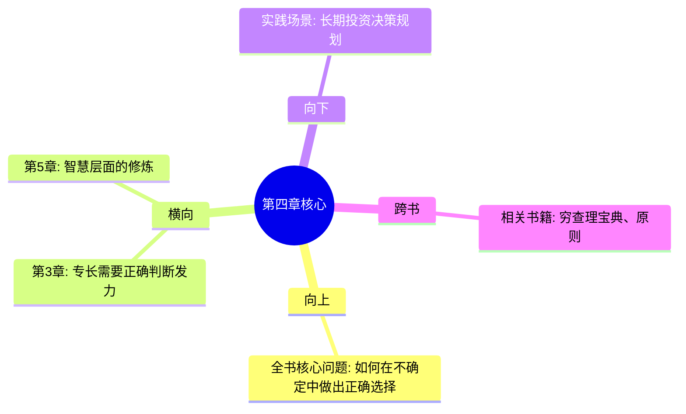

# 第4章 判断力——方向比速度更重要

## 📍 章节定位

### 全书位置
> 第4章是全书决策框架的核心，解决"选择比努力更重要"的战略思维问题，强调判断力在财富创造中的决定性作用

- **全书核心问题**: 如何同时拥有财富与幸福？
- **本章回答的问题**: 在充满不确定性的世界中，如何做出正确的选择和判断？
- **角色类型**: 决策战略型 - 提供行动指导原则
- **论证位置**: 衔接个人能力（专长知识）与财富工具（杠杆运用）的关键决策环节

### 章节序列
| 方向 | 章节标题 | 逻辑连接 |
|------|----------|----------|
| 前章 | [[第3章-专长知识——你的护城河]] | 承接个人能力，强调运用能力的方向性 |
| 后章 | [[第5章-幸福是一门技能]] | 同为心智层面的指导，判断力vs情绪管理 |

### 一句话定位
> 第4章强调在杠杆时代，正确的判断比单纯的努力更关键，决策质量决定了财富创造的方向和效率

---

## 🎯 核心观点

### 第一层：表层案例
> 章节中的具体情境、实例、数据

| 案例名称 | 简要描述 | 页码 | 关键引文 |
|----------|----------|------|----------|
| 努力vs判断力 | 优先级重新定义 | - | "努力工作的作用被大大高估了。判断力被低估了。" |
| 杠杆时代影响 | 判断放大效应 | - | "在杠杆时代，一个正确的决策可以让你赢一切。" |
| 方向错误模型 | 低效努力 | - | "如果方向错误，努力 × 杠杆 = 灾难" |
| 清晰思维框架 | 智慧定义 | - | "智慧 = 知道个人行为的长期后果" |

### 第二层：中层机制
> 判断力发挥作用的内部逻辑

| 机制名称 | 组成要素 | 因果链条 | 证据来源 |
|----------|----------|----------|----------|
| 放大效应机制 | 杠杆 + 决策正确性 | 错误决策 → 杠杆放大 → 灾难性后果 | 杠杆放大原理 |
| 质量导向机制 | 决策质量 + 长期影响 | 正确判断 → 复利效应 → 几何增长 | 复利决策模型 |
| 方向优先机制 | 路线选择 + 执行速度 | 方向正确 → 执行有效 → 结果优化 | 航海导向原理 |
| 资源配置机制 | 时间精力 + 机遇识别 | 准确判断 → 资源聚焦 → 效率提升 | 资源优化配置 |

### 第三层：底层规律
> 判断力背后的普适性原则

| 规律陈述 | 抽象层级 | 知识连接 | 适用范围 |
|----------|----------|----------|----------|
| 杠杆放大定律 | 系统论 | 决策质量放大效应 | 所有系统性决策 |
| 选择成本律 | 经济学 | 路径依赖效应 | 人生/事业决策 |
| 复合增长律 | 数学理论 | 复利效应扩散性 | 长期价值规划 |
| 长远思维律 | 认知科学 | 短期vs长期利益权衡 | 一切战略决策 |

---

## 💬 降维翻译

### 观点1: 努力被高估，判断力被低估

#### 原文表达
> "努力的作用被大大高估了。判断力的作用被大大低估了。在杠杆时代，一个正确的决策可以让你赢一切；一个错误的决策可以让你输一切。最终结果 = 方向（判断力） × 速度（努力） × 杠杆。如果方向错误，努力×杠杆 = 灾难。"

#### 降维翻译（中学生能懂）
就像你坐车到目的地：
- A路线：虽然开车很慢，但方向是对的 → 最后能到达目的地
- B路线：开车飞快，但方向错的 → 离目标越来越远

现在的时代有了"加速器"（就是杠杆），A路线的慢车可能比B路线的快车跑得更快，而B路线错误车一旦加速反而更快地离目标远去。

所以现在最重要的是搞清楚哪条是正确的路，而不是拼命踩油门。

#### 日常类比（奶奶能懂）
就像种地一样：
- A方法：勤快种但选错了种子（错误判断）
- B方法：用心选对优良品种（正确判断）、适当照料

以前不发达时代，A的努力也能有点效果；但现在科技时代，B的正确种子配合现代农业技术（杠杆），那产出差距巨大。

所以"选对方向"比"埋头苦干"更重要了。

#### 检验
- Q: 如果一个中学生问你这是什么意思？
- A: 就是现在做什么都要先想清楚，不要盲动，因为现在有放大器会把错误也放大。

### 观点2: 智慧的定义

#### 原文表达
> "智慧 = 知道个人行为的长期后果。"

#### 降维翻译（中学生能懂）
聪明是解决现在的问题，智慧是考虑五年后、十年后的结果。
比如：
- 聪明人：这次考试要得高分（考虑现在）
- 智慧人：为将来选专业和发展选择做这次的选择（考虑长远）

智慧就是能想到今天决定可能五年后才看到结果。

#### 日常类比（奶奶能懂）
就像做事情要想远一点：
- 不知道后果：今天借钱买漂亮衣服穿
- 知道后果：今天节约钱为子女做教育储蓄

智慧的人做决定的时候会想着"这件事过几年会变成什么样"。

#### 检验
- Q: 如果长辈问你什么是智慧？
- A: 就是做决定时想想这件事过几年会怎么样，不只看眼前的好处。

---

## ✨ 金句库

### 原书金句
| 金句 | 页码 | 适用场景 |
|------|------|----------|
| 努力工作的作用被大大高估了。判断力被低估了。 | - | 微博/朋友圈/文章引用 |
| 在杠杆时代，一个正确的决策可以让你赢一切。 | - | 深度文章引用 |
| 智慧 = 知道个人行为的长期后果。 | - | 思维成长分享 |
| 你想在社会上出类拔萃，你必须和长期的人玩长期的游戏。 | - | 战略思维 |

### 降维金句
| 金句 | 来源观点 | 适用场景 |
|------|----------|----------|
| 方向比速度重要100倍——特别是在运用杠杆以后。 | 判断力 | 决策指导 |
| 正确的决定胜过千次努力 | 质量导向 | 努力观念 |
| 谁更长远，谁赢未来 | 长期思维 | 策略视野 |
| 想5年，做今天 | 长远规划 | 行动准则 |

## 🔗 当下映射

### 💰 财富应用
| 场景 | 具体行动 | 预期效果 | 风险提示 |
|------|----------|----------|----------|
| 投资决策 | 优先分析大方向和趋势 | 避免短期波动导致的错误决策 | 需要大量知识和经验积累 |
| 职业选择 | 选择朝阳行业和优质公司 | 获得长期职业发展优势 | 需准确判断行业发展趋势 |
| 创业方向 | 选择适合的商业模式 | 避免努力方向失误 | 需要有充分市场调研 |

### 💼 职场应用
| 场景 | 具体行动 | 所需能力 | 适用职级 |
|------|----------|----------|----------|
| 工作重点 | 优先选择重要项目而非紧急任务 | 战略判断能力 | 所有级别 |
| 学习方向 | 学习对未来有益的技能而非热门技能 | 前瞻性思考 | 所有级别 |
| 时间分配 | 优先处理能带来长期收益的任务 | 优先级管理能力 | 中高级 |

### 🏠 生活应用
| 场景 | 具体行动 | 可行性 | 见效时间 |
|------|----------|--------|----------|
| 决策习惯 | 做决定前思考长期后果 | 高 | 长期有效 |
| 焦虑缓解 | 避免被短期波动影响情绪 | 高 | 即时生效 |
| 教育子女 | 培养长远眼光而非短期成绩 | 中 | 长期见效 |

### 72小时行动计划
1. [ ] 在下一个重大决策前，列出可能的长期影响
2. [ ] 思考自己最近一年的主要决策质量和结果
3. [ ] 制定"决策优先还是执行优先"的行为准则

---

## 🕸️ 章节关联

### 向上关联 → 整书
- **贡献**: 解决"如何做出正确决策"问题，为专长+杠杆的有效运用提供方向指引
- **位置**: 财富公式中的J(Judgement)元素，起到方向引导作用

### 横向关联 → 章节间
| 章节编号 | 章节标题 | 关联类型 | 连接描述 |
|----------|----------|----------|----------|
| 第3章 | 专长知识——你的护城河 | 合作 | 专长需要判断正确发挥方向 |
| 第5章 | 幸福是一门技能 | 共同 | 都是心智层面的修炼技能 |
| 第1章 | 财富不是目标，而是副产品 | 支撑 | 为财富观提供决策框架 |

### 向下关联 → 具体应用
| 应用场景 | 难度 | 前置知识 |
|----------|------|----------|
| 战略决策制定 | 高 | 市场/行业知识 |
| 时机把握能力 | 高 | 经验总结储备 |
| 人生规划规划 | 中 | 自我认知基础 |

### 跨书关联 → 知识网络
| 书籍 | 概念 | 关系 | 备注 |
|------|------|------|------|
| [[穷查理宝典-拆解记录]] | 多元思维模型 | 强化 | 芒格提供思维工具，纳瓦尔强调判断重要性 |
| [[反脆弱-塔勒布-拆解记录]] | 不确定性中的选择 | 互补 | 为判断力提供应对外部不确定性的框架 |
| [[原则-拆解记录]] | 决策原则系统 | 平行 | 相似的系统化决策理念 |

### 关联可视化

---

## ❓ 问答设计

### Q1: [记忆型] 纳瓦尔对智慧的定义是什么？判断力的作用被如何评估？
**认知层次**: 记忆
**难度**: 低
**答案要点**:
- 智慧 = 知道个人行为的长期后果
- 判断力被严重低估，而努力被高估
- 在杠杆时代判断力比努力更重要

### Q2: [理解型] 为什么在杠杆时代，判断力比努力更重要？
**认知层次**: 理解
**难度**: 中
**答案要点**:
- 杠杆会放大一切，包括错误
- 正确决策 × 杠杆 = 指数收益
- 错误决策 × 杠杆 = 指数损失
- 因此选择正确的方向比单纯执行重要

### Q3: [应用型] 如何在投资决策中应用判断力而不是努力？
**认知层次**: 应用
**难度**: 中
**答案要点**:
- 不是疯狂寻找短期机会，而是判断行业的长期趋势
- 不是频繁交易，而是选择优秀的标的长期持有
- 不是技术分析，而是对商业基本面的深入理解
- 重视投资标的的管理和商业模式

### Q4: [分析型] 分析判断力和专长知识的关系
**认知层次**: 分析 
**难度**: 中
**答案要点**:
- 专长知识提供判断的专业基础
- 判断力决定如何最佳利用专长知识
- 专业技能需要正确判断才能发挥
- 两大要素互补，缺一不可

### Q5: [评价型] 评价"判断力决定一切"观点的局限性
**认知层次**: 评价
**难度**: 高
**答案要点**:
- 积极性：强调战略性思维重要性
- 局限性：过分轻视执行力的价值
- 平衡性：理想情况是判断力+执行力的结合
- 实用性：在某些需要快速执行的场景下判断不是全部

### Q6: [创造型] 设计一个判断力决策检查清单用于商业决定
**认知层次**: 创造
**难度**: 高
**答案要点**:
- 长期影响：5年后的结果会是什么？
- 机遇成本：如果不做这个选择，会失去什么？
- 风险评估：最坏情况的可能性及后果？
- 资源匹配：是否有足够资源支撑此决策？
- 反向思考：这个做法最大的潜在问题是什么？

### Q7: [理解型] 如何区分短期判断和长期判断？
**认知层次**: 理解
**难度**: 中
**答案要点**:
- 短期：关注当下效率、近期目标达成
- 长期：关注发展趋势、未来价值创造
- 关联：短期服从于长期目标
- 平衡：两者需要兼顾而非对立

### Q8: [应用型] 举三个生活中体现判断力的例子
**认知层次**: 应用
**难度**: 中
**答案要点**:
- 职业选择：选择发展前景好的行业而非短期薪资高的岗位
- 健康管理：长期保健而非短期减肥
- 人际关系：结交能促进成长的人而非只是舒服的关系

### Q9: [记忆型] 纳瓦尔的财富创造公式中判断力的位置？
**认知层次**: 记忆
**难度**: 低
**答案要点**:
- 财富创造 = 专长知识 × 杠杆 × 判断力 × 复利
- 判断力(J)是其中一个关键乘数
- 任何乘数为零，整个结果为零

### Q10: [分析型] 分析判断力和努力在不同生命周期中的相对重要性？
**认知层次**: 分析
**难度**: 中
**答案要点**:
- 年轻时期：努力构建基础，判断力用于选择正确技能
- 中年时期：判断力决定事业高度，努力保证执行
- 成熟期：判断力主导资源配置，执行交给专业团队

### Q11: [应用型] 如何在职业生涯中提高判断力而非仅提升技能？
**认知层次**: 应用
**难度**: 中
**答案要点**:
- 拓宽视野：多了解行业发展趋势
- 跨域学习：接触不同领域的知识经验
- 决策实践：主动争取重要的决策机会
- 反思总结：定期回顾决策的效果及其原因

### Q12: [理解型] 在面对选择困难时如何运用判断力？
**认知层次**: 理解
**难度**: 中
**答案要点**:
- 识别核心标准：什么是最重要的？
- 长期视角：哪个选择对未来更有利？
- 价值观对照：哪个符合个人核心价值观？
- 概率思维：考虑各种结果的可能性

### Q13: [记忆型] 杠杆如何改变判断力vs努力的重要性对比？
**认知层次**: 记忆
**难度**: 低
**答案要点**:
- 在没有杠杆的时代，努力决定成败
- 有了杠杆后，方向对错被放大
- 错误方向+杠杆=灾难性后果
- 正确方向+杠杆=几何级收益提升

### Q14: [分析型] 分析判断力在团队管理中的作用？
**认知层次**: 分析
**难度**: 中
**答案要点**:
- 团队方向：领导者需要选择正确的战略方向
- 人员配置：合理分配人力资源至最有潜力的项目
- 激励机制：建立有效的团队协作系统
- 资源分配：判断应向哪些方向倾斜资源

### Q15: [评价型] 从多元文化视角评价判断力文化的优势与挑战？
**认知层次**: 评价
**难度**: 高
**答案要点**:
- 优势：鼓励前瞻性思考、战略决策能力培养
- 挑战：可能过于强调个体选择而忽视集体智慧
- 适应性：在快速变化的时代较为适用
- 文化差异：不同文化背景下对判断力的理解存在差异

---
