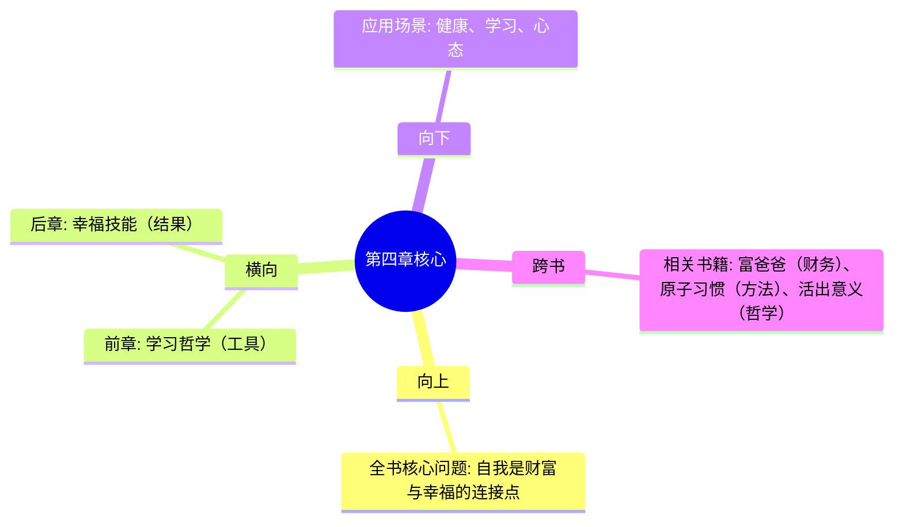

# 第4章 拯救自己

## 📍 章节定位

### 全书位置
> 第4章是全书的自我责任宣言，将外在财富创造转向内在能力建设，回答"谁对你的生活负责"这一根本问题

- **全书核心问题**: 如何同时拥有财富与幸福？
- **本章回答的问题**: 如何成为自己人生的第一责任人？健康、教育、选择——谁来掌舵？
- **角色类型**: 责任转移型 - 从外在依赖到内在掌控
- **论证位置**: 构成财富与幸福之间的桥梁，自我是连接点

### 章节序列
| 方向 | 章节标题 | 逻辑连接 |
|------|----------|----------|
| 前章 | [[第3章-学习哲学]] | 知识积累 → 自我实践 |
| 后章 | [[第5章-幸福是一门技能]] | 掌控自己 → 获得幸福 |

### 一句话定位
> 第4章宣告"没有人会来救你"，提出健康优先、自我教育、独立判断三大自我救赎法则，是财富与幸福的连接纽带

---

## 🎯 核心观点

### 第一层：表层案例
> 章节中涉及的实例、数据、引用

| 案例名称 | 简要描述 | 页码 | 关键引文 |
|----------|----------|------|----------|
| 没人会来救你 | 童年幻想的终结 | - | "没有骑士会骑着白马来拯救你" |
| 健康第一性 | 身体是所有追求的基础 | - | "没有健康，财富和幸福都毫无意义" |
| 自我教育 | 学校只教你基本技能 | - | "真正的教育从你离开学校开始" |
| 长期游戏 | 选择可以玩一辈子的事 | - | "生活中所有的回报都来自复利" |

### 第二层：中层机制
> 机制背后的原理和运作过程

| 机制名称 | 组成要素 | 因果链条 | 证据来源 |
|----------|----------|----------|----------|
| 责任内化机制 | 外在期待 → 失望 → 内在接管 | 依赖他人 → 常态性失望 → 自我负责 | 心理成熟模型 |
| 健康乘数效应 | 身体 → 精力 → 判断力 → 决策 | 健康 → 能量充沛 → 清晰思考 → 正确选择 | 生理心理联动 |
| 自我教育循环 | 阅读实践 → 思考 → 输出 → 反馈 | 主动学习 → 知识内化 → 能力提升 → 新问题 | 终身学习框架 |
| 复利选择机制 | 长期主义 → 坚持 → 复利 | 选择长期游戏 → 持续投入 → 指数回报 | 复利效应原理 |

### 第三层：底层规律
> 可迁移的普遍原则

| 规律陈述 | 抽象层级 | 知识连接 | 适用范围 |
|----------|----------|----------|----------|
| 自我责任定律 | 存在主义哲学 | 萨特"存在先于本质" | 人生所有领域 |
| 身心统一律 | 整体医学 | 中医整体观、功能医学 | 健康管理 |
| 主动学习律 | 认知科学 | 建构主义学习理论 | 知识获取 |
| 长期主义原则 | 时间哲学 | 《原子习惯》复利思维 | 决策与习惯 |

---

## 💬 降维翻译

### 观点1: 没有人会来救你

#### 原文表达
> "没有骑士会骑着白马来拯救你。你就是自己的救世主。"

#### 降维翻译（中学生能懂）
想象你在沙漠里迷路了：
- 等救援的人：坐在原地等，可能等一辈子
- 自己走的人：虽然累，但迟早能走出去

很多人一生都在等"贵人"、"机会"、"运气"：
- 等老板提拔 → 老板可能永远看不到你
- 等伴侣改变 → 对方可能一辈子不变
- 等环境变好 → 环境可能越来越差

唯一的出路：自己动手，自己负责。

#### 日常类比（奶奶能懂）
就像种庄稼：
- 盼着老天爷下雨，不如自己挖井
- 盼着邻居帮忙收麦子，不如自己早起干活
- 盼着儿女孝顺，不如自己身体好、钱够花

靠山山会倒，靠人人会跑，靠自己最牢靠。

#### 检验
- Q: 如果一个朋友问你"为什么我总是等不到机会？"
- A: 因为你在等，别人在造。机会是自己制造的，不是等来的。

---

### 观点2: 健康是第一优先级

#### 原文表达
> "没有健康，财富和幸福都毫无意义。健康应该是你的第一优先级。"

#### 降维翻译（中学生能懂）
想象你有一辆跑车：
- 车再贵，引擎坏了也开不动
- 你有再多钱，躺在病床上也花不了
- 你有再大抱负，身体垮了也实现不了

很多人拼命赚钱，然后用赚来的钱治病——这逻辑不对。

正确的顺序是：
1. 先把身体搞好
2. 有了精力再去追求
3. 这样你才能真正享受结果

#### 日常类比（奶奶能懂）
就像盖房子：
- 地基不稳，房子再漂亮也会塌
- 身体就是人生的"地基"
- 年轻时不觉得，老了才知道"地基"多重要

年轻时用命换钱，年老时用钱换命——这是最亏的买卖。

#### 检验
- Q: 如果有人问"工作和健康哪个重要？"
- A: 没有健康，工作就没意义。健康是那个"1"，其他都是后面的"0"。

---

### 观点3: 自我教育是终身事业

#### 原文表达
> "学校教你基本技能，真正的教育从你离开学校开始。"

#### 降维翻译（中学生能懂）
学校教育就像学自行车的基础：
- 教你平衡、踩踏板
- 但没教你骑向哪里、怎么避开坑洼

真正的学习是在路上的：
- 工作中遇到的问题 → 自己想办法解决
- 生活中遇到的困惑 → 自己找书看、找人问
- 时代在变 → 自己跟上新东西

那些离开学校就不学习的人，就像骑自行车停在原地，永远到不了目的地。

#### 日常类比（奶奶能懂）
就像做饭：
- 学会炒菜（学校教育）只是入门
- 真正的功夫是：
  - 今天咸了，明天少放盐
  - 看到新菜谱，自己试试
  - 家人爱吃什么，慢慢摸索

人生就是一道菜，学校只教了你会开火，味道要自己调。

#### 检验
- Q: 如果有人问"大学毕业后还需要学习吗？"
- A: 大学毕业那天，学习才真正开始。学校给你的是地图，路要自己走。

---

## ✨ 金句库

### 原书金句
| 金句 | 页码 | 适用场景 |
|------|------|----------|
| 没有骑士会骑着白马来拯救你。 | - | 微博/朋友圈/自我激励 |
| 你就是自己的救世主。 | - | 人生转折点引用 |
| 没有健康，财富和幸福都毫无意义。 | - | 健康提醒 |
| 真正的教育从你离开学校开始。 | - | 终身学习倡导 |
| 生活中所有的回报都来自复利。 | - | 长期主义传播 |

### 降维金句
| 金句 | 来源观点 | 适用场景 |
|------|----------|----------|
| 等救不如自救。 | 自我负责 | 简洁传播 |
| 健康是那个"1"，其他都是后面的"0"。 | 健康优先 | 价值观传递 |
| 学校毕业那天，学习才真正开始。 | 自我教育 | 毕业季/职场转型 |
| 靠自己，永远不靠不住。 | 独立自主 | 自立自强 |

## 🔗 当下映射

### 💰 财富应用
| 场景 | 具体行动 | 预期效果 | 风险提示 |
|------|----------|----------|----------|
| 投资决策 | 保持身心健康，做清晰判断 | 减少情绪化投资错误 | 过度谨慎可能错失机会 |
| 职业发展 | 持续学习，提升核心竞争力 | 收入增长，选择权增加 | 需要时间和精力投入 |
| 风险管理 | 建立健康储蓄和医疗保障 | 防止因病返贫 | 前期投入较大 |

### 💼 职场应用
| 场景 | 具体行动 | 所需能力 | 适用职级 |
|------|----------|----------|----------|
| 职业瓶颈 | 不等公司培训，主动学习新技能 | 自驱力、学习能力 | 所有级别 |
| 健康管理 | 保持规律作息，定期锻炼 | 自律能力 | 所有级别 |
| 职业规划 | 选择可长期发展的赛道 | 长期思维 | 中高级 |

### 🏠 生活应用
| 场景 | 具体行动 | 可行性 | 见效时间 |
|------|----------|--------|----------|
| 健康习惯 | 每天运动30分钟，规律作息 | 高 | 1-3个月 |
| 自我教育 | 每天阅读30分钟，输出笔记 | 高 | 持续积累 |
| 心态调整 | 从"等"转为"做"，减少抱怨 | 中 | 立即 |

### 72小时行动计划
1. [ ] 评估健康状态：列出3个可以立即改善的习惯（如睡眠、运动、饮食）
2. [ ] 制定学习计划：选择1本近期要读的书，并设定完成日期
3. [ ] 心态自查：列出3件你在"等待"的事情，思考能否转为"主动"

---

## 🕸️ 章节关联

### 向上关联 → 整书
- **贡献**: 建立个人责任的核心框架，连接财富创造与幸福获得
- **位置**: 财富篇与幸福篇之间的桥梁章节

### 横向关联 → 章节间
| 章节编号 | 章节标题 | 关联类型 | 连接描述 |
|----------|----------|----------|----------|
| 第3章 | 学习哲学 | 承接 | 学习方法是自我教育的工具 |
| 第5章 | 幸福是一门技能 | 铺垫 | 自我掌控是幸福的起点 |
| 第1章 | 财富不是目标，而是副产品 | 基础 | 健康是财富创造的前提 |

### 向下关联 → 具体应用
| 应用场景 | 难度 | 前置知识 |
|----------|------|----------|
| 健康习惯建立 | 中 | 基础健康知识 |
| 终身学习系统 | 中 | 阅读和笔记方法 |
| 心态转变实践 | 中 | 自我觉察能力 |

### 跨书关联 → 知识网络
| 书籍 | 概念 | 关系 | 备注 |
|------|------|------|------|
| [[富爸爸穷爸爸-清崎-拆解记录]] | 财务独立 | 互补 | 自我负责的财务体现 |
| [[原子习惯-詹姆斯克利尔-拆解记录]] | 习惯系统 | 方法 | 健康和学习习惯的建立 |
| [[活出生命的意义-弗兰克尔-拆解记录]] | 自我负责 | 哲学溯源 | 存在主义的责任观 |

### 关联可视化

---

## ❓ 问答设计

### Q1: [记忆型] 纳瓦尔为什么说"没有骑士会来救你"？
**认知层次**: 记忆
**难度**: 低
**答案要点**:
- 童年的幻想：等待被拯救
- 现实：必须自己承担责任
- 核心信息：你是自己的救世主

### Q2: [理解型] 为什么健康是第一优先级？
**认知层次**: 理解
**难度**: 中
**答案要点**:
- 健康是所有追求的基础
- 没有健康，财富和幸福都无意义
- 身心状态影响判断力和决策
- 健康问题会消耗所有资源

### Q3: [应用型] 如何实践"自我教育"的理念？
**认知层次**: 应用
**难度**: 中
**答案要点**:
- 建立阅读习惯，持续输入
- 实践中学，问题中学
- 输出倒逼输入，写作/分享
- 建立反馈循环，持续改进

### Q4: [分析型] 分析"等救"和"自救"两种心态的长期影响
**认知层次**: 分析
**难度**: 中
**答案要点**:
- 等救心态：被动、焦虑、常失望
- 自救心态：主动、成长、可控感
- 长期：等救者停滞，自救者进化
- 社会层面：自救者更受尊重和机会青睐

### Q5: [评价型] "自我负责"理念在现实中有哪些局限？
**认知层次**: 评价
**难度**: 高
**答案要点**:
- 积极面：增强自主性和成长动力
- 局限：系统性障碍无法仅靠个人努力克服
- 平衡：自我负责 + 识别外部帮助的价值
- 警惕：过度自责可能导致心理负担

### Q6: [创造型] 设计一个"自我救赎"的90天行动计划
**认知层次**: 创造
**难度**: 高
**答案要点**:
- 第1-30天：建立健康基础（睡眠、运动、饮食）
- 第31-60天：启动学习系统（阅读、输出）
- 第61-90天：心态转变实践（从等待到行动）
- 每周回顾，持续调整

### Q7: [理解型] 为什么说"真正的教育从离开学校开始"？
**认知层次**: 理解
**难度**: 中
**答案要点**:
- 学校提供基础知识和学习方法
- 真正的问题和挑战在现实中
- 自我驱动比被动学习更有效
- 终身学习是时代要求

### Q8: [应用型] 如何在繁忙工作中保持健康？
**认知层次**: 应用
**难度**: 中
**答案要点**:
- 将健康纳入日程，像会议一样固定
- 利用碎片时间活动
- 保证睡眠质量
- 选择健康的饮食选项

### Q9: [记忆型] 本章提到的三个自我救赎法则是什么？
**认知层次**: 记忆
**难度**: 低
**答案要点**:
- 健康优先
- 自我教育
- 独立判断/长期游戏

### Q10: [分析型] 分析"长期主义"与"短期满足"的决策差异
**认知层次**: 分析
**难度**: 中
**答案要点**:
- 长期主义：选择有复利效应的事
- 短期满足：即时快乐但无积累
- 长期：能力提升、选择权增加
- 短期：能力停滞、被动局面

### Q11: [应用型] 如何识别自己是否有"等待被救"的心态？
**认知层次**: 应用
**难度**: 中
**答案要点**:
- 自问：我是否常抱怨"没人帮我"
- 检查：遇到问题第一反应是找人还是自己想办法
- 观察：是否总在等"机会"而非创造机会
- 反思：是否把责任推给环境、他人、运气

### Q12: [理解型] "自我负责"和"自私"的区别是什么？
**认知层次**: 理解
**难度**: 中
**答案要点**:
- 自我负责：对自己的选择和结果负责
- 自私：只顾自己，不顾他人
- 自我负责不排斥帮助他人
- 自我负责是成熟，自私是幼稚

### Q13: [应用型] 如何建立可持续的自我学习系统？
**认知层次**: 应用
**难度**: 中
**答案要点**:
- 固定学习时间，形成习惯
- 选择感兴趣且有价值的主题
- 输出实践，验证所学
- 建立学习社区，互相促进

### Q14: [分析型] 分析"自我救赎"理念与东方哲学的异同
**认知层次**: 分析
**难度**: 高
**答案要点**:
- 相似：强调个人修行和成长
- 不同：东方更强调顺应自然，西方强调主动掌控
- 共同点：责任最终归于自己
- 现代融合：主动负责 + 接受不可控

### Q15: [评价型] 从批判性视角评估"没有人会来救你"这一观点
**认知层次**: 评价
**难度**: 高
**答案要点**:
- 积极面：激发自主性，减少依赖
- 消极面：可能忽视社会支持和系统性问题
- 平衡视角：自我负责是基础，但接受合理帮助
- 文化差异：集体主义文化中强调互助
- 实践建议：以自我负责为主，善用外部资源

---
