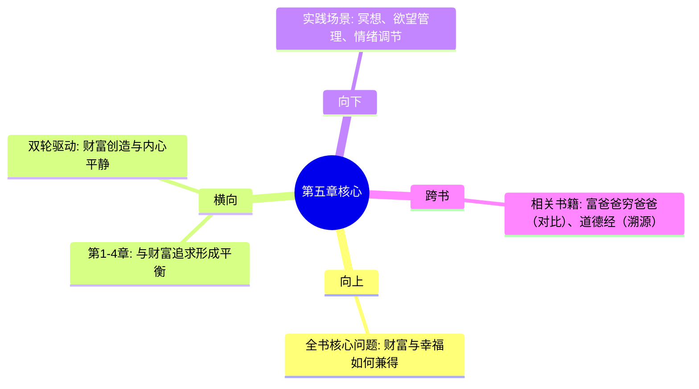

# 第5章 幸福是一门技能

## 📍 章节定位

### 全书位置
> 第5章是全书价值哲学的升华部分，与前四章的财富创造形成平衡，回答"财富的意义是什么"以及"如何实现可持续的心理健康"

- **全书核心问题**: 如何同时拥有财富与幸福？
- **本章回答的问题**: 真正的幸福是什么？如何通过技能训练获得内心平静？
- **角色类型**: 平衡升华型 - 与财富创造互补的幸福哲学
- **论证位置**: 构成《纳瓦尔宝典》"财富+幸福"双轮驱动的后轮

### 章节序列
| 方向 | 章节标题 | 逻辑连接 |
|------|----------|----------|
| 前章 | [[第4章-判断力——方向比速度更重要]] | 承接心智修炼，提供内在平静的修炼方法 |
| 后章 | 无 | 全书终点，完成"双轮驱动"哲学闭环 |

### 一句话定位
> 第5章定义幸福为可通过技能修炼获得的内心平静状态，提供欲望管理的具体方法，实现"财富+幸福"完整人生哲学

---

## 🎯 核心观点

### 第一层：表层案例
> 书中涉及的具体情境、例子、实用方法

| 案例名称 | 简要描述 | 页码 | 关键引文 |
|----------|----------|------|----------|
| 幸福定义对比 | 区分外部刺激与内心平静 | - | "幸福不是与生俱来的特质，而是一种可以学习的技能" |
| 欲望循环模型 | 期待→获得→新欲望→期待 | - | "欲望就是你和自己签的合约：在得到你想要的东西之前，你不会快乐" |
| 欲望管理实践 | 冥想、锻炼、减少社交媒体 | - | "冥想训练你专注当下，锻炼给身体是头脑的基础" |
| 内在平静获得 | 减少对外界认可依赖 | - | "你越平和，你越不需要外在世界来认可你" |

### 第二层：中层机制
> 幸福产生的内在逻辑机制

| 机制名称 | 组成要素 | 因果链条 | 证据来源 |
|----------|----------|----------|----------|
| 欲望循环机制 | 欲望→期待→获得→新欲望 | 外部依赖 → 不满足 → 持续渴望 → 痛苦 | 欲望驱动痛苦原理 |
| 内观训练机制 | 注意力→内省→觉察→接纳 | 外向注意 → 收回关注 → 觉醒当下 → 内心平静 | 冥想心理训练模型 |
| 满足阈值机制 | 初次满足→习得效应→阈值提高→需要更多 | 得到物品 → 快感递减 → 寻求更大刺激 → 永无满足 | 快乐适应原理 |
| 内外平衡机制 | 内在价值→外在认可→独立平衡 | 自我肯定 → 减少依赖 → 独立性 → 内在富足 | 心理独立理论 |

### 第三层：底层规律
> 幸福哲学的普遍适用原则

| 规律陈述 | 抽象层级 | 知识连接 | 适用范围 |
|----------|----------|----------|----------|
| 内在决定论 | 心理学基本原理 | 内控型人格研究 | 个人幸福建构 |
| 简约平衡律 | 古典哲学 | 朴素生活原则 | 各领域生活选择 |
| 需求独立律 | 经济学和社会学 | 减少依赖提升自由度 | 个人独立能力 |
| 当下现世论 | 佛教哲学、斯多葛 | 活在当下哲学 | 跨文化智慧传统 |

---

## 💬 降维翻译

### 观点1: 幸福是一种技能而非天赋

#### 原文表达
> "幸福不是与生俱来的特质，而是可以学习的技能。幸福是一种内心的平静，不是外在刺激。"

#### 降维翻译（中学生能懂）
就像打篮球一样：
- 有的人天生身体好，但后天不练球技术也不会好
- 有的人身体一般，但通过练习掌握了投篮、运球技术，反而打得很好
- 哪种更厉害：是身体好的，还是技术好的？
  
一样的，有些人天生性格开朗，但如果不懂管理情绪，遇到挫折还是痛苦；而有些人学会了情绪管理技术（比如冷静分析、专注当下、感恩等），即使天生情绪波动大，也能过得很平静开心。

所以"开心"是一种可以学习的技术。

#### 日常类比（奶奶能懂）
就像养心养性的功夫：
- 年轻人遇到什么开心事就特别高兴，遇到不顺心就特别生气
- 经验老道的人，遇事心平气和，不高兴也不过分伤心
- 所谓"修炼道行深"，其实就是一个心态管理的技术活

不是命好就能幸福一辈子，是要学着怎么"管理心情"的技巧。

#### 检验
- Q: 如果一个长辈问你什么是幸福？
- A: 就是心情管理的好，不被外头的事牵着鼻子走。

### 观点2: 欲望是痛苦之源

#### 原文表达
> "欲望就是你和自己签的合约：在得到你想要的东西之前，你不会快乐。幸福是当你不再欲望时的内在平静。"

#### 降维翻译（中学生能懂）
就像你一直盯着前方的一个苹果树：
- 距离还很远时（目标未实现）：心里痒，总想着快点走到那里
- 终于走到那里摘到苹果（目标实现）：开心1小时
- 看见前边有个更大更好的梨树（新欲望）：又开始心里痒...

这样永远在"期待→得到→期待"的圈子里打转，实际上大部分时间都在不满足中度过。相反，如果你不再盯着果实，而是欣赏眼前的风景、感受走路的轻松自在，反而能享受到当下时刻。

#### 日常类比（奶奶能懂）
就像小孩哭着喊饿要吃包子，家长一给包子就笑了，但笑5分钟后看见糖果又要糖，又要哭。孩子永远在"得不到的焦虑"和"得到后的无感"之间摇摆。

真正快乐不是有吃有喝，是心里踏实不折腾，不被"还想再多点"的想法折腾。

#### 检验
- Q: 如果一个朋友问你怎么才能经常开心？
- A: 别老想要什么，多想想有就挺好的。

---

## ✨ 金句库

### 原书金句
| 金句 | 页码 | 适用场景 |
|------|------|----------|
| 幸福是当不再欲望时的内在平静。 | - | 微博/朋友圈/文章引用 |
| 欲望就是你和自己签的合约：在得到你想要的东西之前，你不会快乐。 | - | 人生感悟分享 |
| 你越平和，越不需要外在世界来认可你。 | - | 心理成长内容 |
| 真正的赢家是退出游戏的人。 | - | 哲学观点引用 |

### 降维金句
| 金句 | 来源观点 | 适用场景 |
|------|----------|----------|
| 欲望越少，痛苦越少。 | 欲望管理 | 简化生活 |
| 高手都是不动心的。 | 内心平静 | 心态指导 |
| 真正自由 = 不依赖外界认可 | 心理独立 | 状态描述 |
| 快乐的才能平静，平静了才会快乐。 | 幸福机制 | 心理健康 |

## 🔗 当下映射

### 💰 财富应用
| 场景 | 具体行动 | 预期效果 | 风险提示 |
|------|----------|----------|----------|
| 投资心态 | 管理对收益的期待 | 减少焦虑，作出理性决策 | 过度平静可能错失机会 |
| 消费观念 | 重视必要消费与享乐消费的区分 | 消费更有目的性，避免冲动购物 | 可能影响消费市场的繁荣 |
| 财富观 | 将财富视为工具而非终极目标 | 财富与幸福平衡发展 | 可能影响财富追求的主动性 |

### 💼 职场应用
| 场景 | 具体行动 | 所需能力 | 适用职级 |
|------|----------|----------|----------|
| 压力管理 | 通过内心平静应对外界压力 | 情绪调节能力 | 所有级别 |
| 评价应对 | 减少对外部评价的依赖 | 心理韧性强 | 所有级别 |
| 目标设定 | 制定可持续的职业发展目标 | 理性规划能力 | 中高级管理 |

### 🏠 生活应用
| 场景 | 具体行动 | 可行性 | 见效时间 |
|------|----------|--------|----------|
| 人际关系 | 降低对他人的过高期待 | 高 | 立即可改善 |
| 日常减压 | 实践冥想、专注当下的练习 | 中 | 1-2周开始见效 |
| 情绪管理 | 练习感恩、接受与放下 | 高 | 持续练习改善 |

### 72小时行动计划
1. [ ] 记录一天中的情绪波动及诱发事件
2. [ ] 尝试练习冥想或专注呼吸5分钟
3. [ ] 指出3件日常中可以降低期待的地方

---

## 🕸️ 章节关联

### 向上关联 → 整书
- **贡献**: 提供财富追求的终极意义框架，防止单纯物质主义的空虚 
- **位置**: 与财富创造形成平衡，构成完整的人生哲学体系

### 横向关联 → 章节间
| 章节编号 | 章节标题 | 关联类型 | 连接描述 |
|----------|----------|----------|----------|
| 第4章 | 判断力——方向比速度更重要 | 互补 | 判断力指导如何正确追求，幸福感指导追求的终极意义 |
| 第1章 | 财富不是目标，而是副产品 | 平衡 | 修正纯粹的财富追求心态 |
| 第2章 | 杠杆的力量 | 避免陷阱 | 杠杆可能放大外在目标，需要内在平衡 |
| 第3章 | 专长知识——你的护城河 | 调控动机 | 不同于外部标准，更注重内在发展 |

### 向下关联 → 具体应用
| 应用场景 | 难度 | 前置知识 |
|----------|------|----------|
| 冥想练习实践 | 中 | 基础专注训练 |
| 欲望管理技巧 | 中 | 心理自我觉察能力 |
| 生活简化行动 | 中 | 价值观梳理基础 |

### 跨书关联 → 知识网络
| 书籍 | 概念 | 关系 | 备注 |
|------|------|------|------|
| [[富爸爸穷爸爸-清崎-拆解记录]] | 财富观对比 | 对照 | 《富爸》偏向财富积累，《纳瓦尔》强调平衡 |
| [[反脆弱-塔勒布-拆解记录]] | 情绪稳定 | 互补 | 提供应对不确定性的情绪策略 |
| [[道德经-老子-拆解记录]] | 道家思想根源 | 追溯 | 简约、无为而治的思想传承 |

### 关联可视化

---

## ❓ 问答设计

### Q1: [记忆型] 纳瓦尔是如何定义幸福的？他认为幸福与欲望的关系是什么？
**认知层次**: 记忆
**难度**: 低
**答案要点**:
- 幸福是一种可以学习的技能（不是天赋）
- 内在平静（不是外部刺激）
- 欲望 = 和自己签约：得不到就不快乐
- 幸福 = 停止欲望时的内在安静

### Q2: [理解型] 为什么纳瓦尔认为"欲望就是与自己的合约"？
**认知层次**: 理解
**难度**: 中
**答案要点**:
- 欲望设置了一个条件："我要获得XX后才快乐"
- 这是自己强加给自己的一种约束
- 这种合约导致持续的不快乐直到条件达成
- 即使达成后新的合约会产生

### Q3: [应用型] 如何实践纳瓦尔提出的幸福技能训练方法？
**认知层次**: 应用
**难度**: 中
**答案要点**:
- 冥想：每日练习专注当下，减少思绪波动
- 锻炼：保持身体健康支撑心理健康
- 减社交媒体使用：减少比较和外在刺激
- 早睡早起：顺应自然节律获得平静
- 感恩练习：专注于已有而非缺乏

### Q4: [分析型] 分析幸福技能与专长知识之间的关系
**认知层次**: 分析 
**难度**: 中
**答案要点**:
- 专长知识提供外在成就感和经济保障
- 幸福技能提供内在平静和心理韧性
- 两者互补：外在成功如果没有内心平静容易空虚
- 内在平静有助于专注发展专长知识
- 实现财富与幸福的双重循环

### Q5: [评价型] 评价纳瓦尔"欲望减少=更幸福"理念的合理性
**认知层次**: 评价
**难度**: 高
**答案要点**:
- 积极面：确实减少不必要的焦虑和痛苦
- 消极面：可能降低动力和进取心
- 实用面：需要在适度追求和满足中平衡
- 文化面：东方哲学基础，可能不适合所有文化

### Q6: [创造型] 如何在追求财富的过程中应用幸福技能？
**认知层次**: 创造
**难度**: 高
**答案要点**:
- 设置合适的目标：有挑战性但不苛刻
- 过程中享受努力本身而非only看结果
- 在失败时保持心理弹性
- 成功时不被新欲望绑架
- 用内在平静保持理性投资决策

### Q7: [理解型] 为什么说"专注当下"能带来幸福？
**认知层次**: 理解
**难度**: 中
**答案要点**:
- 过去是记忆，过分纠结引起懊悔
- 未来是想象，过分担忧引起焦虑
- 当下是真实体验，专注此时此地获得实在感
- 只有当下是我们真正拥有的时间和空间

### Q8: [应用型] 列举三个可以立即开始的"幸福技能训练"活动
**认知层次**: 应用
**难度**: 中
**答案要点**:
- 深呼吸练习：每次紧张时暂停3次深呼吸
- 感恩日记：每天写下3件感谢的事
- 冥想练习：从5分钟静坐开始观察内心

### Q9: [记忆型] 纳瓦尔认为幸福和快乐有何区别？
**认知层次**: 记忆
**难度**: 低
**答案要点**:
- 快乐：外在刺激带来的短暂感受
- 幸福：内在平静的持续状态
- 快乐需要外部条件，幸福来自内心状态

### Q10: [分析型] 分析现代社会中实践"欲望管理"的主要挑战？
**认知层次**: 分析
**难度**: 中
**答案要点**:
- 信息过载：海量诱惑信息轰炸
- 消费文化：制造并强化消费需求
- 社交媒体：不断展示他人成功
- 竞争压力：社会比较不可避免

### Q11: [应用型] 在职场焦虑情况下如何应用幸福技能？
**认知层次**: 应用
**难度**: 中
**答案要点**:
- 正确看待评价：减少对他人认可需求
- 专注可控因素：在能力范围内尽力
- 保持长远视角：不过分纠结暂时挫折
- 照料身心健康：通过锻炼和冥想调节

### Q12: [理解型] 如何理解"你越平和，越不需要外在世界认可"？
**认知层次**: 理解
**难度**: 中
**答案要点**:
- 内在安全感源自自身，不需要外界证实
- 平和的人有清晰自我认知和价值观
- 减少因外在变化导致的情绪波动
- 建立持久稳定的心理状态

### Q13: [记忆型] 纳瓦尔提出的基本幸福实践方法有哪些？
**认知层次**: 记忆
**难度**: 低
**答案要点**:
- 冥想（专注当下）
- 锻炼（身体是头脑的根基）
- 减少社交媒体（降低比较）
- 阅读（提升思维模型）
- 早睡早起（遵循自然节律）

### Q14: [分析型] 分析"理性佛教"与纳瓦尔幸福哲学的关系？
**认知层次**: 分析
**难度**: 中
**答案要点**:
- 佛教思想：减少欲望，专注当下，内心平静
- 理性主义：通过思考理解，科学验证方法
- 纳瓦尔：将古佛学智慧用现代理性和实践方法阐释
- 现代化：更适合当代科学思维方式的实践

### Q15: [评价型] 批判性评估纳瓦尔幸福哲学面临的挑战？
**认知层次**: 评价
**难度**: 高
**答案要点**:
- 社会现实：激烈竞争环境中保持平静并不容易
- 经济压力：经济匮乏条件下难以实践欲望管理
- 个体差异：不是所有人都具备实践基础
- 文化适应：需要与个体文化背景相融合

---
