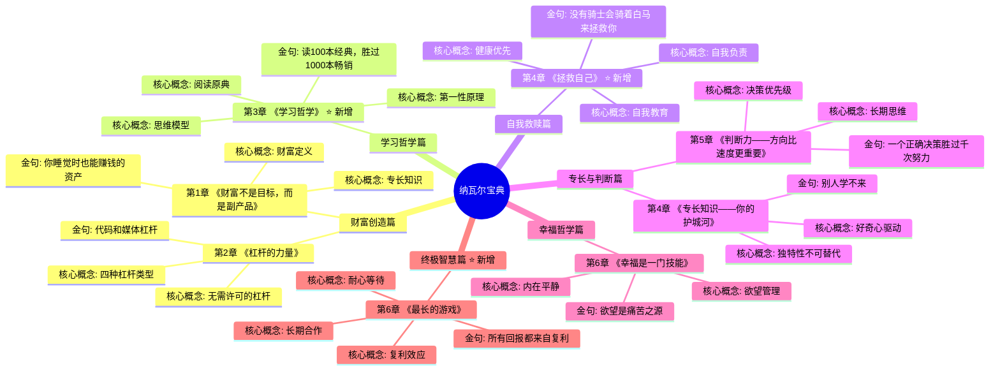
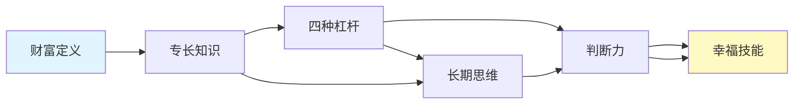

# 《纳瓦尔宝典》- 章节导航

> 作者: 埃里克·乔根森整理 / 纳瓦尔·拉维坎特
> 总章节: 5个主要概念章节
> 最后更新: 2026-02-28

---

## 📚 章节结构（Mermaid Mindmap）

---

## 🔗 核心概念关联图

---

| 章节 | 标题 | 状态 | 完成日期 | 核心收获 |
---

## 🚀 快速跳转

### 按章节跳转
- [[第1章-积累财富]] ⭐ 新增（财富不是靠运气）
- [[第1章-财富不是目标，而是副产品]]
- [[第2章-杠杆的力量]]
- [[第2章-学习幸福]] ⭐ 新增（幸福是一种技能）
- [[第3章-学习哲学]] ⭐ 新增（哲学与生活）
- [[第4章-拯救自己]] ⭐ 新增（自我救赎）
- [[第3章-专长知识——你的护城河]]
- [[第4章-判断力——方向比速度更重要]]
- [[第5章-幸福是一门技能]]
- [[第6章-最长的游戏]] ⭐ 新增（长期主义终极智慧）
### 按主题跳转
- 财富创造
- [[杠杆]]
- [[第3章-专长知识——你的护城河]]
- [[第4章-判断力——方向比速度更重要]]
- 幸福哲学

### 相关资源
- [[纳瓦尔宝典-乔根森]] - 主拆解笔记
- [[富爸爸穷爸爸-清崎]] - 相关书籍
- [[穷查理宝典]] - 相关书籍

---

## 📌 新增章节记录

| 日期 | 章节 | 核心主题 |
|------|------|----------|
| 2026-02-28 | 第3章-学习哲学 | 阅读原典、第一性原理、思维模型 |
| 2026-02-28 | 第4章-拯救自己 | 自我负责、健康优先、自我教育 |
| 2026-02-28 | 第6章-最长的游戏 | 复利效应、长期合作、耐心等待 |
