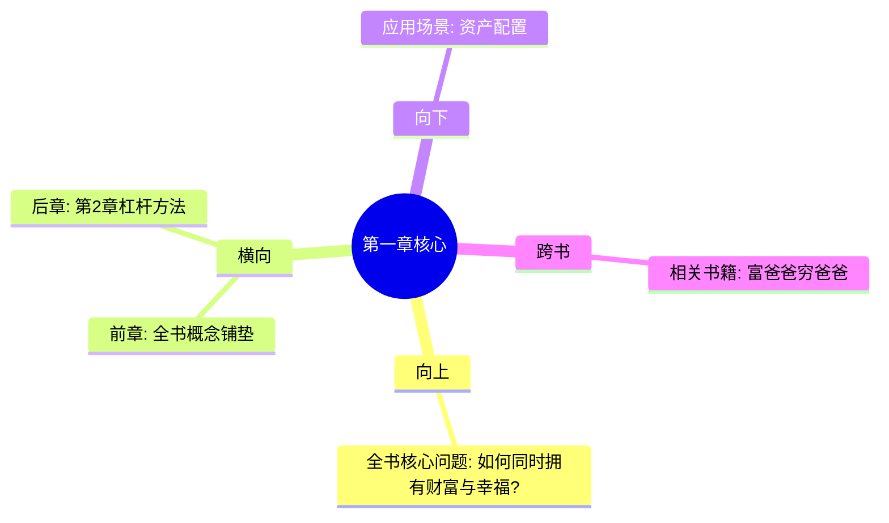

---

category: 
  - 书籍拆解
  - 纳瓦尔宝典
status: draft
chapter: 
number: 1
title: 财富不是目标，而是副产品
links:

  - "[[第2章-杠杆的力量]]"
  - "[[第3章-专长知识——你的护城河]]"
created: 2026-02-27
tags:
  - 纳瓦尔宝典
  - 财富创造
  - 专长知识
  - 财富思维
---

# 第1章 财富不是目标，而是副产品

## 📍 章节定位

### 全书位置
> 第1章是全书的开篇理念，为整书的财富创造哲学奠定概念基础，建立读者认知框架

- **全书核心问题**: 如何同时拥有财富与幸福？
- **本章回答的问题**: 什么是真正的财富？为什么要从"获取财富"转向"创造财富"？
- **角色类型**: 开篇理念定义型 - 核心概念阐述
- **论证位置**: 建立"财富≠金钱≠地位"的三元认知基础

### 章节序列
| 方向 | 章节标题 | 逻辑连接 |
|------|----------|----------|
| 前章 | [[纳瓦尔宝典-乔根森]] | 承接全书财富创造概念 |
| 后章 | [[第2章-杠杆的力量]] | 财富理念 → 实现手段 |

### 一句话定位
> 第1章定义财富的本质，区分财富、金钱、地位三大概念，为后续杠杆、专长知识、判断力铺垫理论基础

---

## 🎯 核心观点

### 第一层：表层案例
> 章节中涉及的实例、数据、引用

| 案例名称 | 简要描述 | 页码 | 关键引文 |
|----------|----------|------|----------|
| 睡眠财富概念 | 纳瓦尔对财富的定义 | - | "你睡觉时也能赚钱的资产" |
| 三元对比案例 | 财富vs金钱vs地位 | - | "财富：股权、知识产权 → 睡觉时赚钱" |
| 时间交易模式 | 出卖时间vs拥有资产模式 | - | "大多数人在出租时间，无法致富" |
| 股权所有权 | 拥有商业的一部分 | - | "你必须拥有股权——一块生意的一部分" |

### 第二层：中层机制
> 机制背后的原理和运作过程

| 机制名称 | 组成要素 | 因果链条 | 证据来源 |
|----------|----------|----------|----------|
| 时间交易限制 | 时间有限性、劳动报酬封顶 | 出卖时间 → 收入上限 → 无法变富 | 睡眠财富概念 |
| 资产复制放大 | 股权、知识产权、数字化 | 资产拥有 → 复制扩张 → 收入无上限 | 三种对比分析 |
| 财富创造模型 | 专长+杠杆+判断力 | 专业化能力 → 规模放大 → 财富积累 | 纳瓦尔财富公式 |
| 价值交换模式 | 主动收入vs被动收入 | 主动劳动 → 有偿交易 → 被动资产 | 睡眠时赚钱 |

### 第三层：底层规律
> 可迁移的普遍原则

| 规律陈述 | 抽象层级 | 知识连接 | 适用范围 |
|----------|----------|----------|----------|
| 复利原则 | 复杂系统论 | 复利效应在所有领域 | 金融/知识/关系/习惯 |
| 扩展性规律 | 复杂性科学 | 扩展性vs线性增长 | 商业/技术/社会 |
| 被动收益原理 | 收入结构论 | 从《富爸爸穷爸爸》演进 | 个人/企业/社会 |
| 终身价值论 | 长期思维框架 | 未来导向决策模式 | 投资/教育/关系 |

---

## 💬 降维翻译

### 观点1: 财富不是金钱

#### 原文表达
> "财富不是钱。财富是在你睡觉时仍能为你赚钱的资产。金钱是我们转换财富的方式。地位是你在人们心中的排名。"

#### 降维翻译（中学生能懂）
想象你有两个人生选择：
- 选择A：每天辛苦工作8小时，挣800元，一停歇就没钱。（这是金钱）
- 选择B：花时间建立一个小餐厅，雇佣员工运营，每天虽然休息依然有收入。（这是财富）
大多数人追逐的是A，但富人拥有的是B。

#### 日常类比（奶奶能懂）
就像种树和砍柴的区别：
- 砍柴（金钱）：今天砍了柴才烧得起饭，没有积蓄
- 种树（财富）：今年播下种子，后面每年都有收获
财富就是那棵持续结果的"钱树"，别人砍柴你收割。

#### 检验
- Q: 如果一个中学生问你这是什么意思？
- A: 真正有钱是"不工作也有收入"，而不是"工作才有钱拿"。

### 观点2: 找出专长

#### 原文表达
> "专长知识是一种社会无法通过培训获得的知识。如果社会可以训练你，它也可以训练其他人来取代你。"

#### 降维翻译（中学生能懂）
学校教所有学生同样的课程，但有些东西只有少数人能学到：
- 每个人都能学会数学公式（可培训技能）
- 但不是每个人都能具备销售的直觉、创意的独特性（专长知识）
你的专长知识就像"天赋+爱好+专业技能"的化学反应，别人很难复制。

#### 日常类比（奶奶能懂）
就像有人特别会调味儿：
- 普通人可以模仿做饭步骤（技能培训）
- 但调料的搭配、火候把握那种"感觉"难以传授（专长知识）
每个人的"味觉本能判断"不一样，这就是不可替代的价值。

#### 检验
- Q: 如果一个老年人问你这是什么意思？
- A: 就是你做着高兴、别人觉得辛苦的事情，这种能力别人学不去。

---

## ✨ 金句库

### 原书金句
| 金句 | 页码 | 适用场景 |
|------|------|----------|
| 你不会通过出租时间变富。你必须拥有股权——一块生意的一部分。 | - | 微博/朋友圈/文章引用 |
| 财富不是目标，是副产品。 | - | 深度文章引用 |
| 停止通过出租时间换钱，开始建立系统创造财富。 | - | 行动指南 |

### 降维金句
| 金句 | 来源观点 | 适用场景 |
|------|----------|----------|
| 你睡觉时赚钱，才是真正的富。 | 财富定义 | 大众传播 |
| 追求财富而不是金钱。 | 财富vs金钱 | 概念澄清 |
| 出卖时间vs拥有资产 | 两种财富模式 | 思维切换 |

## 🔗 当下映射

### 💰 财富应用
| 场景 | 具体行动 | 预期效果 | 风险提示 |
|------|----------|----------|----------|
| 职场发展 | 构建专业壁垒，培养专长知识 | 稀缺性价值提升 | 仍需基础工作过渡 |
| 投资理财 | 优先购买生息资产，而非仅关注现金流 | 睡眠时收入增长 | 需要初始资金积累风险 |
| 副业开发 | 发展可复制的知识资产，而非临时劳务 | 被动收入管道建设 | 时间和技能双重成本 |

### 💼 职场应用
| 场景 | 具体行动 | 所需能力 | 适用职级 |
|------|----------|----------|----------|
| 岗位竞争 | 发展岗位独有的专业特长和判断力 | 专长知识识别与培养 | 所有级别 |
| 晋升方向 | 不求头衔求能力，不重地位重价值 | 决策判断力 | 中高层管理 |
| 职业规划 | 考虑职业的扩展性和被动收益潜力 | 长期思考规划 | 各阶段 |

### 🏠 生活应用
| 场景 | 具体行动 | 可行性 | 见效时间 |
|------|----------|--------|----------|
| 思维转变 | 将"我需要多少年才能退休"换成"我需要构建什么才能不工作还收入" | 高 | 立即 |
| 资产配置 | 购买生钱的资产而非耗钱的装饰 | 中 | 3-6个月 |
| 生活方式 | 追求效率而非单纯忙碌 | 高 | 立即 |

### 72小时行动计划
1. [ ] 评估现有收入来源：多少是主动收入？多少是被动收入？
2. [ ] 思考自己做什么事情比别人更快乐而且更高效
3. [ ] 列出三个可以产生被动收入的想法，并挑选其中一个开始探索

---

## 🕸️ 章节关联

### 向上关联 → 整书
- **贡献**: 为全书奠定财富哲学认知基础，区分三种价值概念
- **位置**: 从全书财富问题中分离出核心定义，避免后续概念混乱

### 横向关联 → 章节间
| 章节编号 | 章节标题 | 关联类型 | 连接描述 |
|----------|----------|----------|----------|
| 第2章 | 杠杆的力量 | 铺垫 | 阐述财富概念 → 实现杠杆方法 |
| 第3章 | 专长知识——你的护城河 | 承接 | 定义需培养的特性 |

### 向下关联 → 具体应用
| 应用场景 | 难度 | 前置知识 |
|----------|------|----------|
| 收入结构调整 | 中 | 财务基础知识 |
| 被动收入创建 | 中高 | 创业/投资经验 |

### 跨书关联 → 知识网络
| 书籍 | 概念 | 关系 | 备注 |
|------|------|------|------|
| [[富爸爸穷爸爸-清崎]] | 资产vs负债 | 延伸 | 纳瓦尔提供了更现代的资产概念 |
| [[从0到1-彼得蒂尔]] | 垄断vs竞争 | 互补 | 专长知识类似于"秘密"概念 |

### 关联可视化

---

## ❓ 问答设计

### Q1: [记忆型] 请描述纳瓦尔对财富的定义及其三个组成部分？
**认知层次**: 记忆
**难度**: 低
**答案要点**:
- 财富是睡觉时也能赚钱的资产
- 金钱是转换财富的工具
- 地位是零和排名游戏
- 三者不能混淆，追求不同结果不同

### Q2: [理解型] 为什么出卖时间不能让人致富？
**认知层次**: 理解
**难度**: 中
**答案要点**:
- 时间有限性：每天只有24小时
- 收入上限：个人工作不可能无限制扩展
- 可替代性：技能会被社会培训他人
- 复利缺失：无法利用复制和放大规模优势

### Q3: [应用型] 我应该如何判断自己的收入结构是主动还是被动？
**认知层次**: 应用
**难度**: 中
**答案要点**:
- 问自己：如果我不工作一周会怎样？
- 审查收入来源：工资=主动，投资收益=被动
- 关注资产类别：负债（消耗现金流）vs 资产（产生现金流）

### Q4: [分析型] 分析纳瓦尔财富观与传统财富观的核心区别
**认知层次**: 分析 
**难度**: 中
**答案要点**:
- 传统：追求高薪、昂贵奢侈品、地位象征
- 纳瓦尔：追求被动收入资产、时间自由、长期价值
- 传统：消费导向，纳瓦尔：投资和创造导向

### Q5: [评价型] 纳瓦尔的财富观适用于所有人吗？有哪些现实局限？
**认知层次**: 评价
**难度**: 高
**答案要点**:
- 适用性：有启动资源和时间的人
- 局限：对急需现金流的基本生存群体可能不现实
- 前提：需要有一定知识技能和资本积累能力
- 风险：建立资产过程中的试错成本

### Q6: [创造型] 结合纳瓦尔财富观，提出一个适合普通职场人的财富构建方案
**认知层次**: 创造
**难度**: 高
**答案要点**:
- 利用业余时间积累专长知识
- 开发可复制的知识产品（写作、课程、咨询）
- 逐渐用被动收入替换主动收入
- 执行长期主义和耐心储蓄策略

### Q7: [应用型] 纳瓦尔提到"把自己产品化"是什么意思？
**认知层次**: 应用
**难度**: 中
**答案要点**:
- 确定你的专长知识和价值
- 将你的价值通过工具和渠道放大
- 使自己不再受时间和地理限制

### Q8: [理解型] 财富、金钱、地位三者的区别在实践中如何体现？
**认知层次**: 理解
**难度**: 中
**答案要点**:
- 财富：股票期权、房产租金、知识产权 → 睡梦中赚钱
- 金钱：工资、奖金 → 只有劳作才获得
- 地位：头衔、社交认可 → 你升迁代表别人的降级

### Q9: [记忆型] 纳瓦尔的财富创造公式？
**认知层次**: 记忆
**难度**: 低
**答案要点**:
- 财富创造 = 专长知识 × 杠杆 × 判断力 × 复利

### Q10: [分析型] 分析"出卖时间vs拥有资产"两种模式的优劣势
**认知层次**: 分析
**难度**: 中
**答案要点**:
- 出卖时间：安全稳定但有限，短期有效
- 拥有资产：风险较高但潜在无限，长期有效
- 杠杆效应在资产模式中放大正面结果和负面结果

### Q11: [理解型] 什么是"专长知识"？如何判断某项技能是不是专长知识？
**认知层次**: 理解
**难度**: 中
**答案要点**:
- 专长知识是难以被社会培训的技能
- 判断标准：你是否在做这事时享受，而别人感到辛苦
- 专长常源于个性、经历、热情的结合

### Q12: [应用型] 基于本章，给出一个财富结构改善计划
**认知层次**: 应用
**难度**: 中
**答案要点**:
- 保留一定主动收入维持生活
- 逐步建立被动收入管道
- 提高专长知识在收入中占比
- 优化资产负债比例

### Q13: [记忆型] 纳瓦尔关于财富与努力的观点？
**认知层次**: 记忆
**难度**: 低
**答案要点**:
- 努力的作用被高估，判断力被低估
- 方向比速度重要

### Q14: [分析型] 为什么专长知识无法被社会批量培训？
**认知层次**: 分析
**难度**: 中
**答案要点**:
- 专长知识基于个性化经验
- 涉及创新结合而非程序操作
- 依赖创造力和直觉判断

### Q15: [评价型] 从批判性视角分析纳瓦尔财富观的局限和挑战
**认知层次**: 评价
**难度**: 高
**答案要点**:
- 忽略社会经济起点差异
- 幸存者偏差风险，只看到成功者的故事
- 对缺乏初期资本者不够友好
- 要求较高的心理承受能力和风险容忍度

---
