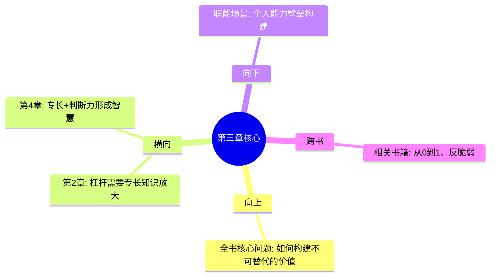

---

category: 
  - 书籍拆解
  - 纳瓦尔宝典
status: draft
chapter: 
number: 3
title: 专长知识——你的护城河
links:

  - "[[第2章-杠杆的力量]]"
  - "[[第4章-判断力——方向比速度更重要]]"
created: 2026-02-27
tags:
  - 纳瓦尔宝典
  - 专长知识
  - 个人护城河
  - 不可替代性
---

# 第3章 专长知识——你的护城河

## 📍 章节定位

### 全书位置
> 第3章是全书实现财富创造的重要核心要素，解决"凭什么你能被别人不可替代"的关键问题

- **全书核心问题**: 如何同时拥有财富与幸福？
- **本章回答的问题**: 什么样的能力无法被社会批量培训？如何培养不可替代的核心竞争力？
- **角色类型**: 核心概念型 - 建立竞争壁垒
- **论证位置**: 在财富创造公式(W=S*K*L*J×T)中提供S(专长知识)这一基础变量

### 章节序列
| 方向 | 章节标题 | 逻辑连接 |
|------|----------|----------|
| 前章 | [[第2章-杠杆的力量]] | 承接杠杆工具，解决"用哪方面的专业能力去放大" |
| 后章 | [[第4章-判断力——方向比速度更重要]] | 专长知识 + 判断力 = 高效决策 |

### 一句话定位
> 第3章明确"专长知识"的定义和培养方法，强调其不可替代性和竞争壁垒作用，为后续杠杆应用奠定基础

---

## 🎯 核心观点

### 第一层：表层案例
> 书中提及的具体情境、实例、引用

| 案例名称 | 简要描述 | 页码 | 关键引文 |
|----------|----------|------|----------|
| 社会培训对比 | 专长知识无法批量培训 | - | "专长知识是你无法被培训的知识。如果社会能培训你，社会就能培训别人来取代你。" |
| 好奇心驱动模型 | 跟随兴趣发展专业 | - | "从追随好奇心开始，逐步建立专业地位" |
| 护城河比喻 | 专长知识即竞争优势 | - | "别人无法复制的核心价值" |
| 痴迷领域案例 | 个人独特性发掘 | - | "你做起来像玩、别人像工作的能力" |

### 第二层：中层机制
> 专长知识形成的内在动力机制

| 机制名称 | 组成要素 | 因果链条 | 证据来源 |
|----------|----------|----------|----------|
| 独特组合机制 | 个人经历、能力、兴趣、环境 | DNA+背景+好奇→独特组合→专长知识 | 个人发展轨迹观察 |
| 深度积累机制 | 专注、热爱、持续投入 | 痴迷热爱→专注投入→领域专家→专业护城河 | 专业发展模型 |
| 不可转移机制 | 个性、经验、知识结构 | 个人特质→难以复制→独特价值→无法替代 | 职业护城河原理 |
| 时间复利机制 | 长期专注、经验增长、深度理解 | 时间投入→经验累积→复合优势→能力差距扩大 | 复利优势原理 |

### 第三层：底层规律
> 专长知识存在的根本性原理

| 规律陈述 | 抽象层级 | 知识连接 | 适用范围 |
|----------|----------|----------|----------|
| 价值稀缺律 | 供需经济学 | 稀缺带来价值 | 所有市场领域 |
| 个体差异律 | 心理学、社会学 | 人人独特，优势各异 | 人类社会基础 |
| 专业深度律 | 认知科学 | 宽泛与深入的选择 | 知识发展规律 |
| 竞争进化律 | 演化生物学 | 差异化生存优势 | 个人和组织适应性 |

---

## 💬 降维翻译

### 观点1: 专长知识的定义和区别

#### 原文表达
> "专长知识是社会无法培训你的知识。如果社会能培训你，社会就能培训别人来取代你。专长知识来源于你的DNA、成长背景、好奇心和痴迷。"

#### 降维翻译（中学生能懂）
想象找工作市场上招聘：
- 技能A：会计基础、办公软件使用 —— 任何培训机构都能培训，到处都是这类人才
- 技能B：独特的跨文化营销思维、敏锐的社会观察、艺术审美能力 —— 这些是从小经历、读书思考、兴趣爱好慢慢培养的，别人没法培训出来

A类技能容易找工作，但工资低且容易被替代；
B类技能难找到，但无可替代且收入丰厚。

#### 日常类比（奶奶能懂）
就像做菜，有两种本事：
- 基本事：照菜谱做，人人学会（这个做菜师傅容易找）
- 高级本事：火候掌握、口味创新、营养调配（这个得靠多年悟性）

专门找那种人人都学不会、只有你会的本事，才是你的"金饭碗"。

#### 检验
- Q: 如果一个中学生问你这是什么意思？
- A: 就是别学别人都能轻易学会的东西，要学那种"只可意会不可言传"的独特本事。

### 观点2: 罪魁祸首 - 追随好奇心的重要性

#### 原文表达
> "你做起来像玩，别人看起来像工作的事 = 你的专长知识。专长知识往往在你的'怪癖'和'痴迷'中。不要追逐热门技能，追随你的好奇心。"

#### 降维翻译（中学生能懂）
每个人都有这样的事情：
- 你整天玩不厌
- 别人让你干一会儿就觉得累得慌
- 你还会主动去琢磨改进

比如说你特别爱研究手机的各种功能，朋友们都觉得复杂，但你玩得很开心。这种"你觉得简单有趣，别人觉得麻烦无聊"的事，可能就是你的专业潜能所在。

#### 日常类比（奶奶能懂）
就像有些人天生能"闻味儿识物"，在香料堆里一下就能挑出哪种香味；有人天生能"听声辨位"，声音里能听出方向远近。

每个人都有自己的"天赋"，关键是往自己感兴趣的方向深挖，而不是跟风学热门。

#### 检验
- Q: 如果一个长辈问你这是什么意思？
- A: 就是每个人有个性，往自己擅长又喜欢的方向努力，比学时髦有用的多。

---

## ✨ 金句库

### 原书金句
| 金句 | 页码 | 适用场景 |
|------|------|----------|
| 专长知识是你无法被培训的知识。如果社会能培训你，社会就能培训别人来取代你。 | - | 微博/朋友圈/文章引用 |
| 你睡觉时赚钱才是真正的富。 | - | 深度文章引用 |
| 把自己产品化。 | - | 职业发展分享 |
| 喜欢做、做得好的事，就是你的专长知识。 | - | 个人发展 |

### 降维金句
| 金句 | 来源观点 | 适用场景 |
|------|----------|----------|
| 别人学不来的，才是你的护城河。 | 专长知识 | 贸易护城河 |
| 跟风学热门，不如追趣挖深坑。 | 好奇心驱动 | 教育发展 |
| 你觉得有趣的，别人都觉得枯燥 —— 顺着这条线找 | 痴迷识别 | 职业规划 |
| 专业化到别人学不懂，才是护城河 | 不可替代性 | 价值定位 |
| 热门技能可培训，独特技能不可教 | 培训边界 | 选择判断 |

## 🔗 当下映射

### 💰 财富应用
| 场景 | 具体行动 | 预期效果 | 风险提示 |
|------|----------|----------|----------|
| 职业发展 | 深耕独特技能，构建个人护城河 | 增加就业竞争力 | 可能限制职业选择面 |
| 投资方向 | 投资个人能力培训而非跟风技能 | 提升长期收入潜力 | 短期收益可能不佳 |
| 副业探索 | 探索个人兴趣与盈利模式结合点 | 培养被动收入能力 | 回报周期可能较长 |

### 💼 职场应用
| 场景 | 具体行动 | 所需能力 | 适用职级 |
|------|----------|----------|----------|
| 角色定位 | 构建岗位核心能力壁垒 | 战略思维、专业深度 | 管理层 |
| 价值贡献 | 发挥独特专业优势 | 专业技能、创新能力 | 所有级 |
| 职业规划 | 持续深化特长领域 | 自我认知、执行自律 | 所有级 |

### 🏠 生活应用
| 场景 | 具体行动 | 可行性 | 见效时间 |
|------|----------|--------|----------|
| 能力培养 | 每天在兴趣方向上投入1小时 | 高 | 6个月见成效 |
| 学习投资 | 放弃快速变现技能，选择深度能力 | 中 | 长期受益 |
| 爱好探索 | 从娱乐爱好中发掘专长潜力 | 高 | 随时开始 |

### 72小时行动计划
1. [ ] 列出5件自己做起来轻松愉快而别人觉得困难的事
2. [ ] 思考这些事是否具备商业价值并可进一步提升
3. [ ] 设定30天专长探索计划并开始执行

---

## 🕸️ 章节关联

### 向上关联 → 整书
- **贡献**: 解决"个人价值不可替代性"问题，提供财富创造的核心资源变量
- **位置**: 财富公式中提供独特的专业要素(S)

### 横向关联 → 章节间
| 章节编号 | 章节标题 | 关联类型 | 连接描述 |
|----------|----------|----------|----------|
| 第2章 | 杠杆的力量 | 前提 | 杠杆需要有效的专业能力才能放大 |
| 第4章 | 判断力——方向比速度更重要 | 联动 | 专长知识 + 判断力 = 科学决策 |
| 第5章 | 幸福是一门技能 | 前景 | 追求兴趣导向的专长能提升幸福感 |

### 向下关联 → 具体应用
| 应用场景 | 难度 | 前置知识 |
|----------|------|----------|
| 专业能力提升 | 中 | 自我认知基础 |
| 职业发展路线 | 中 | 知识技能储备 |

### 跨书关联 → 知识网络
| 书籍 | 概念 | 关系 | 备注 |
|------|------|------|------|
| [[富爸爸穷爸爸-清崎]] | 财务技能 | 对比 | 《清崎》教通用财务，《纳瓦尔》教你独特的价值 |
| [[从0到1-彼得蒂尔]] | 隐秘/垄断 | 同质 | 都强调"别人没有你有"的核心优势 |
| [[反脆弱-塔勒布]] | 不确定性应对 | 互补 | 专长知识提供应对不确定的稳定性 |

### 关联可视化

---

## ❓ 问答设计

### Q1: [记忆型] 什么是"专长知识"？为什么它不可被培训？
**认知层次**: 记忆
**难度**: 低
**答案要点**:
- 概念：无法被社会批量培训的知识
- 原因：基于个人DNA/背景/兴趣/痴迷，因人而异
- 独特性：每个人的成长轨迹不同，因此具备的不同

### Q2: [理解型] 如何区分"可培训技能"和"专长知识"？
**认知层次**: 理解
**难度**: 中
**答案要点**:
- 可培训技能：结构化、程序性、可通过学习系统掌握
- 专长知识：体验性、直觉性、需要个人独特经验和积累
- 测试办法：看别人是否通过相同训练能达到同样水平

### Q3: [应用型] 我如何发掘自己的专长知识领域？
**认知层次**: 应用
**难度**: 中
**答案要点**:
- 反思自己从小就擅长什么
- 观察什么事情做起来不累
- 寻求朋友反馈看他们都认为你擅长什么
- 尝试将兴趣和专业能力结合寻找交集

### Q4: [分析型] 分析专长知识与职业发展的关系
**认知层次**: 分析 
**难度**: 中
**答案要点**:
- 强相关：专长知识是职业发展的差异化支撑
- 防护性：提供职业安全性，不易替代
- 价值性：为雇主/客户提供更多独特价值
- 收益性：通常对应更高的薪酬和地位

### Q5: [评价型] 评价"所有人都能找到专长知识"这种说法的合理性
**认知层次**: 评价
**难度**: 高
**答案要点**:
- 积极方面：人类多样性使得每个人都可能有独特优势
- 消极方面：某些基础岗位或特殊情况可能缺乏差异化空间
- 实际性：需要结合具体环境和资源，不是所有人都能找到高价值领域
- 条件性：发现专长需要相对宽松的探索环境资源

### Q6: [创造型] 如何设计一套个人专长知识发展规划？
**认知层次**: 创造
**难度**: 高
**答案要点**:
- 自我评估：识别当前能力特征和兴趣点
- 市场调研：评估潜在领域的市场需求
- 选择焦点：确定1-2个最有潜力的领域深入
- 实施计划：制定年度学习深化方案
- 检验反馈：定期评估专长独特性和市场价值

### Q7: [理解型] 专长知识的"复合型"特征是指什么？
**认知层次**: 理解
**难度**: 中
**答案要点**:
- 结合多个领域知识形成独特的交叉组合
- 复合技能更难被复制，因为别人需要同时掌握多套技能
- 例子：懂技术又懂艺术的UI设计师

### Q8: [应用型] 列举三个方法来验证我的专长是否具备独特性？
**认知层次**: 应用
**难度**: 中
**答案要点**:
- 测试他人：看能不能教会别人达到相似水平
- 市场评估：看在求职或合作中是否具备独特价值
- 可替代性：分析是否存在大量竞争对手

### Q9: [记忆型] 影响专长知识形成的关键因素有哪些？
**认知层次**: 记忆
**难度**: 低
**答案要点**:
- DNA遗传的特性
- 成长背景环境
- 好奇心驱动
- 痴迷投入

### Q10: [分析型] 分析专长知识与社会需求的匹配关系？
**认知层次**: 分析
**难度**: 中
**答案要点**:
- 需具备独特性的同时也需要市场价值
- 兴趣导向与现实需求之间需平衡
- 时代变化可能影响专长的实际价值
- 需要在独特性与实用性之间找到交汇点

### Q11: [应用型] 如何在公司环境中发展个人专长知识？
**认知层次**: 应用
**难度**: 中
**答案要点**:
- 争取跨部门交流接触不同业务领域
- 主动承揽具有挑战性的特殊任务
- 在工作时间内外结合自身兴趣发展能力
- 寻找内外部导师和同行交流学习

### Q12: [理解型] 为何"追随好奇心"能产生专长知识？
**认知层次**: 理解
**难度**: 中
**答案要点**:
- 持续性：好奇心驱动持续投入而不觉疲惫
- 递增性：深度学习产生复合效应
- 个性化：每个人好奇的事物不同
- 自然性：无强迫的自主探索更加高效

### Q13: [记忆型] 专长知识和纳瓦尔财富公式的其他元素如何相互配合？
**认知层次**: 记忆
**难度**: 低
**答案要点**:
- 财富 = 专长知识 × 杠杆 × 判断 × 复利
- 专长知识是被放大的价值基础
- 配合其他元素产生复合效益

### Q14: [分析型] 分析专长知识和时代发展的关系演变？
**认知层次**: 分析
**难度**: 中
**答案要点**:
- 工业时代：工艺技能、机械操作成为专长
- 信息时代：计算机技能、数据分析成为专长
- 智能时代：创造力、情感沟通、人际理解成为专长
- 每个时代对专长的知识结构要求不同

### Q15: [评价型] 从批判角度评价"专注培养专长知识"可能存在的问题？
**认知层次**: 评价
**难度**: 高
**答案要点**:
- 专精风险：过度专精可能造成抗风险能力脆弱
- 时效问题：某些专长可能会被新技术淘汰
- 平衡挑战：过分强调专长可能忽视基础能力培养
- 环境依赖：对特定场景和生态依存度较高

---
