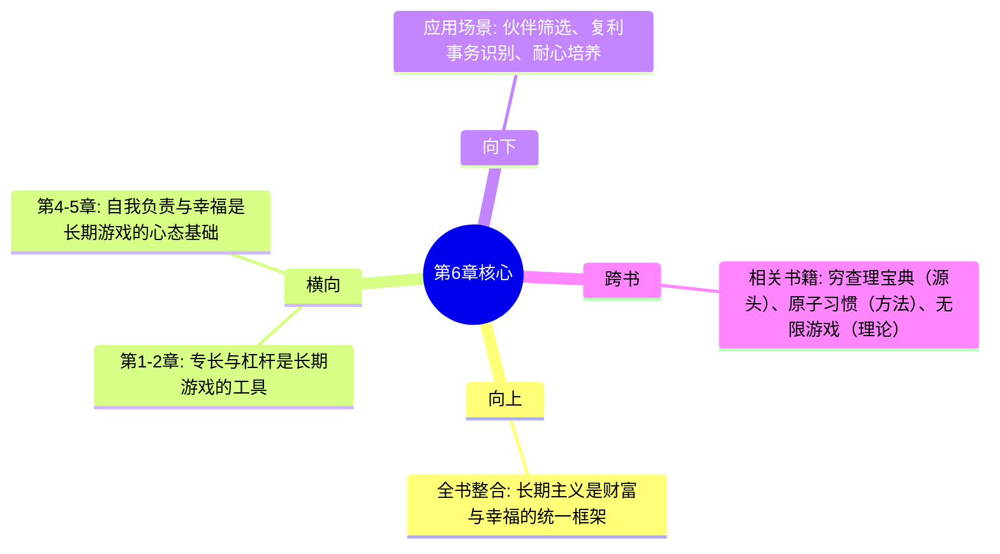

---

category: 
  - 书籍拆解
  - 纳瓦尔宝典
status: draft
chapter: 
number: 6
title: 最长的游戏
links:

  - "[[第5章-幸福是一门技能]]"
  - "[[第4章-拯救自己]]"
created: 2026-02-28
tags:
  - 纳瓦尔宝典
  - 长期主义
  - 复利思维
  - 无限游戏
  - 声誉积累
---

# 第6章 最长的游戏

## 📍 章节定位

### 全书位置
> 第6章是全书的终极智慧整合，将财富创造、专长发展、幸福追求统一到"长期主义"的框架下，回答"如何让一切努力产生复利效应"这一根本问题

- **全书核心问题**: 如何同时拥有财富与幸福？
- **本章回答的问题**: 如何选择值得一生投入的事？如何与值得信任的人建立长期关系？
- **角色类型**: 整合升华型 - 将前五章内容统一到长期主义框架
- **论证位置**: 全书收官，完成从"术"到"道"的升华

### 章节序列
| 方向 | 章节标题 | 逻辑连接 |
|------|----------|----------|
| 前章 | [[第5章-幸福是一门技能]] | 幸福是内在状态 → 长期游戏是外在实践 |
| 后章 | 无 | 全书终点，完成"财富+幸福+长期"三维闭环 |

### 一句话定位
> 第6章提出"与长期的人玩长期游戏"的人生策略，揭示复利效应在财富、关系、声誉中的普适性，是全书的终极智慧整合

---

## 🎯 核心观点

### 第一层：表层案例
> 书中涉及的具体情境、例子、实用方法

| 案例名称 | 简要描述 | 页码 | 关键引文 |
|----------|----------|------|----------|
| 复利的普适性 | 财富、关系、知识都遵循复利 | - | "所有回报都来自复利" |
| Elad Gil的故事 | 硅谷天使投资人的长期合作 | - | "他总是让利给我，所以我把所有交易都给他" |
| 99%努力浪费论 | 大部分努力没有复利效应 | - | "99%的努力是浪费的" |
| 声誉复利 | 几十年积累的信任价值连城 | - | "你的声誉最终会比有才华但无声誉的人值万倍" |
| 耐心等待 | 优秀的人终将成功 | - | "只需要给他们足够长的时间维度" |

### 第二层：中层机制
> 长期游戏产生的内在逻辑机制

| 机制名称 | 组成要素 | 因果链条 | 证据来源 |
|----------|----------|----------|----------|
| 复利积累机制 | 时间 × 信任 × 利益让渡 | 小利让渡 → 信任建立 → 长期合作 → 巨大回报 | 商业合作模型 |
| 声誉放大机制 | 一致行为 × 时间 × 公开透明 | 持续正直 → 声誉积累 → 信任溢价 → 机会倍增 | 信任经济学 |
| 筛选聚焦机制 | 尝试 → 评估 → 聚焦 | 广泛尝试 → 识别1% → 全情投入 → 复利产生 | 帕累托法则 |
| 耐心等待机制 | 能力 × 时间 × 机会 | 持续努力 → 能力积累 → 机会来临 → 爆发成功 | 成功延迟效应 |

### 第三层：底层规律
> 可迁移的普遍原则

| 规律陈述 | 抽象层级 | 知识连接 | 适用范围 |
|----------|----------|----------|----------|
| 复利定律 | 数学/经济学 | 爱因斯坦"世界第八大奇迹" | 财富、关系、知识、声誉 |
| 长期博弈论 | 博弈论 | 重复博弈 vs 一次性博弈 | 人际关系、商业合作 |
| 信任资本论 | 社会学 | 福山《信任》 | 跨文化商业 |
| 时间杠杆原理 | 时间哲学 | 巴菲特长期持有哲学 | 投资与人生决策 |

---

## 💬 降维翻译

### 观点1: 所有回报都来自复利

#### 原文表达
> "All the returns in life, whether in wealth, relationships, or knowledge, come from compound interest."（生活中所有的回报——无论是财富、关系还是知识——都来自复利。）

#### 降维翻译（中学生能懂）
想象你种了一棵苹果树：
- 第一年：种下种子，什么都没有
- 第二年：小树苗，还是没苹果
- 第三年：结了3个苹果
- 第五年：结了50个苹果
- 第十年：结了500个苹果

这就是复利：开始很慢，后来很快。

财富是这样：
- 存1万块，每年10%，30年后变成17万
- 但前10年几乎看不到变化

人际关系也是这样：
- 刚认识的人：客客气气，互相试探
- 合作3年：有点信任，但还在算计
- 合作10年：不需要合同，一个电话就搞定

知识和技能也一样：
- 学编程第1年：写个Hello World
- 学编程第5年：能做项目
- 学编程第10年：别人请教你的意见

所以：不要急着看结果，要相信复利的力量。

#### 日常类比（奶奶能懂）
就像存粮食的老鼠：
- 聪明的老鼠：每天多存一点，冬天不愁
- 不聪明的老鼠：每天吃光，冬天饿死

人也一样：
- 每天学一点：几年后你是专家
- 每天玩过去：几年后你还是原来的你

#### 检验
- Q: 为什么有些人努力了10年还是不行？
- A: 可能他一直在做没有复利的事。比如每天搬砖，今天搬的和10年前一样，没有积累。

---

### 观点2: 与长期的人玩长期游戏

#### 原文表达
> "When you find the right thing to do, when you find the right people to work with, invest deeply. Sticking with it for decades is really how you make the big returns."（当你找到对的事、对的人，就深度投入。坚持几十年，才能获得巨大回报。）

#### 降维翻译（中学生能懂）
想象你在玩一个游戏：
- 短期游戏：今天赢一把，明天输一把，没有积累
- 长期游戏：每次胜利都让下次更容易赢

关键问题：你在和谁玩？

- 临时队友：今天配合，明天消失
- 长期队友：一起打了几百场，不用说话就知道对方想干嘛

纳瓦尔举了一个例子：
> 有个叫Elad Gil的天使投资人，每次合作都主动让利给我。所以我把所有交易都给他，我也主动让利给他。这就是长期游戏的玩法。

短期游戏的逻辑：
- 我要占便宜
- 对方也想占便宜
- 结果：互相算计，交易成本高

长期游戏的逻辑：
- 我先让利
- 建立信任
- 后面几十年一起赚钱

#### 日常类比（奶奶能懂）
就像种地找帮手：
- 临时工：干一天拿一天钱，不管收成好坏
- 长期帮手：一起干10年，收成好了大家都好

做生意也是：
- 菜市场砍价：今天便宜5毛，明天不记得你了
- 老客户：10年交情，东西不好他会帮你，东西好他会帮你宣传

#### 检验
- Q: 怎么判断一个人值得长期合作？
- A: 看他怎么处理利益冲突。让利的人值得长期合作，斤斤计较的人不行。

---

### 观点3: 99%的努力是浪费的

#### 原文表达
> "99% of effort is wasted...when you find the 1 percent...go all-in and forget about the rest."（99%的努力是浪费的……当你找到那1%……就全情投入，忘记其他的。）

#### 降维翻译（中学生能懂）
想象你去挖金矿：
- 99%的地方：挖了半天全是石头
- 1%的地方：挖到金矿脉

问题是：你不知道哪里有金子，所以不得不到处挖。

但一旦找到了金矿，就应该：
- 停止到处乱挖
- 在金矿上深挖
- 挖得越深，金子越多

纳瓦尔举的例子：
- 学校里学的地理、历史，99%用不上
- 谈过那么多次恋爱，99%最后没结婚
- 做过的那么多项目，99%没有持续价值

所以关键不是"多努力"，而是"找到那1%"。

#### 日常类比（奶奶能懂）
就像种庄稼：
- 试着种了10块地
- 9块地收成不好
- 1块地特别肥沃

聪明的做法：
- 把那9块地放弃
- 在那1块地上精耕细作

#### 检验
- Q: 那是不是不用努力了？
- A: 不是。你只有努力尝试，才能找到那1%。找到之后，才是全情投入的时候。

---

### 观点4: 耐心是最大的杠杆

#### 原文表达
> "Great people have great outcomes. You just have to be patient...It never happens in the timescale you want, but it does happen."（优秀的人终将成功。你只需要耐心……它不会在你希望的时间发生，但它一定会发生。）

#### 降维翻译（中学生能懂）
纳瓦尔说：我回头看20年前认识的人，那些我当初觉得"哇，这人不一般"的人，现在几乎都成功了。

唯一的条件：给他们足够长的时间。

问题在于：
- 你想3年成功
- 现实可能需要10年
- 如果你一直在算时间，你会放弃

所以：
- 不要计数
- 不要计时
- 只要方向对，就继续走

#### 日常类比（奶奶能懂）
就像煮开水：
- 前90度：看起来没变化
- 最后10度：突然沸腾

很多人在80度的时候放弃了，其实再坚持一下就开了。

#### 检验
- Q: 怎么知道方向是对的？
- A: 问自己：这件事5年后还有价值吗？如果是，方向就对。

---

## ✨ 金句库

### 原书金句
| 金句 | 页码 | 适用场景 |
|------|------|----------|
| 生活中所有的回报——无论是财富、关系还是知识——都来自复利。 | - | 长期主义传播 |
| 99%的努力是浪费的。 | - | 聚焦策略 |
| 优秀的人终将成功，你只需要耐心。 | - | 鼓励坚持 |
| 你的声誉最终会比有才华但无声誉的人值万倍。 | - | 价值观引导 |
| 当你找到对的事、对的人，就深度投入。 | - | 决策指导 |
| 意图不重要，行动才重要。 | - | 执行力倡导 |
| 人们会奇怪地保持一致。 | - | 人性洞察 |

### 降维金句
| 金句 | 来源观点 | 适用场景 |
|------|----------|----------|
| 复利不只在银行，在人生每个角落。 | 复利普适性 | 价值观传播 |
| 让利是长期投资，占便宜是短期自杀。 | 长期合作 | 商业智慧 |
| 找到1%值得的事，忘记99%的杂事。 | 聚焦策略 | 时间管理 |
| 好人需要时间证明，坏人一次就露馅。 | 声誉积累 | 人际关系 |
| 耐心是最便宜的杠杆。 | 耐心等待 | 心态调整 |

## 🔗 当下映射

### 💰 财富应用
| 场景 | 具体行动 | 预期效果 | 风险提示 |
|------|----------|----------|----------|
| 投资决策 | 选择可长期持有的优质资产 | 复利效应放大收益 | 需要极强的耐心 |
| 商业合作 | 优先选择有长期合作潜力的伙伴 | 降低交易成本，增加信任 | 前期可能"吃亏" |
| 副业选择 | 选择有积累效应的领域 | 能力随时间增值 | 初期回报低 |

### 💼 职场应用
| 场景 | 具体行动 | 所需能力 | 适用职级 |
|------|----------|----------|----------|
| 职业规划 | 选择可长期发展的赛道 | 长期思维能力 | 所有级别 |
| 团队建设 | 培养长期信任的团队关系 | 信任建立能力 | 管理层 |
| 技能投资 | 学习有复利效应的技能 | 识别能力 | 所有级别 |

### 🏠 生活应用
| 场景 | 具体行动 | 可行性 | 见效时间 |
|------|----------|--------|----------|
| 朋友圈筛选 | 减少临时社交，深耕长期友谊 | 高 | 1-3年 |
| 学习聚焦 | 停止无效学习，专注核心技能 | 中 | 3-6个月 |
| 声誉管理 | 在所有场合保持一致性 | 高 | 持续积累 |

### 72小时行动计划
1. [ ] 列出当前正在做的5件事，判断哪些有复利效应
2. [ ] 回顾最近的3次合作，判断对方是否值得长期合作
3. [ ] 写下1件可以坚持10年的事，制定第1周计划

---

## 🕸️ 章节关联

### 向上关联 → 整书
- **贡献**: 提供全书的方法论整合框架，统一"财富创造"与"幸福追求"到长期主义视角
- **位置**: 全书收官章节，完成从"术"到"道"的升华

### 横向关联 → 章节间
| 章节编号 | 章节标题 | 关联类型 | 连接描述 |
|----------|----------|----------|----------|
| 第1章 | 财富不是目标，而是副产品 | 延伸 | 专长知识是长期游戏的筹码 |
| 第2章 | 杠杆的力量 | 工具 | 杠杆放大长期游戏的回报 |
| 第4章 | 拯救自己 | 基础 | 长期游戏需要自我负责的心态 |
| 第5章 | 幸福是一门技能 | 平衡 | 长期游戏需要内心平静支撑 |

### 向下关联 → 具体应用
| 应用场景 | 难度 | 前置知识 |
|----------|------|----------|
| 长期伙伴筛选 | 高 | 人际判断能力 |
| 复利事务识别 | 中 | 自我认知能力 |
| 耐心培养 | 高 | 情绪管理能力 |

### 跨书关联 → 知识网络
| 书籍 | 概念 | 关系 | 备注 |
|------|------|------|------|
| [[穷查理宝典]] | 长期思维 | 溯源 | 巴菲特芒格的长期持有哲学 |
| 原子习惯-詹姆斯克利尔 | 复利效应 | 方法 | 习惯的复利放大 |
| 无限的游戏-西蒙·斯涅克 | 无限游戏 | 理论支撑 | Finite vs Infinite Games |
| [[原则/_导航]] | 长期原则 | 互补 | 用原则指导长期决策 |

### 关联可视化

---

## ❓ 问答设计

### Q1: [记忆型] 纳瓦尔认为人生所有回报来自什么？
**认知层次**: 记忆
**难度**: 低
**答案要点**:
- 复利（Compound Interest）
- 财富、关系、知识都来自复利
- 复利不只适用于资本

### Q2: [理解型] 为什么纳瓦尔说"99%的努力是浪费的"？
**认知层次**: 理解
**难度**: 中
**答案要点**:
- 大部分努力没有复利效应
- 学校学的很多东西用不上
- 谈过的很多恋爱没有结果
- 但不尝试就无法找到那1%
- 找到那1%后要全情投入

### Q3: [应用型] 如何实践"与长期的人玩长期游戏"？
**认知层次**: 应用
**难度**: 中
**答案要点**:
- 识别值得长期合作的伙伴
- 主动让利建立信任
- 不计较小利，看重长期关系
- 保持行为一致性

### Q4: [分析型] 分析"让利"与"占便宜"的长期后果
**认知层次**: 分析
**难度**: 中
**答案要点**:
- 让利者：
  - 短期看似吃亏
  - 建立信任资产
  - 获得更多合作机会
  - 长期回报巨大
- 占便宜者：
  - 短期获得利益
  - 消耗信任资本
  - 失去合作机会
  - 长期收益下降

### Q5: [评价型] 评价"耐心是最大的杠杆"这一观点
**认知层次**: 评价
**难度**: 高
**答案要点**:
- 积极面：
  - 时间放大优秀者的优势
  - 耐心降低决策焦虑
  - 不需要额外成本
- 局限面：
  - 需要方向正确
  - 可能错过时间窗口
  - 不是所有事都值得等待
- 平衡点：
  - 耐心+方向判断
  - 耐心+持续行动

### Q6: [创造型] 设计一个"识别复利事务"的自检清单
**认知层次**: 创造
**难度**: 高
**答案要点**:
1. 这件事5年后还有价值吗？
2. 做这件事的能力会随时间增长吗？
3. 这件事的结果可以积累吗？
4. 这件事可以产生连锁反应吗？
5. 做这件事的人值得长期合作吗？
6. 如果全情投入10年，回报会是多少？

### Q7: [理解型] 为什么声誉比才华更值钱？
**认知层次**: 理解
**难度**: 中
**答案要点**:
- 声誉需要几十年积累
- 声誉代表可预测性
- 声誉降低交易成本
- 有才华无声誉的人风险高
- 声誉有复利效应

### Q8: [应用型] 如何在职场中应用"长期游戏"思维？
**认知层次**: 应用
**难度**: 中
**答案要点**:
- 选择可长期发展的赛道
- 与值得信任的人建立关系
- 主动承担责任建立声誉
- 学习有复利效应的技能
- 不计较短期得失

### Q9: [记忆型] 纳瓦尔举了谁的例子说明长期合作？
**认知层次**: 记忆
**难度**: 低
**答案要点**:
- Elad Gil
- 硅谷天使投资人
- 总是让利给纳瓦尔
- 纳瓦尔把所有交易都给他

### Q10: [分析型] 分析"临时关系"与"长期关系"的本质差异
**认知层次**: 分析
**难度**: 中
**答案要点**:
- 临时关系：
  - 一次性博弈
  - 信息不对称
  - 互相算计
  - 无复利效应
- 长期关系：
  - 重复博弈
  - 信息透明
  - 互相信任
  - 复利放大

### Q11: [应用型] 如何判断一件事是否有"复利效应"？
**认知层次**: 应用
**难度**: 中
**答案要点**:
- 今天做的事，明天还有价值吗？
- 做得越久，越容易还是越难？
- 能力会积累还是每次从头开始？
- 结果是独立还是有累积效应？

### Q12: [理解型] 如何理解"意图不重要，行动才重要"？
**认知层次**: 理解
**难度**: 中
**答案要点**:
- 意图是内在的，不可见
- 行动是外在的，可观察
- 声誉建立在行动上
- 道德的难点在于行动一致性
- 人们根据行动判断你

### Q13: [记忆型] 本章提到的"复利"适用于哪些领域？
**认知层次**: 记忆
**难度**: 低
**答案要点**:
- 财富（资本复利）
- 人际关系（信任复利）
- 知识（学习复利）
- 声誉（品牌复利）

### Q14: [分析型] 分析"长期主义"与"短期效率"的冲突与平衡
**认知层次**: 分析
**难度**: 高
**答案要点**:
- 冲突点：
  - 长期需要耐心，短期需要效率
  - 长期可能牺牲短期利益
  - 短期考核与长期目标矛盾
- 平衡策略：
  - 设定阶段性目标
  - 在长期框架内优化短期
  - 用短期成果验证长期方向
  - 保持方向不变，方法灵活

### Q15: [评价型] 批判性评估"99%努力是浪费"这一观点
**认知层次**: 评价
**难度**: 高
**答案要点**:
- 积极面：
  - 提醒聚焦重要事务
  - 避免无效努力
  - 激励寻找复利事务
- 局限面：
  - 尝试过程本身有价值
  - 1%需要99%去发现
  - 可能打击努力积极性
- 平衡视角：
  - 用99%去发现1%
  - 找到后全情投入1%
  - 不后悔尝试过程

---

## 📊 信息来源与质量评级

### 检索记录
- 【第一轮】核心观点检索：⭐⭐⭐ 官方网站 navalmanack.com 原文内容
- 【第二轮】深度解读检索：⭐⭐ 掘金社区读书笔记
- 【第三轮】批评争议检索：跳过（本章为核心方法章节）

### 信息整合公式
= 官方原文核心内容（复利、长期合作、耐心）
  + 已拆解章节关联（第1-5章）
  + 降维翻译（生活化类比）

---

*拆解日期：2026-02-28*
*下次回访：拆解后1周检查选题执行情况*
