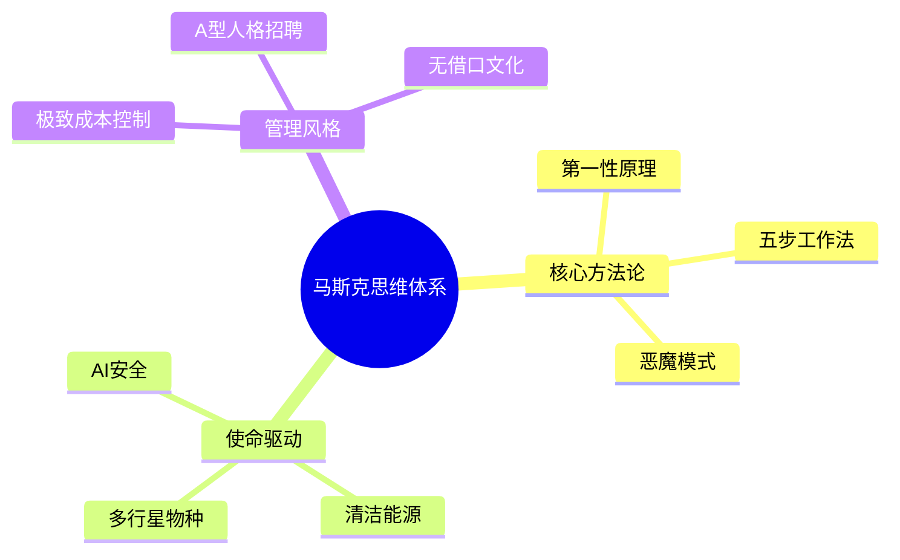

# 《马斯克传》读书笔记

## 这本书要解决什么问题？

**核心困境**：为什么有些人能改变世界，而大多数人只能适应世界？

马斯克给出的答案：用第一性原理重新定义可能的边界。

**一句话定位**：
> 天才和疯子只有一线之隔——马斯克就是那条线，他同时站在两边。

### 作者站在什么位置说这些话？

| 维度 | 定位 |
|------|------|
| 主领域 | 商业传记、创新方法论 |
| 跨界领域 | 物理学思维、心理学、领导力 |
| 作者背景 | 沃尔特·艾萨克森——写过乔布斯、爱因斯坦、达芬奇传记的权威传记作家 |

### 和其他书有什么关系？

| 关联书籍 | 关联关系 | 共同底层逻辑 |
|----------|----------|--------------|
| [[原则]] | 互补 | 系统化工作方法论：达利欧用原则，马斯克用算法 |
| [[穷查理宝典]] | 互补 | 跨学科思维模型：芒格用多元模型，马斯克用物理+商业 |
| [[从0到1-彼得蒂尔]] | 同领域 | 硅谷创业思维：从0到1 vs 从地球到火星 |

### 知识网络图

---

## 作者的核心论点

### 第一性原理——从物理本质重新思考

马斯克造火箭时，所有人都说成本不可能降低。传统航天巨头波音造一个涡轮泵要1亿美元、5年时间。马斯克问：涡轮泵由什么组成？原材料多少钱？答案是原材料只占总成本的2%。于是SpaceX用13个月、100万美元造出来了。

| 传统思维 | 第一性原理 |
|----------|------------|
| "别人都是这么做的" | "物理本质是什么？" |
| 类比思维（参照现有方案） | 演绎思维（从基本原理推导） |
| 接受既定规则 | 质疑一切假设 |
| 成本由市场决定 | 成本由物理决定 |

> **马斯克-物理学定律**：任何工程问题，如果从物理第一性原理出发，成本可以降到原材料成本的水平，时间可以压缩到物理极限。

别人问"这东西多少钱？"，马斯克问"这东西由什么组成？"

这个观点打碎了我对"创新"的假设。我一直以为创新需要天才的灵感，但马斯克告诉我：创新只需要追问"物理本质是什么？"

### 五步工作法——系统化执行的算法

马斯克在SpaceX和特斯拉反复强调一套流程，他称之为"算法"（The Algorithm）。

Step 1: 质疑需求 → 所有的需求都是建议，都可以被质疑
Step 2: 删除部件 → 如果最后没把10%的东西加回来，说明删得不够
Step 3: 简化优化 → 最常见的错误是优化一个不应该存在的东西
Step 4: 加速周期 → 只有在前三步完成后才能加速
Step 5: 自动化 → 最后一步才是自动化

| 传统流程 | 马斯克算法 |
|----------|------------|
| 需求→设计→开发→测试→部署 | 质疑→删除→简化→加速→自动化 |
| 先做加法 | 先做减法 |
| 优化现有流程 | 质疑流程存在的必要性 |
| 自动化一切 | 最后才自动化 |

> **减法优先原则**：大多数人犯错不是因为做得太少，而是因为做得太多。优化一个不该存在的东西，是最大的浪费。

你以为问题是"怎么做得更快"，马斯克说问题是"这事儿为什么要做"。

下次遇到效率问题，我不会再问"怎么更快"，而是先问"这事儿为什么要做"。

### 恶魔模式——压力下的超理性

马斯克的情绪被描述为"时明时暗、时而紧张时而呆滞"。他的朋友说他"渴望风暴和戏剧"。2008年，SpaceX三次发射失败，特斯拉濒临破产，他经历了"地狱般"的时期——在抑郁、狂躁之间摇摆。

| 普通人压力反应 | 马斯克压力反应 |
|----------------|----------------|
| 压力→焦虑→决策失误 | 压力→恶魔模式→更加理性 |
| 回避困难 | 直面困难 |
| 情绪崩溃 | 情绪成为燃料 |

> **压力理性化定律**：对某些人来说，极端压力不是负担，而是激活剂。压力越大，决策越清晰。

别人崩溃的时候，他变得更清醒。

### 使命驱动——为人类而战

马斯克的三家公司分别对应三个使命：特斯拉——解决全球变暖，让人类摆脱化石燃料；SpaceX——让人类成为多行星物种，避免灭绝；Neuralink/X.AI——确保AI安全，避免AI独裁。

使命驱动的飞轮：宏大使命 → 吸引顶尖人才 → 做出突破性产品 → 更大的使命感 → 更强的人才吸引。

| 利润驱动公司 | 使命驱动公司 |
|--------------|--------------|
| "我们做什么赚钱？" | "什么问题值得解决？" |
| 短期目标 | 十年百年目标 |
| 员工为工资工作 | 员工为使命工作 |
| 竞争对手是其他公司 | 竞争对手是物理定律 |

> **使命引力定律**：使命越大，能吸引的人才越强；目标越远，能容忍的周期越长。

别人造产品为了赚钱，他赚钱为了造能拯救人类的东西。

---

## 这本书的局限

| 批评点 | 谁在批评 | 怎么说 |
|--------|---------|--------|
| 管理风格争议 | 前员工 | 马斯克的"恶魔模式"对员工造成巨大心理压力 |
| 个人生活争议 | 媒体 | 多段婚姻、复杂的家庭关系 |
| 第一性原理的局限 | 学术评论 | 不是所有问题都能用物理学解决，人的问题需要心理学 |

**一句话总结局限性**：
> 马斯克的方法论适合天才和偏执狂，普通人复制需谨慎。

---

## 最值得记住的话

**原书说的**：
1. "你应该从问题的首要原则开始：它的物理本质是什么？需要花多少时间？需要花多少钱？"
2. "好的点子在被实现之前，人们总觉得那很疯狂。"
3. "我成了算法的复读机。"
4. "有些创新者就像一个喜欢冒险的孩子，他们不愿意接受如厕训练。"

**翻译成人话**：
1. 别人问"这东西多少钱？"，马斯克问"这东西由什么组成？"
2. 你以为问题是"怎么做得更快"，真正的问题是"这事儿为什么要做"
3. 优化一个不该存在的东西，是最大的浪费
4. 别人崩溃的时候，他变得更清醒
5. 如果最后没把10%的东西加回来，说明删得不够
6. 他的竞争对手是其他公司，马斯克的竞争对手是物理定律

---

## 讲给没读过的人听

你知道马斯克是怎么降火箭成本的吗？

所有人都说不可能。传统航天巨头波音造一个涡轮泵要1亿美元、5年时间。

马斯克问了一个简单的问题：涡轮泵由什么组成？原材料多少钱？

答案是原材料只占总成本的2%。于是SpaceX用13个月、100万美元造出来了。

这就是第一性原理：别问"别人怎么做"，问"物理本质是什么"。

马斯克还有一套"五步工作法"：质疑需求→删除部件→简化优化→加速周期→自动化。他常说："如果最后没把10%的东西加回来，说明删得不够。"

你以为问题是"怎么做得更快"，他先问"这事儿为什么要做"。

---

## 用来检验理解的问题

**基础回忆**：
1. Q: 什么是"第一性原理"思维？
   A: 从物理本质出发，质疑一切假设，而不是参照别人的方案。问"物理本质是什么"，不问"别人怎么做"。

2. Q: 马斯克的"五步工作法"是什么？
   A: 质疑需求→删除部件→简化优化→加速周期→自动化。关键：先做减法，最后才自动化。

**理解验证**：
1. Q: 为什么马斯克说"如果最后没把10%的东西加回来，说明删得不够"？
   A: 因为大多数人删除得太保守。真正的简化需要激进删除，然后只把最必要的加回来。

2. Q: 马斯克和传统企业家的核心区别是什么？
   A: 传统企业家的竞争对手是其他公司，马斯克的竞争对手是物理定律。使命驱动 vs 利润驱动。

---

## 和其他书的对话

达利欧用原则来避免犯错，马斯克用算法来快速试错。达利欧是理性+谦逊，马斯克是理性+疯狂。两者结合：原则导航方向，算法快速执行。

芒格用100个模型看世界，马斯克用1个模型（物理学）改变世界。芒格是多元思维，马斯克是第一性原理。两条通往伟大的不同路径。

蒂尔教你从0到1寻找垄断机会，马斯克教你用第一性原理实现从0到1。一个讲战略选择，一个讲执行方法。

---

*拆解日期：2026-03-08*
*下次回访：1周后回顾「讲给没读过的人听」和「检验问题」*