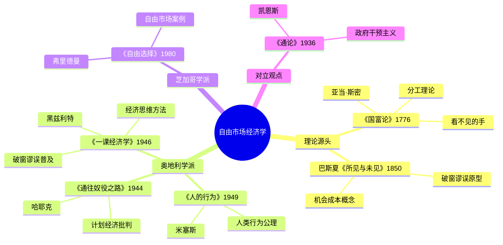

# 《一课经济学》读书笔记

## 这本书要解决什么问题？

**核心困境**：为什么人们总是被错误的经济观点误导？大多数人只看到政策的直接后果，忽视了长远后果。只考虑特殊群体的利益，而忽视了对所有人的影响。

**一句话定位**：
> 经济学的艺术在于不仅要看任何行为或政策的即时影响，还要看其对所有群体的长远影响。

**基本信息**：
- 作者：亨利·黑兹利特（Henry Hazlitt, 1894-1993）
- 出版：1946年（首版），已连续再版70+年，销量超100万册
- 地位：20世纪最具影响力的经济学普及著作之一

### 作者站在什么位置说这些话？

| 维度 | 定位 |
|------|------|
| 主领域 | 自由市场经济学 |
| 跨界领域 | 政治哲学、公共政策、认知科学 |
| 作者背景 | 20世纪最杰出的经济新闻人、奥地利学派重要成员、米塞斯的学生 |
| 思想源头 | 弗雷德里克·巴斯夏（Frédéric Bastiat）《所见与未见》 |
| 对立观点 | 凯恩斯《通论》政府干预主义 |

### 和其他书有什么关系？

| 关联书籍 | 关联关系 | 共同底层逻辑 |
|----------|----------|--------------|
| [[人的行为-米塞斯]] | 同学派 | 米塞斯奠定理论基础，黑兹利特用通俗语言普及 |
| [[通往奴役之路-哈耶克]] | 同学派 | 哈耶克从政治哲学角度警告计划经济，黑兹利特从经济学角度揭示 |
| [[国富论-亚当·斯密]] | 理论源头 | 斯密发现了"看不见的手"，黑兹利特解释其运作机制 |
| [[自由选择-弗里德曼]] | 同学派 | 弗里德曼用案例证明自由市场，黑兹利特系统分析政策谬误 |
| [[通论-凯恩斯]] | 对立观点 | 凯恩斯主张政府干预，黑兹利特驳斥干预主义 |

### 知识网络图

---

## 作者的核心论点

### 破窗谬误——经济学最常见的错误

一个顽童砸了面包店的窗户。玻璃碎了。面包店老板不得不花钱修窗户。人群围观，说："多好啊！玻璃工有活干了，钱在流动，经济在增长。"

人们看到了什么？玻璃工有工作，玻璃制造商有生意。但他们没看到什么？面包店老板本打算用这笔钱做一套西装。现在钱没了，裁缝店的生意黄了，西装店工人也没活干。

净结果：没有净财富增加，只有财富转移。

> **经济学第一课**：好的经济学不仅要看政策对某个群体的影响，还要看对所有人的长远影响。

这个观点打碎了我对"刺激经济"的迷信。以前看到"基建投资创造就业"就觉得是好事，现在会追问：这笔钱如果不被政府拿走，原本会去哪里？

但这还没完，作者进一步指出，政府拿钱的方式本身就有问题。

### 税收抑制生产

"税收不是为了公共利益，而是为了特殊利益。"黑兹利特这句话刺破了政府支出的叙事。政府花的每一分钱，都来自纳税人。公共工程宣称创造就业，但资金来自税收。羊毛出在羊身上。

税收不仅仅是拿走钱，更是拿走激励。当一种行为的收益被税收拿走，这种行为就会减少。生产收益被征税，不愿生产。投资收益被征税，不愿投资。工作收益被征税，不愿加班。

> **激励原则**：当一种行为的收益被税收拿走，这种行为就会减少。

这不是反对所有税收。斯密说过，政府有三个正当职能——国防、司法、公共工程。但超出边界的税收，会抑制生产，最终让社会总财富减少。

这个观点打碎了我的一个假设：我以为税收只是"贡献"，没想到它会改变行为。当政府拿走你收益的一半，你的努力意愿就下降了一半。下次遇到"加税"的呼声，我不会只算政府能收多少钱，而会算社会会少创造多少钱。

有了税收的教训，再来看政府直接干预价格会怎样。

### 价格管制的危害

价格管制就像把温度计的水银柱卡住——温度还在变，但你看不见。

黑兹利特举了三个例子。租金管制想让穷人住得起，结果房东不愿出租，房源更少。最低工资想提高收入，结果企业裁员，失业率上升。价格上限想让商品便宜，结果商家不生产，短缺出现。

价格有三大功能：信号功能（告诉生产者该生产什么）、配给功能（把有限商品配给最需要的人）、激励功能（决定生产者是否有利润）。破坏价格机制，就是摧毁信息网络。

> **自发秩序原理**：复杂系统不能被设计，只能演化。价格管制 → 信号失灵 → 资源错配 → 短缺与过剩并存。

下次有人呼吁"政府应该控制房价"的时候，我不会再急着附和，而是问：价格管制后，房源会变多还是变少？

价格管制只是干预的一种形式，这引出了另一个问题：另一种常见的干预——关税。

### 关税保护谁？

关税声称"保护本国工人"，但实际保护的是低效企业。消费者承担更高价格，出口企业被报复性关税打击。黑兹利特一句话总结：关税保护的不是工人，是低效率企业。

自由贸易的逻辑很简单——让每个国家做自己最有优势的事，然后贸易交换，所有国家都受益。限制贸易，就是限制自己变富。

> **比较优势法则**：贸易让每个人做自己最有优势的事。

这打碎了我对"保护民族经济"的迷信。以前觉得关税是在保护本国工人，现在才明白，保护的是低效率企业，买单的是每一个消费者。下次听到"提高关税"，我不会再觉得跟我无关，而是问：我买东西贵了多少？

关税只是看得见的干预，还有一种更隐蔽的——对技术的恐惧。

### 机器的诅咒？——技术不会抢走工作

"机器会抢走工作"这个说法，从工业革命说到AI时代，每次都被证明是错的。

黑兹利特的论证链条：机器提高生产力 → 价格下降 → 需求上升 → 新工作诞生。历史数据证实了这一点：工业革命后就业大增，信息革命后新岗位涌现。技术不是毁灭者，是解放者。旧岗位消失带来短期阵痛，但技能转型后新岗位会诞生。

> **生产力与就业正相关**：技术进步不会导致长期失业，反而创造新的就业机会。

以前我觉得AI和自动化会抢走工作，现在我明白，每一次技术革命都是短期阵痛、长期受益。新工作不会凭空出现，但一定会在价格下降和需求上升之间诞生。机器只是硬币的一面，另一面是更隐蔽的掠夺——通胀。

### 通货膨胀的隐形掠夺

通货膨胀是政府对你财富的隐形掠夺。

机制很简单：政府印钞 → 货币供应增加 → 购买力下降 → 储蓄者财富缩水、固定收入者受损、债权人吃亏。与此同时，政府获得资源，表面繁荣。但钱变成烫手的山芋——今天不花，明天就不值钱了。

黑兹利特提醒我们：货币增加不等于生产增加。政府印钱不是创造财富，是稀释你已有的财富。

> **货币数量不等同于财富**：印钞不创造价值，只稀释购买力。

这个观点让我重新审视手中的钱。我以前只关心"有多少钱"，现在开始关心"钱还值多少"。通胀不是远在天边的事，它每天都在悄悄拿走我储蓄的一小块。下次看到"宽松货币政策"的新闻，我不会觉得是好消息，而是问：我的钱又被稀释了多少？

---

## 这本书的局限

> 《一课经济学》是一本1946年的奥地利学派普及读物，有它鲜明的立场和边界。

| 批评点 | 谁在批评 | 怎么说 | 实际情况 |
|--------|---------|--------|---------|
| 过度简化 | 凯恩斯学派 | 把复杂经济问题简化为"看得见vs看不见" | 简化是力量也是弱点，现实比二分法复杂 |
| 忽视市场失灵 | 制度经济学 | 现实中信息不对称、外部性、垄断普遍存在 | 市场确实有失灵的时候，黑兹利特几乎没有讨论 |
| 只有一面之词 | 经济学界中间派 | 全书只呈现自由市场观点，不承认干预的合理性 | 作为普及读物立场鲜明，但读者需要读对立面 |
| 时代局限 | 当代经济学家 | 1946年的案例和分析框架未必适用于2026年 | 核心逻辑仍然成立，但具体案例需要更新 |

**一句话总结局限性**：
> 黑兹利特教你"看长远、看全部"的思维方法极其有用，但他几乎没有讨论市场自身的失灵问题。读了这本，必须再读凯恩斯才能看到完整的画面。

---

## 最值得记住的话

**原书说的**：
1. "经济学的艺术在于不仅要看任何行为或政策的即时影响，还要看其对所有群体的长远影响。"
2. "破窗谬误的本质是：人们只看到直接后果，忽视长远后果。"
3. "税收不仅仅是拿走钱，更是拿走激励。"
4. "关税保护的不是工人，是低效率企业。"
5. "通货膨胀是政府对你财富的隐形掠夺。"
6. "好的经济学和坏的经济学之间的区别在于：好的经济学追索政策的长远影响，坏的经济学只看到直接后果。"
7. "价格管制就像把温度计的水银柱卡住——温度还在变，但你看不见。"
8. "机器不是抢走工作，是把人从繁重劳动中解放出来。"

**翻译成人话**：
1. 你看到的"好处"，可能是别人的"损失"
2. 灾难能刺激经济？破窗 = 财富损失
3. 税不仅仅是钱少了，更是生产意愿少了
4. 关税保护的不是工人，是低效率企业
5. 价格不是数字，是信息——破坏它就是摧毁信息网络
6. 技术不是毁灭者，是解放者
7. 钱变成烫手的山芋——今天不花，明天就不值钱了
8. 政府印钱不是创造财富，是稀释你已有的财富
9. 看得见的就业增长，背后是看不见的失业
10. 免费的东西最贵——因为你要用税收买单
11. 通胀不是"价格上涨"，是"钱不值钱了"
12. 羊毛出在羊身上——政府花的每一分钱，都来自纳税人

---

## 讲给没读过的人听

你有没有想过：超市永远有货。没有人指挥，没有中央计划，但你需要的东西总在那里。

为什么？因为价格信号在自动协调亿万人的行为。面包涨价了，说明面包供不应求，生产者会多做面包。面包降价了，说明供过于求，生产者会少做面包。价格就是信息网络。

黑兹利特写了一本书，核心就一句话：看政策不能只看眼前的好处，还要看长远的影响，看对所有群体的影响。

他讲了一个破窗故事。一个小孩砸了面包店的窗户，人群说"多好啊，玻璃工有活干了"。但他们没看到：面包店老板本打算用这笔钱做西装，裁缝店的生意没了。净结果：没有净财富增加，只有财富转移。

这就是经济学的第一课。你看到的"好处"，背后可能是看不见的"代价"。

---

## 用来检验理解的问题

**基础回忆**：
1. Q: 破窗谬误的本质是什么？
   A: 人们只看到直接后果（玻璃工有工作），忽视长远后果（裁缝店损失）。没有净财富增加，只有财富转移。

2. Q: 价格有哪三大功能？
   A: 信号功能（告诉生产者该生产什么）、配给功能（把有限商品配给最需要的人）、激励功能（决定生产者是否有利润）。

3. Q: 为什么关税保护的不是工人？
   A: 关税保护的是低效率企业。消费者承担更高价格，出口企业被报复性关税打击。

**理解验证**：
1. Q: "税收抑制生产"的机制是什么？
   A: 税收拿走收益 → 行为减少。生产收益被征税，不愿生产；投资收益被征税，不愿投资。

2. Q: 为什么"价格管制像卡住温度计"？
   A: 价格管制只是改变了数字，没有改变供需关系。温度（供需）还在变，但你看不见——直到出现短缺或过剩。

3. Q: 黑兹利特怎么看技术进步和就业的关系？
   A: 技术进步 → 生产率提高 → 价格下降 → 需求增加 → 新岗位诞生。历史证明技术进步不会导致长期失业。

**实际应用**：
1. Q: 用"看得见vs看不见"的思维分析一项当前政策。
   A: 关键步骤：找到看得见的好处 → 追问"这笔钱原本会去哪里" → 看不见的代价是什么。

2. Q: 下次听到"刺激经济"的说法，你会怎么追问？
   A: 问三个问题：钱从哪来？如果不被政府拿走，原本会去哪里？长期后果是什么？

**深度分析**：
1. Q: 黑兹利特和凯恩斯的根本分歧是什么？
   A: 黑兹利特关注长期效应和所有群体，凯恩斯关注短期需求和宏观总量。凯恩斯说政府应该花钱刺激经济，黑兹利特说政府花的每一分钱都来自纳税人，羊毛出在羊身上。

2. Q: 黑兹利特的最大盲点是什么？
   A: 几乎没有讨论市场失灵。信息不对称、外部性、垄断——这些都是现实中市场无法自动解决的问题。

---

## 和其他书的对话

米塞斯和黑兹利特是师徒关系。米塞斯在《人的行为》里建立了奥地利学派的理论大厦——经济学是人类行为的科学，人有目的，行为有后果。黑兹利特把这些高深理论用破窗故事讲得连中学生都能听懂。一个是奠基者，一个是普及者。

哈耶克和黑兹利特从不同角度攻击同一个敌人。哈耶克从政治哲学层面警告计划经济通向奴役，黑兹利特从经济学层面揭示计划经济为什么行不通。读了哈耶克知道"为什么要自由"，读了黑兹利特知道"自由市场怎么运作"。

斯密是黑兹利特的思想源头。斯密在1776年发现了"看不见的手"，黑兹利特在1946年用破窗故事告诉你这只手如何协调市场。两本书间隔170年，但说的是同一件事：市场比政府更擅长协调经济活动。

弗里德曼和黑兹利特是自由市场的两个辩护者，但打法不同。弗里德曼用数据和事实证明自由市场的结果，黑兹利特用逻辑推演告诉你为什么会这样。一个是实证派，一个是逻辑派。

凯恩斯是黑兹利特的对手。凯恩斯说"长远来看我们都死了"，关注短期需求。黑兹利特说"正因为长远很重要，才不能只看眼前"。凯恩斯主张政府干预，黑兹利特主张自由市场。两种观点都需要读，才能看到完整的经济学图景。

---

*拆解日期：2026-02-14*
*下次回访：1周后回顾「讲给没读过的人听」和「检验问题」*