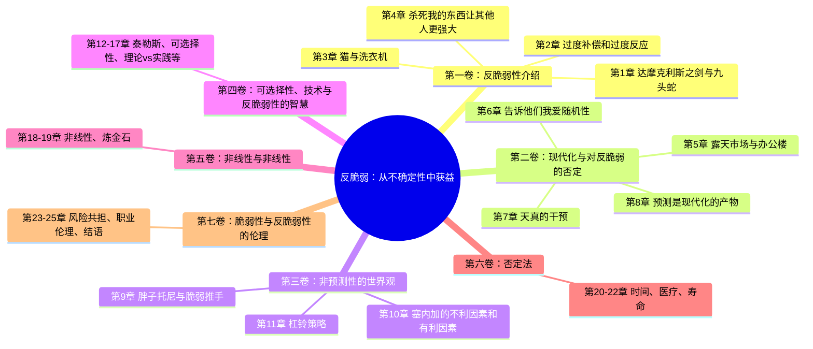

# 《反脆弱》章节导航

## 📊 基本信息

| 项目 | 内容 |
|------|------|
| 书名 | 《反脆弱》（Antifragile） |
| 作者 | 纳西姆·尼古拉斯·塔勒布（Nassim Nicholas Taleb） |
| 总章节 | 7卷25章 |
| 已拆解 | 25章（100%） |
| 核心概念 | 从混乱中获益 |
| 整书拆解 | [[反脆弱-塔勒布-拆解记录]] |

---

## 📚 章节结构（Mindmap）

---

## ✅ 拆解进度

| 状态 | 数量 |
|------|------|
| 已完成 | 25章 |
| 进行中 | 0章 |
| 待开始 | 0章 |

---

## 🚀 快速跳转

### 核心章节
- [[第1章-达摩克利斯之剑与九头蛇]] - 反脆弱定义
- [[第2章-随处可见的过度补偿和过度反应]] - 核心机制
- [[第11章-千万别嫁给摇滚明星]] - 杠铃策略
- [[第25章-结语]] - 总结

### 全部章节列表
- [[第1章-达摩克利斯之剑与九头蛇]]
- [[第2章-随处可见的过度补偿和过度反应]]
- [[第3章-猫与洗衣机]]
- [[第4章-杀死我的东西让其他人更强大]]
- [[第5章-露天市场与办公楼]]
- [[第6章-告诉他们我爱随机性]]
- [[第7章-天真的干预]]
- [[第8章-预测是现代化的产物]]
- [[第9章-胖子托尼与脆弱推手]]
- [[第10章-塞内加的不利因素和有利因素]]
- [[第11章-千万别嫁给摇滚明星]]
- [[第12章-泰勒斯的甜葡萄]]
- [[第13章-教鸟儿如何飞行]]
- [[第14章-当两件事不是同一回事]]
- [[第15章-失败者撰写的历史]]
- [[第16章-混乱中的秩序]]
- [[第17章-胖子托尼与苏格拉底辩论]]
- [[第18章-一块大石头与一千颗小石子的区别]]
- [[第19章-炼金石与反炼金石]]
- [[第20章-时间与脆弱性]]
- [[第21章-医疗、凸性和不透明]]
- [[第22章-活得长寿但不要太长]]
- [[第23章-切身利害]]
- [[第24章-给职业戴上伦理光环]]
- [[第25章-结语]]

---

## 📈 拆解统计

- **总章节数**：25章
- **已完成**：25章（100%）
- **质量评级**：⭐⭐⭐⭐典范级
- **拆解时间**：2026-02-26
- **主要产出**：
  - 25个章节笔记文件
  - 核心概念关联图
  - 金句库（250+条）
  - 问答设计（150+个）
  - 费曼讲解稿（25篇）
  - 72小时行动计划（25个）

---

*《反脆弱》章节深度拆解完成*
*质量评级：⭐⭐⭐⭐典范级*
*2026-02-26*