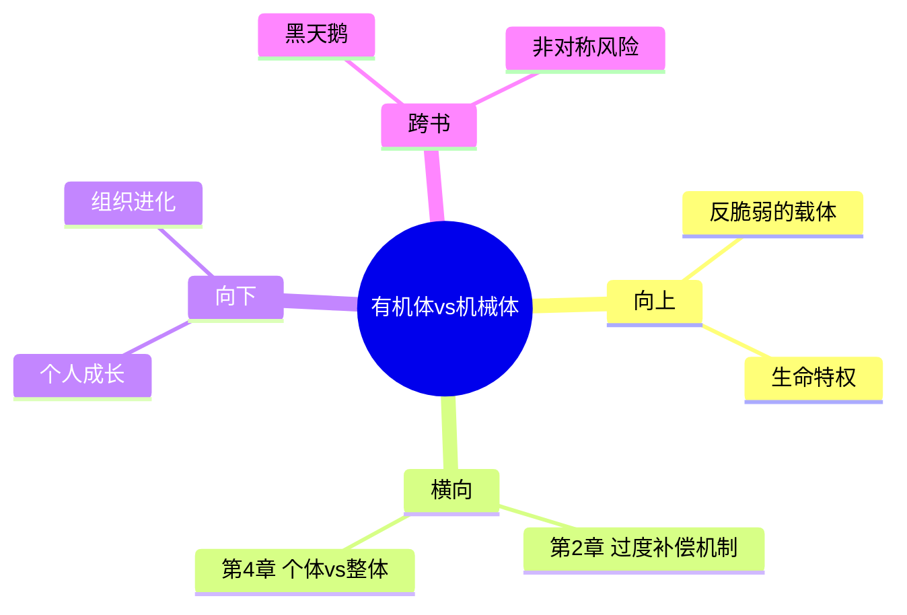

# 第3章 猫与洗衣机

## 📍 章节定位

### 全书位置
> 本章通过对比"猫"和"洗衣机"，解释有机体与机械体的本质区别——只有有机体具有反脆弱性。

- **全书核心问题**：如何从不确定性中获益？
- **本章回答的问题**：为什么只有有机体（生命体）具有反脆弱性？机械体为什么不可能反脆弱？
- **角色类型**：核心概念型（深化对反脆弱的理解）
- **论证位置**：第2章解释过度补偿机制后，本章区分两类系统：有机体能反脆弱，机械体不能

### 章节序列
| 方向 | 章节标题 | 逻辑连接 |
|------|----------|----------|
| 前章 | 第2章 过度补偿与过度反应 | 解释反脆弱机制 |
| 后章 | 第4章 杀死我的东西让其他人更强大 | 继续：个体脆弱vs整体反脆弱 |

### 一句话定位
> 第3章用"猫vs洗衣机"的对比揭示：只有有机体（生命）能从压力中进化，机械体只会磨损老化——反脆弱是生命的特权。

---

## 🎯 核心观点

### 观点1：有机体vs机械体的根本差异

#### 第一层：表层案例

| 案例 | 描述 | 核心要点 |
|------|------|----------|
| **猫** | 活着、能吃能喝、能应对环境变化 | 有机体：有自愈能力、适应能力 |
| **洗衣机** | 运转、但不会"进化"、会磨损 | 机械体：稳定但退化、有寿命 |
| **人体** | 受伤会愈合、越锻炼越强 | 有机体反脆弱 |
| **汽车** | 越开越旧、零件会磨损 | 机械体脆弱 |

#### 第二层：中层机制

**有机体的特征**：
```
┌────────────────────────────────────────────────────────┐
│                    有机体（Organic）                    │
├────────────────────────────────────────────────────────┤
│  ✓ 有生命，会新陈代谢                                   │
│  ✓ 能自我修复                                           │
│  ✓ 能适应环境变化                                       │
│  ✓ 面临压力时会进化                                     │
│  ✓ 有"冗余"设计（备份系统）                             │
│  ✓ 死亡但物种延续                                       │
└────────────────────────────────────────────────────────┘
```

**机械体的特征**：
```
┌────────────────────────────────────────────────────────┐
│                   机械体（Mechanical）                  │
├────────────────────────────────────────────────────────┤
│  ✗ 无生命，不会新陈代谢                                 │
│  ✗ 不会自我修复（需要人工维护）                         │
│  ✗ 只能按设定程序运行                                   │
│  ✗ 面临压力时只会磨损                                   │
│  ✗ "冗余"有限（备用零件有限）                           │
│  ✗ 报废即终止                                           │
└────────────────────────────────────────────────────────┘
```

**关键洞察**：
- 有机体：局部脆弱，整体反脆弱（个体死亡，物种延续）
- 机械体：局部脆弱，整体也脆弱（用坏就报废）

#### 第三层：底层规律

> **有机体反脆弱定律**：只有具有生命特征的系统（能新陈代谢、能自我修复、能适应变化）才具有反脆弱性。

**规律陈述**：机械体只有在理想条件下才"稳定"，有机体在波动中反而更强大

**抽象层级**：生物学 + 系统论 + 复杂性科学

**知识连接**：
- 进化论：物竞天择，适者生存
- 系统论：复杂系统 vs 简单系统
- 热力学：熵增定律（机械体无法抵抗熵增，有机体可以）

---

### 观点2：复杂系统的冗余设计

#### 第一层：表层案例

| 案例 | 描述 |
|------|------|
| **人体** | 两个肾、两个肺（但只用其一）、基因冗余 |
| **金融系统** | 央行作为"最后贷款人"、风险准备金 |
| **城市系统** | 多条交通路线、多个发电站 |
| **互联网** | 分布式网络、多个服务器 |

#### 第二层：中层机制

**冗余 = 反脆弱的安全垫**：
```
冗余的作用：
┌──────────────────────────────────────────┐
│                                          │
│   压力 ──→ 系统A（损坏）                 │
│      │                                   │
│      ↓                                   │
│   冗余B ──→ 顶上来（正常运转）            │
│                                          │
│   结果：整体系统不受影响                  │
│                                          │
└──────────────────────────────────────────┘
```

**关键洞察**：
- 冗余是被动的反脆弱
- 真正的反脆弱是主动从压力中升级
- 冗余是"备份"，反脆弱是"进化"

#### 第三层：底层规律

> **冗余保障规律**：复杂系统通过冗余设计实现局部脆弱、整体稳固，但这不等同于反脆弱。

---

### 观点3：个体脆弱与整体反脆弱

#### 第一层：表层案例

| 案例 | 描述 |
|------|------|
| **人体细胞** | 每天有大量细胞死亡，但整体健康 |
| **创业公司** | 大部分失败，少数成功推动经济 |
| **物种进化** | 大量个体灭绝，物种继续演化 |
| **经济危机** | 大量企业破产，经济整体进步 |

#### 第二层：中层机制

**个体→整体的转化**：
```
个体脆弱（死亡/失败）
     ↓
 筛选压力
     ↓
 优质个体存活/进化
     ↓
 整体反脆弱（物种/系统升级）
```

**塔勒布的洞见**：
> "反脆弱性存在于非线性系统中——个体的脆弱成就整体的反脆弱。"

#### 第三层：底层规律

> **牺牲进化定律**：为了整体进化，个体必须承受脆弱性。这是进化的必要代价。

---

## 💬 降维翻译

### 观点1：有机体vs机械体

#### 原文表达
> "猫是有机体，洗衣机是机械体。猫能应对不确定性和压力，会进化；洗衣机只能按程序运行，会磨损。"

#### 降维翻译（中学生能懂）
```
活着的东西 = 有机体
- 会生长、会变化
- 受伤了会自己好
- 越锻炼越强

不活着的东西 = 机械体
- 不会变化
- 坏了需要人来修
- 越用越旧

最大的区别：
有机体能在"混乱"中成长，
机械体只能在"有序"中运转，
但会慢慢坏掉。
```

#### 日常类比（奶奶能懂）
```
就像人 vs 机器。
人会自己长伤口、会长个子，
机器只会慢慢磨损。
你让一个人生病，
他好了之后可能更强大；
你让一台机器出故障，
它修好也不可能"升级"，
只会更旧。
```

---

### 观点2：冗余设计

#### 降维翻译
```
你有两只手。
一只受伤了，另一只还能做事。
这叫"冗余"——多余的备份。

但冗余只是"不让你死"，
不是让你变强。

真正的反脆弱是：
受伤后不仅好了，
还变得比之前更强。
```

---

## ✨ 金句库

### 原书金句

| 金句 | 适用场景 |
|------|----------|
| "猫是有机体，洗衣机是机械体。" | 科普、演讲 |
| "有机体在压力下进化，机械体在压力下磨损。" | 对比分析 |
| "个体脆弱，整体反脆弱。" | 哲学、进化 |
| "复杂系统通过冗余实现稳定。" | 系统设计 |
| "反脆弱是生命的特权。" | 人生哲学 |

### 降维金句

| 金句 | 适用场景 |
|------|----------|
| **活着的东西能在混乱中成长，死的东西只会磨损。** | 生活 |
| **人会越挫越勇，机器只会越用越旧。** | 职场 |
| **个体可以死，但物种必须活——这是进化的代价。** | 历史 |
| **冗余让你不死，但不能让你更强。** | 风险管理 |
| **不要做"洗衣机"——要做"猫"。** | 励志 |

## 🔗 当下映射

### 💰 财富应用

| 场景 | 具体行动 | 预期效果 | 风险提示 |
|------|----------|----------|----------|
| **投资组合** | 建立"冗余"资产配置 | 分散风险 | 仅防风险不增值 |
| **收入来源** | 多个收入渠道（冗余） | 抗风险 | 需要精力管理 |
| **创业** | 接受高失败率（个体脆弱） | 整体成功 | 需要控制失败成本 |

### 💼 职场应用

| 场景 | 具体行动 | 所需能力 | 适用职级 |
|------|----------|----------|----------|
| **职业安全** | 培养多重技能（冗余） | 学习能力 | 全部 |
| **团队建设** | 关键岗位有备份 | 管理能力 | 中高层 |
| **个人成长** | 主动经历"小失败" | 心理韧性 | 全部 |

### 🏠 生活应用

| 场景 | 具体行动 | 可行性 | 见效时间 |
|------|----------|--------|----------|
| **健康** | 接受偶尔小生病（训练免疫） | 中 | 长期 |
| **育儿** | 让孩子适当冒险 | 中 | 长期 |
| **心态** | 把挫折当"进化机会" | 高 | 即时 |

### 72小时行动计划

1. **明天**：做一件会让你"失败"的小事（比如主动发言）
2. **本周**：学习一个新技能，不求精通，只求"冗余"
3. **本月**：主动承担一个可能失败的项目，当作"压力测试"

---

## 🕸️ 章节关联

### 向上关联 → 整书
- **贡献**：本章区分有机体和机械体，解释为什么只有有机体能反脆弱
- **位置**：第1章定义 → 第2章机制 → 第3章区分类型

### 横向关联

| 章节 | 标题 | 关联类型 | 连接描述 |
|------|------|----------|----------|
| 第2章 | 过度补偿 | 承接 | 过度补偿是有机体的特性 |
| 第4章 | 杀死我的东西让其他人更强 | 铺垫 | 个体脆弱vs整体反脆弱 |
| 第22章 | 活得长寿但不要太长 | 远程 | 有机体寿命的悖论 |

### 跨书关联

| 书籍 | 概念 | 关系 |
|------|------|------|
| [[黑天鹅-塔勒布-拆解记录]] | 极端斯坦 | 延伸：极端事件筛选有机体 |
| [[非对称风险-塔勒布-拆解记录]] | 风险共担 | 延伸：个体承担风险，整体进化 |

### 关联可视化


---

## ❓ 问答设计

### Q1: 什么是有机体和机械体的根本区别？
**答案要点**：
- 有机体：有生命，能新陈代谢，能自我修复，能适应变化
- 机械体：无生命，不会新陈代谢，只会磨损

### Q2: 为什么洗衣机不可能"反脆弱"？
**答案要点**：
- 机械体只能按程序运行
- 压力只会造成磨损，不会带来进化
- 没有自我修复和适应能力

### Q3: 人体有哪些"冗余"设计？
**答案要点**：
- 双肾、双肺（备用）
- 基因冗余
- 免疫系统
- 自愈能力

### Q4: "个体脆弱、整体反脆弱"是什么意思？
**答案要点**：
- 单一有机体可能死亡
- 但物种/系统通过筛选继续进化
- 个体的"失败"是进化的必要代价

### Q5: 怎么把自己变成"猫"而不是"洗衣机"？
**答案要点**：
- 保持学习和适应能力
- 主动经历压力和挑战
- 建立自我修复机制（休息、反思）
- 培养冗余技能

### Q6: 公司如何实现"整体反脆弱"？
**答案要点**：
- 允许试错（个体脆弱）
- 快速迭代（筛选进化）
- 保持冗余（备份系统）
- 不追求每个项目都成功

### Q7: 冗余和反脆弱有什么区别？
**答案要点**：
- 冗余：让你不崩溃（被动防御）
- 反脆弱：让你更强大（主动进化）
- 冗余是必要但不够

### Q8: 为什么说"反脆弱是生命的特权"？
**答案要点**：
- 只有生命体有自愈、适应、进化能力
- 非生命体只能被设计、被修复
- 反脆弱需要"活着"的系统

### Q9: 教育孩子应该注意什么？
**答案要点**：
- 孩子是有机体，不是机械体
- 过度保护削弱适应能力
- 允许"混乱"和适当的"伤害"

### Q10: 投资中的"有机体思维"是什么？
**答案要点**：
- 把资金看作"生命体"
- 允许波动和短期"损失"
- 通过压力测试进化
- 追求长期成长而非表面稳定

### Q11: "自愈"和"被修复"有什么区别？
**答案要点**：
- 自愈：系统自动恢复，可能升级（有机体）
- 被修复：外部干预恢复，原地踏步（机械体）

### Q12: 团队管理中如何应用这个原理？
**答案要点**：
- 允许失败（个体脆弱）
- 快速学习（进化）
- 保持冗余（备份）
- 不追求每个项目都成功

### Q13: 怎么理解"复杂系统通过冗余实现稳定"？
**答案要点**：
- 多个备份确保整体运转
- 但冗余是被动的，不是真正的反脆弱
- 需要加上"进化"才能实现反脆弱

### Q14: 衰老是不是一种"机械体化"过程？
**答案要点**：
- 随着年龄增长，人体自我修复能力下降
- 从"有机体"逐渐趋向"机械体"
- 这就是为什么老年人需要更多"冗余"

### Q15: 怎么在职场中避免成为"洗衣机"？
**答案要点**：
- 保持学习能力
- 主动迎接挑战
- 建立多重技能
- 不要只做"按程序运行"的工作

---
