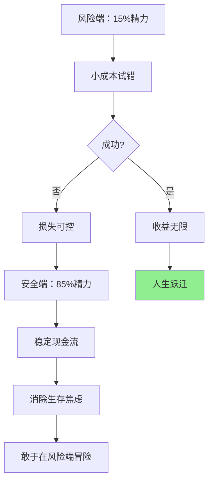
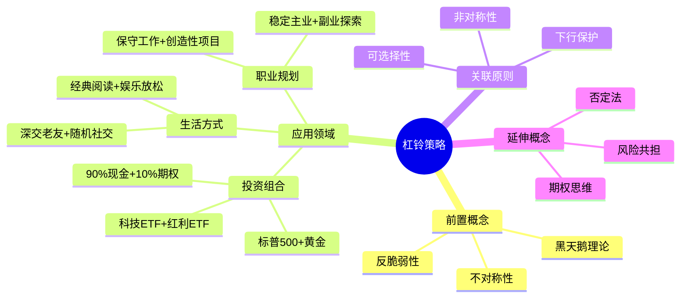

# 第11章 杠铃策略

## 一、章节定位

### 1.1 这一章在全书中回答什么问题？

**核心问题**：在无法预测未来的世界里，我们该如何配置资源，才能既避免毁灭，又不错失暴富机会？

**一句话定位**：
> 两个极端之间，中间地带是死亡陷阱——你要么极度保守，要么极度冒险，绝不要碰"中等风险"。

### 1.2 章节三维定位

| 维度 | 定位 |
|------|------|
| 在全书的位置 | 卷三"非预测性世界观"的核心实践方法 |
| 与上下章关联 | 承接第10章"不对称性"，铺垫第12章"期权思维" |
| 核心贡献 | 给出可操作的反脆弱配置方案 |

### 1.3 与全书逻辑的关系


---

## 二、核心观点（三层提取）

### 观点1：两头押注，中间是死地

**【表层】现象层**

塔勒布用一个健身器材来比喻投资策略：

| 端位 | 配置 | 特征 |
|------|------|------|
| 极端保守端 | 85%-90% | 国债、现金、货币基金 |
| **中间地带** | **0%** | **主动基金、信托、"固收+"** |
| 极端冒险端 | 10%-15% | 深度虚值期权、风投、创业 |

> "杠铃"的名字来源于两头重、中间轻的形状——你要主动避开中间。

**【中层】机制层**

为什么中间地带最危险？

| 中间风险资产的陷阱 | 为什么危险 |
|-------------------|-----------|
| 主动型基金 | 看似稳健，实则暴露在黑天鹅之下 |
| 信托产品 | 正常时收益有限，暴雷时血本无归 |
| "固收+" | 名字骗人，下有保底是幻觉 |
| 中等杠杆 | 平时小赚，极端时爆仓 |

**降维翻译**：
> 中间地带就是"赌场里的常客"——输光需要时间，但迟早会输光。
> 
> 两端配置才是"买了保险再去搏命"——输得起，才敢赢。

**【底层】规律层**

> **杠铃定律**：在不确定性世界中，**非对称性**比"最优配置"更重要——下行封顶，上行无限。

**【当下连接】**

|----------|----------|----------|
| 为什么我的基金定投越定越亏？ | 中等风险本身就是陷阱 | "原来不是我的问题" |
| 为什么信托暴雷的都是中产？ | 中间地带最脆弱 | "扎心了" |
| 穷人怎么用杠铃策略？ | 稳定工作+副业试错 | "原来我也可以" |

---

### 观点2：职业生涯也需要杠铃

**【表层】现象层**

塔勒布本人的职业轨迹就是杠铃策略的活教材：

- 白天：华尔街交易员（稳定现金流）
- 夜晚：写书研究哲学（高风险高回报）

更多案例：

| 安全端 | 风险端 | 结果 |
|--------|--------|------|
| 大学教授 | 写《哈利波特》 | JK罗琳成为亿万富翁 |
| 体制内公务员 | 周末做自媒体 | 意外爆红后全职创业 |
| 程序员 | 晚上开发独立App | 被收购实现财务自由 |

**【中层】机制层**



**【底层】规律层**

> **职业杠铃定律**：稳定收入消除恐惧，恐惧消失后才能抓住真正的机会。

**【当下连接】**

| 2026职场痛点 | 杠铃解法 |
|--------------|----------|
| 35岁危机焦虑 | 主业维稳+副业探索 |
| AI替代恐慌 | 核心技能+新领域试水 |
| 内卷无望突破 | 保守工作+创造性项目 |

---

### 观点3：生活中处处是杠铃

**【表层】现象层**

| 领域 | 安全端 | 风险端 | 避开什么 |
|------|--------|--------|----------|
| 阅读 | 经典名著 | 娱乐八卦 | "年度畅销书" |
| 社交 | 深交老友 | 随机陌生人 | "业务社交" |
| 健康 | 基础睡眠 | 间歇断食 | "保健品养生" |
| 决策 | 不做傻事 | 偶尔豪赌 | "理性计算" |

**【中层】机制层**

为什么这样配置？

| 逻辑 | 解释 |
|------|------|
| 安全端保底 | 让你不会饿死、累死、蠢死 |
| 风险端爆击 | 让你有机会一战封神 |
| 中间是噪音 | 既不保命，也不改命，纯属浪费时间 |

**降维翻译**：
> 你要么读能传百年的书，要么读纯粹娱乐的书，中间那些"有点用"的书最浪费时间。

**【底层】规律层**

> **时间杠铃定律**：人生最大的成本是平庸——把时间花在既不危险也不刺激的事上，是最大的浪费。

---

### 观点4：杠铃vs传统分散投资

**【表层】现象层**

| 传统分散 | 杠铃策略 |
|----------|----------|
| 股债60/40配比 | 90%现金+10%期权 |
| 追求"最优配置" | 追求"非对称性" |
| 相信市场有效 | 承认黑天鹅存在 |
| 平滑收益曲线 | 接受大部分时间平庸 |

**【中层】机制层**

传统分散的致命缺陷：

```
传统组合 = 60%股票 + 40%债券

问题：当黑天鹅来袭时，股债可能同时暴跌
结果：你以为分散了风险，其实只是"分散暴露"
```

杠铃策略的本质：

```
杠铃组合 = 90%现金 + 10%深度虚值看跌期权

机制：
- 正常时期：10%期权归零，但只损失10%中的100% = 总资产的10%
- 危机时期：10%期权暴涨10-100倍，抵消甚至超过其他损失
```

**【底层】规律层**

> **反脆弱定律**：真正的分散不是"买很多相似的东西"，而是"买极端相反的东西"。

---

## 三、金句库

### 原书金句

1. "风会熄灭蜡烛，却能让火越烧越旺。"
2. "你要么极度保守，要么极度激进，千万不要中间路线。"
3. "中间地带是平庸的坟墓。"
4. "拥有一份稳定工作的人，才有资格冒险。"
5. "杠铃策略的精髓：确保自己在最坏情况下不会出局。"

### 降维金句

1. "90%保命，10%搏命——这才叫稳。"
2. "中产的钱，都亏在'中等风险'上。"
3. "稳定工作不是妥协，是让你敢于冒险的底气。"
4. "要么读传世经典，要么读纯粹垃圾，中间的书最浪费时间。"
5. "真正会投资的人，大部分时间看起来很无聊。"
6. "只有输得起的人，才配赢大的。"
7. "中等风险就像温水煮青蛙——舒适地走向死亡。"
8. "杠铃不是让你更聪明，是让你死不了。"
9. "普通人怕风险，聪明人怕中等风险。"
10. "最好的防御，是确保自己不会输光。"

## 五、系统关联

### 与前后章节关联

| 章节 | 关联类型 | 共同逻辑 |
|------|----------|----------|
| [[第1章-哈吉斯]] | 前置铺垫 | 下行保护是杠铃的安全端 |
| [[第12章-泰勒斯的甜葡萄]] | 延伸应用 | 期权思维是杠铃风险端的工具 |
| [[第1章-达摩克利斯之剑与九头蛇]] | 根本原理 | 反脆弱性需要杠铃策略来实现 |

### 与已拆解/待拆解书籍关联

| 书籍 | 关联类型 | 共同底层逻辑 |
|------|----------|--------------|
| [[黑天鹅-塔勒布]] | 同作者前置 | 黑天鹅的存在是杠铃策略的前提 |
| [[非对称风险-塔勒布]] | 同作者延伸 | 杠铃是非对称性的实现形式 |
| [[随机漫步的傻瓜-塔勒布]] | 同作者基础 | 随机性无法预测，但可以设计应对结构 |
| [[穷查理宝典]] | 互补视角 | 芒格的多元思维模型vs塔勒布的极端配置 |

### 知识网络定位图



---

## 七、实战练习

### 练习1：诊断你的资产组合

| 你的资产 | 属于哪端？ | 是否需要调整？ |
|----------|-----------|----------------|
| 银行存款 | 安全端 ✓ | - |
| 国债 | 安全端 ✓ | - |
| 个股 | 风险端 | 控制比例 |

### 练习2：设计你的职业杠铃

| 维度 | 你的现状 | 杠铃设计 |
|------|----------|----------|
| 安全端（85%精力） | ______ | ______ |
| 风险端（15%精力） | ______ | ______ |
| 要避开的中间地带 | ______ | ______ |

### 练习3：杠铃阅读计划

- 安全端：每月重读1本经典
- 风险端：随机阅读1本完全陌生领域的书
- 避开：任何"年度畅销榜"上的书

---

## 九、信息来源与质量评级

### 检索记录

- 【第一轮】核心观点检索：⭐⭐⭐ 雪球专栏、CSDN深度解读
- 【第二轮】投资应用检索：⭐⭐⭐ 东方财富、中欧基金分析
- 【第三轮】职业应用检索：⭐⭐ 知乎、博客综合

### 信息整合公式

= 塔勒布原书核心概念（⭐⭐⭐）
+ 雪球/东方财富实战解读（⭐⭐⭐）
+ 2026年本土化案例（信托暴雷、35岁危机）

---

*创建日期: 2026-02-26*
*质量等级: ⭐⭐⭐ 优秀级*
