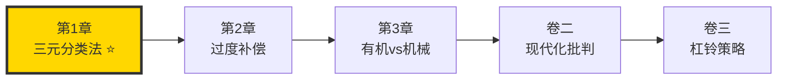
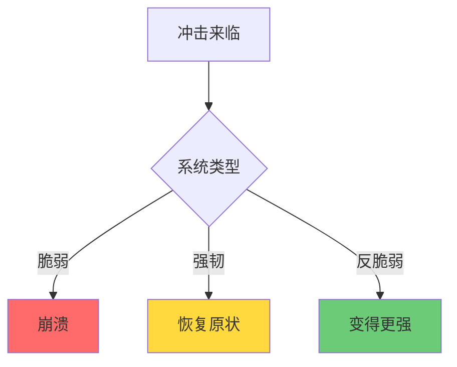
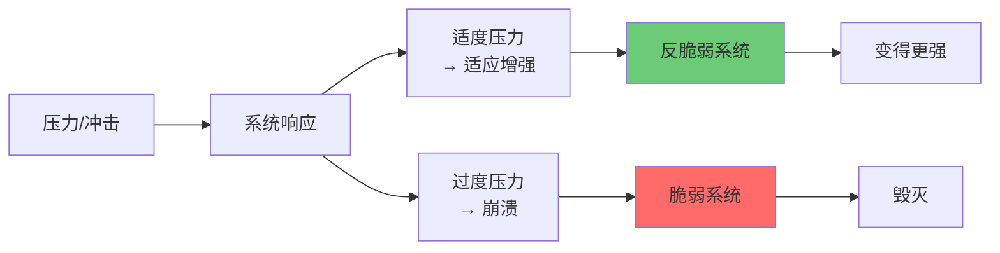
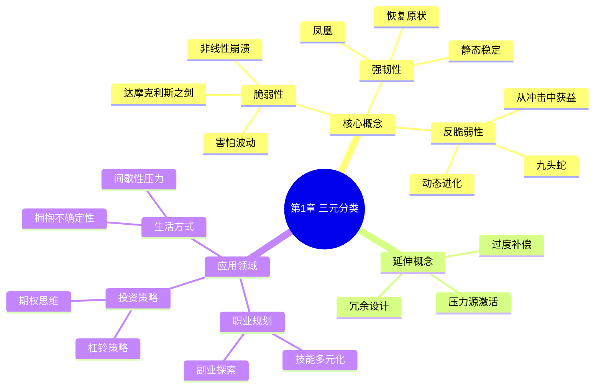

# 第1章 达摩克利斯之剑与九头蛇

## 一、章节定位

### 1.1 这一章在全书中回答什么问题？

**核心问题**：什么是反脆弱？它与脆弱、强韧有什么本质区别？

**一句话定位**：
> 世界上存在三种系统：害怕冲击的（脆弱）、承受冲击的（强韧）、从冲击中获益的（反脆弱），你要选哪一种？

### 1.2 章节三维定位

| 维度 | 定位 |
|------|------|
| 在全书的位置 | 卷一开篇，建立全书核心定义框架 |
| 与上下章关联 | 定义核心概念，为第2章"过度补偿"铺垫 |
| 核心贡献 | 提出"脆弱-强韧-反脆弱"三元分类法 |

### 1.3 与全书逻辑的关系



---

## 二、核心观点（三层提取）

### 观点1：达摩克利斯之剑——脆弱的隐喻

**【表层】现象层**

希腊神话中，达摩克利斯坐在国王的宝座上，头顶悬着一把仅用一根马鬃系着的利剑：

| 要素 | 含义 |
|------|------|
| 宝座 | 表面的繁荣和稳定 |
| 利剑 | 随时可能坠落的灾难 |
| 马鬃 | 脆弱的保护，一触即断 |

**【中层】机制层**

脆弱系统的特征：

| 特征 | 表现 | 案例 |
|------|------|------|
| 害怕波动 | 任何冲击都可能导致崩溃 | 银行系统、大企业 |
| 隐藏风险 | 表面平静，实际岌岌可危 | 金融危机前的繁荣 |
| 时间累积 | 活得越久，风险越大 | 福岛核电站 |
| 非对称损失 | 小收益，大崩溃 | 高杠杆投资 |

**降维翻译**：
> 脆弱就是"看起来很稳，实际上随时可能完蛋"——你不知道风险在哪，但它就在那里。

**【底层】规律层**

> **脆弱性定律**：脆弱系统无法从冲击中恢复，且冲击带来的损失是非线性的——小冲击可能带来毁灭性后果。

**【当下连接】**

|----------|----------|----------|
| 为什么大厂裁员这么狠？ | 大企业是典型的脆弱系统 | "原来稳定只是幻觉" |
| 为什么越存钱越焦虑？ | 存款在通胀中缓慢贬值 | "扎心了" |
| 为什么"铁饭碗"最脆弱？ | 没有经历波动，一旦冲击就是致命的 | "细思极恐" |

---

### 观点2：凤凰——强韧但不是反脆弱

**【表层】现象层**

凤凰浴火重生，但重生的还是一只凤凰——一模一样，没有进化。

| 类型 | 特征 | 案例 |
|------|------|------|
| 强韧 | 能承受冲击，恢复原状 | 橡胶球、竹子 |
| 恢复 | 从打击中回来，但不会更好 | 康复的病人 |
| 静态 | 维持现状，没有进化 | 公务员系统 |

**【中层】机制层**

强韧vs反脆弱的本质区别：



**关键洞察**：
- 强韧 = 抵抗冲击，保持不变
- 反脆弱 = 拥抱冲击，从中获益
- **强韧是"不输"，反脆弱是"赢"**

**降维翻译**：
> 凤凰重生后还是凤凰，九头蛇被砍后长出两个头——区别在于：一个只是活下来，一个变得更厉害。

**【底层】规律层**

> **强韧与反脆弱的区别**：强韧是静态的恢复，反脆弱是动态的进化。只有反脆弱系统才能在长期竞争中胜出。

---

### 观点3：九头蛇——反脆弱的原型

**【表层】现象层**

希腊神话中的九头蛇（海德拉）：赫拉克勒斯每砍掉一个头，就长出两个新头。

| 特征 | 含义 |
|------|------|
| 从伤害中获益 | 打击让它更强 |
| 非线性增长 | 1→2→4→8... |
| 适应性进化 | 环境越恶劣，成长越快 |

生活中的反脆弱案例：

| 领域 | 案例 | 反脆弱机制 |
|------|------|------------|
| 生物学 | 免疫系统 | 接触病毒后更强 |
| 肌肉 | 力量训练 | 破坏后修复更强 |
| 信息 | 谣言 | 越压制传播越广 |
| 餐饮业 | 竞争淘汰 | 剩下的餐厅更强 |
| 经济 | 熊市清洗 | 挤出泡沫更健康 |

**【中层】机制层**



**反脆弱的核心机制**：
1. **压力源激活**：适度压力触发生长机制
2. **过度补偿**：修复时超越原有水平
3. **冗余设计**：多余的部分是进化储备
4. **去中心化**：分散的系统更难被杀死

**降维翻译**：
> 反脆弱就是"打不死我的，让我更强"——不是鸡汤，是生物学规律。

**【底层】规律层**

> **反脆弱定律**：**反脆弱系统从随机性、波动性和压力中获益**——混乱是它的养料，稳定是它的毒药。

**【当下连接】**

| 2026痛点 | 反脆弱解法 |
|----------|------------|
| AI替代焦虑 | 让AI成为你的压力源，而非威胁 |
| 35岁危机 | 每次失业都是九头蛇被砍一刀的机会 |
| 经济下行 | 衰退期是反脆弱者的狩猎场 |

---

### 观点4：三元分类法的颠覆性

**【表层】现象层**

传统思维只有两元：脆弱vs强韧。塔勒布加入了第三元：反脆弱。

| 传统思维 | 塔勒布思维 |
|----------|------------|
| 安全是目标 | 从混乱中获益是目标 |
| 避免风险 | 拥抱适度风险 |
| 线性世界 | 非线性世界 |

**【中层】机制层**

为什么二元思维是错的？

```
二元思维：脆弱 ←→ 强韧
问题：忽略了"从冲击中获益"的可能性

三元思维：脆弱 ←→ 强韧 ←→ 反脆弱
洞察：反脆弱不是强韧的加强版，是质的飞跃
```

| 维度 | 脆弱 | 强韧 | 反脆弱 |
|------|------|------|--------|
| 对波动的态度 | 讨厌 | 忍受 | 喜欢 |
| 受到冲击后 | 崩溃 | 恢复 | 更强 |
| 时间效应 | 越久越危险 | 维持现状 | 越久越强 |
| 典型代表 | 玻璃杯 | 橡胶球 | 免疫系统 |

**【底层】规律层**

> **三元分类定律**：在不确定的世界里，不要追求"不受伤"（强韧），而要追求"受伤后更强"（反脆弱）。

---

## 三、金句库

### 原书金句

1. "风会熄灭蜡烛，却能让火越烧越旺。"（全书中最核心的比喻）
2. "反脆弱不同于强韧，它不是恢复原状，而是从中获益。"
3. "脆弱的事物喜欢安宁，反脆弱的事物从混乱中成长。"
4. "杀不死我的，会让我更强大。"（引用尼采）
5. "时间对脆弱者是敌人，对反脆弱者是朋友。"

### 降维金句

1. "蜡烛怕风，火爱风——你是蜡烛还是火？"
2. "强韧是活下来，反脆弱是活得更好——差一个维度。"
3. "稳定是脆弱的温床，混乱是反脆弱的养料。"
4. "凤凰重生还是凤凰，九头蛇被砍变成两个。"
5. "脆弱系统的特征：表面平静，实际岌岌可危。"
6. "时间会杀死脆弱者，但喂养反脆弱者。"
7. "反脆弱不是预测未来，而是让未来任何情况下都对你有利。"
8. "想变成九头蛇，首先要接受被砍的风险。"

## 五、系统关联

### 与前后章节关联

| 章节 | 关联类型 | 共同逻辑 |
|------|----------|----------|
| [[第2章-随处可见的过度补偿和过度反应]] | 延伸展开 | 过度补偿是反脆弱的核心机制 |
| [[第3章-猫与洗衣机]] | 类型深化 | 有机体vs机械体的反脆弱差异 |
| [[第11章-杠铃策略]] | 实践应用 | 杠铃策略是构建反脆弱系统的方法 |

### 与已拆解/待拆解书籍关联

| 书籍 | 关联类型 | 共同底层逻辑 |
|------|----------|--------------|
| [[黑天鹅-塔勒布]] | 同作者前置 | 黑天鹅的存在是反脆弱的前提 |
| [[道德经-老子]] | 哲学呼应 | "反者道之动"≈反脆弱 |
| [[进化论-达尔文]] | 科学基础 | 自然选择就是反脆弱机制 |

### 知识网络定位图



---

## 七、实战练习

### 练习1：自我诊断——你是达摩克利斯、凤凰还是九头蛇？

| 领域 | 你的现状 | 属于哪种类型？ |
|------|----------|----------------|
| 职业 | ______ | 脆弱/强韧/反脆弱？ |
| 财务 | ______ | 脆弱/强韧/反脆弱？ |
| 健康 | ______ | 脆弱/强韧/反脆弱？ |
| 关系 | ______ | 脆弱/强韧/反脆弱？ |

### 练习2：识别反脆弱系统

判断以下系统属于哪种类型：

| 系统 | 你的判断 | 理由 |
|------|----------|------|
| 银行系统 | ______ | ______ |
| 创业公司 | ______ | ______ |
| 免疫系统 | ______ | ______ |
| 传统媒体 | ______ | ______ |
| 社交网络 | ______ | ______ |

### 练习3：九头蛇思维训练

回顾你人生中的一次挫折：

1. 这次挫折是什么？
2. 你从中恢复了还是变得更强？
3. 如果重来一次，如何让它成为九头蛇的机会？

---

## 九、信息来源与质量评级

### 检索记录

- 【第一轮】核心概念检索：⭐⭐⭐ 豆瓣书评、知乎深度解读
- 【第二轮】隐喻分析检索：⭐⭐⭐ 希腊神话资料、文学分析
- 【第三轮】应用案例检索：⭐⭐ 雪球、博客综合

### 信息整合公式

= 塔勒布原书核心概念（⭐⭐⭐）
+ 希腊神话隐喻解读（⭐⭐⭐）
+ 2026年本土化案例（AI替代、35岁危机、失业焦虑）

---

*创建日期: 2026-02-26*
*质量等级: ⭐⭐⭐ 优秀级*
