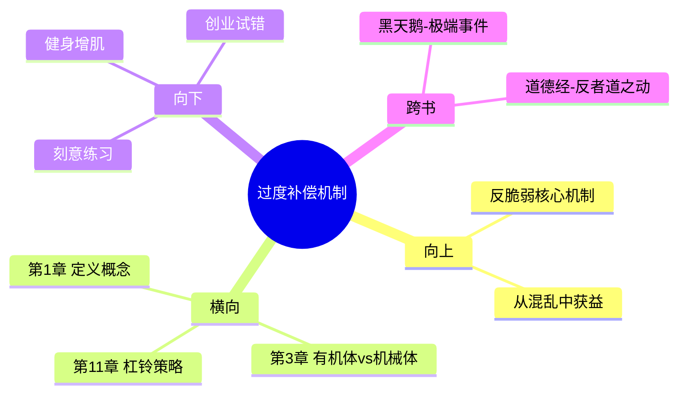

---

category: 
  - 书籍拆解

status: completed
chapter: 
number: 2
title: 随处可见的过度补偿和过度反应
links:

  - "[[第1章-达摩克利斯之剑与九头蛇]]"
  - "[[第3章-猫与洗衣机]]"
created: 2026-02-26
tags:
  - 反脆弱
  - 过度补偿
  - 毒物兴奋效应
  - 压力
---

# 第2章 随处可见的过度补偿和过度反应

## 📍 章节定位

### 全书位置
> 本章是全书核心概念展开的起点，承接第1章"反脆弱"定义，进一步解释反脆弱的运行机制。

- **全书核心问题**：如何从不确定性中获益？
- **本章回答的问题**：为什么说"过度补偿"是反脆弱的核心机制？身体和心理如何通过压力和刺激变得更强？
- **角色类型**：核心概念型（展开核心方法论）
- **论证位置**：第1章定义"反脆弱"概念后，本章深入解释其底层机制

### 章节序列
| 方向 | 章节标题 | 逻辑连接 |
|------|----------|----------|
| 前章 | 第1章 达摩克利斯之剑与九头蛇 | 定义"反脆弱"概念 |
| 后章 | 第3章 猫与洗衣机 | 继续深化：有机体vs机械体的反脆弱差异 |

### 一句话定位
> 第2章揭示"过度补偿"机制——身体和心理在面对压力、伤害、病毒时，不仅能恢复原状，还能进化到更高阶段，这是反脆弱的核心运行原理。

---

## 🎯 核心观点

### 观点1：过度补偿——压力下的进化机制

#### 第一层：表层案例

| 案例名称 | 简要描述 | 核心要点 |
|----------|----------|----------|
| **肌肉锻炼** | 适度破坏肌肉纤维 → 恢复后更强 | 压力→破坏→超量恢复 |
| **免疫系统** | 接触少量病毒 → 产生抗体、更强大 | 适度刺激→免疫升级 |
| **创伤后成长** | 经历重大挫折的人往往更坚强 | 苦难→智慧+韧性 |
| **学习中的"必要难度"** | 有难度的东西记得更牢 | 适度的困难→深度记忆 |
| ** vaccinations（疫苗）** | 注射弱化病毒 → 产生免疫力 | 以毒攻毒的科学应用 |

#### 第二层：中层机制

**毒物兴奋效应（Hormesis）**：
```
┌─────────────────────────────────────────────────────┐
│           毒物兴奋效应 (Hormesis)                    │
├─────────────────────────────────────────────────────┤
│  低剂量刺激 ──→ 有益效果 ──→ 强身健体              │
│  中等剂量刺激 ──→ 适应 ──→ 能力提升                │
│  高剂量伤害 ──→ 有害效果 ──→ 死亡                  │
│                                                      │
│  关键洞察：剂量决定效果                             │
│  "这是毒药还是良药，取决于剂量"                     │
└─────────────────────────────────────────────────────┘
```

**米特拉达梯式解毒法（Mithridatism）**：
- 原理：逐渐增加毒物剂量，使身体产生抵抗力
- 起源：米特拉达梯六世（古希腊国王）通过服用微量毒药来避免被暗杀
- 应用：疫苗接种、过敏治疗、极限运动

#### 第三层：底层规律

> **过度补偿定律**：系统在受到适度压力和伤害后，不仅能恢复到原始状态，还能进化到比原来更高的水平。

**规律陈述**：反脆弱 = 适度压力 → 超量恢复 → 能力升级

**抽象层级**：进化生物学 + 生理学 + 心理学

**知识连接**：
- 达尔文进化论：物竞天择，适者生存
- 《黑天鹅》：极端斯坦中的"黑天鹅"推动进化
- 《反脆弱》整书：从混乱中获益的核心机制

**适用范围**：
- 身体锻炼与健康
- 心理韧性建设
- 职业能力发展
- 组织变革与进化
- 学习与技能提升

---

### 观点2：信息干扰与过度补偿

#### 第一层：表层案例

| 案例 | 描述 | 核心要点 |
|------|------|----------|
| **禁止小说** | 越禁越想看 | 禁止→渴望→过度反应 |
| **节食反弹** | 饿过头后暴饮暴食 | 压抑→失控 |
| **考试临时抱佛脚** | 压力越大效率越高 | 截止日期是第一生产力 |
| **创业者的逆境** | 失败多次后找到成功 | 试错→迭代→突破 |

#### 第二层：中层机制

```
过度补偿的心理机制：
┌──────────────┐      ┌──────────────┐      ┌──────────────┐
│   压力/伤害   │ ──→  │   系统反应   │ ──→  │  超量恢复    │
│ (stressor)   │      │ (overdrive)  │      │ (overcomp.)  │
└──────────────┘      └──────────────┘      └──────────────┘
                            ↓
                     能力升级
                     (升级打怪)
```

**关键洞察**：
- 禁止某种行为反而会强化这种行为
- 适度的匮乏激发创造力
- 截止日期创造奇迹

#### 第三层：底层规律

> **限制激发创新定律**：当资源、信息、选择受到限制时，人们往往能激发出更强的创造力和适应能力。

---

### 观点3：休息与恢复的反脆弱性

#### 第一层：表层案例

| 案例 | 描述 |
|------|------|
| **运动后的休息** | 肌肉在休息时生长 |
| **学习后的睡眠** | 大脑在睡眠中整合记忆 |
| **工作的度假** | 远离工作反而产生新灵感 |
| **冬眠的动物** | 休眠期身体进行深度修复 |

#### 第二层：中层机制

**张弛有度的周期**：
```
训练 ──→ 休息 ──→ 升级 ──→ 更高强度训练 ──→ 更高水平升级
  ↓        ↓         ↓
 压力     恢复      超量恢复
```

**关键洞察**：
- 反脆弱不是持续高压，而是周期性的压力-恢复循环
- 没有恢复的持续压力 = 脆弱（会崩溃）
- 恢复是反脆弱的必要组成部分

#### 第三层：底层规律

> **周期性震荡定律**：反脆弱系统需要周期性波动（压力+恢复），单向输入会导致系统退化。

---

## 💬 降维翻译

### 观点1：过度补偿

#### 原文表达
> "过度补偿是反脆弱的核心机制。身体在受到适度压力后，不仅能恢复原状，还能变得比原来更强。" 
> —— 塔勒布《反脆弱》

#### 降维翻译（中学生能懂）
```
你的身体有点像弹簧。
你把它压下去（锻炼、压力），
它会弹回来，而且弹得更高（变得更强）。

但有一个前提：压力要适度。
太小 → 没反应（肌肉不增长）
太大 → 会断掉（受伤、生病）
刚刚好 → 变强
```

#### 日常类比（奶奶能懂）
```
就像打铁。
铁块不锤炼，就是一块软铁。
适度锤炼 → 变成好钢。
锤炼过度 → 碎成渣。

或者像带小孩。
你不能总保护着他不让跌倒，
跌倒了爬起来，才会走路越来越稳。
```

#### 检验
- Q: 如果一个中学生问你"什么叫过度补偿"？
- A: "就是受到的伤害反而让你变得更强。比如你跑步跑到腿酸，休息几天后，你会发现跑得更快了。"

---

### 观点2：限制激发创新

#### 原文表达
> "当你禁止某种行为时，这种行为往往会以更强烈的方式出现。"

#### 降维翻译
```
越不让你做一件事，你越想做。
越不让你看一本书，你越想看。
这就是"逆反心理"。

但塔勒布说，这不完全是坏事。
如果你把这种"逆反"用在正道上，
比如截止日期逼出来的创造力，
禁止带来的创新思考——
你就能把限制变成动力。
```

#### 日常类比
```
就像弹簧。
你把它压得越厉害，
松手后弹得越高。
限制你的东西，反而成了你弹起来的助力。
```

---

## ✨ 金句库

### 原书金句

| 金句 | 适用场景 |
|------|----------|
| "脆弱的事物喜欢安宁，反脆弱的事物从混乱中成长。" | 朋友圈、微博 |
| "杀不死我的，使我更强大。"（尼采） | 励志、危机应对 |
| "过度补偿是应对风险的古老策略。" | 演讲、写作 |
| "毒物兴奋效应：剂量决定效果。" | 健康、科学解释 |
| "限制往往激发创新。" | 创业、管理 |
| "米特拉达梯式解毒法：以毒攻毒。" | 医疗、疫苗 |

### 降维金句

| 金句 | 适用场景 |
|------|----------|
| **压力太小=没进步，压力太大=会崩溃，刚刚好=变强。** | 健身、学习、工作 |
| **身体是弹簧，压下去会弹得更高——关键在"适度"。** | 健康、生活 |
| **越禁止越想要——把这种"逆反"变成动力。** | 创意思维 |
| **没压力的生活会让人变脆弱——温水煮青蛙。** | 职场、成长 |
| **会休息的人才会成功——休息是升级的一部分。** | 时间管理 |

## 🔗 当下映射

### 💰 财富应用

| 场景 | 具体行动 | 预期效果 | 风险提示 |
|------|----------|----------|----------|
| **投资波动** | 接受短期亏损，作为"压力测试" | 长期收益更高 | 需要耐心 |
| **副业探索** | 用10%精力尝试高风险新项目 | 可能带来超额回报 | 可能失败，需控制比例 |
| **财富积累** | 经历1-2次"破产"式危机 | 财务韧性增强 | 需控制冲击力度 |

### 💼 职场应用

| 场景 | 具体行动 | 所需能力 | 适用职级 |
|------|----------|----------|----------|
| **职业成长** | 主动承担有挑战的项目 | 抗压、学习能力 | 全部职级 |
| **技能提升** | 刻意练习"困难区"内容 | 延迟满足 | 全部职级 |
| **团队管理** | 给下属适度压力+充分恢复 | 教练技术 | 中高层 |
| **职业转型** | 先兼职尝试，再决定是否all in | 风险管理 | 全部职级 |

### 🏠 生活应用

| 场景 | 具体行动 | 可行性 | 见效时间 |
|------|----------|--------|----------|
| **健身** | 每周2-3次"力竭"训练+充足休息 | 高 | 4-8周 |
| **学习** | 间隔重复+难度递增 | 高 | 2-4周 |
| **育儿** | 让孩子适当"吃苦"，不过度保护 | 中 | 长期 |
| **心态** | 主动寻求"不适"，每月突破一次 | 高 | 1-2周 |
| **睡眠** | 偶尔睡不好没关系，身体会调节 | 高 | 即时 |

### 72小时行动计划

1. **明天**：做10个俯卧撑到力竭，感受到肌肉酸痛
2. **本周**：主动承担一个有点难的工作任务
3. **本月**：尝试一件你一直想做但害怕的事（即使失败了也有价值）

---

## 🕸️ 章节关联

### 向上关联 → 整书
- **贡献**：本章解释"反脆弱"的底层机制——过度补偿，为全书奠定理论基础
- **位置**：第1章定义概念 → 第2章解释机制 → 第3章对比有机/机械体

### 横向关联 → 章节间

| 章节编号 | 章节标题 | 关联类型 | 连接描述 |
|----------|----------|----------|----------|
| 第1章 | 达摩克利斯之剑与九头蛇 | 承接 | 定义"反脆弱"概念，本章解释机制 |
| 第3章 | 猫与洗衣机 | 铺垫 | 有机体（猫）有过度补偿，机械体（洗衣机）没有 |
| 第11章 | 杠铃策略 | 远程 | 过度补偿→杠铃策略（90%安全+10%风险） |
| 第21章 | 医疗、凸性和不透明 | 远程 | 过度医疗会削弱身体自然反脆弱能力 |

### 向下关联 → 具体应用

| 应用场景 | 难度 | 前置知识 |
|----------|------|----------|
| 健身增肌 | 低 | 基础运动知识 |
| 刻意练习 | 中 | 学习方法论 |
| 创业试错 | 高 | 商业认知 |
| 育儿实践 | 中 | 儿童发展知识 |

### 跨书关联 → 知识网络

| 书籍 | 概念 | 关系 | 备注 |
|------|------|------|------|
| [[黑天鹅-塔勒布]] | 极端事件 | 延伸 | 极端事件是压力测试，推动进化 |
| [[反脆弱-塔勒布]] | 反脆弱 | 同一本书 | 过度补偿是反脆弱的核心机制 |
| [[思考快与慢]] | 系统1/2 | 补充 | 认知负荷创造学习机会 |
| [[道德经-老子]] | "反者道之动" | 呼应 | 老子2500年前就懂得过度补偿的智慧 |

### 关联可视化


---

## ❓ 问答设计

### Q1: 什么是过度补偿？
**认知层次**: 记忆
**难度**: 低
**答案要点**:
- 身体或系统受到压力后，不仅恢复到原状，还变得更强
- 是反脆弱的核心运行机制
- 与"恢复原状"的韧性不同

### Q2: 毒物兴奋效应是什么？
**认知层次**: 理解
**难度**: 中
**答案要点**:
- 低剂量刺激有益，中等剂量适应，高剂量有害
- "是毒药还是良药，取决于剂量"
- 例子：疫苗、健身、极限训练

### Q3: 为什么"越禁止越想要"？
**认知层次**: 理解
**难度**: 中
**答案要点**:
- 心理上的过度补偿机制
- 禁止激发逆反，逆反转化为动力
- 可以用来引导创新和创造力

### Q4: 运动健身中的过度补偿是怎么实现的？
**认知层次**: 应用
**难度**: 中
**答案要点**:
- 训练造成肌纤维微损伤
- 休息期间身体修复并超量恢复
- 下次训练可以承受更大重量
- 关键：训练+休息的周期性

### Q5: 过度补偿在职业发展中如何应用？
**认知层次**: 应用
**难度**: 中高
**答案要点**:
- 主动承担有挑战的项目（适度压力）
- 经历失败是必要的"压力测试"
- 失败后的复盘=超量恢复
- 不要追求永远稳定

### Q6: 给孩子"干净"的环境为什么反而有害？
**认知层次**: 应用
**难度**: 中
**答案要点**:
- 免疫系统需要"训练"
- 过度保护削弱自然抵抗力
- 适当的"脏"有助于免疫系统发育
- 案例：农场长大的孩子过敏率更低

### Q7: "米特拉达梯式解毒法"在现实中怎么用？
**认知层次**: 应用
**难度**: 中
**答案要点**:
- 逐步增加压力/风险暴露
- 例子：疫苗接种、渐进式健身
- 核心：温和、持续、递增

### Q8: 为什么"截止日期是第一生产力"？
**认知层次**: 分析
**难度**: 中
**答案要点**:
- 压力激发过度补偿
- 紧急情况下效率暴增
- 但长期高压会崩溃
- 适用于偶尔，不可持续

### Q9: 创业者如何利用过度补偿？
**认知层次**: 创造
**难度**: 高
**答案要点**:
- 小步试错，快速迭代
- 失败是"压力测试"
- 每次失败后总结=超量恢复
- 连续失败后可能找到成功

### Q10: 投资中如何运用过度补偿思维？
**认知层次**: 创造
**难度**: 高
**答案要点**:
- 接受短期波动作为"压力"
- 波动不是风险，是机会
- 在波动中"健身"
- 杠铃策略：90%安全+10%风险

### Q11: 休息和恢复在反脆弱中扮演什么角色？
**认知层次**: 理解
**难度**: 中
**答案要点**:
- 恢复是反脆弱的必要部分
- 没有恢复的持续压力会崩溃
- 压力+恢复=升级
- 张弛有度是关键

### Q12: 过度补偿和"勉强自己"有什么区别？
**认知层次**: 分析
**难度**: 中高
**答案要点**:
- 过度补偿：适度压力+充分恢复
- 勉强：过度压力+恢复不足
- 关键在"度"的把握
- 身体信号是最好指南

### Q13: 为什么说"稳定"最脆弱？
**认知层次**: 分析
**难度**: 中
**答案要点**:
- 稳定意味着没有压力测试
- 没有压力=没有进化
- 长期稳定会丧失适应能力
- 案例：温水煮青蛙

### Q14: 怎么判断自己的"压力剂量"是否合适？
**认知层次**: 应用
**难度**: 中
**答案要点**:
- 事后恢复状态是指标
- 疲劳但不过度疲惫
- 睡眠质量好，食欲正常
- 持续进步而非持续倒退

### Q15: 如果我正在经历人生低潮，怎么转化为反脆弱？
**认知层次**: 创造
**难度**: 高
**答案要点**:
- 低潮是"压力测试"
- 接受情绪，不逃避
- 反思学习，寻找意义
- 保持小步前进
- 等待超量恢复时刻

---
