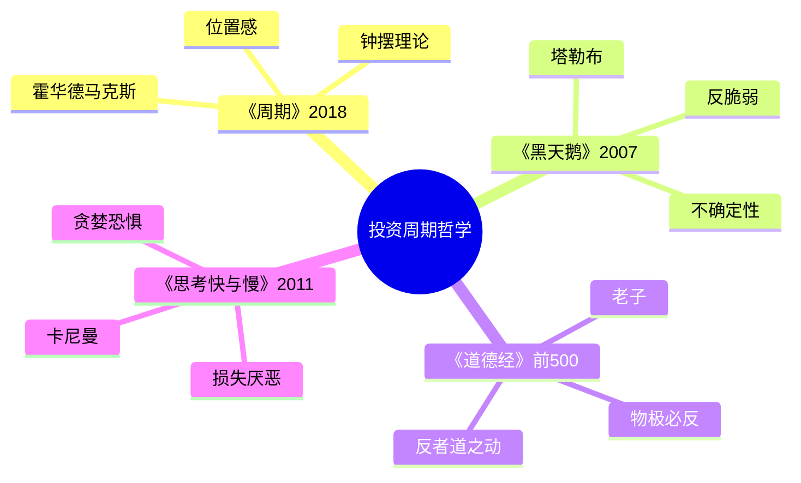

# 《周期》拆解记录

## 这本书要解决什么问题？

**核心困境**：大多数人"高点买入、低点卖出"——不是不聪明，而是不知道自己在哪。

**一句话定位**：
> 投资最难的不是预测未来，而是知道现在处于周期的什么位置。

### 作者站在什么位置说这些话？

| 维度 | 定位 |
|------|------|
| 主领域 | 投资哲学、周期理论、风险管理 |
| 作者背景 | 橡树资本联合创始人，管理资产超千亿美金，穿越多次牛熊 |
| 历史语境 | 2018年出版，巴菲特说"我会第一时间打开霍华德的备忘录" |
| 核心贡献 | 把"周期"这个抽象概念变成可判断、可操作的"位置感"工具 |

### 和其他书有什么关系？

| 关联书籍 | 关联关系 | 共同底层逻辑 |
|----------|----------|--------------|
| [[道德经-老子-拆解记录]] | 规律呼应 | 物极必反 = 均值回归 |
| [[黑天鹅-拆解记录]] | 互补 | 周期可认知 + 黑天鹅不可预测 |
| [[思考快与慢-丹尼尔·卡尼曼-拆解记录]] | 人性基础 | 贪婪恐惧的认知机制 |

### 知识网络图

---

## 作者的核心论点

### 位置感比预测更重要

投资界有一个共识：预测未来是徒劳的。马克斯说，更徒劳的是不知道自己在哪里。大多数人高点买入低点卖出，不是因为笨，是因为不知道自己在周期的什么位置。

> **位置感定律**：知道自己在哪里，比知道要往哪里去更重要。

这打碎了我对"投资需要预测能力"的迷信。以前觉得投资高手是因为能预测未来，现在理解了——投资高手只是知道现在在哪，然后顺势而为。

位置感怎么判断？马克斯给出了具体的工具。

### 钟摆三位置理论：在极端时逆向，在中间时观望

马克斯把市场比喻成钟摆，永远在两个极端之间摆动。三个位置对应三种行动：

极度乐观时，人人都在谈论股票，不买会被嘲笑，"这次不一样"成为主流论调。这是高点，应该卖出。

中间区时，争议不断，有人说好有人说坏。这时候观望，不要急着行动。

极度悲观时，无人问津，股票被骂是骗局，没人愿意碰。这是低点，应该买入。

| 位置 | 特征 | 行动 |
|------|------|------|
| 极度乐观 | 人人谈论 | 卖出 |
| 中间区 | 争议不断 | 观望 |
| 极度悲观 | 无人问津 | 买入 |

> **钟摆定律**：钟摆永远会摆回来。在极端时逆向，在中间时观望，是周期投资的根本法则。

下次遇到"人人都在谈论"的情况，我不会再觉得是机会，而是警惕高点信号。遇到"无人问津"，不再觉得是无聊，而是寻找买入机会。

但为什么钟摆一定会摆回来？

### 周期重复的原因是人性的不变

马克斯的回答很直接：人性不会变。贪婪和恐惧是永恒的，几千年前如此，今天如此，一万年后还是如此。只要人性不变，泡沫和崩盘就会一遍又一遍上演。

每次泡沫破裂前，人们都说"这次不一样"。互联网泡沫时说互联网改变了商业逻辑；房地产泡沫时说土地是稀缺资源；AI泡沫时说AI将改变一切。但每次都一样——钟摆摆到极端，必然会摆回来。

> **人性永恒定律**：周期会重复，不是因为经济规律会重复，而是因为人性不会变。别相信"这次不一样"——每一次都一样。

以前我以为周期会改变，现在理解了——周期会重复不是因为经济规律会重复，而是因为人性不会变。贪婪和恐惧是永恒的，几千年前如此，今天如此，一万年后还是如此。

这和老子两千年前说的"反者道之动"完全一致。物极必反，均值回归，是同一个规律的不同表达。马克斯用投资语言，老子用哲学语言。

知道了位置感、知道了钟摆规律，如何判断现在在哪？

### 情绪+估值双指标：人人谈论等于高点，无人问津等于低点

马克斯给出了一套自检清单。情绪指标：身边人都在谈论这个资产吗？不买会被嘲笑吗？"这次不一样"成为主流论调吗？估值指标：市盈率远高于历史均值吗？价格远超内在价值吗？

判断很简单：4个以上"是"，可能接近高点；4个以上"否"，可能接近低点。

> **情绪判断定律**：当所有人都谈论股票时，是顶部；当无人关心时，是底部。大众的情绪就是位置的坐标。

这个观点打碎了我的一个假设——我以前以为判断位置需要复杂的技术分析，现在理解了：身边人都在谈论就是高点，无人问津就是低点，情绪本身就是坐标。

春节聚会亲戚都在问"买什么基金"，警惕——可能接近顶部。同事聚会没人聊股票都在聊裁员，机会——可能接近底部。出租车司机给你推荐股票，卖出信号。朋友说"股市是骗局再也不碰了"，买入信号。

知道了位置，最难的问题来了：如何逆向行动？

### 逆向是反人性的

投资最大的错误，是高点买入低点卖出——普通人正好相反。为什么？因为逆向是反人性的。高点时，所有人都乐观，你卖出意味着离开热闹的派对，很孤独。低点时，所有人都悲观，你买入意味着在一片骂声中站出来，也很孤独。

马克斯说，克服恐惧的唯一方法是用原则对抗情绪。建立一套系统化的规则，让它代替你的情绪做决策。

> **逆向定律**：投资最难的不是高点卖出低点买入，而是在高点时敢于卖出，在低点时敢于买入。这是反人性的，需要用原则对抗情绪。

这打碎了我对逆向操作的迷信——以为逆向就是买跌卖涨，现在理解了：逆向最难的不是操作，而是心理——在高点时敢于离开热闹的派对，在低点时敢于在一片骂声中站出来。马克斯说，克服恐惧的唯一方法是用原则对抗情绪。

下次听到反对意见想反驳，停一下问自己：我是真的不同意，还是我的恐惧在抢方向盘？

逆向的底气来自哪里？来自一个铁律。

### 均值回归是铁律：极端不可持续，回归是必然

马克斯和老子说的是同一件事。老子：物极必反。马克斯：均值回归。任何极端状态都不可能持续，钟摆必然会回到中点，然后再摆向另一个极端。

这不是预测，是规律。不是"这次会不一样"，是"每次都一样"。区别只是时间——钟摆什么时候摆回来，没人知道；但一定会摆回来，这是确定的。

> **均值回归定律**：极端不可持续，回归是必然。等待，让钟摆自己摆回来。

这个规律提供了逆向的底气。高点卖出不是因为预测会跌，是因为知道极端不可持续。低点买入不是因为预测会涨，是因为知道钟摆会摆回来。

下次遇到极端行情，我不会再怀疑"这次不一样"，而是相信均值回归的铁律——极端不可持续，钟摆必然会摆回来。区别只是时间，但一定会摆回来。

---

## 这本书的局限

| 批评点 | 谁在批评 | 怎么说 | 实际情况 |
|--------|---------|--------|---------|
| 方法过于定性 | 专业投资者 | "位置感"是定性判断，难以量化 | 确实缺乏精确指标，但定性判断本身有价值 |
| 无法预测时间 | 评论者 | 知道会回归，但不知道什么时候 | 这正是马克斯的观点：不预测时间，只判断位置 |
| 黑天鹅例外 | 塔勒布学派 | 黑天鹅事件可能打破周期规律 | 马克斯承认周期可认知，但黑天鹅不可预测，两者互补 |
| 适用范围有限 | 学术界 | 周期理论在新兴市场效果不确定 | 新兴市场波动更大，但钟摆逻辑依然成立 |

**一句话总结局限性**：
> 马克斯告诉你钟摆会摆回来，但不告诉你什么时候。这个时间缺口，是周期理论最大的留白。

---

## 最值得记住的话

**原书说的**：
1. "投资最难的不是预测未来，而是知道现在处于周期的什么位置。"
2. "周期会重复，不是因为经济规律会重复，而是因为人性不会变。"
3. "投资中最难的，是高点时敢于卖出，低点时敢于买入。"

**翻译成人话**：
1. 知道自己在哪里，比知道要往哪里去更重要
2. 别相信"这次不一样"——每一次都一样
3. 在高点时，所有人都在买入；在低点时，所有人都在卖出
4. 投资最大的错误：在高点买入，在低点卖出——普通人正好相反
5. 高点特征：人人谈论、不买被嘲笑、"这次不一样"
6. 低点特征：无人问津、人人喊骂、"再也不碰了"
7. 钟摆永远会摆回来——等待，别急

---

## 讲给没读过的人听

你有没有发现，每次股市大涨的时候你冲进去，大跌的时候你跑出来？马克斯说，你不是笨，你是不知道自己在哪里。

市场像一个钟摆，永远在乐观和悲观之间摆动。高点的时候，人人都在谈论，不买会被嘲笑，"这次不一样"成为主流。低点的时候，无人问津，股票被骂是骗局。你需要做的，就是判断自己在哪里。

为什么钟摆一定会摆回来？因为人性不会变。贪婪和恐惧是永恒的。几千年前如此，今天如此，一万年后还是如此。

下次遇到"人人都在谈论"，别觉得是机会，那是高点的信号。遇到"无人问津"，别觉得是无聊，那是低点的机会。

一句话：知道自己在哪，比预测未来更重要。

---

## 用来检验理解的问题

**基础回忆**：
1. Q: 马克斯把市场比喻成什么？
   A: 钟摆，永远在两个极端之间摆动。

2. Q: 钟摆三个位置分别对应什么行动？
   A: 极度乐观→卖出；中间区→观望；极度悲观→买入。

3. Q: 为什么周期会重复？
   A: 因为人性不会变。贪婪和恐惧是永恒的。

**理解验证**：
1. Q: 马克斯和老子说的有什么共同点？
   A: 马克斯说均值回归，老子说物极必反。同一规律的不同表达。

2. Q: 情绪指标自检清单的核心问题是什么？
   A: 身边人都在谈论？不买会被嘲笑？"这次不一样"？

3. Q: 为什么逆向是反人性的？
   A: 高点卖出意味着离开热闹的派对，很孤独；低点买入意味着在一片骂声中站出来，也很孤独。

**实际应用**：
1. Q: 春节聚会亲戚都在问"买什么基金"，根据马克斯的理论，你应该怎么做？
   A: 警惕，可能接近顶部。高点信号是"人人都在谈论"。

**深度分析**：
1. Q: 马克斯和塔勒布的关系是什么？
   A: 马克斯说周期可认知，钟摆会摆回来。塔勒布说黑天鹅不可预测，极端事件可能打破一切。两者互补：周期理论告诉你大概率会发生什么，黑天鹅理论告诉你小概率事件也可能致命。

---

## 和其他书的对话

老子两千年前说"反者道之动"，马克斯2018年说"均值回归"。物极必反，钟摆会摆回来。一个是哲学语言，一个是投资语言，说的是同一个规律。读完马克斯再读老子，会发现古老智慧和现代投资的惊人共鸣。

塔勒布和马克斯是互补关系。马克斯告诉你钟摆会摆回来，塔勒布告诉你钟摆可能被黑天鹅砸断。周期可认知，但黑天鹅不可预测。马克斯教你大概率怎么应对，塔勒布教你小概率怎么活着。两者结合，才是完整的风险管理。

黄仁宇的《万历十五年》和《中国大历史》讲的是政治钟摆。马克斯讲的是市场钟摆。投资市场的钟摆源于人性永恒（贪婪恐惧），政治系统的钟摆源于制度缺陷（自由vs控制）。钟摆效应的普遍性——市场有钟摆，政治也有钟摆。

赫拉利的三简史系列提出了一个挑战：算法会不会改变人性？马克斯说周期源于人性不变，赫拉利说算法可能让人性失效。如果算法真的改变了人性，周期规律可能也要重写。这是马克斯理论的最大挑战。

---

*拆解日期：2026-02-15*
*下次回访：1周后回顾「讲给没读过的人听」和「检验问题」*