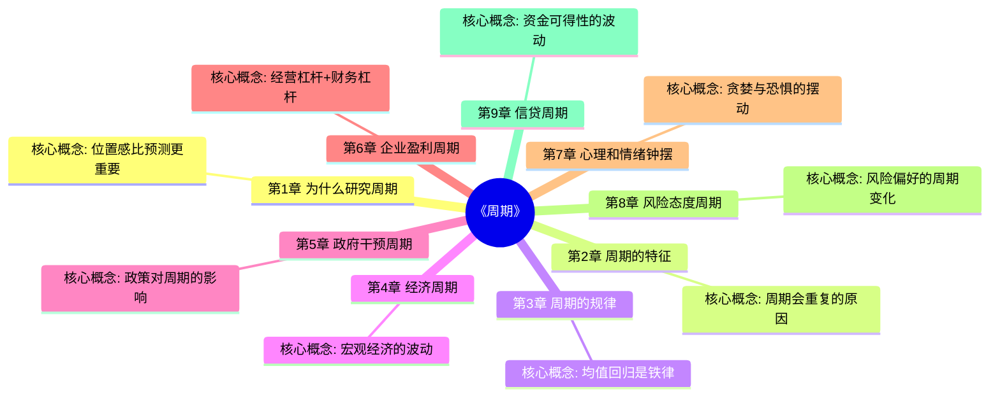

# 《周期》章节导航

## 📊 基本信息

| 项目 | 内容 |
|------|------|
| 书名 | 《周期》（Mastering the Market Cycle） |
| 作者 | 霍华德·马克斯（Howard Marks） |
| 总章节 | 9个核心周期 |
| 已拆解 | 9章 |
| 整书拆解 | [[周期-拆解记录]] |

---

## 🗺️ 章节结构图

---

## 📈 拆解进度

| 序号 | 章节 | 核心概念 | 状态 | 链接 |
|------|------|----------|------|------|

**进度**: 9/9 (100%)

⭐ = 优先拆解（核心章节）

---

## 🎯 拆解优先级

根据整书拆解记录，优先拆解以下章节：

### 第一优先级（核心概念）
1. **第7章 心理和情绪钟摆** - 最核心的周期，所有周期的基础
2. **第1章 为什么研究周期** - 建立位置感的认知框架
3. **第3章 周期的规律** - 均值回归的底层逻辑

### 第二优先级（应用层面）
4. 第9章 信贷周期 - 资金周期的实际应用
5. 第8章 风险态度周期 - 风险管理的关键

### 第三优先级（延伸阅读）
6. 第4-6章 各类具体周期 - 经济/政府/企业

---

## 🔗 快速跳转

### 按章节跳转
- [[第1章-为什么研究周期]]
- [[第2章-周期的特征]]
- [[第3章-周期的规律]]
- [[第4章-经济周期]]
- [[第5章-政府干预周期]]
- [[第6章-企业盈利周期]]
- [[第7章-心理和情绪钟摆]]
- [[第8章-风险态度周期]]
- [[第9章-信贷周期]]

### 相关资源
- [[周期-拆解记录]] - 整书拆解笔记
- [[黑天鹅-拆解记录]] - 塔勒布不确定性理论
- [[道德经-老子-拆解记录]] - 物极必反哲学呼应
- [[投资最重要的事-霍华德·马克斯-拆解记录]] - 作者前作

---

## 📝 章节拆解说明

每个章节拆解将包含：
- 📍 **章节定位**：在全书中回答的问题
- 🎯 **核心观点**：三层提取（案例→机制→规律）
- 💬 **降维翻译**：原文→中学生能懂→奶奶能懂
- ✨ **金句库**：原书/降维/二创金句
- 🔗 **当下映射**：财富/职场/生活应用
- 🕸️ **章节关联**：前后章+整书+跨书关联
- ❓ **问答设计**：5-10个认知层次问题

---

*创建日期: 2026-02-25*
