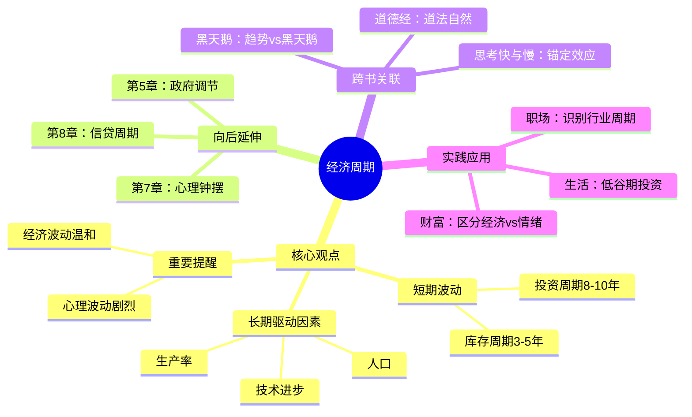

# 第4章 经济周期

## 📍 章节定位

**全书位置**：本章是周期分析的基础章节，解释经济层面的周期波动规律。

**章节序列**：第4章，属于"周期的各种类型"系列，承接前文概念铺垫，引出后续信贷周期和心理周期。

**一句话定位**：
> 经济周期是周期分析的基础层，但马克斯提醒我们：经济周期波动相对温和，真正剧烈的是心理和信贷周期。

---

## 🎯 核心观点（三层提取）

### 观点1：经济周期的长期驱动因素

| 层次 | 内容 |
|------|------|

**降维翻译**：
- **原文**：经济周期的长期驱动因素包括人口增长、生产率提升和技术进步
- **降维**：长期看，人变多了、技术变好了、效率变高了，经济自然会涨
- **类比**：就像一艘大船——引擎越来越好（技术）、水手越来越多（人口）、航线越来越熟（生产率），船自然会越开越快

---

### 观点2：短期经济波动的两个周期

| 周期类型 | 持续时间 | 驱动因素 | 典型表现 |
|----------|----------|----------|----------|
| **库存周期** | 3-5年 | 企业补库存/去库存 | 通胀上行时企业囤货，通胀下行时企业清库存 |
| **企业投资周期** | 8-10年 | 企业扩张/收缩产能 | 经济好时大举投资，经济差时削减资本开支 |

**降维翻译**：
- **原文**：短期经济波动主要由库存周期和企业投资周期驱动
- **降维**：企业囤货、建厂、裁员，这些日常决策造成经济忽高忽低
- **类比**：就像商店——生意好时疯狂进货、扩张门店，生意差时清仓甩卖、关门歇业

**深入理解**：

| 层次 | 内容 |
|------|------|

---

### 观点3：经济周期的局限性——不是主角

| 层次 | 内容 |
|------|------|

**降维翻译**：
- **原文**：经济周期波动相对温和，真正剧烈的是心理和信贷周期
- **降维**：经济只走了1米，情绪能跑100米——别被经济数据迷惑，看情绪更管用
- **类比**：就像电影——背景音乐只是氛围，剧情才是重点

**马克斯的核心提醒**：

| 误区 | 真相 |
|------|------|
| 盯着GDP预测股市 | GDP波动小，股市波动大，两者不完全同步 |
| 经济衰退=股市崩盘 | 2008年GDP只降2.5%，股市却腰斩——心理因素放大了波动 |
| 经济复苏=股市上涨 | 股市往往提前反映预期，经济数据出来时行情已经走完 |

---

### 观点4：长期趋势vs短期波动的区别

| 层次 | 内容 |
|------|------|

**降维翻译**：
- **原文**：经济有长期趋势和短期波动，不要把短期波动误判为趋势改变
- **降维**：一年有四季，但总体在变暖——别把冬天当成冰河时代
- **类比**：就像股票K线——长期看是向上的趋势线，短期看是上蹿下跳的波动

---

## 💬 金句库

### 原书金句
> "经济周期波动相对温和，真正剧烈的是心理和信贷周期。"

> "长期因素（人口、生产率、技术）决定经济的趋势，短期因素（库存、投资）造成经济的波动。"

> "不要把短期波动误判为长期趋势的改变。"

> "GDP波动通常在±3%以内，但股市可以涨跌50%以上——中间的差值就是情绪。"

### 降维金句
> "经济只走了1米，情绪能跑100米——别被GDP数据迷惑。"

> "库存周期3-5年，投资周期8-10年——知道这些就够了，别想太复杂。"

> "经济周期是背景板，心理周期才是剧情。"

> "长期看涨，短期看波动——别把冬天当成冰河时代。"

## 🔗 当下映射

### 💰 财富应用

| 场景 | 具体行动 | 预期效果 | 风险提示 |
|------|----------|----------|----------|
| 宏观判断 | 区分"经济波动"和"趋势改变"，不因短期衰退过度悲观 | 保持长期投资定力 | 极端事件（战争、瘟疫）可能改变趋势 |
| 行业配置 | 关注库存周期——补库存阶段配置周期股，去库存阶段配置防御股 | 提高行业轮动收益 | 周期判断需要经验和数据支撑 |
| 股市投资 | 知道经济波动有限，情绪波动无限——在情绪极端时逆向 | 获得超额收益 | 逆向需要勇气和资金 |

### 💼 职场应用

| 场景 | 具体行动 | 所需能力 | 适用职级 |
|------|----------|----------|----------|
| 职业规划 | 区分行业短期波动vs长期趋势，不被短期低谷吓跑 | 行业分析能力 | 中层以上 |
| 创业决策 | 避开行业投资周期的高点（竞争激烈、估值泡沫） | 周期判断能力 | 创业者 |
| 跳槽时机 | 在行业去产能末期进入（供给出清、机会增多） | 信息收集能力 | 全职级 |

### 🏠 生活应用

| 场景 | 具体行动 | 可行性 | 见效时间 |
|------|----------|--------|----------|
| 消费决策 | 在经济周期低谷期购买大件（车企清库存、房产降价） | 高 | 立即 |
| 心态管理 | 知道"衰退是暂时的"，在低谷期保持信心 | 高 | 长期 |
| 教育投资 | 在就业市场低谷期进修，为复苏做准备 | 中 | 中长期 |

### 72小时应用计划
1. **今天**：判断一个你关注的行业，当前是补库存还是去库存阶段？
2. **明天**：观察最近的经济新闻，区分哪些是"短期波动"、哪些是"趋势改变"
3. **本周**：用"经济vs情绪"的视角重新审视一次投资决策

---

## 🕸️ 章节关联

### 向上：整书关联
- **核心问题**：本章回答"经济周期是什么"——它是背景板，不是主角
- **论证位置**：是周期类型分析的第一个层次，引出更重要的心理周期和信贷周期

### 横向：章节序列

| 章节编号 | 章节标题 | 关联类型 | 连接描述 |
|----------|----------|----------|----------|
| 第1章 | 为什么研究周期 | 基础 | 第1章建立位置感，本章分析经济层面的位置信号 |
| 第5章 | 政府对周期的调节 | 延伸 | 政府如何通过政策干预经济周期 |
| 第7章 | 心理和情绪钟摆 | 深化 | 经济周期是"背景"，心理周期是"放大器" |
| 第8章 | 信贷周期 | 深化 | 经济周期驱动信贷周期，信贷周期反过来放大经济波动 |

### 跨书关联

| 书籍 | 概念 | 关系 | 备注 |
|------|------|------|------|
| [[黑天鹅-塔勒布-拆解记录]] | 趋势vs波动 | 互补 | 塔勒布强调趋势可能被黑天鹅打断，马克斯强调趋势相对稳定 |
| [[道德经-老子-拆解记录]] | 道法自然 | 呼应 | 经济有自然规律，人为干预只能缓解、不能消除 |
| [[思考快与慢-丹尼尔·卡尼曼-拆解记录]] | 锚定效应 | 深化 | 人们容易把最近的经济数据当成未来趋势 |

### 关联可视化

---

## ❓ 问答设计

### Q1: 经济周期的长期驱动因素有哪些？（记忆型）
**认知层次**: 记忆
**难度**: 低
**答案要点**:
- 人口增长：决定劳动力供给和消费需求
- 生产率提升：决定单位产出效率
- 技术进步：决定上限突破能力
- 这三者变化缓慢，决定长期趋势

### Q2: 库存周期和投资周期有什么区别？（理解型）
**认知层次**: 理解
**难度**: 中
**答案要点**:
- 库存周期3-5年：企业补库存/去库存，波动较快
- 投资周期8-10年：企业扩产/收缩产能，波动较慢
- 两者都是短期波动，但时间尺度不同
- 两者都会造成经济的周期性波动

### Q3: 为什么马克斯说"经济周期波动相对温和"？（理解型）
**认知层次**: 理解
**难度**: 中
**答案要点**:
- GDP波动通常在±3%以内
- 但股市可以涨跌50%以上
- 中间的差值是情绪和信贷的放大效应
- 所以经济周期只是"背景板"，心理周期才是"剧情"

### Q4: 如何区分"短期波动"和"趋势改变"？（应用型）
**认知层次**: 应用
**难度**: 中
**答案要点**:
- 短期波动：由库存、投资、情绪驱动，1-3年内会恢复
- 趋势改变：需要战争、革命、技术革命等极端事件
- 大多数衰退是短期波动，不是趋势改变
- 判断标准：看长期因素（人口、技术）是否发生根本变化

### Q5: 为什么股市波动比经济波动大这么多？（分析型）
**认知层次**: 分析
**难度**: 高
**答案要点**:
- 经济本身相对稳定（生产和消费变化慢）
- 但投资者的心理会剧烈波动（贪婪和恐惧）
- 信贷会放大波动（加杠杆涨得更多，去杠杆跌得更多）
- 所以"经济跌3%，情绪可能跌80%"

### Q6: 本章与第7章"心理和情绪钟摆"有什么关系？（分析型）
**认知层次**: 分析
**难度**: 高
**答案要点**:
- 第4章分析经济周期（客观层面）
- 第7章分析心理周期（主观层面）
- 经济周期是"输入"，心理周期是"放大器"
- 两者叠加，造成市场的剧烈波动
- 马克斯认为后者比前者更重要

### Q7: 如何用"库存周期"指导投资决策？（应用型）
**认知层次**: 应用
**难度**: 高
**答案要点**:
- 补库存阶段：企业预期需求上升，利好周期股
- 去库存阶段：企业预期需求下降，利好防御股
- 判断方法：观察PPI、库存数据、企业财报中的库存变化
- 注意：周期判断需要经验和数据，不能只凭感觉

### Q8: 经济周期理论有什么局限性？（综合型）
**认知层次**: 综合
**难度**: 高
**答案要点**:
- 不能预测具体时点：只知道"会波动"，不知道"何时波动"
- 黑天鹅事件可能打断周期：战争、瘟疫、技术革命
- 政府干预可能改变周期形态：QE、财政刺激
- 马克斯的提醒：经济周期只是"背景"，别过度关注

---
