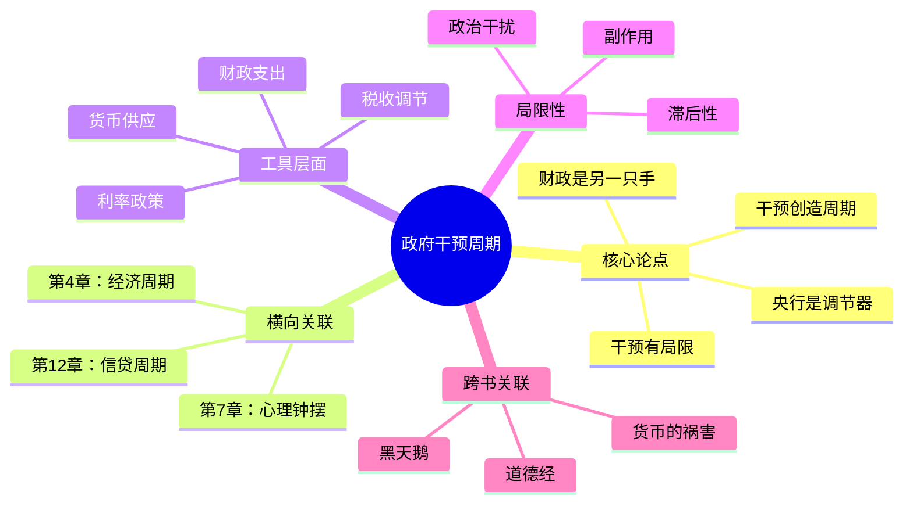

# 第5章 政府干预周期

## 📍 章节定位

**全书位置**：本章连接"基础周期"与"市场周期"，解释政府如何通过政策工具影响经济周期。

**章节序列**：第5章，承上启下——承接经济周期（第4章），启下信贷周期（第12章）。

**一句话定位**：
> 政府干预是周期的"调节器"——可以缓解波动，但不能消除波动，有时还会制造新的波动。

---

## 🎯 核心观点（三层提取）

### 观点1：央行是周期的主要调节者

| 层次 | 内容 |
|------|------|
| 📖 **表层（案例）** | 美联储在2008年金融危机时将利率降至接近零，同时启动量化宽松；2022年为抑制通胀又快速加息。中国央行在经济下行时降准降息，在过热时收紧流动性。 |
| ⚙️ **中层（机制）** | 央行通过两大工具调节周期：一是**利率政策**——降息刺激借贷和消费，加息抑制过热；二是**货币供应**——通过公开市场操作、存款准备金率等控制市场流动性。 |
| 🔮 **底层（规律）** | 央行的核心使命是"逆周期调节"——在经济下行时托底，在经济过热时降温。但由于政策有滞后性，往往"出手时已经晚了"。 |

**降维翻译**：
- **原文**：央行通过利率和货币供应来调节经济周期
- **降维**：央行就像经济的"空调"——太热了开冷风（加息），太冷了开热风（降息）
- **类比**：就像开车——油门踩太猛会超速，刹车踩太急会甩尾，关键是要平稳

---

### 观点2：财政政策是政府的另一只手

| 层次 | 内容 |
|------|------|
| 📖 **表层（案例）** | 2020年疫情期间，各国政府大规模发放补贴、减免税收、增加基建支出。中国推出"四万亿"刺激计划（2008年），美国推出多轮财政刺激法案。 |
| ⚙️ **中层（机制）** | 财政政策通过两条路径影响周期：一是**政府支出**——基建、补贴、政府采购直接增加需求；二是**税收政策**——减税增加企业和居民可支配收入，刺激消费和投资。 |
| 🔮 **底层（规律）** | 财政政策具有"乘数效应"——政府花1块钱可能带动经济多增长几块钱。但财政刺激也有代价：增加政府债务，可能引发通胀或债务危机。 |

**降维翻译**：
- **原文**：政府通过支出和税收政策影响经济周期
- **降维**：政府花钱买东西，经济就热；政府少收税，大家手里钱多就会多花
- **类比**：就像家庭——爸爸多给零花钱，孩子就敢多买零食；爸爸省着给，孩子就得精打细算

---

### 观点3：干预的三大局限

| 局限 | 具体表现 | 根本原因 |
|------|----------|----------|
| **滞后性** | 政策制定需要时间，执行需要时间，见效更需要时间 | 信息收集、决策流程、传导机制都需要时间 |
| **副作用** | 长期低利率导致资产泡沫，大规模刺激导致债务累积 | 没有免费的午餐，刺激现在就是透支未来 |
| **政治干扰** | 政客倾向于在选举前刺激经济，在选举后收紧 | 央行独立性难以完全保证，财政政策受政治周期影响 |

**降维翻译**：
- **原文**：政府干预存在滞后性、副作用和政治干扰
- **降维**：政策像吃药——药效有延迟，副作用难免，医生还可能被病人塞红包
- **类比**：就像家长管孩子——管轻了不听，管重了逆反，而且还要考虑孩子的心情和面子

---

### 观点4：干预可以缓解但不能消除周期

| 层次 | 内容 |
|------|------|
| 📖 **表层（案例）** | 1929年大萧条后，各国加强政府干预，经济周期波动幅度确实减小了，但周期依然存在——1970年代滞胀、2000年互联网泡沫、2008年金融危机、2020年疫情冲击。 |
| ⚙️ **中层（机制）** | 政策工具只能"削峰填谷"——在经济过热时降温，在经济衰退时托底。但政策的力度、时机、方向都难以精准把控，而且干预本身也会产生新的周期（如政策周期）。 |
| 🔮 **底层（规律）** | 周期的根源是人性，而政策是由人制定的——政策制定者同样受心理和情绪影响，同样会过度乐观或过度悲观。用人的干预来消除人的周期，本身就是一个悖论。 |

**降维翻译**：
- **原文**：政府干预可以缓解周期波动，但不能消除周期
- **降维**：政策能给周期装上"减震器"，但没法把坑洼的路变成平地
- **类比**：就像感冒——吃药可以减轻症状，但不能让你永远不感冒；增强免疫力才是根本

---

### 观点5：干预本身也会创造周期

| 层次 | 内容 |
|------|------|
| 📖 **表层（案例）** | 2008年后的长期低利率环境催生了资产泡沫（美股长牛、房价上涨）；2020年的大规模财政刺激引发了2022年的全球通胀。中国"四万亿"后的产能过剩和地方债务问题。 |
| ⚙️ **中层（机制）** | 每一次政策干预都会产生"后遗症"：降息刺激的借贷会变成未来的债务负担；财政刺激的支出会变成未来的财政赤字；量化宽松释放的流动性会变成未来的通胀压力。 |
| 🔮 **底层（规律）** | 经济是 interconnected system（互联系统），你按下一个按钮，会在意想不到的地方引发反应。政策的"意外后果"往往比"预期后果"更深远。 |

**降维翻译**：
- **原文**：政府干预会产生新的周期性波动
- **降维**：按下葫芦浮起瓢——解决了这个问题，又冒出来那个问题
- **类比**：就像打地鼠——打掉一只，另一只又冒出来，有时候还会打到自己

---

## 💬 金句库

### 原书金句
> "央行试图通过调节利率和货币供应来平抑经济周期，但政策往往来得太晚、太猛或太弱。"

> "财政政策是政府的另一只手，但它同样受制于政治周期和官僚效率。"

> "政府可以缓解周期，但不能消除周期——因为周期的根源是人性，而政策也是由人制定的。"

> "每一次政策干预都会留下痕迹，今天的刺激就是明天的负担。"

> "用人的干预来消除人的周期，就像揪着自己的头发把自己提起来。"

### 降维金句
> "央行是经济的空调——太热开冷风，太冷开热风，但温度调节有延迟。"

> "政策像抗生素——能治病，但不能当保健品天天吃。"

> "干预的悖论：用人的智慧对抗人的愚蠢，但制定政策的人同样会犯傻。"

## 🔗 当下映射

### 💰 财富应用

| 场景 | 具体行动 | 预期效果 | 风险提示 |
|------|----------|----------|----------|
| 判断利率周期 | 关注央行政策信号，在降息周期增加久期，在加息周期缩短久期 | 债券投资收益优化 | 政策转向可能比预期更快 |
| 股票投资 | 在货币宽松期配置成长股，在紧缩期配置价值股 | 适应不同周期环境 | 政策对股市影响有滞后性 |
| 房产决策 | 利率低位时考虑锁定长期贷款，利率高位时观望 | 降低融资成本 | 房产周期长，需综合考虑 |

### 💼 职场应用

| 场景 | 具体行动 | 所需能力 | 适用职级 |
|------|----------|----------|----------|
| 行业分析 | 判断目标行业是否受政策大力支持或打压 | 政策解读能力 | 中层以上 |
| 职业规划 | 在政策红利期积极进取，在政策收缩期稳健防守 | 周期感知能力 | 全职级 |
| 创业决策 | 避免进入政策打压的行业，寻找政策支持的赛道 | 政策敏感度 | 创业者 |

### 🏠 生活应用

| 场景 | 具体行动 | 可行性 | 见效时间 |
|------|----------|--------|----------|
| 贷款决策 | 在低利率时期锁定长期贷款（如房贷） | 高 | 立即 |
| 消费规划 | 在财政刺激期（如消费券发放）增加大额消费 | 中 | 短期 |
| 资产配置 | 根据货币政策调整现金、债券、股票的比例 | 中 | 中长期 |

### 72小时应用计划
1. **今天**：查阅最近一次央行政策会议纪要，了解当前货币政策立场
2. **明天**：判断自己持有的资产（股票/房产/债券）对利率变化的敏感度
3. **本周**：关注一项财政政策（如减税、补贴）对你的行业或收入的影响

---

## 🕸️ 章节关联

### 向上：整书关联
- **核心问题**：本章回答"政府能做什么"——可以调节，但无法消除
- **论证位置**：连接"周期为什么发生"（第7章心理钟摆）与"周期如何传导"（第12章信贷周期）

### 横向：章节序列

| 章节编号 | 章节标题 | 关联类型 | 连接描述 |
|----------|----------|----------|----------|
| 第4章 | 经济周期 | 前置 | 经济周期是政府干预的对象 |
| 第7章 | 心理和情绪钟摆 | 深化 | 政策制定者也受心理钟摆影响 |
| 第12章 | 信贷周期 | 延伸 | 央行政策通过信贷传导到实体经济 |
| 第10章 | 如何应对周期 | 落地 | 理解政府干预的局限，更好制定应对策略 |

### 跨书关联

| 书籍 | 概念 | 关系 | 备注 |
|------|------|------|------|
| [[货币的祸害-拆解记录]] | 货币政策 | 深化 | 弗里德曼对央行干预的经典批判 |
| [[宏观经济学-拆解记录]] | IS-LM模型 | 工具 | 分析财政和货币政策效果的经典框架 |
| [[黑天鹅-拆解记录]] | 政策失误 | 互补 | 政策干预的意外后果往往是黑天鹅 |
| [[道德经-老子-拆解记录]] | 无为而治 | 呼应 | 老子主张"治大国若烹小鲜"，少干预 |

### 关联可视化

---

## ❓ 问答设计

### Q1: 央行调节经济周期的主要工具有哪些？（记忆型）
**认知层次**: 记忆
**难度**: 低
**答案要点**:
- 利率政策：通过调整基准利率影响借贷成本
- 货币供应：通过公开市场操作、存款准备金率等控制流动性
- 前瞻指引：通过沟通未来政策意图影响市场预期

### Q2: 财政政策和货币政策有什么区别？（理解型）
**认知层次**: 理解
**难度**: 中
**答案要点**:
- 执行主体不同：财政政策由政府（财政部）执行，货币政策由央行执行
- 工具不同：财政政策用支出和税收，货币政策用利率和货币供应
- 效果不同：财政政策直接增加需求，货币政策通过影响借贷间接起作用
- 时效不同：财政政策决策周期长，货币政策可以更快调整

### Q3: 为什么说政府干预存在"滞后性"？（理解型）
**认知层次**: 理解
**难度**: 中
**答案要点**:
- 认识滞后：发现问题需要时间
- 决策滞后：制定政策需要讨论和审批
- 执行滞后：政策落地需要时间
- 传导滞后：政策效果传导到实体经济需要时间
- 结果：当政策生效时，经济状况可能已经变化

### Q4: 政府干预为什么不能消除周期？（分析型）
**认知层次**: 分析
**难度**: 高
**答案要点**:
- 周期的根源是人性，政策由人制定——制定者同样受情绪影响
- 政策工具有限，难以精准把控力度和时机
- 干预本身会产生新的周期（如政策周期）
- 信息不对称——政府无法获得完全信息
- 用人的干预消除人的周期，是一个悖论

### Q5: 政府干预的"意外后果"有哪些例子？（分析型）
**认知层次**: 分析
**难度**: 高
**答案要点**:
- 长期低利率导致资产泡沫（2008年后美股长牛）
- 大规模财政刺激导致通胀（2020年后的全球通胀）
- 产能刺激导致过剩（中国"四万亿"后的产能过剩）
- 救助金融机构带来道德风险（"大而不能倒"）

### Q6: 如何利用政府政策周期做投资决策？（应用型）
**认知层次**: 应用
**难度**: 中
**答案要点**:
- 关注央行政策信号，判断当前处于宽松还是紧缩周期
- 在降息周期增加债券久期，在加息周期缩短久期
- 在财政刺激期关注受益行业，在财政收缩期规避依赖政府支出的行业
- 理解政策有滞后性，不要追着政策跑，要提前布局

### Q7: "治大国若烹小鲜"对政府干预有什么启示？（综合型）
**认知层次**: 综合
**难度**: 高
**答案要点**:
- "烹小鲜"需要火候和耐心，频繁翻动反而会破坏
- 政府干预也应该适度，过于频繁的干预会打乱市场预期
- 有时候"不作为"比"乱作为"更好
- 政策应该追求"四两拨千斤"的效果，而非大水漫灌
- 但在危机时刻（如2008年、2020年），适度干预仍是必要的

### Q8: 央行独立性的重要性是什么？现实中能做到吗？（评价型）
**认知层次**: 评价
**难度**: 高
**答案要点**:
- 重要性：避免政治干扰，防止政客为短期选情牺牲长期稳定
- 现实挑战：央行行长由政府任命，完全独立很难
- 案例对比：美联储独立性相对较强，一些国家央行受政府影响较大
- 结论：独立性是程度问题，不是有或无的问题

---
