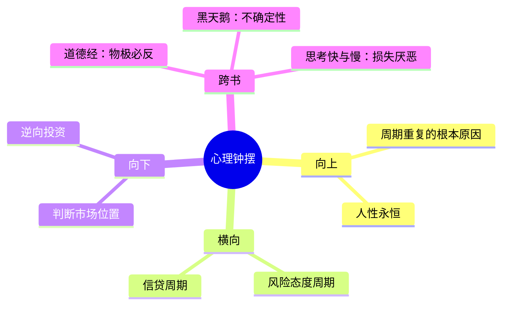

# 第7章 心理和情绪钟摆

## 📍 章节定位

**全书位置**：本章是全书的核心章节，回答"周期为什么会重复"的根本问题。

**章节序列**：第7章，属于核心概念层，是所有其他周期的基础。

**一句话定位**：
> 心理和情绪钟摆是所有周期的底层驱动力——因为人性永恒，所以周期重复。

---

## 🎯 核心观点（三层提取）

### 观点1：钟摆永远在摆动

| 层次 | 内容 |
|------|------|

**降维翻译**：
- **原文**：投资者的心理和情绪在乐观与悲观之间周期性摆动
- **降维**：市场情绪像钟摆，今天极度乐观，明天可能极度悲观
- **类比**：就像海盗船，一会儿荡到高空（乐观），一会儿荡到低谷（悲观），永远不会停在中间

---

### 观点2：钟摆的两个极端

| 极端位置 | 特征 | 典型行为 |
|----------|------|----------|
| **极度乐观** | 人人谈论、不买被嘲笑、"这次不一样" | 追涨、加杠杆、忽视风险 |
| **极度悲观** | 无人问津、买了被嘲笑、"永远回不去了" | 割肉、逃离市场、过度避险 |

**降维翻译**：
- **原文**：在极端乐观时，所有利好都被放大，所有利空都被忽视；在极端悲观时恰恰相反。
- **降维**：高点时，好消息满天飞，坏消息没人信；低点时，坏消息满天飞，好消息没人信
- **类比**：就像聚会——在高潮时大家都说"再来一杯"，在散场时没人愿意留下

---

### 观点3：钟摆在中间停留的时间最短

| 层次 | 内容 |
|------|------|

**降维翻译**：
- **原文**：钟摆在两个极端之间摆动，经过中点的时间最短
- **降维**：市场很难维持"刚刚好"的状态——不是太贵就是太便宜
- **类比**：就像荡秋千，在最高点和最低点停得最久，在中间"嗖"的一下就过去了

---

### 观点4：知道钟摆位置比预测方向更重要

| 层次 | 内容 |
|------|------|

**降维翻译**：
- **原文**：我们无法预测钟摆何时会反转，但我们可以判断它目前处于什么位置
- **降维**：别猜明天涨还是跌，先搞清楚现在是在天上还是地上
- **类比**：就像钓鱼——不知道鱼什么时候咬钩，但知道在鱼多的地方下竿

---

## 💬 金句库

### 原书金句
> "投资者的心理和情绪在乐观与悲观之间摆动，就像钟摆一样——永远不会停在理性的中间位置。"

> "在极端乐观时，投资者只看到利好，忽视风险；在极端悲观时，投资者只看到利空，忽视机会。"

> "我们无法预测钟摆何时反转，但我们可以判断钟摆目前的位置。"

### 降维金句
> "市场情绪像钟摆，今天乐观到天上，明天可能悲观到地下。"

> "高点特征：人人谈论，不买被嘲笑；低点特征：无人问津，买了被嘲笑。"

> "知道自己在哪里，比知道要去哪里更重要。"

## 🔗 当下映射

### 💰 财富应用

| 场景 | 具体行动 | 预期效果 | 风险提示 |
|------|----------|----------|----------|
| 判断股市位置 | 用"人人谈论"指标判断当前情绪极端 | 避免在高点追涨、在低点割肉 | 极端可以持续很久 |
| 投资决策 | 在极度悲观时加仓，在极度乐观时减仓 | 提高长期收益 | 需要足够的耐心和纪律 |

### 💼 职场应用

| 场景 | 具体行动 | 所需能力 | 适用职级 |
|------|----------|----------|----------|
| 职业选择 | 在行业极度悲观时进入，在极度乐观时谨慎 | 行业判断能力 | 中层以上 |
| 跳槽决策 | 判断公司/行业当前处于周期的什么位置 | 信息收集能力 | 全职级 |

### 🏠 生活应用

| 场景 | 具体行动 | 可行性 | 见效时间 |
|------|----------|--------|----------|
| 房产决策 | 判断当地房市情绪是否过热/过冷 | 高 | 长期（3-5年） |
| 消费决策 | 在打折季购买大件商品（情绪钟摆应用） | 高 | 立即 |

### 72小时应用计划
1. **明天**：观察身边人对当前市场的情绪（乐观/悲观/中立）
2. **本周**：用"人人谈论"指标判断一个你关注的投资品类
3. **本周**：记录3个"钟摆位置"的观察案例

---

## 🕸️ 章节关联

### 向上：整书关联
- **核心问题**：本章回答"周期为什么会重复"——因为人性永恒
- **论证位置**：是整书的核心章节，所有其他周期（经济周期、信贷周期等）都建立在本章基础上

### 横向：章节序列

| 章节编号 | 章节标题 | 关联类型 | 连接描述 |
|----------|----------|----------|----------|
| 第1章 | 为什么研究周期 | 铺垫 | 第1章提出"位置感"，本章解释"位置的成因" |
| 第8章 | 风险态度周期 | 深化 | 风险态度是心理钟摆的具体表现 |
| 第9章 | 信贷周期 | 延伸 | 信贷松紧反映银行的心理钟摆 |

### 跨书关联

| 书籍 | 概念 | 关系 | 备注 |
|------|------|------|------|
| [[黑天鹅-拆解记录]] | 不确定性 | 互补 | 塔勒布强调不可预测，马克斯强调位置可判断 |
| [[道德经-老子-拆解记录]] | 物极必反 | 呼应 | 老子的"反者道之动"与钟摆理论同一逻辑 |
| [[思考快与慢]] | 损失厌恶 | 深化 | 卡尼曼用心理学解释恐惧为何比贪婪更强烈 |

### 关联可视化

---

## ❓ 问答设计

### Q1: 为什么周期会重复？（记忆型）
**认知层次**: 记忆
**难度**: 低
**答案要点**:
- 周期重复的根本原因是人性永恒
- 贪婪与恐惧是人类的本能，不会随时间改变
- 只有人性改变，周期才会停止重复

### Q2: 钟摆在中间停留时间最短，这意味着什么？（理解型）
**认知层次**: 理解
**难度**: 中
**答案要点**:
- "合理"只是瞬间过渡状态
- 市场大部分时间不是过高就是过低
- 不要期待市场长期保持"理性"

### Q3: 如何用"钟摆理论"判断当前市场位置？（应用型）
**认知层次**: 应用
**难度**: 中
**答案要点**:
- 观察情绪指标：人人谈论？不买被嘲笑？
- 判断是否出现极端词汇："永远涨"、"这次不一样"
- 检查自己是想买入还是卖出——如果人人都想买，可能在高位

### Q4: 为什么逆向投资这么难？（分析型）
**认知层次**: 分析
**难度**: 高
**答案要点**:
- 逆向是反人性的——人类有从众本能
- 在高点卖出意味着"拒绝即时收益"，大脑会痛苦
- 在低点买入意味着"接飞刀"，恐惧会阻止行动
- 需要用原则对抗情绪，而非意志力

### Q5: "这次不一样"为什么是最危险的话？（分析型）
**认知层次**: 分析
**难度**: 高
**答案要点**:
- 这句话在每次泡沫顶峰都会出现
- 它是贪婪的合理化——让人相信"旧规律不适用"
- 每次都错了——人性没变，规律就不会变
- 听到这句话时，应该更警惕而非更乐观

---
