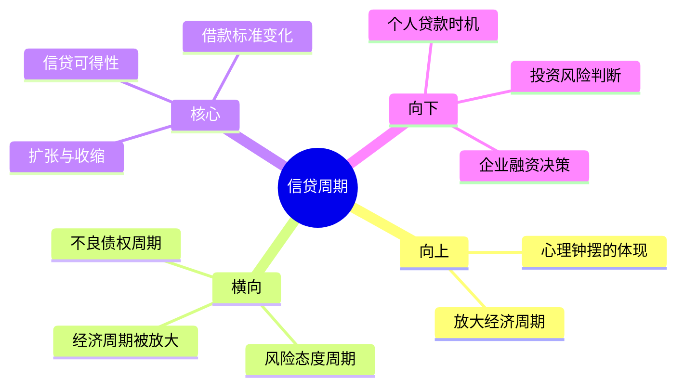

# 第9章 信贷周期

## 📍 章节定位

**全书位置**：本章是全书最关键的章节之一，马克斯称信贷周期为"所有周期中最有影响力的周期"。

**章节序列**：第9章，属于具体周期层，是心理钟摆在经济系统中的具体体现。

**一句话定位**：
> 信贷周期是经济周期背后的放大器——好时候钱多得像空气，坏时候钱少得像黄金。

---

## 🎯 核心观点（三层提取）

### 观点1：信贷周期是最剧烈的周期

| 层次 | 内容 |
|------|------|

**降维翻译**：
- **原文**：信贷窗口会周期性地打开和关闭，而且关闭的速度往往比打开快得多
- **降维**：借钱这事很奇怪——好借的时候像自来水，难借的时候像沙漠里的水
- **类比**：就像一个性情古怪的有钱叔叔——心情好时主动塞钱给你，心情不好时你跪着求都没用

---

### 观点2：信贷扩张与收缩的不对称性

| 阶段 | 特征 | 银行行为 | 借款人体验 |
|------|------|----------|------------|
| **扩张期** | "钱多得没处放" | 放松标准、主动推销、降低利率 | 人人能借、想借多少借多少 |
| **顶峰** | "不借是傻子" | 甚至借钱给不合格的人 | 连信用差的人都能借到钱 |
| **收缩期** | "现金为王" | 收紧标准、提前收回、提高利率 | 只有人人都能借到钱，才人人借不到钱 |
| **谷底** | "借钱是傻子" | 只借给最优质客户，利率很高 | 信用好的人都借不到钱 |

**降维翻译**：
- **原文**：信贷周期的不对称性——扩张是渐进的，收缩是急剧的
- **降维**：开门很慢，关门很快——信贷窗口打开要几年，关闭可能就几天
- **类比**：就像游乐场的旋转门——进来时慢慢转，出去时突然卡住

---

### 观点3：信贷周期放大所有其他周期

| 层次 | 内容 |
|------|------|

**降维翻译**：
- **原文**：信贷周期会放大经济周期的波动
- **降维**：经济周期是正弦波，加了信贷就变成了过山车
- **类比**：就像汽车油门——轻轻踩一下（经济变化），车速就剧烈变化（信贷放大后的结果）

---

### 观点4：信贷周期的预警信号

| 信号 | 扩张末期（危险） | 收缩末期（机会） |
|------|------------------|------------------|
| **利率** | 不断下降，甚至负利率 | 不断上升，高得离谱 |
| **标准** | "不看信用记录" | "只看信用记录" |
| **条款** | 借款人说了算 | 银行说了算 |
| **情绪** | "不借是傻子" | "借钱是傻子" |
| **新闻** | 人人谈论投资赚钱 | 人人谈论债务危机 |

**降维翻译**：
- **原文**：信贷周期的转折点往往可以从借款条款的变化中识别
- **降维**：别听专家说什么，看银行实际怎么做——贷款变容易了就是危险信号
- **类比**：就像判断天气——别看预报，看蚂蚁搬家（实际行为）

---

### 观点5：只有人人都能借到钱，才人人借不到钱

| 层次 | 内容 |
|------|------|

**降维翻译**：
- **原文**：当信贷窗口大开时，最不合适的借款人也能借到钱；当窗口关闭时，连最优质的借款人也借不到
- **降维**：借钱太容易的时候，就是出事的时候
- **类比**：就像聚会——什么人都能进来时，就是快出事的时候；什么人都进不来时，反而是安全的时候

---

## 💬 金句库

### 原书金句
> "信贷周期是最重要的周期，因为它放大了其他所有周期的影响。"

> "信贷窗口不是慢慢关闭的，而是'砰'的一声关上的。"

> "在信贷周期的顶峰，钱多得像空气；在谷底，钱少得像黄金。"

> "只有人人都能借到钱的时候，才人人借不到钱。"

> "银行家是这样一群人：下雨时把伞收走，天晴时把伞递给你。"

### 降维金句
> "借钱这事的规律：好借的时候像自来水，难借的时候像沙漠里的水。"

> "信贷周期就像脾气古怪的有钱叔叔——心情好主动塞钱，心情不好跪着求都没用。"

> "经济周期是正弦波，加了信贷就变成了过山车。"

> "别听银行说什么，看他们做什么——标准放松就是危险信号。"

> "扩张期看谁能借到钱，收缩期看谁能活下去。"

## 🔗 当下映射

### 💰 财富应用

| 场景 | 具体行动 | 预期效果 | 风险提示 |
|------|----------|----------|----------|
| 企业融资 | 在信贷宽松期提前储备资金，不等到紧缩时再借 | 避开资金荒 | 资金成本可能上升 |
| 个人贷款 | 在利率低位锁定长期贷款（房贷等） | 降低长期资金成本 | 提前还款可能有罚金 |
| 投资决策 | 信贷紧缩期关注现金流好的公司 | 这些公司能熬过冬天 | 可能错过反弹 |

### 💼 职场应用

| 场景 | 具体行动 | 所需能力 | 适用职级 |
|------|----------|----------|----------|
| 创业时机 | 信贷紧缩期反而可能是好时机——竞争对手少，估值低 | 现金流管理能力 | 创业者 |
| 跳槽选择 | 避开信贷紧缩期跳槽到高杠杆公司 | 财务分析能力 | 全职级 |
| 职业规划 | 在信贷周期不同阶段调整风险偏好 | 宏观判断能力 | 中层以上 |

### 🏠 生活应用

| 场景 | 具体行动 | 可行性 | 见效时间 |
|------|----------|--------|----------|
| 购房决策 | 信贷紧缩期反而是买房好时机（价格低、竞争少） | 高 | 长期 |
| 债务管理 | 在信贷宽松期锁定低利率，避免浮动利率 | 高 | 中期 |
| 消费决策 | 大额消费信贷的时机选择 | 中 | 立即 |

### 72小时应用计划
1. **明天**：检查自己所有的贷款是固定利率还是浮动利率
2. **本周**：观察新闻中关于"信贷收紧/放松"的报道
3. **本周**：记录3个"信贷可得性"的观察案例（如信用卡额度变化、贷款审批速度等）

---

## 🕸️ 章节关联

### 向上：整书关联
- **核心问题**：本章回答"什么周期影响最大"——信贷周期
- **论证位置**：是具体周期层的核心章节，承接心理钟摆，放大经济周期

### 横向：章节序列

| 章节编号 | 章节标题 | 关联类型 | 连接描述 |
|----------|----------|----------|----------|
| 第4章 | 经济周期 | 被放大 | 经济周期是基础，信贷周期是放大器 |
| 第7章 | 心理和情绪钟摆 | 根源 | 银行的信贷态度是心理钟摆的体现 |
| 第8章 | 风险态度周期 | 表现 | 信贷松紧是风险态度的具体化 |
| 第10章 | 不良债权周期 | 延伸 | 不良债权是信贷周期的后果 |

### 跨书关联

| 书籍 | 概念 | 关系 | 备注 |
|------|------|------|------|
| 《非理性繁荣》 | 信贷泡沫 | 深化 | 席勒详细分析信贷泡沫的形成机制 |
| 《大空头》 | 次贷危机 | 案例 | 2008年危机是信贷周期的经典案例 |
| 《债务危机》 | 债务周期 | 扩展 | 达利欧更系统地分析债务周期 |

### 关联可视化

---

## ❓ 问答设计

### Q1: 为什么信贷周期是最重要的周期？（记忆型）
**认知层次**: 记忆
**难度**: 低
**答案要点**:
- 信贷周期放大其他所有周期的影响
- 没有信贷，经济周期波动会小得多
- 信贷可得性的变化比经济本身的变化更剧烈

### Q2: "只有人人都能借到钱，才人人借不到钱"是什么意思？（理解型）
**认知层次**: 理解
**难度**: 中
**答案要点**:
- 信贷扩张时，不合格借款人也被放进来
- 这些人是系统中最脆弱的环节
- 他们出问题会引发连锁反应
- 最终导致信贷窗口关闭，连优质借款人都借不到钱

### Q3: 信贷周期的不对称性体现在哪里？（理解型）
**认知层次**: 理解
**难度**: 中
**答案要点**:
- 扩张是渐进的（慢慢放松标准）
- 收缩是急剧的（突然关闭窗口）
- 开门要几年，关门可能就几天
- 这导致危机往往来得很快很猛

### Q4: 如何判断当前处于信贷周期的什么位置？（应用型）
**认知层次**: 应用
**难度**: 中
**答案要点**:
- 观察借款条款：是对借款人有利还是对银行有利
- 观察利率变化：是不断下降还是不断上升
- 观察贷款标准：是放松还是收紧
- 观察情绪指标："不借是傻子"还是"借钱是傻子"

### Q5: 信贷周期对普通投资者有什么启示？（应用型）
**认知层次**: 应用
**难度**: 中
**答案要点**:
- 在信贷紧缩期，关注现金流好的公司
- 在信贷宽松期，提前储备资金，避免紧缩时被动
- 大额贷款（如房贷）尽量在利率低位锁定
- 避免在信贷扩张末期加杠杆

### Q6: 银行为什么会有"晴天送伞、雨天收伞"的行为？（分析型）
**认知层次**: 分析
**难度**: 高
**答案要点**:
- 银行本质是顺周期的——跟着周期走，而非逆向
- 风险控制要求银行在风险上升时收缩信贷
- 监管要求也迫使银行在资本充足率下降时收缩
- 银行员工的激励机制也是顺周期的

### Q7: 信贷周期与心理钟摆有什么关系？（分析型）
**认知层次**: 分析
**难度**: 高
**答案要点**:
- 信贷周期是心理钟摆在经济系统中的具体体现
- 银行的信贷态度反映了集体的心理状态
- 乐观时放松标准，悲观时收紧标准
- 理解心理钟摆，就能理解信贷周期的根源

### Q8: 2008年金融危机如何体现信贷周期的规律？（分析型）
**认知层次**: 分析
**难度**: 高
**答案要点**:
- 扩张期：次贷发放给不合格借款人
- 顶峰：所有人都能借到钱买房
- 转折：房价下跌，次贷违约
- 收缩：信贷窗口突然关闭，金融危机爆发
- 完美印证"只有人人都能借到钱，才人人借不到钱"

---
