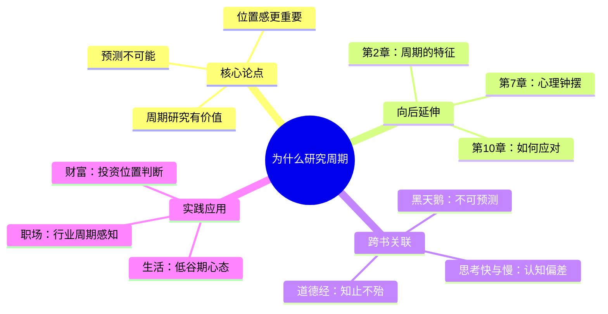

tags: []
# 第1章 为什么研究周期

## 📍 章节定位

**全书位置**：开篇章节，建立全书认知框架，回答"为什么要花时间研究周期"的问题。

**章节序列**：第1章，是全书的逻辑起点和思维基础。

**一句话定位**：
> 投资不需要预测未来，只需要知道当前位置——位置感比预测更重要。

---
tags: []
## 🎯 核心观点（三层提取）

### 观点1：预测几乎是不可能的

| 层次 | 内容 |
|------|------|

**降维翻译**：
- **原文**：没有人能持续准确地预测未来，那些偶尔预测对的人更多是运气
- **降维**：别指望有人能告诉你明天涨还是跌，猜对的都是蒙的
- **类比**：就像天气预报——明天的天气都经常报错，更别说下个月了

---
tags: []
### 观点2：位置感比预测更重要

| 层次 | 内容 |
|------|------|

**降维翻译**：
- **原文**：我们无法预测周期何时反转，但我们可以判断目前处于什么位置
- **降维**：不用猜明天的事，先搞清楚今天是在山顶还是山脚
- **类比**：就像爬山——不知道什么时候到顶，但知道现在累不累、空气稀不稀

---
tags: []
### 观点3：研究周期的核心价值

| 层次 | 内容 |
|------|------|

**降维翻译**：
- **原文**：研究周期不是为了预测未来，而是为了知道当前处于什么位置
- **降维**：学周期不是为了当预言家，是为了不当接盘侠
- **类比**：就像看温度计——不知道明天几度，但知道今天要不要穿棉袄

---
tags: []
### 观点4：为什么周期研究被忽视

| 层次 | 内容 |
|------|------|

**降维翻译**：
- **原文**：人们更喜欢被告知"明天会发生什么"，而不是"现在处于什么位置"
- **降维**：大家都想要"明天涨停"的代码，没人想听"现在有点贵"
- **类比**：就像算命——大家都想知道"我什么时候发财"，没人想知道"我现在是不是太贪了"

---
tags: []
### 观点5：周期是理解市场的框架

| 层次 | 内容 |
|------|------|

**降维翻译**：
- **原文**：周期思维提供了一个理解市场的框架，让你知道价格是贵还是便宜
- **降维**：有周期思维，涨的时候不狂，跌的时候不慌
- **类比**：就像地图——知道自己在哪，就不怕迷路

---
tags: []
## 💬 金句库

### 原书金句
> "投资中最难的不是预测未来，而是知道现在处于周期的什么位置。"

> "没有人能持续准确地预测未来。那些偶尔预测对的人，更多是运气而非能力。"

> "周期研究的价值不在于告诉你未来会发生什么，而在于告诉你现在处于什么位置。"

> "在极端位置时，不需要预测也知道该怎么做。"

> "理解周期的人，知道什么时候该紧张，什么时候该贪婪。"

### 降维金句
> "别猜明天，先看今天。知道自己在哪，比知道要去哪更重要。"

> "预测未来是算命的事，判断位置是投资的事。"

> "高点特征：人人谈论、不买被嘲笑；低点特征：无人问津、买了被嘲笑。"

## 🔗 当下映射

### 💰 财富应用

| 场景 | 具体行动 | 预期效果 | 风险提示 |
|------|----------|----------|----------|
| 股票投资 | 用"人人谈论"指标判断当前是否在极端位置 | 避免在高点追涨、在低点割肉 | 中间区域难以判断，需观望 |
| 基金定投 | 在低估值区域增加定投金额，在高估值区域减少或暂停 | 提高长期收益率 | 需要耐心，极端可能持续较久 |
| 房产决策 | 判断当地房市情绪是否过热/过冷 | 买在无人问津时，卖在人声鼎沸时 | 房产周期长，需考虑流动性 |

### 💼 职场应用

| 场景 | 具体行动 | 所需能力 | 适用职级 |
|------|----------|----------|----------|
| 行业选择 | 在行业极度悲观时考虑进入，在极度乐观时保持谨慎 | 行业周期判断 | 中层以上 |
| 跳槽决策 | 判断目标公司/行业处于周期的什么位置 | 信息收集与分析 | 全职级 |
| 创业时机 | 避免在行业高点入场，寻找低估值机会 | 市场周期感知 | 创业者 |

### 🏠 生活应用

| 场景 | 具体行动 | 可行性 | 见效时间 |
|------|----------|--------|----------|
| 大额消费 | 在行业低谷期购买（如车市、装修淡季） | 高 | 立即 |
| 教育投资 | 在就业市场低谷期进修，为复苏做准备 | 中 | 中长期 |
| 人生决策 | 理解"周期"概念，知道低谷是暂时的 | 高 | 长期心态 |

### 72小时应用计划
1. **今天**：判断一个你持有的投资品种，当前是在高点、低点还是中间？
2. **明天**：观察身边人对市场的情绪（乐观/悲观/中立），记录下来
3. **本周**：用"人人谈论"指标检验一次你的投资判断

---
tags: []
## 🕸️ 章节关联

### 向上：整书关联
- **核心问题**：本章回答"为什么要研究周期"——因为位置感比预测更重要
- **论证位置**：是全书的逻辑起点，后续所有章节都建立在这一认知基础上

### 横向：章节序列

| 章节编号 | 章节标题 | 关联类型 | 连接描述 |
|----------|----------|----------|----------|
| 第2章 | 周期的特征 | 延伸 | 本章建立"位置感"概念，第2章解释周期的具体特征 |
| 第7章 | 心理和情绪钟摆 | 深化 | 本章提出"位置判断"，第7章解释位置的成因——人性钟摆 |
| 第10章 | 如何应对周期 | 落地 | 本章说"为什么"，第10章说"怎么做" |

### 跨书关联

| 书籍 | 概念 | 关系 | 备注 |
|------|------|------|------|
| [[黑天鹅-塔勒布]] | 不可预测性 | 互补 | 塔勒布强调黑天鹅不可预测，马克斯强调位置可判断 |
| [[思考快与慢-丹尼尔·卡尼曼]] | 认知偏差 | 深化 | 卡尼曼解释为什么人喜欢预测——对确定性的渴望 |
| [[道德经-老子]] | 知止不殆 | 呼应 | 老子的"知止"与马克斯的"位置感"异曲同工 |

### 关联可视化

---
tags: []
## ❓ 问答设计

### Q1: 为什么霍华德·马克斯认为预测几乎不可能？（记忆型）
**认知层次**: 记忆
**难度**: 低
**答案要点**:
- 没有人能持续准确预测市场
- 偶尔预测对的人更多是运气
- 复杂系统的本质决定了不可预测性

### Q2: "位置感比预测更重要"是什么意思？（理解型）
**认知层次**: 理解
**难度**: 中
**答案要点**:
- 预测需要知道"何时"反转，几乎不可能
- 定位只需要知道"现在在哪"，完全可行
- 在极端位置时，不需要预测也知道该做什么

### Q3: 研究周期的核心价值是什么？（理解型）
**认知层次**: 理解
**难度**: 中
**答案要点**:
- 提供"位置感知"能力
- 帮助在极端位置时做出逆向决策
- 知道什么时候该紧张，什么时候该贪婪

### Q4: 为什么大多数人忽视周期研究而热衷于预测？（分析型）
**认知层次**: 分析
**难度**: 高
**答案要点**:
- 人类天生喜欢确定性答案
- "会涨"比"在高点"更好理解、更好传播
- 预测许诺确定性，符合人类对确定性的渴望
- 财经媒体也倾向于问"明天会怎样"而非"现在在哪"

### Q5: 如何用第1章的思想判断当前市场位置？（应用型）
**认知层次**: 应用
**难度**: 中
**答案要点**:
- 观察情绪指标：人人谈论？不买被嘲笑？
- 判断是否出现极端词汇："永远涨"、"这次不一样"
- 检查自己是想买入还是卖出——如果人人都想买，可能在高位
- 不追求精确判断，只判断大致位置（高/中/低）

### Q6: "位置感"和"预测"有什么本质区别？（分析型）
**认知层次**: 分析
**难度**: 高
**答案要点**:
- 预测：需要知道"何时"发生什么，要求精确
- 定位：只需要知道"现在"在哪，允许模糊
- 预测是算命，定位是看温度计
- 前者几乎不可能，后者完全可行

### Q7: 第1章与《黑天鹅》的观点有什么异同？（分析型）
**认知层次**: 分析
**难度**: 高
**答案要点**:
- 相同：都认为预测未来几乎不可能
- 不同：塔勒布强调黑天鹅的不可预测性，马克斯强调位置的可判断性
- 互补：接受不可预测的黑天鹅，同时培养可用的位置感

### Q8: 如果周期研究不能预测未来，那它有什么用？（综合型）
**认知层次**: 综合
**难度**: 高
**答案要点**:
- 提供判断当前位置的框架
- 在极端位置时提供行动指南
- 帮助建立对抗情绪的思维工具
- 让投资从"赌博"变成"有依据的决策"
- 核心：知道什么时候该紧张，什么时候该贪婪

---
tags: []