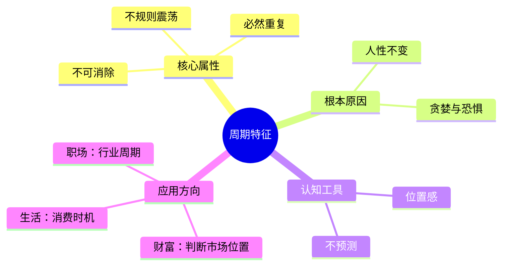

tags: []
# 第2章 周期的特征

## 📍 章节定位

**全书位置**：本章是理解周期的入口，定义周期的本质特征。

**章节序列**：第2章，属于基础概念层，为后续章节奠定认知基础。

**一句话定位**：
> 周期不是规则的波浪线，而是不规则、不可预测、但必然会重复的震荡——核心在于人性不变。

---
tags: []
## 🎯 核心观点（三层提取）

### 观点1：周期会重复，因为人性不变

| 层次 | 内容 |
|------|------|

**降维翻译**：
- **原文**：周期会重复是因为人性永恒不变
- **降维**：历史总是重复，不是因为历史健忘，而是因为人没变
- **类比**：就像四季轮回——不是地球记住了春天的样子，而是太阳和地球的关系不变

---
tags: []
### 观点2：周期是不规则的震荡，不是规则的波浪

| 层次 | 内容 |
|------|------|

**降维翻译**：
- **原文**：周期不是规则的波动，每次的幅度和持续时间都不同
- **降维**：别把周期想象成正弦波，它更像心电图——有节奏但不规律
- **类比**：就像心跳——你知道它会跳，但不知道下一秒跳多快

---
tags: []
### 观点3：周期不可避免，政策干预无法消除

| 层次 | 内容 |
|------|------|

**降维翻译**：
- **原文**：无论政策如何干预，周期都会发生
- **降维**：政府可以延缓冬天，但没办法取消冬天
- **类比**：就像打地鼠——按住一个，另一个就会冒出来；全部按住，桌子会塌

---
tags: []
### 观点4：周期的三个阶段特征

| 阶段 | 情绪特征 | 行为特征 | 市场特征 |
|------|----------|----------|----------|
| **复苏期** | 将信将疑 | 试探性买入 | 价格低于价值，但无人问津 |
| **繁荣期** | 贪婪亢奋 | 追涨加杠杆 | 价格高于价值，人人谈论 |
| **衰退期** | 恐慌绝望 | 割肉逃离 | 价格远低于价值，但无人敢买 |

**降维翻译**：
- **原文**：周期分为复苏、繁荣、衰退三个阶段，每个阶段都有典型的情绪和行为模式
- **降维**：周期就是：没人要→抢着买→哭着卖
- **类比**：就像派对——刚开始没人来，高潮时挤爆，结束时一片狼藉

---
tags: []
### 观点5：认识周期的目的是"位置感"

| 层次 | 内容 |
|------|------|

**降维翻译**：
- **原文**：我们无法预测周期的精确时点，但可以判断周期的大致位置
- **降维**：不知道几点下雨，但能看出天黑了
- **类比**：就像开车——不需要知道红绿灯什么时候变，只需要看现在是红是绿

---
tags: []
## 💬 金句库

### 原书金句
> "周期会重复，是因为人性不变。贪婪和恐惧是刻在我们基因里的，不会因为有了更好的教育或更完善的市场机制就消失。"

> "不要把周期想象成规则的波浪，要把它想象成不规则的心电图——有节奏，但不规律。"

> "政府可以推迟周期，可以放大周期，但无法消除周期。周期是系统特征，不是系统缺陷。"

> "我们无法知道繁荣何时结束，但我们可以判断现在是否处于繁荣期。"

### 降维金句
> "历史总是押韵，因为人性从不押注。"

> "别想预测浪潮什么时候来，先学会判断你在沙滩的哪个位置。"

> "周期不是bug，是feature——没有周期就没有投资机会。"

> "政策干预周期，就像用手按住钟摆——按得越久，反弹越猛。"

## 🔗 当下映射

### 💰 财富应用

| 场景 | 具体行动 | 预期效果 | 风险提示 |
|------|----------|----------|----------|
| 判断市场周期 | 用情绪指标（人人谈论、媒体热度）判断当前位置 | 避免在极端位置做错误决策 | 极端可以持续很久 |
| 资产配置 | 在繁荣后期降低股票仓位，在衰退后期增加仓位 | 提高长期收益 | 需要足够耐心 |
| 行业选择 | 判断不同行业处于周期的不同阶段 | 捕捉行业轮动机会 | 行业周期可能不同步 |

### 💼 职场应用

| 场景 | 具体行动 | 所需能力 | 适用职级 |
|------|----------|----------|----------|
| 职业规划 | 判断所在行业的周期位置，提前布局 | 行业判断能力 | 中层以上 |
| 创业时机 | 在行业衰退后期进入，成本更低 | 逆势判断能力 | 创业者 |
| 跳槽决策 | 避免在行业顶峰期跳入即将衰退的公司 | 周期判断能力 | 全职级 |

### 🏠 生活应用

| 场景 | 具体行动 | 可行性 | 见效时间 |
|------|----------|--------|----------|
| 买房决策 | 判断当地房市周期位置 | 高 | 长期（5-10年） |
| 大额消费 | 在经济衰退期购买（价格更低） | 中 | 立即 |
| 教育投资 | 在经济低迷期进修提升技能 | 高 | 中期（2-3年） |

### 72小时应用计划
1. **明天**：选择一个你关注的投资品类，判断它当前处于周期的哪个阶段
2. **本周**：记录3个"周期特征"的观察案例（可以是股市、楼市、消费品）
3. **本周**：反思自己在过去一次周期中的行为——是在复苏期买入，还是在繁荣期追高？

---
tags: []
## 🕸️ 章节关联

### 向上：整书关联
- **核心问题**：本章定义"周期是什么"，为整书奠定基础
- **论证位置**：是全书的基础概念层，后续所有章节都建立在本章的周期理解上

### 横向：章节序列

| 章节编号 | 章节标题 | 关联类型 | 连接描述 |
|----------|----------|----------|----------|
| 第1章 | 为什么研究周期 | 铺垫 | 第1章提出周期的重要性，本章解释周期的本质 |
| 第3章 | 周期的规律 | 深化 | 本章讲不规则，第3章讲什么是不变的 |
| 第7章 | 心理和情绪钟摆 | 根源 | 心理钟摆是周期重复的根本原因 |

### 跨书关联

| 书籍 | 概念 | 关系 | 备注 |
|------|------|------|------|
| [[黑天鹅-塔勒布]] | 不确定性 | 互补 | 塔勒布强调不可预测的极端事件，马克斯强调可识别的周期位置 |
| [[道德经-老子]] | 反者道之动 | 呼应 | 老子的物极必反与周期震荡同一逻辑 |
| [[反脆弱-塔勒布]] | 从混乱中获益 | 延伸 | 塔勒布教我们如何利用周期而非被周期伤害 |

### 关联可视化

---
tags: []
## ❓ 问答设计

### Q1: 为什么周期会重复？（记忆型）
**认知层次**: 记忆
**难度**: 低
**答案要点**:
- 周期重复的根本原因是人性不变
- 贪婪推动上涨，恐惧推动下跌
- 只有人性改变，周期才会消失——但这不可能

### Q2: "周期"这个词有什么误导性？（理解型）
**认知层次**: 理解
**难度**: 中
**答案要点**:
- "周期"暗示规律性，让人误以为可以预测时点
- 更准确的说法是"不规则震荡"
- 方向可辨，但幅度和时间不可预测

### Q3: 政府政策能消除周期吗？（理解型）
**认知层次**: 理解
**难度**: 中
**答案要点**:
- 不能消除，只能推迟或放大
- 政策干预本身会被纳入周期的计算
- 周期是系统特征，不是系统缺陷

### Q4: 如何用"位置感"指导投资？（应用型）
**认知层次**: 应用
**难度**: 中
**答案要点**:
- 不预测何时反转，只判断当前位置
- 用情绪指标判断：人人谈论？媒体热度？
- 在极端位置逆向行动

### Q5: 为什么说"这次不一样"是最危险的话？（分析型）
**认知层次**: 分析
**难度**: 高
**答案要点**:
- 这句话在每次泡沫顶峰都会出现
- 它是贪婪的自我合理化
- 人性没变，"这次"就不会不一样
- 听到这句话时应该更警惕

### Q6: 周期的三个阶段各有什么特征？（理解型）
**认知层次**: 理解
**难度**: 中
**答案要点**:
- 复苏期：将信将疑，价格低于价值
- 繁荣期：贪婪亢奋，价格高于价值
- 衰退期：恐慌绝望，价格远低于价值

### Q7: 为什么不规则性恰恰是机会？（分析型）
**认知层次**: 分析
**难度**: 高
**答案要点**:
- 如果周期完全可预测，就会被完全定价
- 不规则性意味着总有人判断错误
- 正确判断位置的人可以获得超额收益

---
tags: []