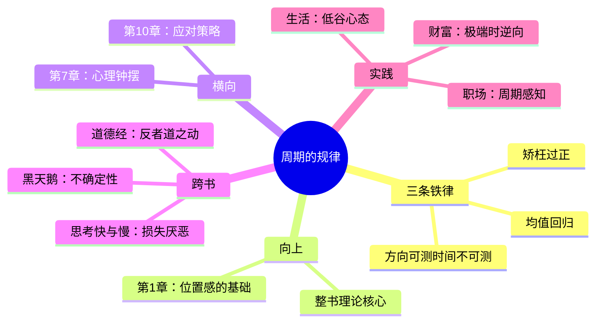

tags: []
# 第3章 周期的规律

## 📍 章节定位

**全书位置**：本章是周期理论的核心，揭示周期运行的底层法则——均值回归、矫枉过正、方向可测。

**章节序列**：第3章，承接第1章的"为什么研究"，为后续章节提供规律基础。

**一句话定位**：
> 周期有三条铁律：极端终将回归（均值回归）、回归必会过头（矫枉过正）、时间不可预测但方向可预测。

---
tags: []
## 🎯 核心观点（三层提取）

### 观点1：均值回归是铁律

| 层次 | 内容 |
|------|------|

**降维翻译**：
- **原文**：极端不会持续，价格终将回归长期均值
- **降维**：涨得太离谱的东西，迟早会跌回来；跌得太惨的东西，迟早会涨回去
- **类比**：就像橡皮筋——拉得越远，回弹的力越大

---
tags: []
### 观点2：矫枉过正——回归不是"点到为止"

| 层次 | 内容 |
|------|------|

**降维翻译**：
- **原文**：周期不会回到中点就停止，而是会冲向另一个极端
- **降维**：市场要么疯涨，要么暴跌，"刚刚好"是罕见状态
- **类比**：就像海盗船——从最高点落下，不会停在中间，而是冲到另一边的高点

**矫枉过正的视觉理解**：

```
        极度乐观
            ↑
            |     ← 矫枉过正，冲到另一端
    合理 ---|---
            |     ← 不是停在这里
            ↓
        极度悲观
```

---
tags: []
### 观点3：时间不可预测，但方向可预测

| 层次 | 内容 |
|------|------|

**降维翻译**：
- **原文**：我们无法预测周期何时反转，但可以确定它终将反转
- **降维**：别问"什么时候"，问"会不会"——极端一定会修正，但哪天修正谁知道
- **类比**：就像火山——知道早晚会爆发，但不知道是明天还是十年后

**方向 vs 时间的矩阵**：

| 维度 | 可预测性 | 原因 |
|------|----------|------|
| **时间** | ❌ 不可预测 | 由外部冲击触发（随机性） |

---
tags: []
### 观点4：理解规律的实用价值

| 层次 | 内容 |
|------|------|

**降维翻译**：
- **原文**：理解周期规律可以增强逆向投资的信心
- **降维**：知道"这事肯定会发生"，做决策就不慌了
- **类比**：就像知道冬天之后一定是春天——虽然不知道哪天回暖，但知道不会再冷太久

---
tags: []
## 💬 金句库

### 原书金句
> "极端情况不会持续，市场终将回归均值——这是周期最基本的规律。"

> "周期从不会恰好回到中点就停止，它总是冲向另一个极端。"

> "我们无法预测周期何时反转，但我们可以确定它终将反转。方向可预测，时间不可预测。"

> "矫枉过正是周期的常态，适度均衡只是短暂的过渡。"

### 降维金句
> "涨疯了的东西一定会跌，跌惨了的东西一定会涨——问题是什么时候。"

> "市场从来不会'刚刚好'——不是太贵就是太便宜，理性定价只是传说。"

> "别问'哪天反转'，问'会不会反转'——前者是算命，后者是规律。"

## 🔗 当下映射

### 💰 财富应用

| 场景 | 具体行动 | 预期效果 | 风险提示 |
|------|----------|----------|----------|
| 判断泡沫 | 当某资产"涨疯了"时，相信均值回归，不追高 | 避免接最后一棒 | 极端可能比你想象的更持久 |
| 寻找机会 | 当某资产"跌惨了"时，相信均值回归，逐步布局 | 提高长期收益 | 可能还会"矫枉过正"继续跌 |
| 资产配置 | 在均值附近增加持仓，在极端位置减少仓位 | 优化风险收益比 | 中间区域难以精确判断 |

### 💼 职场应用

| 场景 | 具体行动 | 所需能力 | 适用职级 |
|------|----------|----------|----------|
| 行业选择 | 在行业极度悲观时进入，相信均值回归 | 行业周期判断 | 中层以上 |
| 职业规划 | 理解"矫枉过正"——今天的冷门可能是明天的热门 | 长期视野 | 全职级 |
| 跳槽决策 | 判断公司是否处于极端位置（过热/过冷） | 信息收集能力 | 全职级 |

### 🏠 生活应用

| 场景 | 具体行动 | 可行性 | 见效时间 |
|------|----------|--------|----------|
| 人生低谷 | 相信均值回归——低谷不会永远持续 | 高（心态） | 长期 |
| 人际关系 | 理解矫枉过正——争吵后会和好，和好后可能又冷战 | 中 | 中期 |
| 健康管理 | 极端饮食/运动不可持续，回归平衡是必然 | 高 | 长期 |

### 72小时应用计划
1. **今天**：找到一个你关注的投资品类，判断它是否处于极端位置
2. **明天**：回顾一次"矫枉过正"的经历（买得太贵或卖得太早）
3. **本周**：用"方向可预测，时间不可预测"的框架，重新审视一个投资决策

---
tags: []
## 🕸️ 章节关联

### 向上：整书关联
- **核心问题**：本章回答"周期有什么规律"——三条铁律是理解一切周期的基础
- **论证位置**：是全书的理论核心，后续所有章节都是这三条规律的具体表现

### 横向：章节序列

| 章节编号 | 章节标题 | 关联类型 | 连接描述 |
|----------|----------|----------|----------|
| 第1章 | 为什么研究周期 | 基础 | 第1章建立"位置感"，本章解释"位置为何会变化" |
| 第2章 | 周期的特征 | 延伸 | 本章讲规律，第2章讲特征——规律决定特征 |
| 第7章 | 心理和情绪钟摆 | 深化 | 矫枉过正的根源是人性钟摆 |
| 第10章 | 如何应对周期 | 落地 | 本章讲规律，第10章讲策略——用规律指导行动 |

### 跨书关联

| 书籍 | 概念 | 关系 | 备注 |
|------|------|------|------|
| [[黑天鹅-塔勒布]] | 不确定性 | 互补 | 塔勒布强调时间不可预测，马克斯强调方向可预测 |
| [[道德经-老子]] | 反者道之动 | 呼应 | 老子的"反者道之动"与均值回归、矫枉过正完全一致 |
| [[思考快与慢-丹尼尔·卡尼曼]] | 损失厌恶 | 深化 | 卡尼曼解释矫枉过正——恐惧比贪婪更强烈，导致下跌更猛烈 |

### 关联可视化



---
tags: []
## ❓ 问答设计

### Q1: 周期的三条基本规律是什么？（记忆型）
**认知层次**: 记忆
**难度**: 低
**答案要点**:
- 均值回归：极端不会持续，终将回归均值
- 矫枉过正：回归不是回到中点就停，而是冲向另一端
- 方向可预测，时间不可预测：知道终将反转，但不知道何时

### Q2: 为什么说"均值回归是铁律"？（理解型）
**认知层次**: 理解
**难度**: 中
**答案要点**:
- 极端价格由极端情绪驱动，极端情绪不可持续
- 当所有人都已买入/卖出，供需失衡必然修复
- 这是系统的自我纠错机制，是稳态的本质属性

### Q3: "矫枉过正"是什么意思？为什么会这样？（理解型）
**认知层次**: 理解
**难度**: 中
**答案要点**:
- 周期不会恰好停在合理位置，而是冲向另一个极端
- 原因是情绪有惯性，人类天生不擅长"适度"
- 恐惧比贪婪更强烈，导致下跌往往比上涨更猛烈

### Q4: 为什么时间不可预测，但方向可预测？（分析型）
**认知层次**: 分析
**难度**: 高
**答案要点**:
- 方向由系统结构决定（均值回归），是内生的、确定的
- 时间由外部冲击触发，是外生的、随机的
- 反转需要无数变量形成"合力"，何时形成不可预知

### Q5: 理解这三条规律对投资有什么实际帮助？（应用型）
**认知层次**: 应用
**难度**: 中
**答案要点**:
- 在极端位置时不追涨、不杀跌（相信均值回归）
- 对"矫枉过正"有预期，抄底分批、逃顶分批
- 接受时间不可预测，用耐心代替焦虑
- 增强"逆向投资"的信心和纪律

### Q6: 如何用"矫枉过正"规律指导投资决策？（应用型）
**认知层次**: 应用
**难度**: 中
**答案要点**:
- 见顶后不要急于抄底——可能会"跌过头"
- 见底后不要急于满仓——可能会"涨过头"
- 分批操作，留出余地，接受"不够完美"
- 不要期待精确抄底逃顶，那违反规律

### Q7: 均值回归与《道德经》的"反者道之动"有什么相通之处？（分析型）
**认知层次**: 分析
**难度**: 高
**答案要点**:
- 两者都认为事物发展会走向反面
- "反者"=回归另一端，"道之动"=周期的运行规律
- 都强调"物极必反"——极端不可能持续
- 马克斯用现代金融语言，老子用哲学语言，本质相同

### Q8: 如果方向可预测但时间不可预测，应该如何制定投资策略？（综合型）
**认知层次**: 综合
**难度**: 高
**答案要点**:
- 策略应该基于"方向"而非"时间"——在极端时行动，不等待"最佳时机"
- 分批建仓/减仓，接受时间不确定性
- 保持足够流动性，因为不知道要等多久
- 用"大概率"思维代替"精确预测"思维

---
tags: []