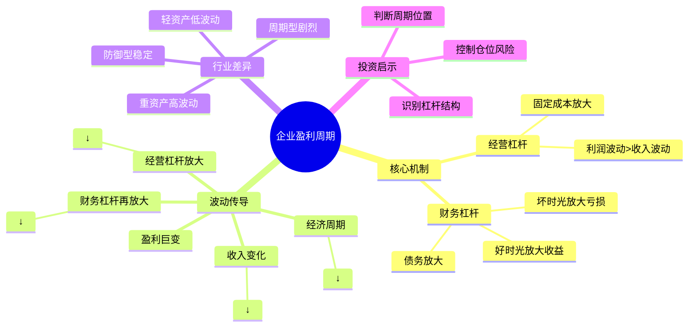

# 第6章 企业盈利周期

## 📍 章节定位

**全书位置**：本章承上启下，解释为什么股市波动（企业盈利）比经济波动（GDP）更剧烈。

**章节序列**：第6章，属于核心概念层，连接经济周期与心理周期。

**一句话定位**：
> 企业盈利周期比经济周期波动更剧烈——因为经营杠杆和财务杠杆会放大收入变化对利润的影响。

---

## 🎯 核心观点（三层提取）

### 观点1：经营杠杆——固定成本放大利润波动

| 层次 | 内容 |
|------|------|

**降维翻译**：
- **原文**：固定成本导致利润波动大于收入波动
- **降维**：房租照付、工资照发，生意不好时利润跌得比收入更惨
- **类比**：就像开饭馆——不管有没有客人，房租水电都得交，客人少的时候亏得比想象中更惨

**经营杠杆的数学逻辑**：
```
收入 100 → 固定成本 60 → 变动成本 30 → 利润 10
收入 90  → 固定成本 60 → 变动成本 27 → 利润 3（下降70%！）
```

---

### 观点2：财务杠杆——债务进一步放大波动

| 层次 | 内容 |
|------|------|

**降维翻译**：
- **原文**：债务放大股东的盈利和亏损
- **降维**：借钱做生意，赚的时候多赚，亏的时候多亏
- **类比**：就像买房——全款买涨10%就是10%，贷款买涨10%可能等于本金涨30%

**财务杠杆的双刃剑**：

| 情境 | 低杠杆公司 | 高杠杆公司 |
|------|-----------|-----------|
| 盈利上升期 | 稳健增长 | 利润飞涨 |
| 盈利平稳期 | 稳定分红 | 大部分钱还利息 |
| 盈利下降期 | 小幅下滑 | 可能直接亏损甚至破产 |

---

### 观点3：盈利波动比经济波动更剧烈

| 层次 | 内容 |
|------|------|

**降维翻译**：
- **原文**：企业盈利周期波动比经济周期更剧烈
- **降维**：经济打喷嚏，企业利润可能感冒；经济感冒，企业利润可能进ICU
- **类比**：就像传话游戏——经济变化是第一句话，经过经营杠杆和财务杠杆两次"传话"，到最后（利润）已经面目全非

**波动传导链条**：
```
经济周期 → 收入变化 → 经营杠杆放大 → 财务杠杆再放大 → 盈利巨变
  ±3%       ±5%         ×3倍效应        ×2倍效应        ±30%
```

---

### 观点4：不同行业杠杆程度不同

| 行业类型 | 经营杠杆 | 财务杠杆 | 盈利波动特点 |
|----------|----------|----------|--------------|
| **重资产**（航空、钢铁、汽车） | 高（大量固定资产） | 中高（需要融资扩张） | 剧烈波动 |
| **轻资产**（软件、咨询、服务） | 低（主要是人力成本） | 低（现金流好） | 相对稳定 |
| **周期型**（原材料、能源） | 高（产能固定） | 中高（行业特性） | 周期极强 |
| **防御型**（公用事业、必需消费） | 中（基础设施重） | 高（稳定现金流支持债务） | 相对稳定 |

**降维翻译**：
- **原文**：不同行业的杠杆结构和盈利波动特征不同
- **降维**：开工厂的比写代码的更容易大起大落
- **类比**：航空公司像开赌场（要么爆赚要么爆亏），软件公司像收租（稳定但难暴富）

---

## 💬 金句库

### 原书金句
> "企业盈利周期波动比经济周期更剧烈，这是因为经营杠杆和财务杠杆的存在。"

> "固定成本是盈利波动的放大器——收入下降时，固定成本照付，利润跌得更惨。"

> "债务是双刃剑——好时光里放大收益，坏时光里放大亏损。"

### 降维金句
> "房租水电照付，客人少的时候，亏的比想的还惨。"

> "借钱做生意就像放大镜——阳光好的时候更亮，阴天的时候更暗。"

> "GDP打个喷嚏，企业利润可能进ICU。"

> "经营杠杆加财务杠杆，等于盈利过山车。"

## 🔗 当下映射

### 💰 财富应用

| 场景 | 具体行动 | 预期效果 | 风险提示 |
|------|----------|----------|----------|
| 行业选择 | 识别高/低杠杆行业，匹配自己风险偏好 | 了解波动特征后再投资 | 高杠杆行业可能长期跑输 |
| 选股分析 | 检查目标公司的固定成本占比和负债率 | 避开周期顶点的高杠杆股 | 需要财务知识基础 |
| 仓位管理 | 高杠杆公司降低仓位，低杠杆公司可加仓 | 平衡组合波动 | 不能只看单一指标 |
| 周期判断 | 在行业低谷时关注高杠杆优质公司 | 周期反转时收益巨大 | 判断低谷非常困难 |

### 💼 职场应用

| 场景 | 具体行动 | 所需能力 | 适用职级 |
|------|----------|----------|----------|
| 求职选择 | 了解目标公司的杠杆结构和周期位置 | 行业分析能力 | 全职级 |
| 创业决策 | 评估业务的固定成本结构，预判盈利波动 | 商业规划能力 | 创业者 |
| 行业研究 | 分析行业平均杠杆水平，判断周期敏感性 | 财务分析能力 | 中层以上 |

### 🏠 生活应用

| 场景 | 具体行动 | 可行性 | 见效时间 |
|------|----------|--------|----------|
| 副业选择 | 选择低固定成本的副业（咨询、写作）减少波动风险 | 高 | 立即 |
| 大额消费 | 避免在高杠杆行业价格高点买入（如车企股价高点买车企股票） | 中 | 中期 |
| 个人财务 | 降低个人"财务杠杆"（减少债务比例）增强抗风险能力 | 高 | 长期 |

### 72小时应用计划
1. **今天**：查一家你持有或关注的上市公司，看其固定成本占比和负债率
2. **明天**：列出3个高杠杆行业和3个低杠杆行业，对比其股价历史波动
3. **本周**：用"双重杠杆"框架分析一次行业新闻（某公司业绩大变脸）

---

## 🕸️ 章节关联

### 向上：整书关联
- **核心问题**：本章回答"为什么股市波动比经济波动大"
- **论证位置**：承接第5章经济周期，为后续心理周期做铺垫

### 横向：章节序列

| 章节编号 | 章节标题 | 关联类型 | 连接描述 |
|----------|----------|----------|----------|
| 第5章 | 经济周期 | 上游 | 经济周期决定收入，收入经过杠杆放大成盈利 |
| 第7章 | 心理和情绪钟摆 | 下游 | 心理周期放大盈利周期，三层叠加 |
| 第8章 | 风险态度周期 | 延伸 | 高杠杆公司在风险偏好高时更容易融资 |

### 跨书关联

| 书籍 | 概念 | 关系 | 备注 |
|------|------|------|------|
| [[黑天鹅-塔勒布]] | 脆弱性 | 呼应 | 高杠杆公司是"脆弱"的典型——小冲击导致大崩溃 |
| [[穷查理宝典]] | lollapalooza效应 | 呼应 | 多种因素叠加产生放大效应 |
| [[聪明的投资者-格雷厄姆]] | 安全边际 | 互补 | 低杠杆是安全边际的一部分 |

### 关联可视化



---

## ❓ 问答设计

### Q1: 什么是经营杠杆？它如何影响盈利波动？（记忆型）
**认知层次**: 记忆
**难度**: 低
**答案要点**:
- 经营杠杆是固定成本对利润波动的放大效应
- 固定成本不随收入变化（租金、折旧、基础人工）
- 收入下降时，固定成本占比上升，利润跌幅大于收入跌幅
- 固定成本占比越高，经营杠杆越大

### Q2: 财务杠杆如何放大盈利波动？（理解型）
**认知层次**: 理解
**难度**: 中
**答案要点**:
- 利息支出是固定的，不管盈利多少都要支付
- 盈利好时，利息占比小，股东收益增加
- 盈利差时，利息负担重，股东收益减少更多
- 债务越多，财务杠杆越大，波动越剧烈

### Q3: 为什么GDP下降2%，企业利润可能下降20%？（应用型）
**认知层次**: 应用
**难度**: 中
**答案要点**:
- 经济变化首先影响收入（假设-5%）
- 经营杠杆放大（可能×3，变成-15%）
- 财务杠杆再放大（可能×1.5，变成-22.5%）
- 双重杠杆叠加，小变化被放大成大变化

### Q4: 如何判断一家公司的杠杆风险？（分析型）
**认知层次**: 分析
**难度**: 高
**答案要点**:
- 看固定成本占比（折旧/收入、租金/收入）
- 看负债率（资产负债率、有息负债/EBITDA）
- 看利息覆盖倍数（EBIT/利息支出）
- 对比同行业公司的杠杆水平
- 结合行业周期位置综合判断

### Q5: 高杠杆公司什么时候值得投资？（分析型）
**认知层次**: 分析
**难度**: 高
**答案要点**:
- 行业周期底部：收入有望反弹，杠杆效应将放大收益
- 公司基本面优秀：杠杆是主动选择而非被动困境
- 估值足够低：已经反映了最悲观预期
- 有能力熬过寒冬：现金流足够支付利息
- 注意：判断底部非常困难，需要安全边际

---
