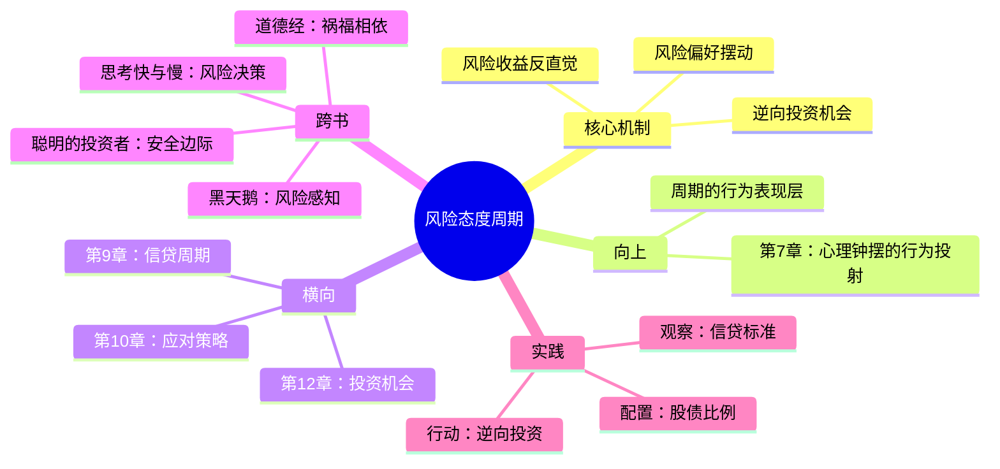

# 第8章 风险态度周期

## 📍 章节定位

**全书位置**：本章是心理钟摆的"行为表现层"，回答"投资者如何根据情绪改变风险偏好"。

**章节序列**：第8章，承接第7章的心理钟摆，将抽象情绪转化为具体的投资行为。

**一句话定位**：
> 风险态度的周期性变化——好时候人人敢于冒险，坏时候人人过度谨慎，而这恰恰创造了逆向投资的机会。

---

## 🎯 核心观点（三层提取）

### 观点1：风险偏好的周期性摆动

| 层次 | 内容 |
|------|------|

**降维翻译**：
- **原文**：投资者的风险偏好呈现周期性变化，与市场情绪高度相关
- **降维**：好日子大家敢赌，坏日子大家怕亏——人对风险的看法完全看心情
- **类比**：就像喝酒——高兴时"再来一杯"，难受时"再也不喝了"

---

### 观点2：风险与收益的反直觉关系

| 层次 | 内容 |
|------|------|

**降维翻译**：
- **原文**：当资产价格上涨时，实际风险上升但感知风险下降；当价格下跌时恰恰相反
- **降维**：东西越贵大家越敢买，东西越便宜大家越不敢买——完全反了
- **类比**：就像超市打折——原价时抢着买，半价时反而怀疑"是不是快过期了"

**风险-收益的周期矩阵**：

| 市场阶段 | 价格 | 实际风险 | 感知风险 | 预期收益 |
|----------|------|----------|----------|----------|
| **牛市顶峰** | 高 | 高 | 低 | 低 |
| **熊市底部** | 低 | 低 | 高 | 高 |
| **合理区间** | 中 | 中 | 中 | 中 |

---

### 观点3：逆向投资的机会窗口

| 层次 | 内容 |
|------|------|

**降维翻译**：
- **原文**：当别人不愿承担风险时，正是承担风险的好时机
- **降维**：大家都不敢买的时候，才是捡便宜的好机会
- **类比**：就像冲浪——浪最大的时候人最少，因为大家都怕被拍死

---

### 观点4：风险态度周期的识别信号

| 层次 | 内容 |
|------|------|

**降维翻译**：
- **原文**：通过观察投资者行为和信贷标准，可以判断风险态度的极端位置
- **降维**：看银行敢不敢借钱、看身边人敢不敢买股，就知道现在胆子是大是小
- **类比**：就像观察天气——看别人带没带伞，比看天气预报更准

**风险态度的观察清单**：

| 观察维度 | 高风险偏好信号 | 低风险偏好信号 |
|----------|----------------|----------------|
| **信贷标准** | 放松、零首付、随便借 | 收紧、高门槛、很难借 |
| **媒体用词** | "新常态""这次不一样" | "现金为王""保守为上" |
| **流行策略** | 加杠杆、追热点 | 降杠杆、持现金 |
| **社交话题** | 人人谈论投资收益 | 人人谈论如何保值 |

---

### 观点5：风险态度周期与其他周期的共振

| 层次 | 内容 |
|------|------|

**降维翻译**：
- **原文**：风险态度周期与其他周期相互影响，共振时市场波动加剧
- **降维**：当胆子大遇上钱多遇上情绪高涨，就会出大事
- **类比**：就像多重感冒——本来只是小病，几种病毒一起来就要命了

---

## 💬 金句库

### 原书金句
> "投资者的风险态度呈现周期性变化——在好时候敢于冒险，在坏时候过度谨慎。"

> "当资产价格上涨时，实际风险上升，但投资者感知的风险却在下降。这是一个危险的组合。"

> "真正的风险不是波动，而是以高价买入、以低价卖出。"

> "逆向投资的机会，就在别人不愿承担风险的时候。"

> "风险和收益的关系被投资者的情绪扭曲了——他们追逐高风险低收益的资产，回避低风险高收益的资产。"

### 降维金句
> "好日子敢赌，坏日子怕输——人对风险的态度完全看心情。"

> "东西越贵越敢买，东西越便宜越不敢买——这就是大众的风险观。"

> "别人吓得发抖的时候，才是你弯腰捡钱的时候。"

> "看银行敢不敢借钱，比看任何报告都管用。"

## 🔗 当下映射

### 💰 财富应用

| 场景 | 具体行动 | 预期效果 | 风险提示 |
|------|----------|----------|----------|
| 判断市场位置 | 观察身边人的风险态度（敢不敢买、借不借钱） | 识别极端位置，避免追涨杀跌 | 极端可能比你想象的更持久 |
| 逆向布局 | 在大众恐慌时分批买入，在大众狂热时分批卖出 | 提高长期收益 | 需要强大的心理承受力 |
| 信贷观察 | 关注银行放贷标准变化、企业融资难度 | 提前感知风险态度转向 | 需要持续跟踪信息 |
| 组合配置 | 根据风险态度调整股债比例 | 优化风险收益比 | 难以精确判断位置 |

### 💼 职场应用

| 场景 | 具体行动 | 所需能力 | 适用职级 |
|------|----------|----------|----------|
| 职业选择 | 在行业恐慌时进入，在行业狂热时谨慎 | 行业周期判断 | 中层以上 |
| 创业时机 | 在资本寒冬时启动，在资本狂热时套现 | 融资环境感知 | 创业者 |
| 职业投资 | 用风险态度周期判断跳槽时机 | 信息收集能力 | 全职级 |

### 🏠 生活应用

| 场景 | 具体行动 | 可行性 | 见效时间 |
|------|----------|--------|----------|
| 房产决策 | 观察银行放贷松紧判断房市位置 | 高 | 长期（3-5年） |
| 消费决策 | 在风险偏好低迷时买入周期性消费品（车、房） | 中 | 长期 |
| 人际观察 | 理解他人的风险态度变化，避免被情绪传染 | 高 | 即时 |

### 72小时应用计划
1. **今天**：观察身边人对当前市场的风险态度（敢不敢投资？借不借钱？）
2. **明天**：查一下当前银行放贷标准（比前几年松了还是紧了？）
3. **本周**：记录3个风险态度变化的信号，思考它们意味着什么

---

## 🕸️ 章节关联

### 向上：整书关联
- **核心问题**：本章回答"投资者如何将情绪转化为行为"——风险态度是心理钟摆的行为投射
- **论证位置**：是第7章（心理钟摆）的延伸，将抽象情绪转化为具体投资行为

### 横向：章节序列

| 章节编号 | 章节标题 | 关联类型 | 连接描述 |
|----------|----------|----------|----------|
| 第7章 | 心理和情绪钟摆 | 基础 | 第7章讲心理波动，本章讲行为变化 |
| 第9章 | 信贷周期 | 深化 | 信贷松紧是风险态度的具体表现 |
| 第10章 | 如何应对周期 | 落地 | 本章讲现象，第10章讲对策 |
| 第12章 | 投资机会周期 | 延伸 | 风险态度决定机会大小 |

### 跨书关联

| 书籍 | 概念 | 关系 | 备注 |
|------|------|------|------|
| [[黑天鹅-塔勒布]] | 风险感知 | 互补 | 塔勒布强调风险被低估的后果，马克斯强调风险感知的周期性 |
| [[道德经-老子]] | 祸福相依 | 呼应 | 老子说"祸兮福之所倚"，风险与机会相互转化 |
| [[思考快与慢-丹尼尔·卡尼曼]] | 风险决策 | 深化 | 卡尼曼用心理学解释为什么人在高风险时反而放松警惕 |
| [[聪明的投资者-格雷厄姆]] | 安全边际 | 延伸 | 格雷厄姆的安全边际本质是对抗风险态度周期的武器 |

### 关联可视化

---

## ❓ 问答设计

### Q1: 什么是风险态度周期？（记忆型）
**认知层次**: 记忆
**难度**: 低
**答案要点**:
- 投资者对风险的态度呈周期性变化
- 好时候敢于冒险，坏时候过度谨慎
- 风险态度是心理钟摆的行为表现

### Q2: 为什么说风险与收益的关系是"反直觉"的？（理解型）
**认知层次**: 理解
**难度**: 中
**答案要点**:
- 价格上涨时，实际风险高但感知风险低
- 价格下跌时，实际风险低但感知风险高
- 大众追逐高估的热门股，回避低估的冷门股
- 这种反直觉关系由情绪扭曲造成

### Q3: 如何识别风险态度的极端位置？（应用型）
**认知层次**: 应用
**难度**: 中
**答案要点**:
- 观察信贷标准（银行敢不敢借钱）
- 观察投资者行为（身边人敢不敢买股）
- 观察媒体用词（"这次不一样" vs "现金为王"）
- 观察流行策略（加杠杆 vs 降杠杆）

### Q4: 为什么逆向投资这么难？（分析型）
**认知层次**: 分析
**难度**: 高
**答案要点**:
- 逆向要求在大家都说"完了"时说"机会来了"
- 逆人性的——人类有从众本能
- 需要承受孤独和质疑
- 需要用原则对抗情绪，而非意志力

### Q5: 风险态度周期与其他周期有什么关系？（分析型）
**认知层次**: 分析
**难度**: 高
**答案要点**:
- 风险态度周期是心理周期的行为投射
- 它影响信贷周期（银行放贷标准）
- 它影响经济周期（投资消费决策）
- 多周期共振时，市场波动加剧

### Q6: 银行放贷标准为什么是好的反向指标？（分析型）
**认知层次**: 分析
**难度**: 中
**答案要点**:
- 银行放贷标准反映风险态度的极端
- 最松时往往是市场高点（2007年次贷危机前）
- 最紧时往往是市场低点（2009年）
- 银行同样受情绪影响，会追涨杀跌

### Q7: 如何用风险态度周期指导投资决策？（应用型）
**认知层次**: 应用
**难度**: 中
**答案要点**:
- 在大众恐慌时承担风险（逆向买入）
- 在大众狂热时回避风险（分批卖出）
- 观察信贷标准判断位置
- 用原则代替情绪，制定纪律性策略

### Q8: "真正的风险不是波动"这句话怎么理解？（理解型）
**认知层次**: 理解
**难度**: 中
**答案要点**:
- 波动只是价格变化，不是真正的风险
- 真正的风险是以高价买入、以低价卖出
- 风险态度周期导致投资者在错误的时间进出
- 控制风险的关键是控制买入卖出的时机，而非避免波动

---
