tags: []
# 《国富论》读书笔记

## 这本书要解决什么问题？

**核心困境**：国家如何变得富裕？亚当·斯密的答案：让每个人自由追求自己的利益，"看不见的手"会自动协调，社会就会繁荣。

**一句话定位**：
> 面包师不是因为爱你才给你做面包，是因为他想赚钱——这就是市场的魔力。

**历史背景**：
- 1776年出版，与美国独立同年
- 工业革命前夕，英国正在崛起
- 对抗重商主义（认为金银=财富）
- 为自由贸易奠定理论基础

### 作者站在什么位置说这些话？

| 维度 | 定位 |
|------|------|
| 主领域 | 古典经济学（开山之作） |
| 跨界领域 | 政治哲学、历史学、伦理学 |
| 历史地位 | "现代经济学的圣经"、"西方经济学的奠基石" |
| 作者背景 | 苏格兰启蒙运动核心人物，格拉斯哥大学道德哲学教授 |

### 和其他书有什么关系？

| 关联书籍 | 关联关系 | 共同底层逻辑 |
|----------|----------|--------------|
| [[资本论-马克思]] | 理论对立 | 斯密说分工创造财富，马克思说劳动被剥削 |
| [[通论-凯恩斯]] | 政策对立 | 看不见的手 vs 看得见的手（政府干预） |
| [[自由选择-弗里德曼]] | 理论继承 | 看不见的手的现代诠释与辩护 |
| [[通往奴役之路-哈耶克]] | 思想延续 | 自由市场是自由社会的基石 |

### 知识网络图

```mermaid
mindmap
  root((经济学思想谱系))
    《国富论》斯密 1776
      现代经济学开山之作
      看不见的手
      劳动分工理论
      自由贸易原则
      对立分支
        《资本论》马克思 1867
          剩余价值理论
          阶级斗争
          资本主义批判
        《通论》凯恩斯 1936
          有效需求
          政府干预
          乘数效应
      继承分支
        《通往奴役之路》哈耶克 1944
          计划经济批判
          自发秩序
        《自由选择》弗里德曼 1980
          市场辩护
          有限政府
```

---
tags: []
## 作者的核心论点

### 分工是财富增长的源泉

1776年，亚当·斯密用一个大头针工厂的故事开场，震惊了整个欧洲。

一个人单独做大头针，一天只能做20枚。10个人分工合作，一天能做48000枚。效率提升240倍。这不是魔法，是分工。

分工为什么能创造如此惊人的效率？斯密拆解出三个原因。第一，重复做一件事，熟练度飞速提高——熟能生巧。第二，不用在不同工作间来回切换，时间省下来了——专注更高效。第三，专注之后更容易改进工具——工欲善其事。

这背后还有一个更深的机制：分工受市场范围限制。市场越大，分工越细。一个只有100人的村子，养不活一个专门的铁匠。一个100万人的城市，可以养活一个专门修自行车链条的师傅。这就是为什么大城市效率更高，机会更多。

> **分工定律**：分工是生产力提高的根本原因，分工程度受市场范围限制。

以前我觉得专业化是被迫的，现在意识到这是市场给我的礼物。我不需要会做所有事，只需要做好一件事。市场会帮我把其他事做好。下次有人问我"要不要专业化"，我不会再说"但我不想被局限"，而是问"我的分工位置在哪里"。

但这还没完，作者进一步指出，分工能运转，靠的不是善意，而是一个更底层的机制。

### 看不见的手——自利促进公益

超市永远有货。这不是奇迹，但比奇迹更神奇。没有人指挥，没有中央计划，你需要的东西总在那里。为什么？因为每个商人都想赚钱。

斯密说出了经济学史上最著名的一句话：

> "我们每天所需的食料和饮料，不是出自屠户、酿酒家或烙面师的恩惠，而是出于他们自利的打算。"

面包师做面包不是为了你，是为了赚钱。但因为他想赚钱，你才能吃到面包。他追求自己的利益，无意中促进了你的利益。这就是"看不见的手"。

机制是这样的：个人追求利益 → 选择最有利的工作/投资 → 资源流向最有效率的领域 → 社会总产出增加 → 每个人都受益（无意中）。价格信号在这个过程中传递供需信息，协调无数人的决策。

> **斯密定律**：每个人追求自身利益，通过市场机制，无意中促进了社会利益。

这个观点打碎了我对"自私"的迷信。以前觉得自利是不道德的，现在看到，自利不是自私，是社会运转的燃料。市场让"想赚钱"变成"服务他人"。没有这个机制，你请别人帮忙都找不到人。

有了自利驱动，还需要一个让财富爆炸式增长的机制——那就是自由贸易。

### 自由贸易是双赢

你用一天的收入，可以买到别人一年的劳动成果。为什么？因为分工+贸易让效率爆炸式增长。限制贸易，就是限制自己变富。

斯密用绝对优势理论解释这一点。英国擅长生产毛呢，葡萄牙擅长生产葡萄酒。如果各自生产各自擅长的，然后贸易交换，双方都受益。

关税看起来在保护本国产业，实际上在伤害本国消费者。关税保护的不是消费者，是低效率的企业。没有竞争，就没有进步。英国19世纪废除《谷物法》后，粮价下降，工人实际工资上涨，工业竞争力增强——历史证明了斯密的判断。

斯密在《国富论》中还专门谈到中国。他说中国幅员广大，居民众多，气候多样，各省间水运便利，单单国内市场就够支持很大的制造业。他预言中国若开放国际贸易，将获得更大发展。250年后看，这预言惊人地准确。

> **自由贸易原则**：自由贸易让每个人做自己最有优势的事，整体财富最大化。

这打碎了我对"保护本国产业"的迷信。以前觉得关税是在保护我们，现在才明白，保护的是低效率企业，买单的是消费者自己。下次听到"保护民族工业"，我不会再热血上头，而是问：保护的是谁？代价由谁承担？

这引出了另一个问题：如果市场这么厉害，政府该干什么？

### 政府的角色要有限

斯密给政府划了三条红线：保护社会免受暴力（国防）、保护公民免受不公（司法）、建设公共工程（市场无法提供的）。

超出这三条，政府往往会越帮越忙。为什么？因为政府无法处理那么多信息。市场是巨大的计算机，瞬间处理亿万条信息。政府做不到。官僚决策往往是信息不足的决策，保护特权往往损害大众利益。

> **有限政府原则**：政府的角色应该是保护产权、维护契约、提供公共品，而不是干预市场。

用大白话说：政府像个守夜人，不是保姆。守夜人保证安全，保姆管你吃喝拉撒。斯密要的是守夜人。

分工只是硬币的一面，另一面是价值如何衡量。

### 价值来自劳动

一件商品值多少钱？斯密说：看花了多少劳动。劳动是衡量价值的"真实尺度"，价格围绕劳动价值波动。

这个观点后来被李嘉图发展，又被马克思批判继承。斯密没有看到后来的边际效用革命，但他的劳动价值论开启了经济学的价值争论。

> **劳动价值原理**：商品的价值取决于生产它所耗费的劳动量。

下次遇到有人说"这个东西不值那么多钱"，我不会再简单附和，而是会追问：生产它花了多少人的时间？多少工序？多少等待？价值不是主观感受，是有客观尺度的。

---
tags: []
## 这本书的局限

> 《国富论》是1776年的作品，有它时代的边界。

| 批评点 | 谁在批评 | 怎么说 | 实际情况 |
|--------|---------|--------|---------|
| 看不见的手被神化 | 萨缪尔森批评者 | 斯密从未证明"个人利益与社会利益和谐一致" | 斯密确实用大量篇幅揭露私人资本伤害公众利益，"和谐一致"是后人的断章取义 |
| 劳动价值论不完整 | 边际效用学派 | 价值不只来自劳动，还来自效用 | 斯密的理论被后人修正，但开启了价值论争论 |
| 忽视市场失灵 | 凯恩斯学派 | 看不见的手可能睡着 | 1929大萧条证明了市场可能失灵 |
| "亚当·斯密问题" | 19世纪德国学者 | 《道德情操论》的同情心 vs 《国富论》的利己心矛盾？ | 现代研究认为两本书相互补充，利己心本身也是人性的一部分 |

**一句话总结局限性**：
> 斯密发现了市场的魔力，但没有看到市场失灵的可能。自由市场需要前提条件：信息充分、竞争充分、无外部性——这些条件现实世界往往不具备。

---
tags: []
## 最值得记住的话

**原书说的**：
1. "我们每天所需的食料和饮料，不是出自屠户、酿酒家或烙面师的恩惠，而是出于他们自利的打算。"
2. "每个人都在力图应用他的资本，来使其生产品能得到最大的价值。"
3. "他追求自己的利益，往往使他能比在真正出于本意的情况下更有效地促进社会的利益。"
4. "分工是劳动生产力提高的主要原因。"
5. "劳动是衡量一切商品交换价值的真实尺度。"

**翻译成人话**：
1. 面包师不是因为爱你才给你做面包，是因为他想赚钱
2. 超市永远有货——这就是看不见的手
3. 你不需要知道社会需要什么，只需要知道什么对你有利
4. 一个人做大头针20枚，10人分工48000枚——这就是分工的力量
5. 市场越大，分工越细，效率越高
6. 看不见的手，比看得见的手，灵活一万倍
7. 自利不是自私，是社会运转的燃料
8. 自由贸易不是零和游戏，是双赢
9. 限制贸易，就是限制自己变富
10. 你用一天的收入，买到别人一年的劳动
11. 关税保护的不是消费者，是低效率的企业
12. 政府像个守夜人，不是保姆
13. 市场是一个巨大的计算机，瞬间处理亿万条信息
14. 250年前的智慧，依然解释今天的世界

---
tags: []
## 讲给没读过的人听

你有没有想过一个问题：超市永远有货。没有人指挥，没有中央计划，但你走进超市，东西总在那里。

亚当·斯密在1776年回答了这个问题。他说，面包师做面包不是为了你，是为了赚钱。但因为他想赚钱，你才能吃到面包。他追求自己的利益，无意中促进了你的利益。这就是"看不见的手"。

斯密还讲了一个大头针工厂的故事。一个人单独做大头针，一天只能做20枚。10个人分工合作，一天能做48000枚。效率提升240倍。分工创造财富，市场协调分工。市场越大，分工越细，效率越高。

这就是国家富裕的秘密：让每个人自由追求自己的利益，让市场自动协调，财富就会增长。政府的角色是保护产权、维护契约、提供公共品，而不是干预市场。

---
tags: []
## 用来检验理解的问题

**基础回忆**：
1. Q: 大头针工厂的故事说明了什么？
   A: 分工创造效率。一个人做20枚，10人分工做48000枚。分工让效率提升240倍。

2. Q: "看不见的手"是什么意思？
   A: 每个人追求自身利益，通过市场机制，无意中促进了社会利益。面包师做面包不是为了你，但结果你吃到了面包。

3. Q: 斯密给政府划的三条红线是什么？
   A: 保护社会免受暴力（国防）、保护公民免受不公（司法）、建设公共工程（市场无法提供的）。

**理解验证**：
1. Q: 为什么分工受市场范围限制？
   A: 市场越大，分工越细。100人的村子养不活一个专门的铁匠，100万人的城市可以养活一个专门修自行车链条的师傅。

2. Q: 自由贸易为什么是双赢？
   A: 绝对优势——各国做自己最擅长的事，然后贸易交换，双方都受益。你用一天的收入，买到别人一年的劳动。

3. Q: 斯密的劳动价值论有什么问题？
   A: 价值不只来自劳动，还来自效用。斯密的理论被后人修正，但开启了价值论争论。

**实际应用**：
1. Q: 斯密会怎么看今天的贸易战？
   A: 斯密会说：没有人赢，都输。限制贸易就是限制自己变富。

2. Q: 如何用斯密的分工理论理解今天的职业选择？
   A: 找到自己的分工位置。市场越大，分工越细。大城市机会多，因为市场范围大，分工更细。

**深度分析**：
1. Q: 斯密和凯恩斯的根本分歧是什么？
   A: 斯密说"看不见的手"会自动调节，凯恩斯说"看不见的手"可能睡着了。斯信任市场，凯恩斯信任政府干预。

2. Q: "亚当·斯密问题"是什么？怎么回答？
   A: 《道德情操论》的同情心 vs 《国富论》的利己心矛盾吗？现代研究认为两本书相互补充，利己心本身也是人性的一部分。人既有同情心，也有利己心，两者不矛盾。

---
tags: []
## 和其他书的对话

亚当·斯密和马克思都从"劳动"出发，但走向了完全不同的方向。斯密说分工让大家都富裕，马克思说分工让工人变成零件。斯密看到市场协调的魔力，马克思看到市场掩盖的剥削。两种视角，同一个世界。

斯密和凯恩斯是对手。斯密说"看不见的手"会自动调节，凯恩斯说"看不见的手"可能睡着了。斯密信任市场自动均衡，凯恩斯说市场可能陷入低水平均衡需要政府拉一把。1929大萧条让凯恩斯赢了一局，1970年代滞胀又让斯密学派回了一局。

弗里德曼是斯密的继承人。斯密发现了"看不见的手"，弗里德曼用了一辈子证明它有效。斯密奠定了自由市场的理论基础，弗里德曼在现代条件下为之辩护、用数据证明市场有效、批判政府干预的四个陷阱。读了斯密，再去读弗里德曼，会看到自由市场思想的完整传承。

斯密和哈耶克是思想延续。斯密说看不见的手自动调节资源配置，哈耶克说分散的知识只有通过价格机制才能有效利用。两本书放在一起读，会明白为什么自由市场是自由社会的基石。

杜兰特在《历史的教训》里说经济因素塑造历史。斯密讲市场机制如何创造财富，杜兰特讲财富如何影响文明兴衰。两本书连起来读，会看到经济发展与文明兴衰的关系。

---
tags: []
*拆解日期：2026-02-14*
*下次回访：1周后回顾「讲给没读过的人听」和「检验问题」*