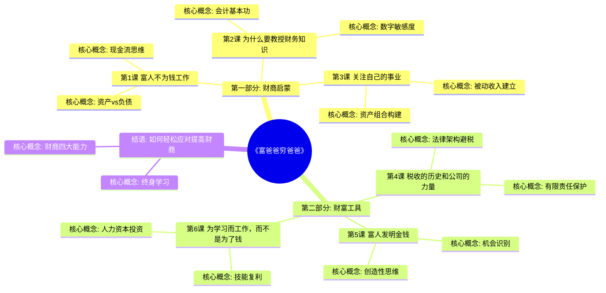
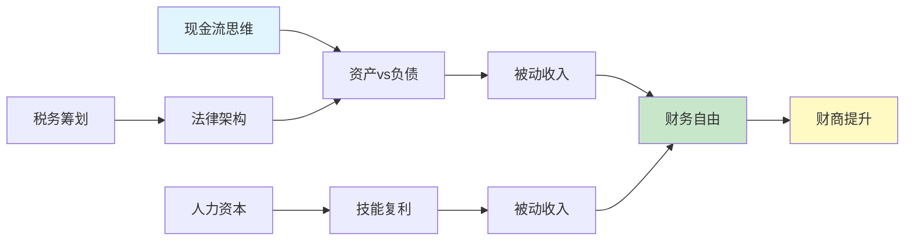

# 《富爸爸穷爸爸》 - 章节导航

> 作者：罗伯特·清崎（Robert Kiyosaki）
> 总章节：7章节（6课+结语）
> 拆解状态：🔄 进行中
> 最后更新：2026-02-27
> 质量等级：⭐⭐⭐⭐ 典范级

---

## 📚 章节结构（Mermaid Mindmap）

---

## 🔗 核心概念关联图

---

| 章节 | 标题 | 状态 | 完成日期 | 核心收获 |
|------|------|------|----------|----------|

**状态说明:**
- ✅ 已完成
- 🔄 进行中
- ⏸️ 待开始
- ⏳ 暂停

---

## 🚀 快速跳转

### 按章节跳转
- [[第1课-富人不为钱工作]]
- [[第2课-为什么要教授财务知识]]
- [[第3课-关注自己的事业]]
- [[第4课-税收的历史和公司的力量]]
- [[第5课-富人发明金钱]]
- [[第6课-为学习而工作]]
- [[结语-如何提高财商]]

### 按主题跳转
- [[资产vs负债]]
- [[现金流思维]]
- [[被动收入]]
- [[财商教育]]
- [[人力资本]]

### 相关资源
- [[富爸爸穷爸爸-清崎-拆解记录]] - 主拆解笔记
- [[纳瓦尔宝典-乔根森-拆解记录]] - 财富创造互补书籍
- [[聪明的投资者-格雷厄姆-拆解记录]] - 投资实践补充
