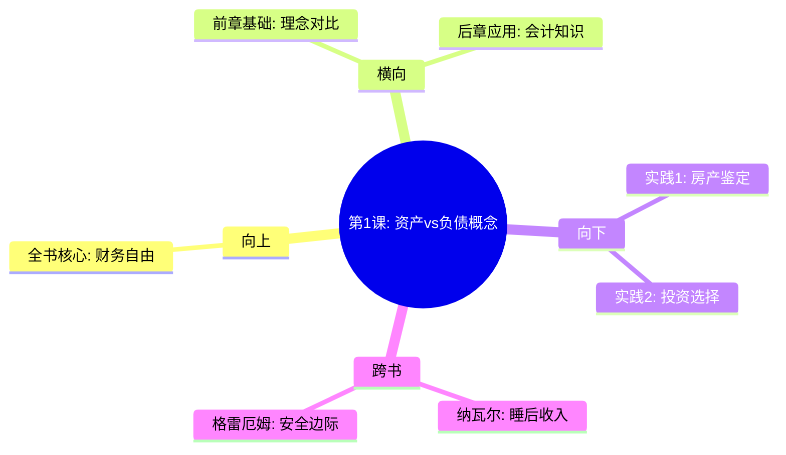

# 第1课 富人不为钱工作

## 📍 章节定位

### 全书位置
> 第一课是整本《富爸爸穷爸爸》的地基，奠定了"资产vs负债"这一贯穿全书的核心原理，为后续6个章节的财富观念奠定了基石

- **全书核心问题**: 如何让钱为我们工作，而不是我们为钱工作？
- **本章回答的问题**: 为什么富人富有而多数人贫穷的根本区别是什么？
- **角色类型**: 开篇定位型/核心概念型，定义整个财富观的基石概念
- **论证位置**: 作为全书开篇，首先提出核心矛盾：两种不同的金钱观念及其结果

### 章节序列
| 方向 | 章节标题 | 逻辑连接 |
|------|----------|----------|
| 前章 | 无 | 开篇第一章，奠定全书基础 |
| 后章 | [[第2课-为什么要教授财务知识]] | 基于"资产vs负债"概念，进一步阐述财务知识的重要性 |

### 一句话定位
第1课是全书的哲学基础，通过"穷爸爸vs富爸爸"的对比，揭示了资产与负债的本质区别，为后续所有理财观念奠定根基。

---

## 🎯 核心观点

### 第一层：表层案例

| 案例名称 | 简要描述 | 页码 | 关键引文 |
|----------|----------|------|----------|
| 穷爸爸故事 | 高学历政府官员，收入稳定但财务窘迫 | p.45-55 | "我买不起" |
| 富爸爸故事 | 八年级辍学商人，财富自由但教育不足 | p.46-50 | "我怎样才能买得起" |
| 工资收入陷阱 | 比尔被高薪绑定，无法跳槽创业 | p.60-65 | "富人买入资产，穷人和中产买入他们以为是资产的负债" |

### 第二层：中层机制

| 机制名称 | 组成要素 | 因果链条 | 证据来源 |
|----------|----------|----------|----------|
| 现金流思维 | 资产vs负债概念 | 财富→现金流入/支出→生活方式 → 财富结果 | 作者亲身经历 |
| 观念决定行为 | 思维模式→行为选择 → 财务结果 | "买不起"stop vs "如何买"start | 两种老爸对比 |
| 工具决定思维 | 管理会计vs财务会计 | 财报看账面价值 vs 现金流状况 | 商学院 vs 富爸爸 |

### 第三层：底层规律

| 规律陈述 | 抽象层级 | 知识连接 | 适用范围 |
|----------|----------|----------|----------|
| 现金流定律 | 经济学/管理学 | [[现金流]] | 个人理财/企业发展 |
| 复利思维 | 数学/金融学 | [[72定律]] | 投资理财/人生规划 |
| 概念框架 | 心理学/教育学 | [[富爸爸穷爸爸-清崎-拆解记录]] | 财商教育 |

---

## 💬 降维翻译

### 观点1: 资产vs负债的本质区别

#### 原文表达
> "资产是把钱放进口袋的东西。负债是把钱从口袋里取走的东西。"
> —— p.55

#### 降维翻译（中学生能懂）
资产就像印钞机或者会下金蛋的鸡，能够不断地给你提供收入。负债就像吃钱的机器，你不仅要投钱进去，还要不断养活它。

#### 日常类比（奶奶能懂）
就像家里的冰箱和生意，冰箱每天耗电吃电费（负债），而做生意可以赚钱让你不用天天上班（资产）。很多人把贵重的车子、豪华的房子当成宝贝，但这些玩意每个月都要花钱保养（就是从你口袋掏钱），这不是宝贝，是负担。

#### 检验
- Q: 如果一个中学生问你资产和负债有什么区别？
- A: 资产能让你躺着赚钱，负债让你起早贪黑养它。

### 观点2: 富人不为钱工作

#### 原文表达
> "富人不为钱工作，而是让钱为他们工作。"
> —— p.40

#### 降维翻译（中学生能懂）
富人花钱买能够帮他们赚钱的东西（资产），而穷人用时间换钱后去买消耗钱的东西（负债）。

#### 日常类比（奶奶能懂）
就像请了工人帮你打工，你在家休息一样道理 —— 富人买了房子、股票等资产，就像雇了自己的"赚钱工"，24小时不间断工作。

#### 检验
- Q: 如果一个中学生问你富人为什么不用那么辛苦？
- A: 因为他们买了能够替自己赚钱的资产，就像雇佣了很多虚拟员工24小时工作。

---

## ✨ 金句库

### 原书金句
| 金句 | 页码 | 适用场景 |
|------|------|----------|
| 富人买入资产，穷人和中产买入他们以为是资产的负债。 | p.42 | 微博/朋友圈分享 |
| 富人让钱为他们工作，而不是为钱而工作。 | p.40 | 文章引用 |
| 资产是把钱放进口袋的东西，负债是从口袋里取走东西。 | p.55 | 普及教育 |
| 房屋是负债，不是资产，如果你必须支付它的话。 | p.90 | 理财科普 |
| 穷爸爸说"我买不起"，富爸爸说"我该如何买得起"。 | p.50 | 心态转变 |

### 降维金句
| 金句 | 来源观点 | 适用场景 |
|------|----------|----------|
| 资产能让你睡着了还在赚钱，负债是闹钟每天都把你叫起来还钱。 | 资产vs负债 | 大众传播 |
| 你买的不是房子，是银行的投资品。 | 负债本质 | 房产反思 |
| 高工资救不了低财商。 | 收入vs财商 | 薪酬反思 |
| 每次你为钱工作，就说明你还没获得财务自由。 | 财务自由 | 职场焦虑 |
| 你花的每一分钱都是你的选择。 | 消费观念 | 理财教育 |

## 🔗 当下映射

### 💰 财富应用
| 场景 | 具体行动 | 预期效果 | 风险提示 |
|------|----------|----------|----------|
| 房产投资 | 用现金流标准判断房产出价 | 买真正的资产，而非虚假投资 | 避免冲动购买自住升级房 |
| 职业选择 | 选择可以学到技能的工作 | 建立人力资本，培养资产眼光 | 避免只看重工资，忽视学习机会 |
| 投资决策 | 建立资产投资池，避免消费性资产 | 培养被动收入来源 | 避免把消费当投资 |

### 💼 职场应用
| 场景 | 具体行动 | 所需能力 | 适用职级 |
|------|----------|----------|----------|
| 35岁危机 | 建立副业收入来源作为资产 | 商业思维、时间管理 | 中高层管理者 |
| 技能提升 | 投资自我技能而非物质奖励 | 持续学习、前瞻性 | 各级员工 |
| 行业选择 | 选择符合现金流思维的行业 | 数据分析、财务管理 | 高级职位 |

### 🏠 生活应用
| 场景 | 具体行动 | 可行性 | 见效时间 |
|------|----------|--------|----------|
| 家庭开支控制 | 建立家庭资产-负债清单 | 高 | 1-3个月 |
| 子女财商教育 | 教导孩子资产vs负债概念 | 高 | 长期 |
| 退休规划 | 投资被动收入产品 | 中 | 5-10年 |

### 72小时行动计划
1. 盘点自己的资产和负债清单，计算每月现金流净额
2. 检视最近一笔大额消费，判断它是资产还是负债
3. 开始记录每日收支，并思考如何创造第一条现金流

---

## 🕸️ 章节关联

### 向上关联 → 整书
- **贡献**: 确立资产vs负债的核心概念，为全书奠定理论基础
- **位置**: 论证的起点，全书概念的发端，一切后续内容的基础

### 横向关联 → 章节间
| 章节编号 | 章节标题 | 关联类型 | 连接描述 |
|----------|----------|----------|----------|
| 第2章 | 为什么要教授财务知识 | 铺垫 | 在理解概念基础上，需要专业知识支撑 |
| 第3章 | 关注自己的事业 | 铺垫 | 建立资产，而非只买负债 |
| 第5章 | 富人发明金钱 | 呼应 | 富人发现创造资产的途径 |

### 向下关联 → 具体应用
| 应用场景 | 难度 | 前置知识 |
|----------|------|----------|
| 个人财务诊断 | 低 | 会计基础知识 |
| 房产投资决策 | 中 | 现金流分析 |
| 被动收入建立 | 高 | 投资经验、风险管理 |

### 跨书关联 → 知识网络
| 书籍 | 概念 | 关系 | 备注 |
|------|------|------|------|
| [[纳瓦尔宝典-乔根森-拆解记录]] | 睡后收入 | 支持 | 清崎说"资产"，纳瓦尔说"睡后收入" |
| [[聪明的投资者-格雷厄姆-拆解记录]] | 安全边际 | 呼应 | 都强调理性的投资思维 |
| [[反脆弱-塔勒布-拆解记录]] | 风险规避 | 呼应 | 构建资产即构建韧性 |

### 关联可视化

---

## ❓ 问答设计

### Q1: 穷爸爸和富爸爸的核心区别是什么？（记忆型）
**认知层次**: 记忆
**难度**: 低
**答案要点**:
- 思维模式：穷爸爸说"我买不起"会停止思考，富爸爸说"我怎样才能买得起"会启动思考
- 收入模式：穷爸爸依赖工资收入，富爸爸依赖被动收入
- 风险态度：穷爸爸规避风险，富爸爸学习如何管控风险

### Q2: 什么是资产？什么是负债？（理解型）
**认知层次**: 理解
**难度**: 中
**答案要点**:
- 资产：把钱放进口袋的东西，现金流为正
- 负债：把钱从口袋取走的东西，现金流为负
- 判断标准：现金流量而非账面价值

### Q3: 为什么大多数人的房子其实是负债而非资产？（应用型）
**认知层次**: 应用
**难度**: 中
**答案要点**:
- 大多数房子需要还房贷、保险、物业费、维修费
- 这些费用持续流出，而非流入
- 房产增值是账面价值，现金流为负

### Q4: 分析自己当前的财务状况，判断你的主要资产和负债类别。（分析型）
**认知层次**: 分析
**难度**: 高
**答案要点**:
- 列出所有物品（车、房、存款、股票等）
- 按现金流方向归类
- 分析资产与负债的比例

### Q5: 假设你是富爸爸，面对金融危机，你会如何调整资产配置？（创造性）
**认知层次**: 创造性
**难度**: 高
**答案要点**:
- 在危机中寻找被低估的资产
- 减少负债，增加现金流正向的资产
- 考虑法律工具如公司架构保护资产

### Q6: 为什么说"富人不为钱工作"？（理解型）
**认知层次**: 理解
**难度**: 中
**答案要点**:
- 富人靠资产产生收入，而非劳动换取收入
- 资产是被动收入的源泉
- 一旦资产产生的现金流超过生活开支，就达到财务自由

### Q7: 如何判断一项投资是否为真正的资产？（分析型）
**认知层次**: 分析
**难度**: 中
**答案要点**:
- 是否带来现金流进项
- 是否能够自主增值
- 风险与收益是否可控

### Q8: 现金流思维和传统的收入思维有何差异？（分析型）
**认知层次**: 分析
**难度**: 中
**答案要点**:
- 收入思维重视表面工资，现金流思维重视净流入
- 收入思维关注当下花费，现金流思维关注长期收益
- 收入思维导致为钱工作，现金流思维导向让钱工作

### Q9: 哪些常见的"资产"实际上是负债？（应用型）
**难度**: 中
**认知层次**: 应用
**答案要点**:
- 自住商品房（贷款、费用）
- 个人汽车（折旧、保险、油费）
- 珠宝古董（维护成本、流动性差）

### Q10: 如何从消费思维转向投资思维？（应用型）
**认知层次**: 应用
**难度**: 中
**答案要点**:
- 购买前思考是否为自己带来正现金流
- 优先选择可以生钱的资产
- 控制负债消费

### Q11: 年薪50万却仍然感觉压力大的原因是什么？（分析型）
**认知层次**: 分析
**难度**: 高
**答案要点**:
- 高收入被高负债绑定
- 缺乏被动收入来维持支出
- 陷入老鼠赛跑的循环

### Q12: 如果只允许投资一种资产，富爸爸会选择什么？（评价型）
**认知层次**: 评价
**难度**: 高
**答案要点**:
- 能产生稳定现金流的资产
- 如租赁房地产、分红蓝筹股
- 现金牛性质的业务

### Q13: 哪些人群最容易陷入负债误区？（分析型）
**认知层次**: 分析
**难度**: 中
**答案要点**:
- 高收入但单一来源的职业
- 缺乏财商教育的中产阶级
- 盲目信任传统价值观的人群

### Q14: 消费主义文化如何阻止人们积累真正资产？（分析型）
**认知层次**: 分析
**难度**: 高
**答案要点**:
- 鼓励购买负债伪装成的资产
- 渲染消费带来幸福感
- 隐藏负债的真实成本

### Q15: 富爸爸和穷爸爸在对待风险的态度上有何根本差异？（理解型）
**认知层次**: 理解
**难度**: 中
**答案要点**:
- 穷爸爸回避风险，富爸爸学习管控风险
- 穷爸爸认为安全是稳定工作，富爸爸认为安全是资产收入
- 学习比避免更重要的风险管控观

---
