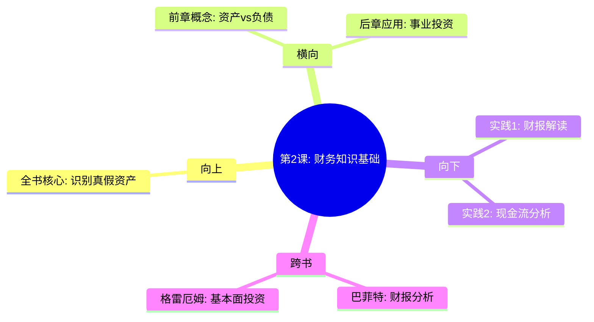

---

category: 
  - 书籍拆解
  - "富爸爸穷爸爸"
status: draft
chapter: 
number: 2
title: 为什么要教授财务知识
links:

  - "[[第1课-富人不为钱工作]]"
  - "[[第3课-关注自己的事业]]"
created: 2026-02-27
tags:
  - 富爸爸穷爸爸
  - 财务知识
  - 会计基础
  - 财商教育
description: "第二课承接第一课\"资产vs负债\"的概念，详解实现财富观念转变的技术基础——财务知识与会计技能，为后续实操奠定方法论"
---

# 第2课 为什么要教授财务知识

## 📍 章节定位

### 全书位置
> 第二课承接第一课"资产vs负债"的概念，详解实现财富观念转变的技术基础——财务知识与会计技能，为后续实操奠定方法论

- **全书核心问题**: 如何具备识别资产与负债的财务技能？
- **本章回答的问题**: 究竟需要掌握哪些财务知识才能识别真伪资产？
- **角色类型**: 核心概念型，详解财务分析技能
- **论证位置**: 承接概念提出环节，进入具体分析方法环节

### 章节序列
| 方向 | 章节标题 | 逻辑连接 |
|------|----------|----------|
| 前章 | [[第1课-富人不为钱工作]] | 基于"资产vs负债"概念，深入财务分析方法 |
| 后章 | [[第3课-关注自己的事业]] | 掌握财务知识后，才能聚焦真正事业 |

### 一句话定位
第2课是财务知识的入门课，教会你读懂财务报表，识别资产与负债，为后续构建财富大厦奠定基础技能。

---

## 🎯 核心观点

### 第一层：表层案例

| 案例名称 | 简要描述 | 页码 | 关键引文 |
|----------|----------|------|----------|
| 会计小白困惑 | 作者大学选修会计后发现，原来财务知识如此重要 | p.75-80 | "学会读财务报表就像学会了理财的基本语法" |
| 现金流表误解 | 大多数人只看利润表，忽略现金流表 | p.80-85 | "现金流比利润更重要" |
| 财报分析训练 | 富爸爸教作者通过财报识别真假投资机会 | p.85-90 | "好的投资者通过财务报表看懂企业的健康状况" |

### 第二层：中层机制

| 机制名称 | 组成要素 | 因果链条 | 证据来源 |
|----------|----------|----------|----------|
| 财报解读机制 | 资产负债表+损益表+现金流表 | 看懂数字 → 识别风险 → 正确投资 | 财报实例分析 |
| 数字素养机制 | 会计基础+财务指标+风险控制 | 数据分析 → 投资决策 → 财务结果 | 理论实例结合 |
| 视角转换机制 | 财务知识 → 专业视角 → 财富洞察 | 学习技能 → 视角变化 → 决策升级 | 作者亲身体验 |

### 第三层：底层规律

| 规律陈述 | 抽象层级 | 知识连接 | 适用范围 |
|----------|----------|----------|----------|
| 数据驱动决策 | 认知科学/管理学 | 财务数据分析 | 投资决策/企业管理 |
| 数字素养要求 | 教育学/认知学 | 量化思维 | 个人理财/商业评估 |
| 专业壁垒理论 | 市场竞争理论 | 信息不对称 | 金融市场/投资领域 |

---

## 💬 降维翻译

### 观点1: 读财报就像读说明书

#### 原文表达
> "掌握财务知识的真正意义在于，它能让你看清数字后面的事实和机会。"
> —— p.78

#### 降维翻译（中学生能懂）
会计和财务知识其实就是帮你读懂企业"体检报告"的工具。学会看财报，就像掌握了理财的基本语法，可以更好地判断一个投资项目是好是坏。

#### 日常类比（奶奶能懂）
就像买东西要看营养成分表一样，投资也要看公司的健康报告。看不懂营养成分，可能会买到有害食品；看不懂财报，可能会掉进投资陷阱。

#### 检验
- Q: 如果一个中学生问你看财报有什么用？
- A: 就像看医生要验血，投资要看公司有没有生病，能不能赚钱。

### 观点2: 现金流比利润更重要

#### 原文表达
> "许多企业看起来盈利，但现金流却是负的，它们是在出售未来来支撑现在。"
> —— p.82

#### 降维翻译（中学生能懂）
一个企业账面上赚了100万，但如果客户没付钱（应收账款很高），现金账户反而是亏的。真正的赚钱是现金实实在在进账。

#### 日常类比（奶奶能懂）
就像一家店，看起来生意很好（销售额高），但如果客户都挂账没给钱，老板连房租都付不起，这就不是真正的好生意。

#### 检验
- Q: 如果一个中学生问现金流和利润有什么区别？
- A: 利润是有多少钱，现金流是手上有多少钱，没现金周转就可能倒闭。

---

## ✨ 金句库

### 原书金句
| 金句 | 页码 | 适用场景 |
|------|------|----------|
| 财务知识是你财务自由的基础 | p.77 | 财商教育 |
| 掌握会计就是掌握了解读商业世界的语言 | p.79 | 个人提升 |
| 现金流比利润更重要 | p.81 | 投资理念 |
| 不懂数字的人会被数字玩弄 | p.83 | 哲理警示 |
| 投资者必须看懂财务报表 | p.82 | 投资教育 |

### 降维金句
| 金句 | 来源观点 | 适用场景 |
|------|----------|----------|
| 财报就是公司的体检报告 | 财报解读 | 科普教育 |
| 没钱的企业赚再多纸面利润也会死 | 现金流vs利润 | 投资提醒 |
| 专业的钱要用专业的眼光看 | 数字素养 | 理念转变 |
| 财商是现代人必备技能 | 财商重要性 | 时代特征 |
| 躲避财务知识等于主动放弃财富 | 财技必要性 | 动机激发 |

## 🔗 当下映射

### 💰 财富应用
| 场景 | 具体行动 | 预期效果 | 风险提示 |
|------|----------|----------|----------|
| 股票投资 | 学会查阅上市公司财报 | 降低投资风险，避开价值陷阱 | 避免技术分析，注重基本面 |
| P2P/理财选择 | 查看借款方财务数据 | 保障资金安全性 | 避免只看收益不看资产 |
| 创业融资 | 自身财务规划与展示 | 提高项目可信度 | 避免财务混乱影响估值 |

### 💼 职场应用
| 场景 | 具体行动 | 所需能力 | 适用职级 |
|------|----------|----------|----------|
| 管理岗位 | 财务预算与分析 | 财务基础、成本控制 | 中高层管理者 |
| 投行/咨询工作 | 财报分析与评估 | 财务建模、风险评估 | 中高级专业岗 |
| 企业高管 | 预算制定与监控 | 战略财务、资本运作 | C级及高管层 |

### 🏠 生活应用
| 场景 | 具体行动 | 可行性 | 见效时间 |
|------|----------|--------|----------|
| 家庭理财 | 建立家庭资产负债表 | 高 | 立即可执行 |
| 购房决策 | 看房产开发商财务实力 | 中 | 1-3个月准备期 |
| 教育投资 | 分析学校/培训机构财务透明度 | 高 | 决策期立即用 |

### 72小时行动计划
1. 选取一家上市公司的年报，学习查看资产负债表
2. 试着分析一家企业是重资产还是轻资产运营
3. 开始建立自己的个人财务健康监测体系

---

## 🕸️ 章节关联

### 向上关联 → 整书
- **贡献**: 承接第1章的资产vs负债概念，为具体操作提供技能支持
- **位置**: 从理论认识向技能实践转换的桥梁环节

### 横向关联 → 章节间
| 章节编号 | 章节标题 | 关联类型 | 连接描述 |
|----------|----------|----------|----------|
| 第1章 | 富人不为钱工作 | 铺垫 | 明确概念后，需要技能支撑 |
| 第3章 | 关注自己的事业 | 承接 | 掌握财务技能才能关注自己的事业 |
| 第4章 | 税收的历史和公司的力量 | 承接 | 学习财报分析为进一步理解税务做铺垫 |

### 向下关联 → 具体应用
| 应用场景 | 难度 | 前置知识 |
|----------|------|----------|
| 个股分析 | 中 | 会计基础知识 |
| 投资决策 | 中 | 财务指标理解 |
| 风险识别 | 高 | 多年财经实践经验 |

### 跨书关联 → 知识网络
| 书籍 | 概念 | 关系 | 备注 |
|------|------|------|------|
| [[纳瓦尔宝典-乔根森]] | 基本面投资 | 支持 | 都强调专业技能在投资中的重要性 |
| [[聪明的投资者-格雷厄姆]] | 财务分析 | 支持 | 某种程度上是格雷厄姆方法的简化版 |
| [[巴菲特致股东信-巴菲特]] | 财报阅读 | 支持 | 清崎的方法论来源于巴菲特思路的启发 |

### 关联可视化

---

## ❓ 问答设计

### Q1: 为什么需要财务知识才能实现财务自由？（记忆型）
**认知层次**: 记忆
**难度**: 低
**答案要点**:
- 财务知识是识别资产和负债的工具
- 财务知识帮你做出正确的投资决策
- 掌握财务知识可以避免被人误导投资

### Q2: 什么是三张主要财务报表，它们分别表达什么？（记忆型）
**认知层次**: 记忆
**难度**: 低
**答案要点**:
- 资产负债表：企业在某一时点的财务状况（净资产）
- 损益表：企业在一段时间内的经营成果（盈利状况）
- 现金流量表：企业在一段时间内的现金往来情况（进出流动）

### Q3: 为什么说现金流比利润更重要？（理解型）
**认知层次**: 理解
**难度**: 中
**答案要点**:
- 获利不代表有钱可用，只有现金才是可用货币
- 企业可能纸面利润很大但现金短缺面临周转困难
- 现金是企业生存的血液，没有现金就可能破产

### Q4: 如何通过财务报表判断一家企业是否健康？（应用型）
**认知层次**: 应用
**难度**: 中
**答案要点**:
- 查看现金流量表（经营活动现金流是否为正值）
- 检查负债率是否过高（通常低于40%-50%较安全）
- 分析营收及利润增长率是否可持续

### Q5: 个人理财中如何运用会计思维？（分析型）
**认知层次**: 分析
**难度**: 高
**答案要点**:
- 建立个人资产负债表：统计净资产
- 记录个人损益表：记录收入支出情况
- 记录个人现金流量表：分析资金进出状况

### Q6: 什么是会计视角，它对普通人有什么意义？（理解型）
**认知层次**: 理解
**难度**: 中
**答案要点**:
- 从现金流和真实财务状况角度分析问题
- 不只看表面账面数据，要看实际价值
- 帮助识别真实的商业机会而非假象

### Q7: 懂财务知识的人比不懂财务知识的人有哪些优势？（理解型）
**认知层次**: 理解
**难度**: 中
**答案要点**:
- 能识别优质企业和投资机会
- 不容易被夸张的数据误导
- 具备基本的商业判断能力

### Q8: 哪些财报上的数字容易被人利用来进行伪装？（分析型）
**认知层次**: 分析
**难度**: 高
**答案要点**:
- 营业收入：可能有关联交易粉饰
- 利润：可通过一次性收益调节
- 应收账款：虚增收入的重要手段
- 长期待摊费用：隐藏亏损的工具

### Q9: 如何看懂一份资产负债表的关键信息？（应用型）
**认知层次**: 应用
**难度**: 中
**答案要点**:
- 看负债占总资产比重
- 分析流动资产与流动负债比率
- 关注应收账款与存货变动

### Q10: 多少比例的个人应该掌握基础财务知识？（评价型）
**难度**: 中
**认知层次**: 评价
**答案要点**:
- 对于有投资理财需求的人群：80%以上
- 对于有一定积蓄的中产家庭：90%以上
- 对于创业者和投资者：100%

### Q11: 财务知识与数学知识有何异同？（分析型）
**认知层次**: 分析
**难度**: 中
**答案要点**:
- 相似：都需要理解数字关系
- 财务是特定领域的数字应用
- 数学更偏理论，财务更注重实用

### Q12: 没有财务背景的人如何快速掌握基本概念？（应用型）
**认知层次**: 应用
**难度**: 中
**答案要点**:
- 从简单的个人财务记录开始练习
- 查阅上市公司的年报分析
- 关注专业的财经资讯

### Q13: 为什么很多高学历人士不懂财务知识？（分析型）
**认知层次**: 分析
**难度**: 高
**答案要点**:
- 传统教育体系偏重理论教学，忽视实用技能
- 很多人认为理财是"钱多才需要懂的事"
- 金融业专业术语造成了理解门槛

### Q14: 财务知识对职业发展有什么帮助？（应用型）
**认知层次**: 应用
**难度**: 中
**答案要点**:
- 有助于理解公司运营机制和业绩表现
- 提升商业视野和战略判断能力
- 促进与管理层的有效沟通

### Q15: 掌握财务知识能否帮助普通人发现被低估的投资机会？（综合性）
**认知层次**: 综合应用
**难度**: 高
**答案要点**:
- 能够识别市场忽视的优质企业
- 透过复杂的财务数据发现真实价值
- 建立独立的投资判断体系

---
