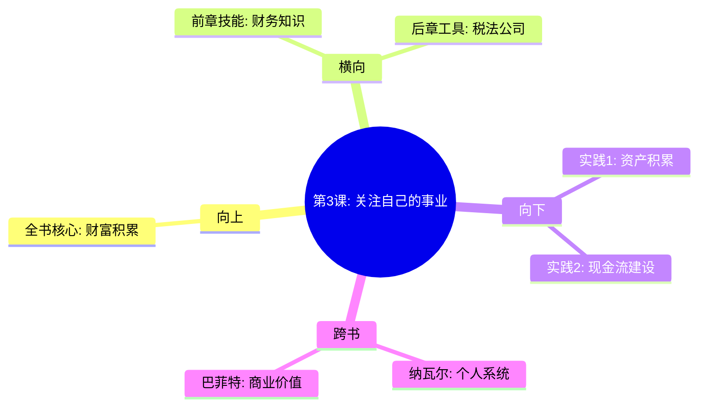

---

category: 
  - 书籍拆解
  - "富爸爸穷爸爸"
status: draft
chapter: 
number: 3
title: 关注自己的事业
links:

  - "[[第2课-为什么要教授财务知识]]"
  - "[[第4课-税收的历史和公司的力量]]"
created: 2026-02-27
tags:
  - 富爸爸穷爸爸
  - 自己的事业
  - 被动收入
  - 资产积累
description: "第三课是行动转换的重要章节，从概念认知和技术储备转向实际操作，详解如何积累和建设个人资产，推动实现财务自由"
---

# 第3课 关注自己的事业

## 📍 章节定位

### 全书位置
> 第三课是行动转换的重要章节，从概念认知和技术储备转向实际操作，详解如何积累和建设个人资产，推动实现财务自由

- **全书核心问题**: 如何建立属于自己的财富帝国，而不只是工作赚钱消费循环?
- **本章回答的问题**: 哪些才是属于自己的事业，如何区分工作与事业?
- **角色类型**: 核心实践型，指导实际行动
- **论证位置**: 从前两章的理念和技能，正式进入实践层面

### 章节序列
| 方向 | 章节标题 | 逻辑连接 |
|------|----------|----------|
| 前章 | [[第2课-为什么要教授财务知识]] | 有了财务知识，接下来要知道干什么 |
| 后章 | [[第4课-税收的历史和公司的力量]] | 明确自己的事业后，需要用法律工具保护资产 |

### 一句话定位
第3课是战略规划指南，教你如何把有限的收入转化为资产，建立属于自己的财富引擎，摆脱打工思维。

---

## 🎯 核心观点

### 第一层：表层案例

| 案例名称 | 简要描述 | 页码 | 关键引文 |
|----------|----------|------|----------|
| 工作者 vs 业主 | 清崎打工时发现，真正赚钱的是物业的拥有者而非劳动者 | p.100-105 | "关注你的事业，不是你为之工作的事业" |
| 演员理财 | 许多演员收入很高，但由于缺乏财商，常常破产 | p.105-110 | "高收入无法弥补低财商的损失” |
| 房产投资策略 | 用现金流标准来挑选和管理房地产投资 | p.110-115 | "真正重要的不是你赚了多少钱，而是你留下了多少钱，以及如何让这些钱为你工作" |

### 第二层：中层机制

| 机制名称 | 组成要素 | 因果链条 | 证据来源 |
|----------|----------|----------|----------|
| 收入分配机制 | 支出控制+投资储蓄+资产积累 | 控制负债支出 → 增加可投资资产 → 建立现金流系统 | 作者实际操作案例 |
| 资产构建机制 | 识别资产+购买资产+经营资产 | 会计知识+财务技能 → 资产配置决定 → 被动收入结果 | 富爸爸教导理论 |
| 风险分散机制 | 多样化投资+现金流管理+风险控制 | 从工资依赖 → 多元收入 → 财务自由 | 真实投资案例 |

### 第三层：底层规律

| 规律陈述 | 抽象层级 | 知识连接 | 适用范围 |
|----------|----------|----------|----------|
| 财富积累定律 | 经济学/金融学 | [[复利]] | 投资理财 |
| 收入分配逻辑 | 财政学/税收学 | 劳动报酬 vs 资本收益 | 个人财务规划 |
| 资本配置原则 | 投资学理论 | 资产配置 | 金融投资 |

---

## 💬 降维翻译

### 观点1: 工作与事业的区分

#### 原文表达
> "许多人混淆了自己的职业和自己的事业。你的职业是你为之工作的事业，你的事业才是你能拥有并在将来购买资产来创造收入的系统。"
> —— p.101

#### 降维翻译（中学生能懂）
工作就是你去帮别人赚钱，事业是你建立一个能替你赚钱的系统。比如你去麦当劳干活是工作，开麦当劳加盟店是事业。

#### 日常类比（奶奶能懂）
就像有个馒头店，去店里打工就是你的时间换老板的钱，而自己开馒头店就是让自己拥有一台赚钱的机器。大多数人一辈子都在替别人开馒头店，而自己并没有真正属于自己的收入来源。

#### 检验
- Q: 如果一个中学生问你工作和事业有什么区别？
- A: 工作是别人给你的任务，事业是你给自己创造的赚钱系统。

### 观点2: 收入留存与再投资

#### 原文表达
> "不要把房子作为你的主要投资，要积累那些能够产生现金流的资产。"
> —— p.110

#### 降维翻译（中学生能懂）
很多人觉得买房就是理财投资，但其实房子每个月要花很多钱（贷款、物业费、维修），真正的投资应该是能给你带来收入的东西。

#### 日常类比（奶奶能懂）
就像有些人拼命省钱买贵重首饰，但珠宝不会带来收入。真正聪明的是买下能产生价值的店铺或农场，让这些东西替你赚钱。

#### 检验
- Q: 如果一个中学生问你什么样的投资才真正赚钱？
- A: 能够持续给你带来收入的才是投资，要花钱保养的就是消费。

---

## ✨ 金句库

### 原书金句
| 金句 | 页码 | 适用场景 |
|------|------|----------|
| 关注你的事业，而不是你的职业 | p.102 | 职业规划 |
| 你的房子不一定是资产，如果它不能产生收入 | p.110 | 房产反思 |
| 真正的资产能产生现金流，负债要消耗现金流 | p.100 | 财富教育 |
| 高收入无法弥补低财商的损失 | p.106 | 理财教育 |
| 建立你的资产组合比提高收入更重要 | p.108 | 投资理念 |

### 降维金句
| 金句 | 来源观点 | 适用场景 |
|------|----------|----------|
| 职业是给别人赚钱，事业是给自己赚钱 | 职业vs事业 | 职业选择 |
| 真投资让你躺着赚钱，假投资让你跑断腿 | 真伪投资 | 理财观念 |
| 高收入治不好低财商的病 | 财商vs收入 | 薪酬观念 |
| 现金流比收益率更重要 | 收入质量 | 投资策略 |
| 把工作当成跳板，把投资当做目标 | 理念转变 | 人生规划 |

## 🔗 当下映射

### 💰 财富应用
| 场景 | 具体行动 | 预期效果 | 风险提示 |
|------|----------|----------|----------|
| 理财规划 | 确保收入的一部分用于购买资产而非负债 | 建立稳定的被动收入来源 | 避免只看收益率忽视现金流 |
| 房产投资 | 按现金流标准衡量房产投资价值 | 选到真正的资产而非负债 | 避免高负债率房产 |
| 投资组合 | 构建现金流稳定的资产组合 | 分散投资风险，增加被动收入 | 避免集中投资带来的脆弱性 |

### 💼 职场应用
| 场景 | 具体行动 | 所需能力 | 适用职级 |
|------|----------|----------|----------|
| 副业规划 | 选择有助于建立自身资产系统的副业 | 市场分析、资源配置 | 各级员工 |
| 职业转型 | 将职业技能转化为可投资资产 | 专业技能、商业洞察 | 高级专业人才 |
| 创业规划 | 打造可持续、有现金流的业务模式 | 商业策划、执行能力 | 企业创始人 |

### 🏠 生活应用
| 场景 | 具体行动 | 可行性 | 见效时间 |
|------|----------|--------|----------|
| 家庭财务规划 | 建立家庭净资产提升计划 | 高 | 1-5年可初见成效 |
| 子女财商教育 | 教授子女区分工作与事业思维 | 高 | 长期影响 |
| 消费习惯调整 | 提升消费的资产属性 | 高 | 即时开始可见效 |

### 72小时行动计划
1. 绘制自己的月度现金流图，区分收入来源与支出类别
2. 开始寻找可替换被动支出（订阅服务、可选消费）的替代方案
3. 研究一个小规模的资产投资机会（金额可控）

---

## 🕸️ 章节关联

### 向上关联 → 整书
- **贡献**: 将前两课的概念和技能转化为实际行动指南，为真正的致富之路奠定基础
- **位置**: 理念技术实践转化的关键环节

### 横向关联 → 章节间
| 章节编号 | 章节标题 | 关联类型 | 连接描述 |
|----------|----------|----------|----------|
| 第2章 | 为什么要教授财务知识 | 延续 | 在财务知识基础上开展实际行动 |
| 第4章 | 税收的历史和公司的力量 | 铺垫 | 了解自己的事业后，需要用公司架构保护 |
| 第5章 | 富人发明金钱 | 引导 | 探索新的事业形式和商业模式 |

### 向下关联 → 具体应用
| 应用场景 | 难度 | 前置知识 |
|----------|------|----------|
| 个人资产配置 | 中 | 基础会计财务知识 |
| 房地产投资 | 高 | 物业评估与市场分析 |
| 股票基金投资 | 中 | 投资组合知识 |

### 跨书关联 → 知识网络
| 书籍 | 概念 | 关系 | 备注 |
|------|------|------|------|
| [[纳瓦尔宝典-乔根森]] | 建立系统vs出卖时间 | 神合 | 都强调时间杠杆的重要意义 |
| [[聪明的投资者-格雷厄姆]] | 投资vs投机 | 支持 | 为投资实践提供方法指导 |
| [[巴菲特致股东信-巴菲特]] | 企业的内在价值 | 支持 | 提升资产识别与筛选能力 |

### 关联可视化

---

## ❓ 问答设计

### Q1: 如何区分工作和事业？（记忆型）
**认知层次**: 记忆
**难度**: 低
**答案要点**:
- 工作是为别人赚钱，事业是为自己创造收入的系统
- 工作需要你亲自参与，事业可以替你工作
- 工作停止收入结束，事业可以持续产生现金流

### Q2: 为什么要把注意力放在自己的事业上？（理解型）
**认知层次**: 理解
**难度**: 中
**答案要点**:
- 职业只是短期收入来源，容易受外部影响
- 自己的事业才是长久、可持续的收入保障
- 事业可以不断复制和增长，不受个人时间限制

### Q3: 如何判断一个投资机会是否属于自己事业的一部分？（应用型）
**认知层次**: 应用
**难度**: 中
**答案要点**:
- 是否能产生持续现金流收入
- 是否可以规模化或复制
- 是否有助于降低对工资的依赖

### Q4: 分析你当前的工作，如何把它转化为事业的一部分？（分析型）
**认知层次**: 分析
**难度**: 高
**答案要点**:
- 从工作中识别可带走的技能和资源
- 寻找技能转化的创业机会
- 建立个人品牌和客户资源积累

### Q5: 从传统职业转向建立个人事业，会面临哪些挑战？（分析型）
**认知层次**: 分析
**难度**: 高
**答案要点**:
- 收入波动性和不确定性增加
- 需要建立自己的商业模式和客户群体
- 风险管理和资本筹备的挑战

### Q6: 建立个人事业需要哪些核心技能？（理解型）
**认知层次**: 理解
**难度**: 中
**答案要点**:
- 市场洞察和客户需求理解
- 业务模式设计和优化
- 风险识别和管理能力

### Q7: 如何平衡现职工作的稳定性与个人事业的开拓？（应用型）
**认知层次**: 应用
**难度**: 中
**答案要点**:
- 利用业余时间进行个人项目探索
- 建立个人事业直到有稳定现金流后考虑转变
- 避免过早放弃主要收入源

### Q8: 哪些因素会让你的个人事业更具可持续性？（分析型）
**认知层次**: 分析
**难度**: 高
**答案要点**:
- 商业模式的可扩展性
- 竞争优势的持久性
- 现金流的稳定性

### Q9: 建立个人事业前，如何评估自己的资源和条件？（应用型）
**认知层次**: 应用
**难度**: 中
**答案要点**:
- 评估个人专业技能的独特性
- 识别可调动的资金和人脉资源
- 分析市场机会与风险承受能力

### Q10: 职业经理人与创业者在思维模式上有哪些显著差异？（评价型）
**认知层次**: 评价
**难度**: 高
**答案要点**:
- 关注点：执行 vs 战略
- 衡量标准：短期kpi vs 长期价值
- 决策框架：局部最优 vs 系统最优

### Q11: 多数人在建立个人事业时最容易犯的错误是什么？（分析型）
**认知层次**: 分析
**难度**: 高
**答案要点**:
- 过度依赖个人劳动，缺乏规模化意识
- 忽视现金流管理，追求账面好看
- 缺乏长期规划，容易被短期诱惑影响

### Q12: 什么时候适合将个人爱好转化为事业？（应用型）
**认知层次**: 应用
**难度**: 中
**答案要点**:
- 爱好有一定的市场需求和变现潜力
- 自己具备相关的专业能力和资源
- 风险可控，不影响基本生活保障

### Q13: 在数字化时代如何建立可持续的个人事业？（分析型）
**认知层次**: 分析
**难度**: 高
**答案要点**:
- 利用数字工具降低运营成本
- 建立在线资产如IP、内容、数据
- 搭建可复制的自动营销系统

### Q14: 理解"关注自己的事业"概念后，如何开始行动？（理解型）
**认知层次**: 理解
**难度**: 中
**答案要点**:
- 开始记录与分析个人收入支出模式
- 熟悉投资品种和基本市场原理
- 探索时间换时间的商业模式

### Q15: 个人事业和被动收入之间是什么样的关系？（综合性）
**认知层次**: 综合应用
**难度**: 高
**答案要点**:
- 个人事业是建立被动收入的前提
- 被动收入是个人事业成功的标志
- 二者相互促进，形成良性循环

---
