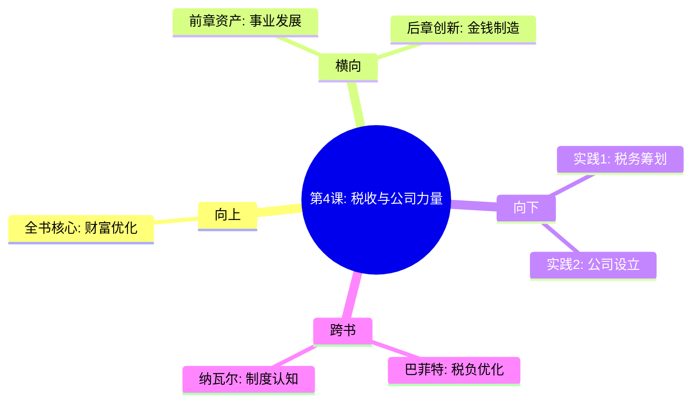

---

category: 
  - 书籍拆解
  - "富爸爸穷爸爸"
status: draft
chapter: 
number: 4
title: 税收的历史和公司的力量
links:

  - "[[第3课-关注自己的事业]]"
  - "[[第5课-富人发明金钱]]"
created: 2026-02-27
tags:
  - 富爸爸穷爸爸
  - 税收政策
  - 公司结构
  - 法律工具
---

# 第4课 税收的历史和公司的力量

## 📍 章节定位

### 全书位置
> 第四课揭示法律和税收制度的重要影响，教你如何利用公司结构等法律工具来保护和增长个人财富，是实现财务自由的利器章节

- **全书核心问题**: 法律税收制度如何影响个人财富积累？如何合法利用制度优势？
- **本章回答的问题**: 为何富人和普通人在税务方面差异巨大？公司是如何助力财富增长的？
- **角色类型**: 工具应用型，详解税收和法律的理财作用
- **论证位置**: 在建立资产之后，教你会用工具保护和放大资产效应

### 章节序列
| 方向 | 章节标题 | 逻辑连接 |
|------|----------|----------|
| 前章 | [[第3课-关注自己的事业]] | 在拥有资产后，需要用工具保护资产 |
| 后章 | [[第5课-富人发明金钱]] | 掌握基础法律工具后，进一步创造财富机会 |

### 一句话定位
第4课是财富保护指南，教你利用公司结构、法律架构和税收优惠政策来保护收入和资产，最大化财富增长效益。

---

## 🎯 核心观点

### 第一层：表层案例

| 案例名称 | 简要描述 | 页码 | 关键引文 |
|----------|----------|------|----------|
| 税收差异故事 | 富人利用公司结构合法节税，而中产缴税比例更高 | p.120-125 | "税收是劫富济贫，而富人通过法律工具绕过这个系统" |
| 公司优势案例 | 富爸爸用自己的公司支付各项开支，减少税负 | p.125-130 | "公司可以用税前列支各种费用，个人不可以" |
| 法律保护 | 公司结构可以保护个人财产免受商业风险影响 | p.130-135 | "你的公司保护你的资产，同时保护你的隐私" |

### 第二层：中层机制

| 机制名称 | 组成要素 | 因果链条 | 证据来源 |
|----------|----------|----------|----------|
| 税收分流机制 | 工薪所得税 vs 投资收入税率 vs 公司税率 | 税收负担 → 财富留存 → 投资复利 | 实际税率对比分析 |
| 公司保护机制 | 有限责任 + 资产隔绝 + 税收优惠 | 法律框架 → 财产权保护 → 风险防控 | 公司法条例 |
| 财富工具机制 | 法律 + 税收 + 金融工具组合 | 制度优势 → 财富保值增值 → 财务自由 | 富人实践经验 |

### 第三层：底层规律

| 规律陈述 | 抽象层级 | 知识连接 | 适用范围 |
|----------|----------|----------|----------|
| 制度优势法则 | 经济学/法学 | 制度经济学 | 财富分配 |
| 财富转移机制 | 政治经济学 | 财富掠夺与保护 | 法律税务 |
| 财务优化原理 | 金融学理论 | 税后收益 | 投资优化 |

---

## 💬 降维翻译

### 观点1: 税收制度的设计目的

#### 原文表达
> "税收制度原本是为了向富人征税而制定的，但是由于税法的漏洞和富人聘请的专业团队，税收反而成了'劫贫济富'。"
> —— p.123

#### 降维翻译（中学生能懂）
税法本来是想让富人多交点税，可是富人有钱请专业人员利用法律缝隙，结果普通上班族交的税反而比富人多。

#### 日常类比（奶奶能懂）
就像马路上的交通规则，普通人要乖乖遵守，富人可以找到一些特殊道路（比如专用车道），既能更快到达目的地，还能享受优惠。

#### 检验
- Q: 如果一个中学生问你为什么富人交税少？
- A: 因为富人懂法律条文，可以找到合法少交税的方法，而普通人只能老老实实交税。

### 观点2: 公司结构的优势

#### 原文表达
> "富人创办企业，利用企业来积累财富和减少税收负担。公司可以列支大量费用，个人却无法做到。"
> —— p.127

#### 降维翻译（中学生能懂）
公司是富人常用的财富工具，公司可以报销很多费用（差旅、培训、设备等），而个人则不行，这样就减少了应纳税所得额。

#### 日常类比（奶奶能懂）
就像开个小店，店里很多费用都能计入成本，比如灯泡坏了、房租水电，这些东西都是为了赚钱用的，就能抵扣税，这样实际交的税就少了。

#### 检验
- Q: 如果一个中学生问你开公司有什么好处？
- A: 可以用公司的名义报销很多与赚钱相关的支出，从而减少需要交的税。

---

## ✨ 金句库

### 原书金句
| 金句 | 页码 | 适用场景 |
|------|------|----------|
| 富人利用公司和法律工具，让税法为他们服务 | p.123 | 税收理念 |
| 税收不是劫富济贫，而是富人逃脱的工具 | p.125 | 社会现实 |
| 公司是富人积攒巨额财富的工具 | p.127 | 公司价值 |
| 了解法律税法是你能做的最重要投资 | p.130 | 法律重要性 |
| 雇员为税而工作，富人为税而创造公司 | p.128 | 财富思维 |

### 降维金句
| 金句 | 来源观点 | 适用场景 |
|------|----------|----------|
| 法律是富人的财富放大器 | 税法优势 | 理念启蒙 |
| 公司不是负担是工具 | 企业价值 | 商业认知 |
| 花钱学习税法是最划算的投资 | 知识价值 | 学习激励 |
| 交税太多的人需要换个思路 | 退税思维 | 理财反思 |
| 富人的财富密码之一：公司架构 | 财富工具 | 认知提升 |

## 🔗 当下映射

### 💰 财富应用
| 场景 | 具体行动 | 预期效果 | 风险提示 |
|------|----------|----------|----------|
| 合理节税 | 学习税收优惠政策 | 合法减少税负 | 注意合规，避免法律风险 |
| 公司注册 | 注册个体户或小微企业 | 享受政策优惠和费用抵扣 | 运营成本增加，管理负担加重 |
| 投资规划 | 考虑税务影响的投资布局 | 提升整体收益 | 避免盲目设立过多实体 |

### 💼 职场应用
| 场景 | 具体行动 | 所需能力 | 适用职级 |
|------|----------|----------|----------|
| 高管薪酬 | 了解股权激励的税务处理 | 税务统筹规划能力 | 高管理层 |
| 商业咨询 | 分析税务筹划的专业服务 | 税务知识+商业理解 | 顾问级及以上 |
| 创业准备 | 熟悉初创期税务优惠政策 | 财税务法规理解 | 草根创业者 |

### 🏠 生活应用
| 场景 | 具体行动 | 可行性 | 见效时间 |
|------|----------|--------|----------|
| 年终奖规划 | 合理安排年终奖金发放方式 | 高 | 每年年初 |
| 投资收益税优 | 巧用不同投资的税收优惠 | 中 | 需要专业规划 |
| 个人资质提升 | 考取税务相关证书 | 中 | 1-2年准备期 |

### 72小时行动计划
1. 了解自己所在城市最新的中小企业扶持政策
2. 咨询税务师关于个人收入的税务优化建议
3. 开始规划建立个人的税务知识框架

---

## 🕸️ 章节关联

### 向上关联 → 整书
- **贡献**: 提供了保护和放大财富的实际工具，使前几章的理念得以实施
- **位置**: 从纯财务技能向法律税务工具拓展的转折点

### 横向关联 → 章节间
| 章节编号 | 章节标题 | 关联类型 | 连接描述 |
|----------|----------|----------|----------|
| 第3章 | 关注自己的事业 | 承继 | 自己的事业建立后，需要法律结构保护 |
| 第5章 | 富人发明金钱 | 铺垫 | 掌握税收和公司知识是发明新机会的基础 |
| 第6章 | 为学习而工作 | 承继 | 持续学习法律财税知识的重要体现 |

### 向下关联 → 具体应用
| 应用场景 | 难度 | 前置知识 |
|----------|------|----------|
| 税务筹划 | 高 | 税法知识 |
| 公司治理 | 高 | 法律基础、工商管理 |
| 法律风险控制 | 中 | 风险管理概念 |

### 跨书关联 → 知识网络
| 书籍 | 概念 | 关系 | 备注 |
|------|------|------|------|
| [[纳瓦尔宝典-乔根森]] | 系统和制度优化 | 承接 | 都认为制度认知是财富的重要因素 |
| [[巴菲特致股东信-巴菲特]] | 税负效率优化 | 支持 | 巴菲特同样善于利用税收政策 |
| [[穷查理宝典]] | 多学科思维模型 | 强化 | 法律经济知识纳入思维体系 |

### 关联可视化

---

## ❓ 问答设计

### Q1: 什么是富人和普通人税收负担的差异？（记忆型）
**认知层次**: 记忆
**难度**: 低
**答案要点**:
- 普通人主要是工薪所得税，几乎无法避税
- 富人可通过公司架构、投资渠道等方式减税
- 税种不同，税率差异较大

### Q2: 为什么公司可以享有更多税务优惠？（理解型）
**认知层次**: 理解
**难度**: 中
**答案要点**:
- 公司可以通过各类支出费用减少应税收入
- 有些业务可以适用税收优惠政策
- 公司结构提供了税务规划空间

### Q3: 如何在合法范围内优化个人税务负担？（应用型）
**认知层次**: 应用
**难度**: 中
**答案要点**:
- 利用个税专项附加扣除政策
- 合理安排收入发放时间
- 恰当选择投资品种的税务特性

### Q4: 分析当前个人纳税结构，可以如何改进？（分析型）
**认知层次**: 分析
**难度**: 高
**答案要点**:
- 统计收入来源与税率结构
- 识别可能的税收优化点
- 制定具体的税务调整方案

### Q5: 公司架构如何保护个人财富？（应用型）
**认知层次**: 应用
**难度**: 中
**答案要点**:
- 通过有限责任保护个人资产
- 隔离商业风险和个人财产
- 运用信托等高级工具进行财产规划

### Q6: 什么是税前支出和税后支出？（记忆型）
**认知层次**: 记忆
**难度**: 低
**答案要点**:
- 税前支出：可以减少应税所得的支出，降低税负
- 税后支出：用税后的收入支付的支出，无法减税

### Q7: 富人和穷人的收入类型有什么税收差异？（理解型）
**认知层次**: 理解
**难度**: 中
**答案要点**:
- 工薪收入税负重，资本收入税负轻
- 富人以资本收益为主，穷人以工薪为主
- 避税能力和法律运用能力差异

### Q8: 公司相比个人在税务方面有哪些优势？（分析型）
**认知层次**: 分析
**难度**: 高
**答案要点**:
- 税前扣除种类更多
- 可享受更多税收优惠政策
- 税务筹划的空间更大

### Q9: 哪些情况下个人设立公司更有利？（应用型）
**认知层次**: 应用
**难度**: 中
**答案要点**:
- 创业或自营收入较高时
- 有明确的业务支出可抵扣时
- 需要税务优化时

### Q10: 避税和逃税的区别是什么？（理解型）
**认知层次**: 理解
**难度**: 中
**答案要点**:
- 避税：合法利用税收规则减少税负
- 逃税：非法逃避纳税义务
- 操作边界需谨慎把握

### Q11: 税收政策变化对财富积累有何影响？（分析型）
**认知层次**: 分析
**难度**: 高
**答案要点**:
- 财税政策影响投资收益结构
- 政策变化可创造新的财富机遇
- 需要及时调整配置策略

### Q12: 普通人如何低成本学习税法知识？（应用型）
**认知层次**: 应用
**难度**: 中
**答案要点**:
- 通过官方渠道了解最新政策
- 参加公益税务讲座
- 关注专业税务公众号

### Q13: 创业初期应该如何运用税收优惠政策？（应用型）
**认知层次**: 应用
**难度**: 中
**答案要点**:
- 了解当地双创扶持政策
- 利用研发费用加计扣除
- 选用合适的经营主体类型

### Q14: 为什么要学习税务知识？（评价型）
**认知层次**: 评价
**难度**: 高
**答案要点**:
- 税收是个人最大隐形消费
- 合理税务规划直接影响财富积累
- 财税能力是现代社会的必需技能

### Q15: 制度优化和财富自由的关系？（综合型）
**认知层次**: 综合应用
**难度**: 高
**答案要点**:
- 深度理解制度规则
- 巧妙运用制度优势
- 实现财富增长目标

---
