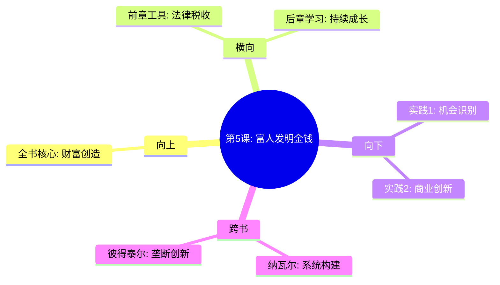

---

category: 
  - 书籍拆解
  - "富爸爸穷爸爸"
status: draft
chapter: 
number: 5
title: 富人发明金钱
links:

  - "[[第4课-税收的历史和公司的力量]]"
  - "[[第6课-为学习而工作]]"
created: 2026-02-27
tags:
  - 富爸爸穷爸爸
  - 金钱创新
  - 机会识别
  - 财富创造
---

# 第5课 富人发明金钱

## 📍 章节定位

### 全书位置
> 第五课代表财富创造的高级阶段，展示了如何从被动适应金钱游戏到主动创造赚钱机制，引领读者走向财富自主创造之路

- **全书核心问题**: 顶级富豪如何持续创造财富并保持领先地位?
- **本章回答的问题**: 如何从寻找金钱机会到创造金钱机会？如何建立可持续的财富创造系统？
- **角色类型**: 创新思维型，详解财富创造的思维模式
- **论证位置**: 从资产积累向财富创造的质变转折阶段

### 章节序列
| 方向 | 章节标题 | 逻辑连接 |
|------|----------|----------|
| 前章 | [[第4课-税收的历史和公司的力量]] | 掌握工具后，需要更高层次的创新能力 |
| 后章 | [[第6课-为学习而工作]] | 掌握创新财富的同时，仍需不断学习提升 |

### 一句话定位
第5课是财富创造的最高境界，揭秘富人不仅仅是寻找金钱，更是创造金钱流动渠道的思维模式和行为方式。

---

## 🎯 核心观点

### 第一层：表层案例

| 案例名称 | 简要描述 | 页码 | 关键引文 |
|----------|----------|------|----------|
| 小型企业创新 | 富爸爸如何创办企业解决社区问题，同时积累财富 | p.140-145 | "富人看到需求就创建解决方案，同时创造财富" |
| 创意变现故事 | 利用专利和创意建立赚钱系统，而非只卖时间 | p.145-150 | "知识产权是富人的武器之一" |
| 机会识别训练 | 作者被训练发现他人看不到的商机 | p.150-155 | "富人训练自己的大脑成为金钱探测器" |

### 第二层：中层机制

| 机制名称 | 组成要素 | 因果链条 | 证据来源 |
|----------|----------|----------|----------|
| 机会发现机制 | 市场洞察+问题识别+解决方案 | 信息敏感度 → 机会发现 → 价值创造 | 富爸爸教导案例 |
| 财富创造机制 | 资源整合+系统构建+规模化复制 | 需求识别 → 解决方案 → 复制盈利 | 商业模式设计 |
| 思维转换机制 | 被动思维→主动思维→创造思维 | 思维模式 → 行为决策 → 财富结果 | 作者成长轨迹 |

### 第三层：底层规律

| 规律陈述 | 抽象层级 | 知识连接 | 适用范围 |
|----------|----------|----------|----------|
| 需求驱动创造 | 经济学/市场营销学 | 供需关系 | 商业创新 |
| 连接产生价值 | 网络经济学 | 连接经济学 | 平台经济 |
| 创新回报倍增 | 创新经济学 | 熊彼特创新理论 | 科技创业 |

---

## 💬 降维翻译

### 观点1: 被动寻金到主动造金

#### 原文表达
> "普通人在市场中寻找金钱，富人则创造市场来聚集金钱。"
> —— p.144

#### 降维翻译（中学生能懂）
普通人像淘金者，在现有的金矿里寻找黄金；富人则像开矿的老板，发现哪有金子就开始开矿，吸引无数淘金者来到自己的地盘。

#### 日常类比（奶奶能懂）
就像集市和超市，普通人是跑市场挑好的水果蔬菜，富人则开个农贸市场或者超市供应商品。一个是去捡现成钱，一个是制造赚钱的机会。

#### 检验
- Q: 如果一个中学生问你寻钱人和造钱人有什么区别？
- A: 寻钱人跟着潮流跑，造钱人在设计潮流让别人跟着跑。

### 观点2: 问题识别即财富机遇

#### 原文表达
> "当你训练自己发现别人看不到的问题时，你就拥有了创造财富的工具。"
> —— p.148

#### 降维翻译（中学生能懂）
富人心态是：看到问题就想到"我能解决这个问题，从而赚到钱"，而不是"这个问题好烦"。

#### 日常类比（奶奶能懂）
就像看到路不好走就想开出租车公司赚钱，看到大家买菜不便就开个便利店，而不只是抱怨路难走、买菜难。

#### 检验
- Q: 如果一个中学生问你如何才能想到赚钱的好办法？
- A: 多观察生活中哪里不方便、哪里有抱怨，想想如何解决这些问题就可能找到赚钱机会。

---

## ✨ 金句库

### 原书金句
| 金句 | 页码 | 适用场景 |
|------|------|----------|
| 富人看到机会就创造解决方案，普通人看到问题就抱怨 | p.142 | 思维对比 |
| 真正的财富来自创造而非争取 | p.144 | 创造理念 |
| 你的大脑是最大最强大的财富创造工具 | p.147 | 自身力量 |
| 被动等待机会的人永远不缺对手，主动制造机会的人稀缺 | p.150 | 主动出击 |
| 富人不是抢金子的人，是造金矿的人 | p.145 | 思维层次 |

### 降维金句
| 金句 | 来源观点 | 适用场景 |
|------|----------|----------|
| 淘金的人多，开矿的人少 | 寻金vs造金 | 机遇思维 |
| 发现问题是发财的开始 | 问题机遇 | 洞察启示 |
| 知识产权是隐形金矿 | 知识价值 | 知识变现 |
| 被动的尽头是竞争激烈，主动的源头是垄断 | 竞争优势 | 商业思维 |
| 成功来自解决问题，而不只是寻找机会 | 解决思维 | 创业理念 |

## 🔗 当下映射

### 💰 财富应用
| 场景 | 具体行动 | 预期效果 | 风险提示 |
|------|----------|----------|----------|
| 商业创新 | 从日常困扰中寻找商机并实现 | 解决用户痛点，获利 | 避免过度投入，需要先验证市场 |
| 知识变现 | 整理专业技能打造成知识产品 | 建立被动收入渠道 | 需要持续内容迭代，竞争激烈 |
| 平台搭建 | 构建连接供需双方的平台 | 实现双边佣金收入 | 需要大量投入，前期回报较低 |

### 💼 职场应用
| 场景 | 具体行动 | 所需能力 | 适用职级 |
|------|----------|----------|----------|
| 內创业 | 在公司内部识别并推进创新举措 | 洞察能力，项目管理 | 高级管理者 |
| 商业洞察 | 为公司引入新商业模式或技术 | 商业理解，战略思维 | 中高层管理 |
| 组织设计 | 优化工作流程创造价值 | 流程优化，创新思维 | 各级管理人员 |

### 🏠 生活应用
| 场景 | 具体行动 | 可行性 | 见效时间 |
|------|----------|--------|----------|
| 问题意识培养 | 记录生活中遇到的不便之处 | 高 | 即刻开始 |
| 周边资源挖掘 | 识别周围人存在的实际困难 | 高 | 观察期间 |
| 技能变现规划 | 整理自身特长寻求变现途径 | 中 | 数月至半年 |

### 72小时行动计划
1. 列出自己近期遇到的十大不便，从中找出可转化为商机的2-3个
2. 观察周边5个朋友或同事的主要困扰，分析解决方向
3. 开始记录自己的问题发现能力，并思考每个问题的商业价值

---

## 🕸️ 章节关联

### 向上关联 → 整书
- **贡献**: 将前几课的资产积累、财务分析、工具运用推向更高端的财富创造
- **位置**: 从财富管理向财富创造的飞跃节点

### 横向关联 → 章节间
| 章节编号 | 章节标题 | 关联类型 | 连接描述 |
|----------|----------|----------|----------|
| 第4章 | 税收的历史和公司的力量 | 承接 | 掌握法律工具为创造金钱提供保障 |
| 第6章 | 为学习而工作 | 对比 | 从实践创富到学习成长的双向互动 |
| 第1章 | 富人与穷人的差异 | 升华 | 验证了富人的创新思维模式 |

### 向下关联 → 具体应用
| 应用场景 | 难度 | 前置知识 |
|----------|------|----------|
| 商业模式设计 | 高 | 创业基础、市场分析 |
| 创新思维训练 | 中 | 逻辑思维、观察练习 |
| 机会识别能力 | 中 | 实践敏感度、行业了解 |

### 跨书关联 → 知识网络
| 书籍 | 概念 | 关系 | 备注 |
|------|------|------|------|
| [[纳瓦尔宝典-乔根森]] | 构建系统而非销售时间 | 神合 | 两书都强调创造系统的重要性 |
| 创新者的窘境-克里斯坦森 | 破坏性创新 | 支持 | 提供创新理论支撑和方法论 |
| [[从0到1-彼得蒂尔]] | 垄断而非竞争 | 神合 | 强调创造独特价值的重要性 |

### 关联可视化

---

## ❓ 问答设计

### Q1: 富人发明金钱和普通人寻找金钱的区别是什么？（记忆型）
**认知层次**: 记忆
**难度**: 低
**答案要点**:
- 寻找者：发现现有市场中的机会
- 创造者：发现新需求并创造新市场
- 方法差异：跟随vs引领

### Q2: 如何理解"问题就是商机"这一观点？（理解型）
**认知层次**: 理解
**难度**: 中
**答案要点**:
- 所有问题本质上都是未被满足的需求
- 解决问题就创造了价值
- 价值被市场认可即可兑换财富

### Q3: 如何培养发现问题的能力？（应用型）
**认知层次**: 应用
**难度**: 中
**答案要点**:
- 保持敏锐观察周围环境
- 多思考"为什么会这样"
- 练习用解决方案的角度看问题

### Q4: 分析你周围最常见的问题，提出可能的解决方案。（分析型）
**认知层次**: 分析
**难度**: 高
**答案要点**:
- 识别高频反复出现的问题
- 分析问题的根本原因
- 设计可持续的解决模式

### Q5: 富人发明金钱需要哪些关键能力？（理解型）
**认知层次**: 理解
**难度**: 中
**答案要点**:
- 市场洞察力：发现未被满足的需求
- 解决方案设计：提出有效方法
- 系统构建能力：规模化实现方案

### Q6: 为什么说创造机会比寻找机会更高级？（理解型）
**认知层次**: 理解
**难度**: 中
**答案要点**:
- 竞争激烈程度不同：机会越多参与者越少
- 盈利持续性不同：创造者享受早期高收益
- 控制力不同：创造者掌握主导权

### Q7: 如何判断一个问题是否具有商业价值？（应用型）
**认知层次**: 应用
**难度**: 中
**答案要点**:
- 识别问题涉及的潜在人群规模
- 估算解决后可带来的价值
- 分析实现解决方案的成本

### Q8: 为什么富人更倾向于知识产权这类无形资产？（分析型）
**认知层次**: 分析
**难度**: 高
**答案要点**:
- 易于复制和规模化
- 竞争门槛相对较高
- 长期盈利能力强

### Q9: 如何评估一个创富想法的可行性？（应用型）
**认知层次**: 应用
**难度**: 中
**答案要点**:
- 市场需求真实性验证
- 资金投入与回报预估
- 竞争环境分析

### Q10: 创造者思维和消费者思维在看待市场的最大差异？（评价型）
**认知层次**: 评价
**难度**: 高
**答案要点**:
- 角度差异：被动接受vs主动改变
- 关注点：个人利益vs系统优化
- 目标：满足现状vs突破限制

### Q11: 如何在日常中锻炼创富思维？（应用型）
**认知层次**: 应用
**难度**: 中
**答案要点**:
- 经常问"Why"而不是"Just because"
- 思考"我能否做得更好"
- 观察他人的痛点

### Q12: 富人发明金钱的过程中面临哪些典型风险？（分析型）
**认知层次**: 分析
**难度**: 高
**答案要点**:
- 市场认可风险：想法没人买单
- 资金风险：投入过大无法收回
- 竞争风险：后来者居上

### Q13: 创新和创造金钱之间有何内在联系？（分析型）
**认知层次**: 分析
**难度**: 高
**答案要点**:
- 创新往往是创造价值的基础
- 有价值的创新能带来商业回报
- 持续创新保证财富增值能力

### Q14: 创造财富的模式如何才能持续？（理解型）
**认知层次**: 理解
**难度**: 中
**答案要点**:
- 解决的是真实持久的需求
- 构建了可持续的商业模式
- 建立了一定的竞争壁垒

### Q15: 对普通人而言，发展创造思维的最佳策略？（综合型）
**认知层次**: 综合应用
**难度**: 高
**答案要点**:
- 从细微处入手，逐步提升观察能力
- 学习市场分析和商业设计
- 培养风险承受和持续改进能力

---
