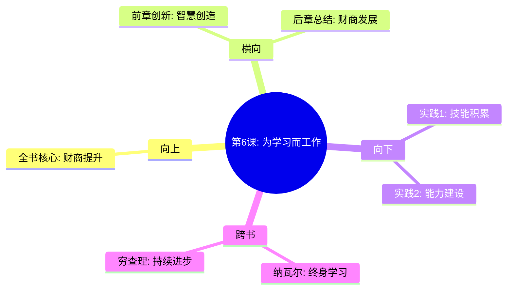

---

category: 
  - 书籍拆解
  - "富爸爸穷爸爸"
status: draft
chapter: 
number: 6
title: 为学习而工作，而不是为了钱
links:

  - "[[第5课-富人发明金钱]]"
  - "[[结语-如何提高财商]]"
created: 2026-02-27
tags:
  - 富爸爸穷爸爸
  - 学习思维
  - 技能提升
  - 人力资本
description: "第六课是个人成长的重要启示，阐述了如何通过工作获得技能积累和经验沉淀，而非单纯为薪水奋斗，揭示了终身学习与财商提升的本质联系"
---

# 第6课 为学习而工作，而不是为了钱

## 📍 章节定位

### 全书位置
> 第六课是个人成长的重要启示，阐述了如何通过工作获得技能积累和经验沉淀，而非单纯为薪水奋斗，揭示了终身学习与财商提升的本质联系

- **全书核心问题**: 如何在工作中获得比金钱更有价值的东西？
- **本章回答的问题**: 为什么有时要为了学习而放弃高薪？如何评估工作的学习价值？
- **角色类型**: 成长思维型，指导人力资本积累
- **论证位置**: 在财技积累的基础上，强调人本身的成长价值

### 章节序列
| 方向 | 章节标题 | 逻辑连接 |
|------|----------|----------|
| 前章 | [[第5课-富人发明金钱]] | 掌握创富思维后，需要持续的学习力支撑 |
| 后章 | [[结语-如何提高财商]] | 学习思维是提高财商的重要组成部分 |

### 一句话定位
第6课是终身成长指南，教你选择工作时优先考虑学习价值，把每次工作经历都当作人力资本的提升机会。

---

## 🎯 核心观点

### 第一层：表层案例

| 案例名称 | 简要描述 | 页码 | 关键引文 |
|----------|----------|------|----------|
| 选择低薪工作 | 作者选择待遇低但能学习销售技巧的施乐工作 | p.160-165 | "我为学习而工作，不是为了钱" |
| 企业离职事件 | 揭示只看金钱的员工，往往得不到真正的发展 | p.165-170 | "金钱是短期回报，技能是长期资产" |
| 学习导向选择 | 多次为了学习新技能而跳槽到更低薪岗位 | p.170-175 | "为学习而工作的思维模式让我获得了巨大财富回报" |

### 第二层：中层机制

| 机制名称 | 组成要素 | 因果链条 | 证据来源 |
|----------|----------|----------|----------|
| 技能增值机制 | 学习机会+经验积累+能力提升 | 初期低报酬 → 长期高回报 → 财富积累 | 作者本人经历 |
| 人力资本机制 | 技能学习+网络建设+机会获得 | 教育投资 → 能力提升 → 收入增长 | 长期职业发展 |
| 战略思维机制 | 短期牺牲+长远规划+系统投资 | 放弃金钱 → 获取技能 → 建立资产 | 富爸爸思想传承 |

### 第三层：底层规律

| 规律陈述 | 抽象层级 | 知识连接 | 适用范围 |
|----------|----------|----------|----------|
| 学习投资回报 | 人力资源学 | 技能复利 | 职业生涯 |
| 人力资本理论 | 经济学理论 | 人力资本投资 | 个人发展 |
| 能力优先法则 | 教育学/发展心理学 | 能力本位 | 终身成长 |

---

## 💬 降维翻译

### 观点1: 学习vs薪资的重要性区分

#### 原文表达
> "如果你只为金钱而工作，你将被束缚在一种生活方式里。如果你为了学习而工作，你的收入将反映你的能力增长。"
> —— p.162

#### 降维翻译（中学生能懂）
把工作看作是赚钱吃饭的机会，会让你一直在这个圈子里转；把工作看作是学技能练能力的机会，技能越来越好，收入自然越来越多。

#### 日常类比（奶奶能懂）
就像学手艺，刚开始师父可能给的工钱不多，但徒弟学会了一门好手艺，以后就能自己当师傅赚钱。那些只想着多拿工钱的徒弟，反而学不到真本事。

#### 检验
- Q: 如果一个中学生问你找工作最重要的是什么？
- A: 不是看现在给你多少钱，而是看能让你学到什么本领。

### 观点2: 人力资本的重要性

#### 原文表达
> "最重要的资产是你头脑里的东西，资产是可以创造更多资产的工具。"
> —— p.164

#### 降维翻译（中学生能懂）
真正的资产不是你银行里有多少钱，而是你脑子里有多少技能和知识。好的脑子能不停地创造出更多的钱来。

#### 日常类比（奶奶能懂）
就像老木匠的手艺，他的锯子、锤子可能会坏，但他的手艺是带不走的，而且只会越来越好，用这个手艺能做出越来越值钱的东西。

#### 检验
- Q: 如果一个中学生问你什么是真正的财富？
- A: 能让你不停赚钱的头脑和技能，比银行里的钱更重要。

---

## ✨ 金句库

### 原书金句
| 金句 | 页码 | 适用场景 |
|------|------|----------|
| 我为学习而工作，不是为了钱 | p.161 | 工作理念 |
| 金钱只是短期回报，技能才是长期资产 | p.163 | 价值判断 |
| 最好的工作是能教你如何赚钱的工作 | p.167 | 就业指导 |
| 你的技能就是你最大的资产 | p.166 | 个人价值 |
| 工作是为了获得比金钱更有价值的东西 | p.165 | 职业哲学 |

### 降维金句
| 金句 | 来源观点 | 适用场景 |
|------|----------|----------|
| 学会钓鱼比要鱼更重要 | 学习价值 | 教育智慧 |
| 好脑子胜过好工作 | 技能重要性 | 价值重构 |
| 给别人打工是学做人，给自己打工是学做事 | 理念转变 | 职业认知 |
| 钱买得走你的时间，买不走你的知识 | 价值辨析 | 个人自信 |
| 技能复利比财富复利更能改变命运 | 复利思维 | 成长激励 |

## 🔗 当下映射

### 💰 财富应用
| 场景 | 具体行动 | 预期效果 | 风险提示 |
|------|----------|----------|----------|
| 职业选择 | 优先考虑能提升技能的工作机会 | 长期职业价值大幅提升 | 避免短期收入下降影响生活质量 |
| 技能投资 | 定期投资时间金钱学习新技能 | 构建不可替代的竞争优势 | 避免盲目跟风，选择与目标相关的技能 |
| 创业准备 | 累积行业经验和人脉资源 | 为未来创业积累原始资本 | 平衡学习与收入需要时间管理 |

### 💼 职场应用
| 场景 | 具体行动 | 所需能力 | 适用职级 |
|------|----------|----------|----------|
| 内部调动 | 寻找能接触到核心业务的机会 | 学习能力、主动性 | 各级员工 |
| 领导力提升 | 主动承接跨部门项目锻炼综合技能 | 沟通协调、战略思维 | 基层到中层 |
| 行业专家 | 持续深耕某一领域成为专业人才 | 专业能力、知识更新 | 中高层管理层 |

### 🏠 生活应用
| 场景 | 具体行动 | 可行性 | 见效时间 |
|------|----------|--------|----------|
| 理财学习 | 掌握基本的财务管理和投资知识 | 高 | 6个月见成效 |
| 健康投资 | 投资身心健康的技能和方法 | 高 | 即时开始 |
| 教育规划 | 为下一代培养终身学习的能力 | 高 | 长线价值 |

### 72小时行动计划
1. 列出3项对个人职业发展最有助益的技能
2. 评估当前工作环境中可以获得的技能提升机会
3. 开始计划学习一项对未来发展有重要价值的技能

---

## 🕸️ 章节关联

### 向上关联 → 整书
- **贡献**: 提供了财商提升的持续动力来源，与技能积累直接相关
- **位置**: 个人成长驱动财富增长的重要环节

### 横向关联 → 章节间
| 章节编号 | 章节标题 | 关联类型 | 连接描述 |
|----------|----------|----------|----------|
| 第5章 | 富人发明金钱 | 延伸 | 在创新能力基础上，强调学习力的重要性 |
| 结语 | 如何提高财商 | 奠基 | 学习思维是财商提升的根本 |

### 向下关联 → 具体应用
| 应用场景 | 难度 | 前置知识 |
|----------|------|----------|
| 自我发展 | 中 | 自我认知 |
| 技能规划 | 高 | 职业规划知识 |
| 终身学习体系 | 高 | 学习方法论 |

### 跨书关联 → 知识网络
| 书籍 | 概念 | 关系 | 备注 |
|------|------|------|------|
| [[纳瓦尔宝典-乔根森]] | 持续学习和技能积累 | 神合 | 两书都强调学习的重要性 |
| [[穷查理宝典]] | 终身学习的重要性 | 支持 | 查理芒格也是终身学习的践行者 |
| 高效能人士的七个习惯 | 前瞻性思维发展 | 强化 | 都强调以终为始的成长观 |

### 关联可视化

---

## ❓ 问答设计

### Q1: 为学习而工作和为钱而工作有什么根本区别？（记忆型）
**认知层次**: 记忆
**难度**: 低
**答案要点**:
- 目标不同：前者追求能力提升，后者追求薪酬增长
- 眼光不同：前者着眼长远，后者关注眼前
- 结果不同：前者能力复利，后者薪资困境

### Q2: 如何评估一份工作的学习价值？（理解型）
**认知层次**: 理解
**难度**: 中
**答案要点**:
- 能否学习到关键技能或知识
- 能否接触到核心业务或资源
- 能否扩展重要的人际关系

### Q3: 在职业选择时如何运用学习思维？（应用型）
**认知层次**: 应用
**难度**: 中
**答案要点**:
- 优先考虑技能成长潜力
- 评估公司培训和发展机制
- 重视导师和学习环境的影响

### Q4: 分析当前工作，评估是否应为学习价值而转岗？（分析型）
**认知层次**: 分析
**难度**: 高
**答案要点**:
- 评估当前岗位学习天花板
- 分析新岗位技能增长空间
- 权衡短期利益与长期发展

### Q5: 什么时候不应该为学习放弃高薪？（应用型）
**认知层次**: 应用
**难度**: 中
**答案要点**:
- 个人财务压力很大时
- 学习内容与目标关联度低时
- 缺乏基本生活保障时

### Q6: 短期收益vs长期发展的平衡策略？（理解型）
**认知层次**: 理解
**难度**: 中
**答案要点**:
- 不同人生阶段有不同重心
- 建立基本保障后再追求成长
- 短期妥协换长期收益的原则

### Q7: 如何在工作中最大化学习效果？（应用型）
**认知层次**: 应用
**难度**: 中
**答案要点**:
- 主动寻求挑战性任务
- 与高手共事学习最佳实践
- 总结复盘持续优化

### Q8: 什么样的技能最有长期价值？（分析型）
**认知层次**: 分析
**难度**: 高
**答案要点**:
- 跨领域应用性广的技能
- 可持续复合增长的技能
- 难以被替代和自动化的技能

### Q9: 为学习而工作可能导致的负面风险？（分析型）
**认知层次**: 分析
**难度**: 高
**答案要点**:
- 长期薪资低于同行
- 职业发展不确定性增加
- 错误学习方向的时间成本

### Q10: 如何平衡财务目标与学习目标？（应用型）
**认知层次**: 应用
**难度**: 中
**答案要点**:
- 制定分阶段的财务与学习规划
- 选择可兼得机会（最佳选择）
- 必要时做好阶段性调整

### Q11: 为学习型思维的人才企业应如何留任？（分析型）
**认知层次**: 分析
**难度**: 高
**答案要点**:
- 提供持续学习机会
- 营造成长型企业文化
- 为高成长员工定制发展路径

### Q12: 如何识别一个学习机会是否值得？（应用型）
**认知层次**: 应用
**难度**: 中
**答案要点**:
- 评估技能的稀缺性和市场需求
- 分析投入产出时间成本
- 查看前人的经验成果

### Q13: 那些技能最能代表人力资本价值？（分析型）
**认知层次**: 分析
**难度**: 高
**答案要点**:
- 行业专业知识和经验
- 通用能力如沟通领导力
- 个人资源网络和影响力

### Q14: 终身学习和为学习而工作有何异同？（理解型）
**认知层次**: 理解
**难度**: 中
**答案要点**:
- 相同：持续学习的意识
- 不同：前者是生活态度，后者是工作理念
- 互相促进：工作中的学习推动终身学习

### Q15: 为学习而非为钱工作的社会价值观影响？（综合型）
**认知层次**: 综合应用
**难度**: 高
**答案要点**:
- 推动教育投资的社会氛围
- 改变传统就业价值观念
- 促使人更加关注自身能力建设

---
