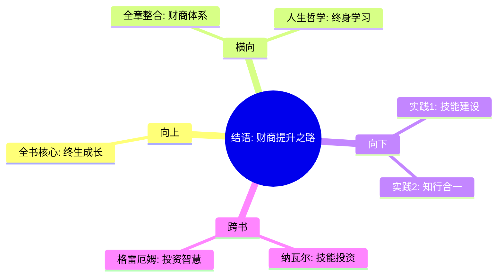

---

category: 
  - 书籍拆解
  - "富爸爸穷爸爸"
status: draft
chapter: 
number: 7
title: 如何轻松地对待提高财商
links:

  - "[[第6课-为学习而工作]]"
created: 2026-02-27
tags:
  - 富爸爸穷爸爸
  - 财商教育
  - 财务智商
  - 终身成长
---

# 结语 如何轻松地对待提高财商

## 📍 章节定位

### 全书位置
> 结语是对全书思想的系统总结和方法升华，阐明财商发展的核心路径和实践指导，是财富哲学的高度概括

- **全书核心问题**: 如何系统提升个人财商实现财务自由？
- **本章回答的问题**: 财商的构成要素与提升方法论是什么？如何在复杂环境中保持财务成长？
- **角色类型**: 系统总结型，整合全书财商理念
- **论证位置**: 全书财商教育思想的凝练与升华

### 章节序列
| 方向 | 章节标题 | 逻辑连接 |
|------|----------|----------|
| 前章 | [[第6课-为学习而工作]] | 集结各章节学习经验，形成财商提升体系 |
| 整书 | [[富爸爸穷爸爸-清崎]] | 与全书核心理念形成呼应和补充 |

### 一句话定位
结语是财商提升的整体蓝图，系统阐述财商四大技能的培育方法和实践指导，为读者提供终生财富成长路径。

---

## 🎯 核心观点

### 第一层：表层案例

| 案例名称 | 简要描述 | 页码 | 关键引文 |
|----------|----------|------|----------|
| 财商缺失悲剧 | NBA球员、彩票中奖者高收入后的财务困境 | p.180-185 | "高收入无法拯救低财商的人生" |
| 财商成功典范 | 懂财务知识的人长期财富增值案例 | p.185-190 | "财商高低决定了财富的命运" |
| 投资对比故事 | 同样投资环境下，财务知识差异导致截然不同结果 | p.190-195 | "投资失败不是缺乏本金，而是缺乏财商" |

### 第二层：中层机制

| 机制名称 | 组成要素 | 因果链条 | 证据来源 |
|----------|----------|----------|----------|
| 财商决定机制 | 会计+投资+市场+法律=财务智商 | 财务知识 → 投资决策 → 财务结果 | 实证案例统计 |
| 钟摆效应机制 | 技能失衡→决策偏误→财务困境 | 财商不均衡 → 投资失利 → 财富损失 | 市场波动实例 |
| 建构主义机制 | 学习驱动→技能提升→财商增长 | 持续学习 → 四大技能完善 → 财务自由 | 作者成长历程 |

### 第三层：底层规律

| 规律陈述 | 抽象层级 | 知识连接 | 适用范围 |
|----------|----------|----------|----------|
| 知能转换定律 | 认知科学 | [[知识管理]] | 技能习得 |
| 财务决策模型 | 经济学/行为金融学 | [[认知偏差]] | 投资判断 |
| 技能复合效应 | 系统论 | [[协同效应]] | 财商发展 |

---

## 💬 降维翻译

### 观点1: 财商四大技能的重要性

#### 原文表达
> "财商由四个方面的专业知识构成：会计、投资、市场和法律。"
> —— p.185

#### 降维翻译（中学生能懂）
理财智慧就像四根柱子撑起的帐篷，需要读懂数据（会计）、会找赚钱路子（投资）、了解买卖规律（市场）和懂得使用规矩（法律）四个方面都过硬。

#### 日常类比（奶奶能懂）
就像开个店要有四项技能：会算账、知道从哪进货赚钱、明白怎么卖商品、懂得遵守店规和法律，缺任何一个都可能亏钱。

#### 检验
- Q: 如果一个中学生问你理财最该学什么？
- A: 首先是懂得怎么看账本，然后是会找到好赚钱的法子，再就是知道买卖的门道，最后要学会法规护航。

### 观点2: 简单有效的学习方法

#### 原文表达
> "不要试图一次学会所有，要一点一点地构建财商的四个方面的技能。"
> —— p.190

#### 降维翻译（中学生能懂）
财商学习就像盖房子，不可能一天建成，需要逐砖累瓦。先选一个领域深入学习，掌握后再扩展到其他三个方面。

#### 日常类比（奶奶能懂）
就像学做饭，不能想着一步学会所有菜，要先学一个菜做得很溜，再学下一个，一步步把所有技能都掌握。

#### 检验
- Q: 如果一个中学生问你如何开始学理财？
- A: 从最基础的开始，比如先学会看懂自家账本，然后再一步步学其他理财知识。

---

## ✨ 金句库

### 原书金句
| 金句 | 页码 | 适用场景 |
|------|------|----------|
| 财商由会计、投资、市场、法律四个技能构成 | p.185 | 概念解析 |
| 高收入无法弥补低财商的损失 | p.182 | 资本警示 |
| 财商是一种技能，技能可以通过学习获得 | p.186 | 学习激励 |
| 投资自己是最好的投资 | p.190 | 知识投资 |
| 财商教育缺失是中国教育的大问题 | p.188 | 社会批判 |

### 降维金句
| 金句 | 来源观点 | 适用场景 |
|------|----------|----------|
| 四个轮子才跑得稳，理财也一样 | 技能均衡 | 理念普及 |
| 财能毁人，也能救人 | 双刃剑 | 理财警示 |
| 学会财商比学会赚钱更重要 | 理念升华 | 教育观念 |
| 财商决定财富命运 | 理念总结 | 价值传递 |
| 技能复利胜过资产复利 | 技能重要性 | 增长激励 |

## 🔗 当下映射

### 💰 财富应用
| 场景 | 具体行动 | 预期效果 | 风险提示 |
|------|----------|----------|----------|
| 财商教育投资 | 优先购买财商类书籍课程 | 系统提升理财决策能力 | 避免被理财骗局迷惑 |
| 技能规划 | 按四大技能逐步建立能力体系 | 实现理财技能全面提升 | 避免急躁心态，循序渐进 |
| 投资实践 | 运用所学知识进行小额试错 | 在实践中验证理论学习 | 控制风险，从小额开始 |

### 💼 职场应用
| 场景 | 具体行动 | 所需能力 | 适用职级 |
|------|----------|----------|----------|
| 决策优化 | 将财商思维应用于商业决策 | 投资分析、风险评估 | 高管理层 |
| 财务管理 | 运用会计市场知识提升部门效益 | 业务洞察、财务意识 | 各级管理者 |
| 战略规划 | 用市场法律知识规划长期发展 | 综合认知、趋势预判 | 战略规划岗 |

### 🏠 生活应用
| 场景 | 具体行动 | 可行性 | 见效时间 |
|------|----------|--------|----------|
| 家庭财务 | 运用会计知识建立家庭财务模型 | 高 | 即时开始见效 |
| 子女教育 | 教授财商基础知识 | 高 | 1-5年见长期效果 |
| 退休规划 | 用四大技能规划养老资产 | 中 | 5-20年长期规划 |

### 72小时行动计划
1. 测评当前财商水平，识别最薄弱的技能领域
2. 制定财商四技能学习计划，选择入门书籍
3. 开始建家庭财务记录，实践会计知识

---

## 🕸️ 章节关联

### 向上关联 → 整书
- **贡献**: 系统总结全书财商教育理念，明确财商提升的方法论
- **位置**: 全书知识体系的高度总结与整合升华

### 横向关联 → 章节间
| 章节编号 | 章节标题 | 关联类型 | 连接描述 |
|----------|----------|----------|----------|
| 第1-6章 | 各章节财智内容 | 综合 | 集结各章节智慧形成财商体系 |
| 全书理念 | 富人vs穷人思维 | 深化 | 从思维差异到技能差异的升华 |

### 向下关联 → 具体应用
| 应用场景 | 难度 | 前置知识 |
|----------|------|----------|
| 财商提升实践 | 中 | 全书基础概念 |
| 投资技能建设 | 高 | 会计基础知识 |
| 终身学习计划 | 中 | 自律自控能力 |

### 跨书关联 → 知识网络
| 书籍 | 概念 | 关系 | 备注 |
|------|------|------|------|
| [[纳瓦尔宝典-乔根森]] | 学习技能的重要性 | 升华 | 两书都强调学习和技能的重要性 |
| [[聪明的投资者-格雷厄姆]] | 投资技能培养 | 扩展 | 投资技能是财商体系的重要组件 |
| [[穷查理宝典]] | 多元思维模型 | 佐证 | 与财商四技能理念高度契合 |

### 关联可视化

---

## ❓ 问答设计

### Q1: 财商包含哪四个方面？（记忆型）
**认知层次**: 记忆
**难度**: 低
**答案要点**:
- 会计：读懂财务报表的能力
- 投资：让钱生钱的策略
- 市场：供需及价格规律的理解
- 法律：运用法律工具进行财务安排

### Q2: 为什么有人说"高收入无法弥补低财商的损失"？（理解型）
**认知层次**: 理解
**难度**: 中
**答案要点**:
- 没有财务知识的人不知道如何处理金钱
- 收入高但理财不当可能损失更多
- 财商决定了财富的最终走向

### Q3: 如何在日常生活中培养财商四技能？（应用型）
**认知层次**: 应用
**难度**: 中
**答案要点**:
- 会计：练习查看和理解财务数据
- 投资：尝试小额投资实践
- 市场：观察商业活动的供需关系
- 法律：学习基础的法律知识条款

### Q4: 分析身边一个人的收支状况，评估其财商水平。（分析型）
**认知层次**: 分析
**难度**: 高
**答案要点**:
- 观察现金流方向和结构
- 分析投资决策的合理性
- 评估财务风险意识和管理能力

### Q5: 财商为什么重要？（理解型）
**认知层次**: 理解
**难度**: 中
**答案要点**:
- 决定了对金钱的理解和运用
- 影响理财决策的质量
- 决定了实现财务自由的可能性

### Q6: 从何处开始系统学习财商？（应用型）
**认知层次**: 应用
**难度**: 中
**答案要点**:
- 从基础知识开始，如读懂财务报表
- 通过实践验证理论
- 系统化学习四个领域的技能

### Q7: 会计技能对普通人有什么作用？（理解型）
**认知层次**: 理解
**难度**: 中
**答案要点**:
- 帮助理解和分析投资对象财务状况
- 建立个人/家庭财务管理系统
- 识别财务报表中的关键信息

### Q8: 缺少某项财商技能会有何影响？（分析型）
**认知层次**: 分析
**难度**: 高
**答案要点**:
- 可能导致理财决策片面
- 承担未知或不必要的财务风险
- 错过某些投资机会

### Q9: 如何评估自己的财商水平？（应用型）
**认知层次**: 应用
**难度**: 中
**答案要点**:
- 检查财务管理实践情况
- 回顾过往投资决策质量
- 评测财商知识的掌握程度

### Q10: 低财务智商的表现有哪些？（记忆型）
**认知层次**: 记忆
**难度**: 低
**答案要点**:
- 盲目追求高收益
- 不能区分资产和负债
- 缺乏风险意识

### Q11: 市场技能与投资技能的区别是什么？（分析型）
**认知层次**: 分析
**难度**: 高
**答案要点**:
- 市场技能着重供需、定价等因素
- 投资技能着重财务工具使用策略
- 两种技能相互配合提升投资效果

### Q12: 如何平衡四项财商技能的学习进度？（应用型）
**认知层次**: 应用
**难度**: 中
**答案要点**:
- 从最薄弱环节着手重点补强
- 注重实践应用验证理论
- 循序渐进不急于求成

### Q13: 法律在财商中为何如此重要？（分析型）
**认知层次**: 分析
**难度**: 高
**答案要点**:
- 为理财行为提供规则保障
- 利用法律工具优化财务安排
- 规避不必要的法律风险

### Q14: 财商教育的重要性体现在哪里？（评价型）
**认知层次**: 评价
**难度**: 高
**答案要点**:
- 培养正确的金钱观
- 减少理财错误损失
- 提升财富增长效率

### Q15: 如何看待财富与财商之间的螺旋上升关系？（综合型）
**认知层次**: 综合应用
**难度**: 高
**答案要点**:
- 财商提升带来更多财富机会
- 财富增长为财商学习提供实践基础
- 二者相互促进实现螺旋上升

---

### 间隔复习时间表
| 复习次数 | 间隔时间 | 复习重点 | 复习方式 |
|----------|----------|----------|----------|
| 第1次 | 1天后 | 财商四技能定义 | 快速浏览+自测 |
| 第2次 | 3天后 | 四技能的相互关系 | 绘制思维导图 |
| 第3次 | 7天后 | 当下映射应用 | 列出个人行动计划 |
| 第4次 | 14天后 | 跨书知识连接 | 对比关联书籍内容 |
| 第5次 | 30天后 | 全文核心要点 | 闭卷自测问答 |

### 核心记忆锚点
1. **数字锚点**："4" - 财商四技能（会计、投资、市场、法律）
2. **类比锚点**：四柱撑帐篷 - 四技能撑财商
3. **金句锚点**：技能复利胜过资产复利
4. **案例锚点**：NBA球星高收入低财商的悲剧

### 快速检索关键词
- **核心概念**：财商四技能、终身学习、技能复利
- **行动指南**：会计入门、投资实践、法律工具
- **关联书籍**：纳瓦尔宝典、穷查理宝典、聪明的投资者

### 自测清单（30秒快速检验）
- [ ] 能说出财商四大技能的名称
- [ ] 能解释每项技能的核心作用
- [ ] 能举出一个"高收入低财商"的案例
- [ ] 能说出自己的财商提升第一步计划
- [ ] 能关联至少一本其他书籍的理念
