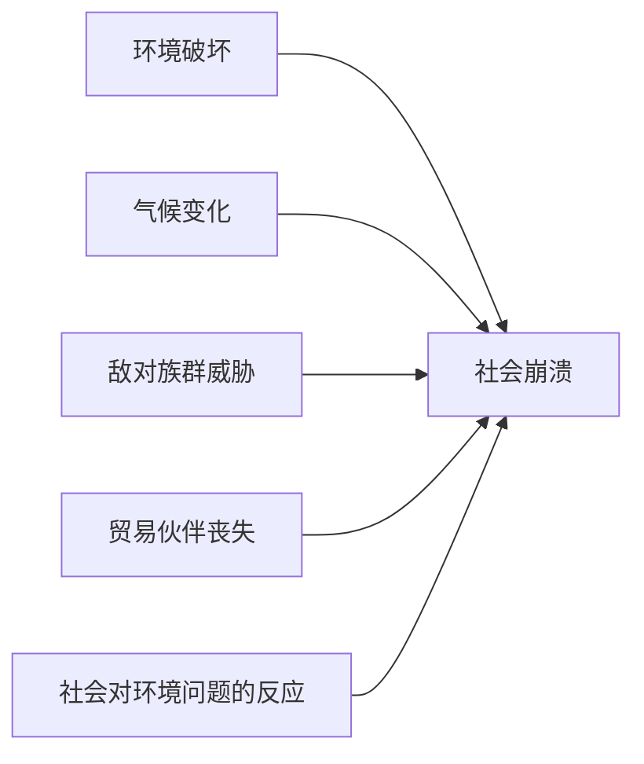
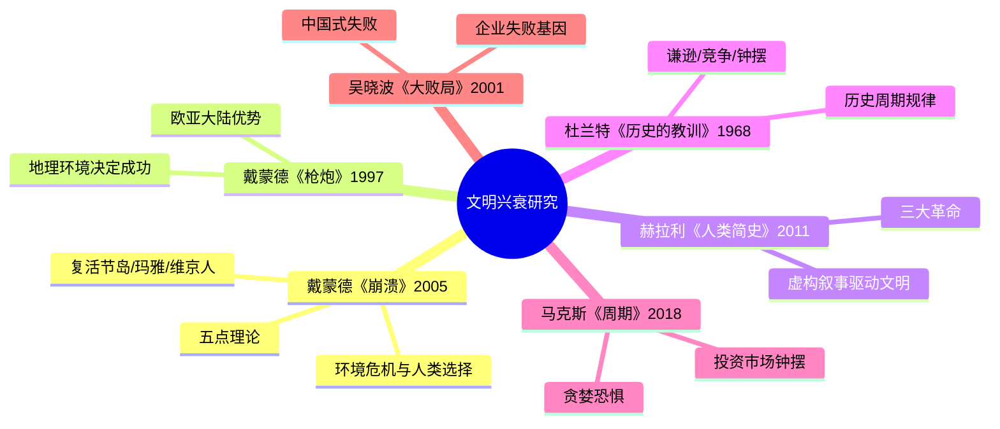

# 《崩溃》读书笔记

## 这本书要解决什么问题？

**核心困境**：为什么有些社会繁荣，有些社会崩溃？是命运必然，还是人类选择？

- 传统答案：**环境决定论**（地理位置、气候变化）
- 戴蒙德的回答：**人类选择论**——环境给出问题，人类做出选择

**一句话定位**：
> 文明的崩溃不是必然，而是选择——面对环境危机，你是选择逃避，还是选择改变？

### 作者站在什么位置说这些话？

| 维度 | 定位 |
|------|------|
| 主领域 | 环境历史 + 文明兴衰研究 |
| 跨界领域 | 地理学、人类学、生态学、经济学、政治学 |
| 作者背景 | 加州大学洛杉矶分校地理学教授、演化生物学家、普利策奖得主（《枪炮、病菌与钢铁》） |
| 历史语境 | 2005年出版。经历了二战后环境运动兴起的时代。戴蒙德站在跨学科研究者的位置，用比较历史学方法分析文明兴衰 |

### 和其他书有什么关系？

| 关联书籍 | 关联关系 | 共同底层逻辑 |
|----------|----------|--------------|
| [[枪炮病菌与钢铁-戴蒙德]] | 同一作者，互补 | 《枪炮》讲地理决定成功，《崩溃》讲环境选择失败 |
| [[人类简史-赫拉利]] | 互补 | 赫拉利讲"虚构叙事"驱动文明，戴蒙德讲"环境现实"约束文明 |
| [[历史的教训-杜兰特]] | 互补 | 杜兰特讲历史周期规律，戴蒙德讲文明兴衰的环境因素 |
| [[周期]] | 互补 | 马克斯讲投资市场的钟摆，戴蒙德讲文明兴衰的钟摆 |
| [[大败局-吴晓波]] | 互补 | 吴晓波讲企业失败的基因，戴蒙德讲社会崩溃的基因 |

### 核心理论框架：五点崩溃理论

戴蒙德提出，文明的崩溃由五个因素共同决定：

关键洞察：前4点是客观压力（环境、气候、邻居、贸易），第5点是主观选择（社会如何反应）。**核心定律**：崩溃不是必然，而是人类面对环境挑战时的选择。

### 知识网络图

---

## 作者的核心论点

### 复活节岛的悲剧——砍掉最后一棵树

复活节岛上曾经茂密的棕榈林。岛民砍树造船、造像、耕作。最后一棵树被砍倒时，整个文明开始崩溃。欧洲人发现时，只剩荒岛和石像。

背后的机制不复杂。资源丰富引发人口增长，人口增长导致过度开发，过度开发耗尽资源，资源耗尽触发生态崩溃，最终走向社会冲突和文明灭亡。用大白话说就是：砍掉最后一棵树时，文明就开始倒计时了。

> **复活节岛定律**：当一个社会耗尽其环境承载力时，崩溃不是偶然，而是必然。最危险的是：在繁荣时埋下的种子，在阳光下长成了灾难。

这打碎了我对资源枯竭的侥幸心理。以前总觉得"资源还多得很"，现在意识到：复活节岛的岛民砍树时也是这么想的。下次遇到某个趋势看起来不可持续时，我不会再安慰自己"船到桥头自然直"，而是问：这个系统的底线在哪里？我们离最后一棵树还有多远？

但这还没完，复活节岛只是环境耗尽的故事。戴蒙德进一步指出，有些文明的崩溃，环境只是引子，真正致命的是人类的反应方式。

### 玛雅文明的崩溃——不是气候问题，而是人类选择

9世纪时，玛雅文明达到鼎盛。100年内，所有城市被废弃。学者争论：气候干旱？资源耗尽？内战？

戴蒙德的答案是——不是气候杀死了玛雅，而是玛雅杀死了自己。干旱只是环境压力，真正致命的是社会反应错误：精英阶层不愿改变，反而加强控制，导致长期决策失误——互攻、过度开发——最终农业崩溃、人口锐减。

> **玛雅崩溃定律**：面对环境危机时，精英阶层的拒绝改变，往往是崩溃的直接原因。崩溃不是环境的错，是人类选择的错。

以前我一直以为文明的崩溃是外部冲击导致的，现在明白了——外部冲击只是暴露系统的脆弱性，真正决定生死的是内部人如何应对。下次遇到公司或团队面临外部危机时，我不会再只关注外部威胁有多大，而是先看：领导层愿不愿意承认问题、做出改变。

有了失败案例，还需要成功案例来对照。戴蒙德接下来展示了一个"成功模式反而导致失败"的反直觉故事。

### 维京人的失败——"成功"往往是失败的前奏

格陵兰维京人（985-1450年）试图把欧洲农业模式复制到极地，结果灭绝了。而因纽特人在同一片土地上活了下来。为什么？

维京人的问题不是不努力，而是太成功了——在欧洲的成功模式让他们不愿改变。他们把欧洲的畜牧业、社会等级、宗教信仰全套搬到了格陵兰，完全不适应极地环境。因纽特人则经过长期演化，灵活适应了极地条件。

> **维京人定律**：成功往往是失败的前奏——你的成功模式，可能不适应新环境。能存活的社会，不是最强大的，而是最适应的。

这打碎了我对"成功经验"的迷信。以前以为成功经验可以直接复制，现在意识到：维京人就是把成功经验复制到了错误的环境里。下次看到某个成功模式被吹捧为"万能模板"时，我会先问：这个模式的适用边界在哪里？换一个环境还行不行？

失败的故事看够了。那有没有成功避免崩溃的社会？有，而且它们的共同特征出奇地简单。

### 成功案例——日本、新几内亚、蒂蔻皮亚岛

三个成功案例：日本德川时代（1603-1868）靠林业管理成功延续；新几内亚用传统农业实现可持续发展；蒂蔻皮亚岛通过社区参与成功管理资源。

它们做对了什么？戴蒙德提炼出共同特征：环境压力显现时社会意识到问题，精英阶层愿意改变，制定长期规划，社区广泛参与，灵活适应。

对比复活节岛和日本，区别就很清楚了。复活节岛：资源耗尽后仍然砍树，崩溃。日本：资源稀缺后主动管理林业，成功。同样的环境压力，不同的社会反应，不同的结局。

> **成功定律**：面对环境危机时，成功的三要素：1. 意识到问题；2. 愿意改变；3. 长期规划。

这个观点让我重新理解了"适应性"。以前觉得适应就是被动接受变化，现在意识到：真正的适应是主动感知问题、集体做出改变。不是等到最后一棵树砍完才反应。

有了历史案例的铺垫，戴蒙德最后把目光投向了现代社会。

### 现代社会的崩溃风险——中国、澳大利亚、卢旺达

现代案例令人不安：中国的环境破坏加人口压力加经济发展形成三重挤压；澳大利亚作为发达国家也面临土壤盐碱化和物种入侵；卢旺达的人口压力直接引爆内战和种族屠杀；海地和多米尼加共享一个岛，却走向了截然不同的命运。

古代崩溃是砍树、干旱、战争。现代崩溃是气候变化、全球化、技术失控。本质相同：人类选择错误。

> **现代崩溃定律**：现代社会的崩溃风险，不是减少，而是增加——因为我们的"成功"模式，不可持续。最危险的幻觉："这次不一样"——每一代崩溃前的人都这么想。

下次听到有人说"这次不一样"，我会提高警惕。历史上每一代崩溃前的人都这么说——不是因为他们蠢，而是因为繁荣遮蔽了判断力。

---

## 这本书的局限

> 戴蒙德的崩溃理论是从比较历史学中提炼的，这套方法有它的边界。

| 批评点 | 谁在批评 | 怎么说 | 实际情况 |
|--------|---------|--------|---------|
| 环境决定论嫌疑 | 历史学家 | 过度强调环境因素，忽略制度、文化、技术的作用 | 戴蒙德确实强调环境，但核心论点是"人类选择"而非"环境决定" |
| 案例选择性 | 批评者 | 挑选的案例支持论点，忽略了反面案例 | 比较历史学方法的固有局限，但案例数量足够多，说服力仍在 |
| 现代推演过度 | 社会学家 | 将古代崩溃模式直接套用到现代社会，忽略技术和制度的缓冲能力 | 现代社会的缓冲能力确实更强，但核心风险（人类选择失误）依然存在 |
| 悲观倾向 | 乐观派 | 整体基调过于悲观，忽视人类的技术创新能力 | 戴蒙德强调的是"选择"而非"宿命"，成功案例证明崩溃不是必然 |

**一句话总结局限性**：
> 五点理论是强有力的分析框架，但古代案例不能简单套用到现代社会。崩溃不是宿命——戴蒙德自己就提供了成功案例。

---

## 最值得记住的话

**原书说的**：
1. "没有一个社会是单纯因为生态环境受到破坏而崩溃的，而是因为社会对环境问题的反应。"
2. "文明的崩溃不是必然，而是人类选择。"
3. "当社会繁荣时，精英阶层往往不愿意改变，这往往是崩溃的开始。"
4. "成功往往是失败的前奏——你的成功模式，可能不适应新环境。"
5. "砍掉最后一棵树时，文明就开始倒计时了。"
6. "面对环境危机时，最重要的不是知道问题，而是愿意改变。"
7. "现代社会的崩溃风险，不是减少，而是增加。"
8. "所有文明都会经历兴起、繁荣、衰落的过程。"
9. "崩溃不是突如其来的，它是一个长期过程的终点。"
10. "能应对变化的社会，才能活下去。"

**翻译成人话**：
1. 崩溃不是必然，而是选择——你可以选择改变，也可以选择灭亡
2. 砍掉最后一棵树时，文明就开始倒计时了
3. 成功往往是失败的前奏——你的成功，可能不适应新环境
4. 最危险的幻觉："这次不一样"——每一代崩溃前的人都这么想
5. 当所有人都说你好时，你要开始害怕了
6. 精英阶层最危险的错误：繁荣时不愿意改变，危机时无法改变
7. 能活下去的社会，不是最强大的，而是最适应的
8. 崩溃不是环境的错，是人类选择的错
9. 承认问题、主动改变，就能避免崩溃
10. 适应性不是被动接受，而是主动感知和集体行动

---

## 讲给没读过的人听

你有没有想过，为什么有些社会能延续千年，有些却突然消失？

戴蒙德研究了复活节岛、玛雅、维京人这些崩溃的文明，发现一个共同规律：崩溃不是环境决定的，是人类选择的。环境出了问题，有的社会选择改变，活了下来；有的选择装作没看见，走向灭亡。

复活节岛的岛民砍掉了最后一棵树。玛雅的精英面对干旱不愿改变，反而加强控制。维京人把欧洲的成功模式搬到格陵兰，不适应极地，灭绝了。因纽特人在同一片土地上，灵活适应，活了下来。

但也有人做对了。日本德川时代主动管理林业，新几内亚的农业可持续千年，蒂蔻皮亚岛的社区管理让小岛延续至今。

戴蒙德总结出崩溃的五因素：环境破坏、气候变化、强邻威胁、贸易伙伴丧失、社会反应。前四个是客观压力，第五个是主观选择。核心定律：崩溃不是必然，选择才是关键。

---

## 用来检验理解的问题

**基础回忆**：
1. Q: 戴蒙德的五点崩溃理论是什么？
   A: 环境破坏、气候变化、敌对族群威胁、贸易伙伴丧失、社会对环境问题的反应。前四个是客观压力，第五个是主观选择。

2. Q: 复活节岛崩溃的核心原因？
   A: 资源耗尽后仍然过度开发。砍掉最后一棵树时，文明就开始倒计时了。

3. Q: 成功避免崩溃的三个案例是什么？
   A: 日本德川时代（林业管理）、新几内亚（传统农业）、蒂蔻皮亚岛（社区管理）。

**理解验证**：
1. Q: 为什么玛雅崩溃是"人类选择"而非"气候决定"？
   A: 干旱只是环境压力。精英阶层拒绝改变、加强控制，导致互攻和过度开发，才是崩溃的直接原因。

2. Q: 维京人灭绝而因纽特人存续，关键区别是什么？
   A: 维京人把欧洲成功模式搬到极地，不适应环境。因纽特人长期演化，灵活适应。能存活的社会，不是最强大的，而是最适应的。

3. Q: 成功避免崩溃的三要素是什么？
   A: 意识到问题、愿意改变、长期规划。

**实际应用**：
1. Q: 你所在的公司/团队，更像复活节岛还是更像日本德川时代？
   A: 检验标准：面临压力时，领导层是装作没看见，还是主动改变？

2. Q: 你的"成功模式"有没有可能成为你未来的陷阱？
   A: 维京人定律：成功模式可能不适应新环境。检验：你的成功依赖什么条件？换一个环境还行吗？

**深度分析**：
1. Q: 戴蒙德和吴晓波的"崩溃"分析有何异同？
   A: 吴晓波分析企业失败的基因（商业视角），戴蒙德分析社会崩溃的基因（环境视角）。共同逻辑：失败是长期过程的终点，不是意外。成功时埋下的种子，最终可能长成灾难。

2. Q: 五点理论能套用到2026年的社会风险吗？
   A: 框架仍然适用——气候变化（环境破坏）、地缘冲突（强邻威胁）、供应链断裂（贸易伙伴丧失）。但现代社会的缓冲能力更强（技术、制度、全球化），不能简单等同。核心启示不变：社会反应决定结局。

---

## 和其他书的对话

戴蒙德自己写了两部曲。《枪炮、病菌与钢铁》讲地理环境如何决定哪些社会成功，《崩溃》讲环境选择如何决定哪些社会失败。两部合在一起就是：环境决定起跑线，但跑向哪里是你选择——有人跑到崩溃，有人持续领先。读完《崩溃》再读《枪炮》，你会对环境与人类选择的关系有完整的理解。

赫拉利和戴蒙德是从两个方向解释同一件事。赫拉利讲人类如何"发明故事"来驱动文明（虚构叙事），戴蒙德讲人类如何"对待环境"来决定存亡（现实约束）。一个是意识形态的力量，一个是物质基础的限制。文明就是故事与现实的博弈。

杜兰特说历史像钟摆，戴蒙德说钟摆撞到环境时——有人选择改变，有人选择撞碎。杜兰特的周期是时间维度，戴蒙德的崩溃是空间环境维度。两个视角叠加，才能看到文明兴衰的全貌。

马克斯讲投资市场的贪婪恐惧钟摆，戴蒙德讲文明兴衰的繁荣崩溃钟摆。两者共同底层：钟摆规律源于人性永恒。马克斯教你利用市场钟摆赚钱，戴蒙德教你警惕文明钟摆塌方。

吴晓波说企业失败是基因，戴蒙德说社会崩溃也是基因。成功时埋下的种子，最终长成灾难——这句话对企业和文明同样成立。吴晓波讲的是商业维度的崩溃，戴蒙德讲的是文明维度的崩溃，但底层逻辑一样：失败不是突发事件，是长期过程的终点。

麦金德的《历史的地理枢纽》与本书也有深层关联。麦金德说地理位置决定权力争夺（心脏地带理论），戴蒙德说地理环境决定生存存亡（环境选择论）。一个解释"如何成为权力中心"，一个解释"如何避免崩溃"。

黄仁宇的《万历十五年》从制度角度分析崩溃——道德替代法制导致制度性失败。戴蒙德从环境角度分析崩溃——环境危机加人类选择失误导致系统性崩溃。两个视角互补：崩溃不是偶然，而是系统缺陷的必然结果（制度缺陷 vs 环境缺陷）。

戴蒙德的《第三种猩猩》和《昨日之前的世界》也与本书形成系列。《第三种猩猩》揭示人类本性中的暴力倾向和短期利益偏好是演化遗产，《崩溃》展示这些本性如何导致社会层面的错误选择。《昨日之前的世界》展示传统社会的生存智慧，恰恰是《崩溃》中成功案例的现代对照——传统智慧是现代风险的解药。

---

*拆解日期：2026-02-15*
*下次回访：1周后回顾「讲给没读过的人听」和「检验问题」*