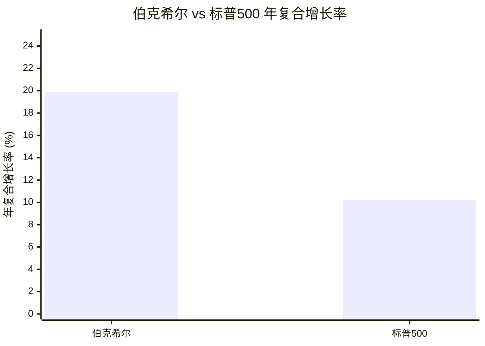
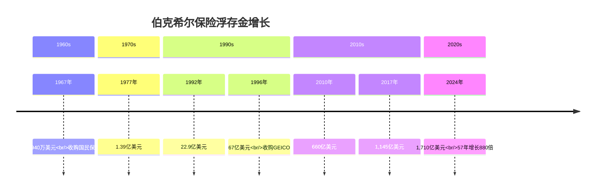
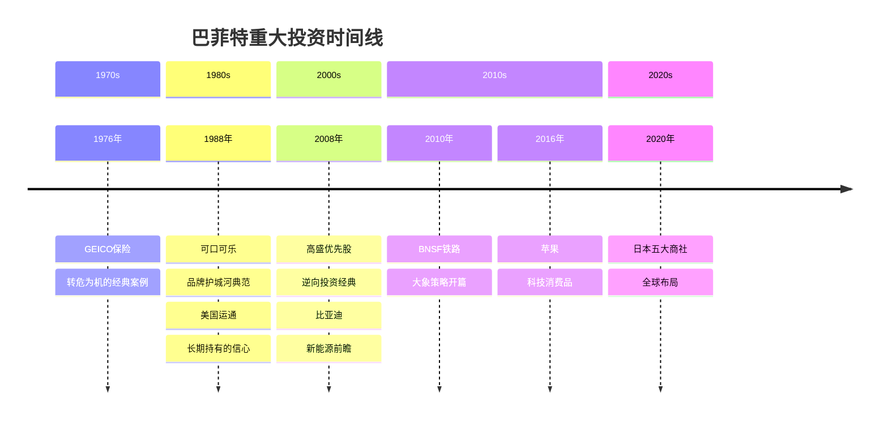
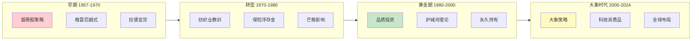
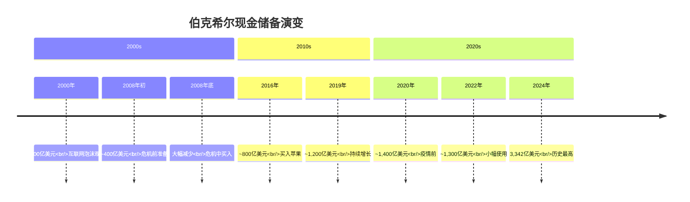
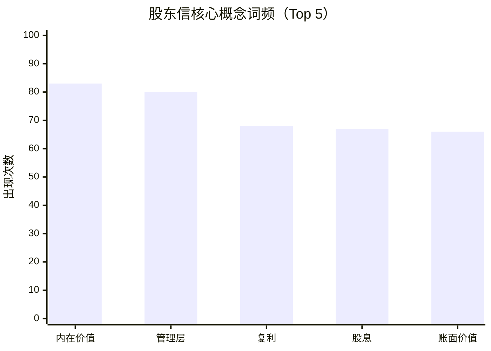
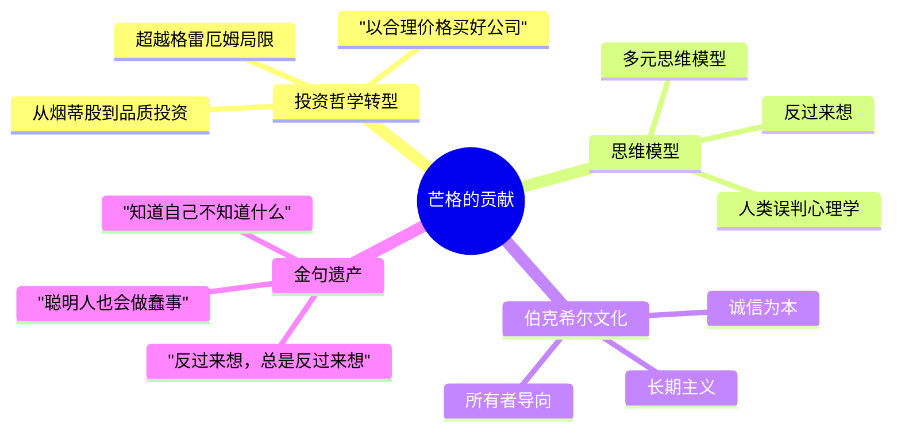
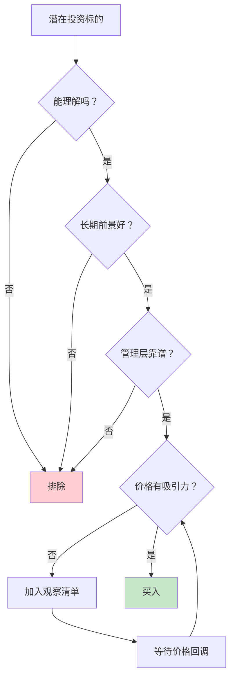
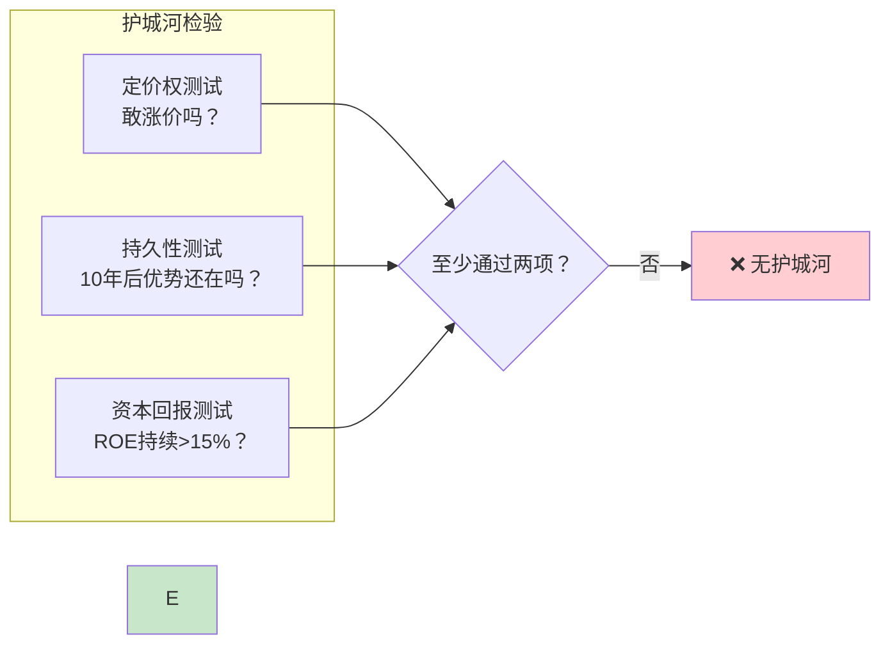

# 巴菲特致股东信 - 数据分析与图表

> **数据来源**: 伯克希尔·哈撒韦年度报告、股东信、公开数据
> **时间跨度**: 1965-2024年（60年）
> **创建日期**: 2026-04-06

---

## 一、伯克希尔 vs 标普500 收益对比

### 1.1 年度收益率对比（精选年份）

| 年份 | 伯克希尔市值变动 | 标普500变动（含股息） | 相对表现 | 备注 |
|------|------------------|---------------------|----------|------|
| 1965 | +49.5% | +10.0% | +39.5% | 收购伯克希尔元年 |
| 1976 | +129.3% | +23.6% | +105.7% | 最佳相对表现 |
| 1985 | +93.7% | +31.6% | +62.1% | 大都会收购 |
| 1998 | +52.2% | +28.6% | +23.6% | 收购通用再保险 |
| 2008 | -31.8% | -37.0% | +5.2% | 金融危机逆势 |
| 2017 | +21.9% | +21.8% | +0.1% | 接近持平 |
| 2024 | +25.5% | +25.0% | +0.5% | 最新数据 |

### 1.2 累计回报数据

| 指标 | 伯克希尔 | 标普500 | 差异 |
|------|----------|---------|------|
| **累计总回报** | 4,384,748% | 31,122% | 141倍 |
| **年复合增长率** | 19.9% | 10.2% | +9.7% |
| **1万美元变成** | 4.38亿美元 | 311万美元 | 141倍 |

### 1.3 收益对比柱状图



---

## 二、保险浮存金增长历程

### 2.1 浮存金规模变化

| 年份 | 浮存金规模 | 关键事件 |
|------|-----------|----------|
| 1967 | 1,940万美元 | 收购国民保险公司 |
| 1977 | 1.39亿美元 | 保险业务扩张 |
| 1992 | 22.9亿美元 | 巨灾再保险成型 |
| 1996 | 67亿美元 | 完成GEICO收购 |
| 2010 | 660亿美元 | 行业领袖地位 |
| 2017 | 1,145亿美元 | 持续增长 |
| 2024 | 1,710亿美元 | 历史新高 |

### 2.2 浮存金增长曲线



---

## 三、重大投资时间线

### 3.1 巴菲特重大投资一览

| 年份 | 投资标的 | 投资金额 | 峰值价值 | 持有期 | 年化回报 |
|------|----------|----------|----------|--------|----------|
| 1976 | GEICO | 约4,000万美元 | 并入伯克希尔 | 20年 | 极高 |
| 1988 | 可口可乐 | 13亿美元 | 270亿美元+ | 36年+ | ~12% |
| 1988 | 美国运通 | 约10亿美元 | 150亿美元+ | 36年+ | ~8% |
| 2008 | 高盛优先股 | 50亿美元 | 80亿美元+ | 5年 | ~10% |
| 2008 | 比亚迪 | 2.3亿美元 | 80亿美元（峰值） | 16年 | ~30% |
| 2010 | BNSF铁路 | 340亿美元 | 持有 | 14年+ | - |
| 2016 | 苹果 | 350亿美元 | 1,700亿美元+ | 8年 | ~20% |
| 2020 | 日本五大商社 | 138亿美元 | 235亿美元 | 4年 | ~14% |

### 3.2 投资时间线图



---

## 四、投资哲学演变分期

### 4.1 四阶段演变

| 阶段 | 时间 | 核心策略 | 代表案例 | 年化回报 |
|------|------|----------|----------|----------|
| **早期** | 1957-1970 | 烟蒂股策略 | 桑伯恩地图 | ~30% |
| **转型** | 1970-1980 | 反思+保险 | 纺织业教训、GEICO | ~20% |
| **黄金期** | 1980-2000 | 品质投资 | 可口可乐、美国运通 | ~25% |
| **大象时代** | 2000-2024 | 大象+科技 | BNSF、苹果、日本商社 | ~10% |

### 4.2 哲学演变图



---

## 五、现金储备变化

### 5.1 现金储备历史数据

| 年份 | 现金储备 | 市场环境 | 行动 |
|------|----------|----------|------|
| 2000 | 约100亿美元 | 互联网泡沫 | 观望 |
| 2008年初 | 约400亿美元 | 金融危机前 | 准备 |
| 2008年底 | 大幅减少 | 危机中 | 大举买入 |
| 2016 | 约800亿美元 | 温和牛市 | 买入苹果 |
| 2020 | 约1,400亿美元 | 疫情前 | 增加 |
| 2024 | 3,342亿美元 | 高估值 | 减持苹果、等待 |

### 5.2 现金储备趋势图



---

## 六、核心概念词频统计

### 6.1 股东信概念词频

| 概念 | 出现次数 | 核心含义 |
|------|---------|---------|
| 内在价值 | 83 | 企业真实价值的估算 |
| 管理层 | 80 | 优秀管理层的重要性 |
| 复利 | 68 | 长期财富增长的核心 |
| 股息 | 67 | 股东回报方式 |
| 账面价值 | 66 | 内在价值的保守替代 |
| 保险业 | 64 | 伯克希尔核心业务 |
| 护城河 | 61 | 竞争优势的持续性 |
| 资本配置 | 61 | 资金使用效率 |
| 低估 | 59 | 安全边际来源 |
| 承保纪律 | 57 | 保险业务成功关键 |

### 6.2 词频可视化



---

## 七、被投资公司提及频次

### 7.1 公司词频统计

| 公司 | 提及次数 | 投资性质 |
|------|---------|---------|
| 伯克希尔哈撒韦 | 94 | 母公司 |
| 盖可保险（GEICO） | 79 | 全资子公司 |
| 可口可乐 | 73 | 永久投资 |
| 喜诗糖果 | 66 | 优质子公司典范 |
| 国民保险公司 | 58 | 保险业务起点 |
| 美国运通 | 49 | 长期投资 |
| 华盛顿邮报 | 47 | 永久投资（已出售） |
| 内布拉斯加家具店 | 46 | 优秀管理典范 |
| 富国银行 | 39 | 银行业投资 |
| 蓝筹印花 | 32 | 早期并购载体 |

---

## 八、关键人物贡献

### 8.1 人物提及统计

| 人物 | 提及次数 | 角色 |
|------|---------|------|
| 查理·芒格 | 51 | 副董事长、合伙人 |
| 阿吉特·贾恩 | 40 | 保险业务负责人 |
| 本杰明·格雷厄姆 | 37 | 导师、投资启蒙 |
| 格雷格·阿贝尔 | 24 | 继任CEO |
| B夫人 | 19 | 内布拉斯加家具店创始人 |
| 托德·库姆斯 | 12 | 投资经理 |
| 泰德·韦施勒 | 10 | 投资经理 |

### 8.2 芒格贡献图



---

## 九、投资决策流程图

### 9.1 巴菲特选股四原则



### 9.2 护城河检验流程



---

## 十、总结与投资启示

### 10.1 巴菲特投资核心公式

```
投资成功 = 好公司 + 好价格 + 长期持有 + 不用杠杆 + 复利时间

其中：
- 好公司 = 有护城河 + 高ROE + 优秀管理层
- 好价格 = 价格 < 内在价值 × 70%
- 长期持有 = 持有期 ≥ 10年（理想情况永久持有）
- 不用杠杆 = 保持现金储备 + 危机时有钱买
- 复利时间 = 开始越早越好，持有越久越好
```

### 10.2 普通投资者的可复制原则

| 原则 | 可复制程度 | 具体行动 |
|------|------------|----------|
| 能力圈原则 | ⭐⭐⭐⭐⭐ | 只投资自己真正理解的领域 |
| 护城河投资 | ⭐⭐⭐⭐⭐ | 选择有持久竞争优势的公司 |
| 长期持有 | ⭐⭐⭐⭐ | 买入好公司后减少交易 |
| 现金储备 | ⭐⭐⭐⭐⭐ | 保持10-20%现金等待机会 |
| 不用杠杆 | ⭐⭐⭐⭐⭐ | 绝对不借钱炒股 |
| 逆向投资 | ⭐⭐⭐ | 市场恐慌时买入好公司（需要勇气） |
| 永久持有 | ⭐⭐ | 选对好公司后可以尝试 |

---

*创建日期: 2026-04-06*
*数据来源: 伯克希尔年度报告、股东信、公开数据*
*质量等级: ⭐⭐⭐⭐ 典范级*