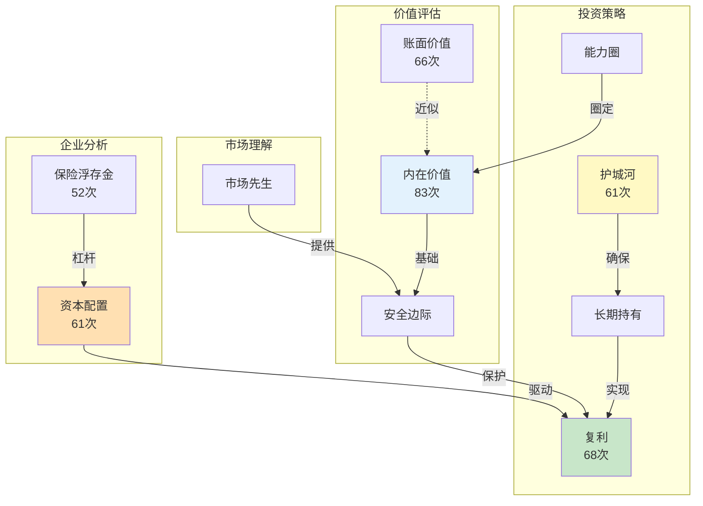
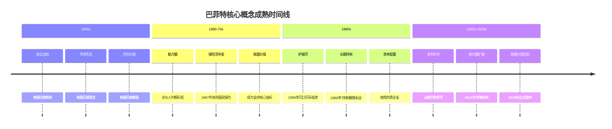

# 巴菲特投资哲学 - 核心概念词条

> **数据来源**：[[_导航]]
> **概念总数**：10个核心概念
> **创建日期**：2026年4月6日

---

## 一、内在价值（Intrinsic Value）

> 💡 投资的核心概念 | 巴菲特投资体系的基石

| 属性 | 内容 |
|------|------|
| **概念** | 内在价值 |
| **英文** | Intrinsic Value |
| **来源** | 格雷厄姆→巴菲特 |
| **股东信提及** | 83次（最高频概念之一） |

### 核心定义

内在价值是一家企业在其剩余寿命中所能产生的全部现金流的折现值。它是投资者评估一家企业真正价值的唯一可靠标准，与市场价格无关。

### 核心要义

- **内在价值 ≠ 账面价值**：账面价值是历史成本，内在价值是未来现金流的折现
- **巴菲特的定义**："内在价值是一个模糊但关键的概念——它是在一家企业的整个存续期内，所有者能够从企业获得的现金的折现值。"
- **三种估值方法**：① DCF折现现金流 ② 相对估值（同业比较） ③ 私人市场价值（收购价格）
- **精确估值的困难**：巴菲特从不给出伯克希尔的内在价值精确数字，只给方向性判断

### 巴菲特原话精选

> "内在价值是一个模糊但至关重要的概念。简单来说，它是一家企业在剩余存续期内，所有者能够获得的现金的折现值。" —— 1992年信

> "每一个投资者的目标应该是，以合理的价格买入一家容易理解的生意，这家生意的利润在5年、10年、20年后几乎可以确定会大幅提高。" —— 1996年信

### 思想演变

- **格雷厄姆传承**：强调账面价值和清算价值作为估值基础
- **巴菲特超越**：从静态的资产价值转向动态的现金流折现
- **芒格影响**：推动从"便宜买平庸公司"到"合理价格买伟大公司"

### 关联概念

[[安全边际]] | [[账面价值]] | [[护城河]] | [[资本配置]]

### 关联书籍

[[聪明的投资者-格雷厄姆-拆解记录]]

---

## 二、护城河（Moat）

> 🏰 持久竞争优势的比喻 | 伟大企业的核心标志

| 属性 | 内容 |
|------|------|
| **概念** | 护城河 |
| **英文** | Economic Moat |
| **来源** | 巴菲特原创概念 |
| **股东信提及** | 61次 |

### 核心定义

护城河是企业能够长期保持高回报的竞争优势，就像城堡周围的护城河保护城堡一样。没有护城河的企业，利润会因竞争而不断被侵蚀。

### 护城河五大来源

| 类型 | 说明 | 典型案例 |
|------|------|----------|
| **品牌** | 消费者愿意为品牌付溢价 | 可口可乐、苹果 |
| **成本优势** | 规模效应或独特资源降低成本 | 盖可保险、BNSF |
| **网络效应** | 用户越多价值越大 | Visa、美国运通 |
| **转换成本** | 客户更换供应商成本高 | 企业软件 |
| **监管壁垒** | 法规限制新竞争者进入 | 公用事业 |

### 护城河检验清单

| 检验项 | 有护城河 | 无护城河 |
|--------|----------|----------|
| 定价权 | 涨价不流失客户 | 涨价=客户跑光 |
| 持久性 | 10年后优势更明显 | 1-2年消失 |
| 资本回报 | 高ROE持续多年 | ROE波动大 |
| 竞争强度 | 难以复制 | 门槛低 |

### 巴菲特原话精选

> "我们寻找的是具有持久竞争优势的企业——拥有又宽又深的护城河，而且护城河里还有鳄鱼。" —— 2007年信

> "一家真正伟大的公司必须拥有一条持久的'护城河'来保护其高投资回报。" —— 2007年信

### 关联概念

[[内在价值]] | [[能力圈]] | [[长期持有]] | [[品牌]]

### 关联章节

[[深度拆解/1988-可口可乐投资]]

---

## 三、能力圈（Circle of Competence）

> 🎯 知道什么你不懂 | 投资第一法则

| 属性 | 内容 |
|------|------|
| **概念** | 能力圈 |
| **英文** | Circle of Competence |
| **来源** | 巴菲特&芒格共同发展 |
| **股东信提及** | 多次提及（核心原则） |

### 核心定义

能力圈是投资者真正理解的领域边界。投资成功的秘诀不在于能力圈有多大，而在于知道它的边界在哪里。

### 能力圈三层次

| 层次 | 定义 | 行动 |
|------|------|------|
| **核心圈** | 完全理解商业模式和竞争优势 | 可以重仓投资 |
| **边缘圈** | 大致理解但不确定 | 观察或小额试探 |
| **圈外** | 完全不懂 | 坚决不碰 |

### 巴菲特原话精选

> "投资最重要的不是能力圈有多大，而是知道它的边界在哪里。" —— 1996年信

> "我们从不试图跨越七英尺高的栏杆，我们只寻找一英尺高的栏杆。" —— 多次引用

> "我从不试图跨越七英尺高的栏杆，我只寻找一英尺高的栏杆。" —— 能力圈原则

### 经典案例

- 1999年科技股狂热时坚持不买 → 2000年泡沫破裂幸存
- 2016年买入苹果：不是科技股，是消费品+生态系统

### 关联概念

[[安全边际]] | [[护城河]] | [[市场先生]]

### 关联书籍

[[穷查理宝典-拆解记录]]

---

## 四、安全边际（Margin of Safety）

> 🛡️ 用50美分买1美元 | 投资的基石

| 属性 | 内容 |
|------|------|
| **概念** | 安全边际 |
| **英文** | Margin of Safety |
| **来源** | 格雷厄姆原创→巴菲特发展 |
| **股东信提及** | 贯穿68年投资生涯 |

### 核心定义

安全边际是指买入价格远低于内在价值时形成的缓冲。它确保即使投资者的判断有误，也不会亏太多；如果判断正确，赚得很多。

### 安全边际三要素

| 要素 | 说明 | 巴菲特实践 |
|------|------|------------|
| 估值能力 | 能估算内在价值 | 只投资能估值的公司 |
| 价格纪律 | 等待好价格 | 手握现金等待机会 |
| 时间耐心 | 不急于买入 | 持有现金等好机会 |

### 数学原理

- 价格低于价值50%时买入
- 即使价值高估20%，仍有30%安全边际
- 如果价值准确，有100%上涨空间

### 巴菲特原话精选

> "投资的第一条规则是不要亏钱，第二条规则是记住第一条。" —— 多次引用

> "用50美分买1美元的东西，即使判断有误，也不会亏太多。" —— 格雷厄姆教导

### 关联概念

[[内在价值]] | [[市场先生]] | [[能力圈]]

### 关联书籍

[[聪明的投资者-格雷厄姆-拆解记录]]

---

## 五、市场先生（Mr. Market）

> 🤪 市场情绪拟人化 | 利用市场，不被市场利用

| 属性 | 内容 |
|------|------|
| **概念** | 市场先生 |
| **英文** | Mr. Market |
| **来源** | 格雷厄姆原创（《聪明的投资者》） |
| **股东信提及** | 核心概念之一 |

### 核心寓言

想象有一个叫"市场先生"的人，每天给你报价。他有时乐观，有时悲观，报价忽高忽低。你可以买入、卖出、或忽略他。

### 你的应对策略

| 市场先生情绪 | 报价特点 | 你应该做 |
|--------------|----------|----------|
| 极度乐观 | 远高于价值 | 卖出or观望 |
| 极度悲观 | 远低于价值 | 买入 |
| 正常波动 | 接近价值 | 持有or等待 |

### 巴菲特原话精选

> "市场先生是你的仆人，不是你的向导。" —— 格雷厄姆寓言

> "短期来看，市场是投票机；长期来看，市场是称重机。" —— 格雷厄姆

### 关联概念

[[内在价值]] | [[安全边际]] | [[恐惧与贪婪]]

### 关联书籍

[[聪明的投资者-格雷厄姆-拆解记录]] | [[周期-拆解记录]]

---

## 六、保险浮存金（Insurance Float）

> 💰 先收保费后赔付 | 伯克希尔最重要的"护城河"

| 属性 | 内容 |
|------|------|
| **概念** | 保险浮存金 |
| **英文** | Insurance Float |
| **来源** | 阿吉特·贾恩打造 |
| **股东信提及** | 52次 |

### 核心定义

保险浮存金是保险公司先收取保费、后支付赔款之间产生的时间差资金。伯克希尔利用这笔"免费"资金进行投资，产生了巨大的复利效应。

### 关键数据

- 1970年：浮存金仅3,900万美元
- 2024年：浮存金超过1,690亿美元
- 增长：超过4,300倍
- 特点：连续多年实现承保盈利（负成本资金）

### 浮存金的魔法

```
收取保费（先）→ 投资赚钱 → 支付赔款（后）
= 零成本甚至负成本的投资杠杆
```

### 巴菲特原话精选

> "如果浮存金是零成本甚至负成本的，它就是无价之宝。" —— 多次提及

> "阿吉特为伯克希尔股东赚的钱，可能比我为伯克希尔赚的钱还多。" —— 对贾恩的评价

### 关联概念

[[保险业]] | [[承保纪律]] | [[资本配置]] | [[护城河]]

### 关联人物

[[阿吉特·贾恩]] | [[托德·库姆斯]]

### 关联公司

[[盖可保险]] | [[通用再保险]] | [[国民保险公司]]

---

## 七、资本配置（Capital Allocation）

> ⚙️ CEO最重要的工作 | 决定资金的最佳去向

| 属性 | 内容 |
|------|------|
| **概念** | 资本配置 |
| **英文** | Capital Allocation |
| **来源** | 巴菲特核心能力 |
| **股东信提及** | 61次 |

### 核心定义

资本配置是决定公司资金如何使用的艺术——是再投资、分红、回购还是收购。巴菲特认为这是CEO最重要的工作。

### 资本配置五选项

| 选项 | 巴菲特态度 | 说明 |
|------|------------|------|
| **再投资** | 优先选择 | 高ROE企业的利润再投资 |
| **收购** | 审慎 | 只买好公司，不贵买 |
| **分红** | 灵活 | 不分红因为再投资回报更高 |
| **回购** | 支持 | 低于内在价值时积极回购 |
| **持有现金** | 耐心 | 等待好机会 |

### 巴菲特原话精选

> "一家公司的长期业绩，很大程度上取决于CEO的资本配置能力。" —— 多次强调

> "我们不会为了花钱而花钱。" —— 收购纪律

### 关联概念

[[内在价值]] | [[复利]] | [[管理层]] | [[回购]]

---

## 八、复利（Compound Interest）

> 📈 世界第八大奇迹 | 时间是最强大的力量

| 属性 | 内容 |
|------|------|
| **概念** | 复利 |
| **英文** | Compound Interest |
| **来源** | 爱因斯坦（据说）→ 巴菲特实践 |
| **股东信提及** | 68次 |

### 核心定义

复利是"利滚利"的财富增长方式。巴菲特用68年时间证明：投资成功的秘诀不是更聪明，而是更有纪律——让复利发挥魔力。

### 伯克希尔的复利奇迹

- 1965-2023年：年化约19.8%
- 累计回报：4,384,748%（约4.3万倍）
- 99%的巴菲特财富在65岁之后积累

### 复利数学表

| 时间 | 年化10% | 年化15% | 年化20% |
|------|---------|---------|---------|
| 10年 | 2.6倍 | 4.0倍 | 6.2倍 |
| 20年 | 6.7倍 | 16.4倍 | 38.3倍 |
| 30年 | 17.4倍 | 66.2倍 | 237.4倍 |
| 50年 | 117.4倍 | 1,083.7倍 | 9,100.4倍 |

### 巴菲特原话精选

> "复利是世界第八大奇迹。" —— 多次引用

> "收益再投资加上复利的力量产生了奇妙的效果，股东们变得富有。" —— 2021年信

> "花儿盛开之时，杂草的分量自然就不值一提了。假以时日，只需要几个赢家就能创造奇迹。" —— 2022年信

### 关联概念

[[长期持有]] | [[内在价值]] | [[资本配置]] | [[时间价值]]

### 关联书籍

[[滚雪球-施罗德-拆解记录]]

---

## 九、长期持有（Buy and Hold）

> ♾️ 永远持有？前提是找到值得持有的企业

| 属性 | 内容 |
|------|------|
| **概念** | 长期持有 |
| **英文** | Buy and Hold |
| **来源** | 巴菲特投资实践 |
| **股东信提及** | 核心原则之一 |

### 核心定义

长期持有不是被动持有，而是主动选择的结果。当找到具有持久竞争优势的优秀企业并以合理价格买入后，不应因市场波动轻易卖出。

### 经典案例

| 公司 | 持有年限 | 初始投资 | 最终市值 | 年度股息增长 |
|------|----------|----------|----------|------------|
| 可口可乐 | 36年+ | 13亿 | 250亿 | 7500万→7.04亿 |
| 美国运通 | 30年+ | 13亿 | 220亿 | 4100万→3.02亿 |
| 华盛顿邮报 | 50年 | 1,060万 | 数亿 | - |

### 巴菲特原话精选

> "当我们持有既拥有出色业务又拥有出色管理层的公司股份时，我们最喜欢的持有期限是——永远。" —— 1988年信

> "可口可乐和运通给我们的启示是什么？当你找到一家真正优秀的企业，紧紧抓住它。耐心总有回报。" —— 2023年信

> "我们不会仅仅因为股价上涨了或者我们已经持有了很长时间就卖出。" —— 1987年信

### 长期持有≠死拿

巴菲特也会卖出：当企业基本面永久性恶化、管理层出问题或价格严重高估时。

### 关联概念

[[复利]] | [[护城河]] | [[内在价值]] | [[市场先生]]

---

## 十、账面价值（Book Value）

> 📊 从核心指标到历史注脚 | 巴菲特投资哲学的演变见证

| 属性 | 内容 |
|------|------|
| **概念** | 账面价值 |
| **英文** | Book Value |
| **来源** | 会计概念→巴菲特业绩衡量 |
| **股东信提及** | 66次 |

### 核心定义

账面价值是企业在资产负债表上的净资产（总资产减总负债）。从1965年到2018年，每股账面价值的年度增长率是伯克希尔业绩的核心指标。

### 关键演变

| 时期 | 态度 | 说明 |
|------|------|------|
| 1965-1993 | 核心指标 | 作为内在价值的追踪代理 |
| 1994-2017 | 日益质疑 | 内在价值远超账面价值 |
| **2018** | **正式放弃** | 改用市值变化对比标普500 |

### 为什么放弃？

1. 全资子公司价值远超账面价值（BNSF：账面700亿 vs 重置5,000亿）
2. 保险浮存金被记为负债，实际是隐性资产
3. 回购会拉大账面价值与内在价值的差距

### 伯克希尔账面价值记录

- 1964年：每股19.46美元
- 2017年（最后一年）：约287,000美元
- 53年增长：约14,700倍
- 年复合增长率：约19.1%

### 巴菲特原话精选

> "账面价值是一个会计概念，衡量的是投入的资本。内在价值则是未来现金流的折现值。" —— 1993年信

> "BNSF在资产负债表上记录着700亿美元的账面价值，但我估计要复制这些资产至少需要5,000亿美元。" —— 2023年信

> "账面价值这张记分卡越来越脱离经济现实。" —— 2018年信

### 关联概念

[[内在价值]] | [[商誉]] | [[留存收益]] | [[回购]]

---

## 十一、概念关系网络



---

## 十二、概念成熟度时间线



---

*数据来源：[[_导航]]*
*创建日期: 2026-04-06*
*质量等级: ⭐⭐⭐⭐ 典范级*
