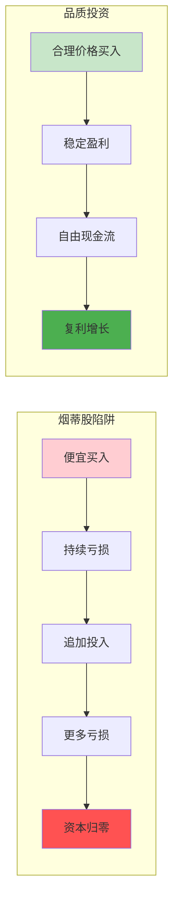
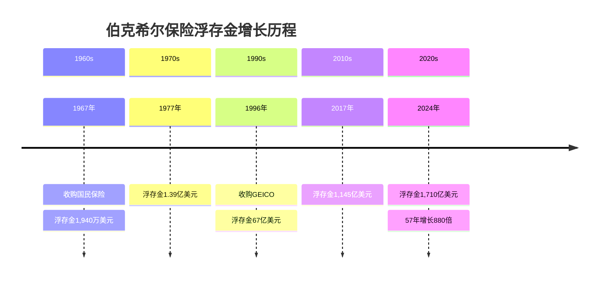
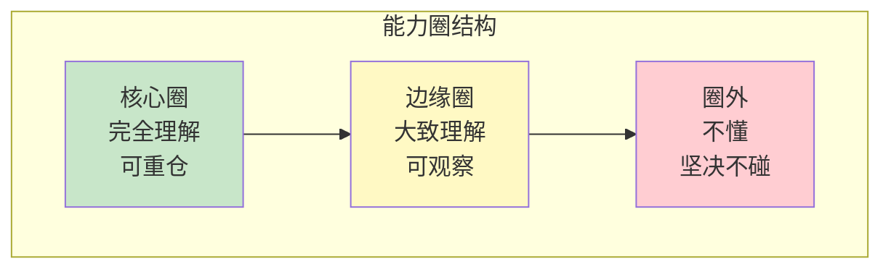
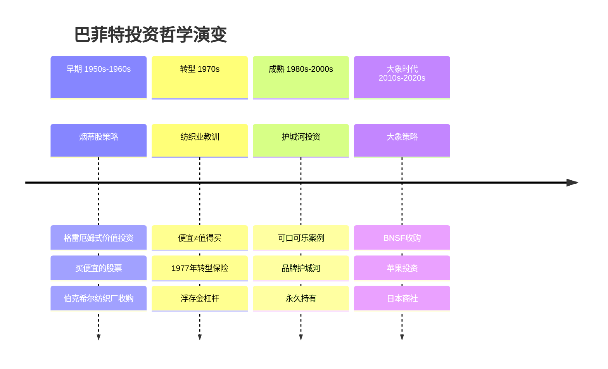
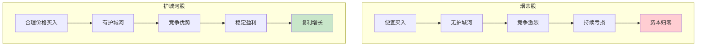

# 第1977年 纺织业转型

## 一、章节定位

**全书位置**：第一阶段的转折点，标志着巴菲特从"烟蒂股"到"品质投资"的思想觉醒。

**章节序列**：巴菲特接管伯克希尔后，纺织业务持续亏损的教训，推动他转向保险和优质资产配置。

**一句话定位**：
> 这是巴菲特投资生涯最重要的"失败"——烟蒂股策略在纺织业上的彻底教训，催生了护城河投资哲学。

---

## 二、核心观点

### 观点1：烟蒂股的教训——便宜不等于值得买

| 层次 | 内容 |
|------|------|
| **表层（案例）** | 1965年巴菲特收购伯克希尔纺织厂，以为是"捡便宜"。但纺织业持续亏损，资本消耗巨大，最终证明是错误的投资。 |
| **中层（机制）** | 烟蒂股陷阱 = 便宜的价格 + 糟糕的生意 + 持续的资本消耗。买入价格低，但维持运营需要不断投入资本。 |
| **底层（规律）** | 烟蒂股定律：**价格便宜不是买入理由，生意本质才是关键。** 没有护城河的生意，再便宜也是陷阱。 |

**降维翻译**：
| 原表达 | 降维表达 | 翻译技巧 |
|--------|----------|----------|
| "烟蒂股" | "捡地上剩下的烟头，还能吸一口" | 用比喻解释 |
| "资本消耗" | "赚的钱都要买设备，没钱分红" | 用现金流解释 |
| "没有护城河" | "谁都能进来竞争" | 用竞争视角 |

**机制可视化**：

---

### 观点2：资本配置哲学——把资本放到最高回报的地方

| 层次 | 内容 |
|------|------|
| **表层（案例）** | 1977年，巴菲特开始将纺织业务的现金流转移到保险业务。虽然纺织业还在运营，但他把重心转向了更高回报的领域。 |
| **中层（机制）** | 资本配置 = 识别高回报机会 + 转移资源 + 坚决执行。巴菲特把纺织业赚的钱投入保险，获得浮存金用于投资。 |
| **底层（规律）** | 资本配置定律：**CEO最重要的工作是决定把资本投到哪里。** 错误的资本配置会毁掉公司价值。 |

**巴菲特资本配置决策矩阵**：

| 决策类型 | 条件 | 行动 |
|----------|------|------|
| 再投资现有业务 | ROE > 资本成本 | 扩大投资 |
| 收购新业务 | 收购回报 > 再投资回报 | 并购 |
| 回购股票 | 股价 < 内在价值 | 回购 |
| 分红 | 无更好投资机会 | 分红 |

---

### 观点3：保险浮存金——伯克希尔的秘密武器

| 层次 | 内容 |
|------|------|
| **表层（案例）** | 1967年收购国民保险公司，获得保险浮存金。1977年浮存金已达1.39亿美元，成为伯克希尔投资的核心杠杆。 |
| **中层（机制）** | 保险浮存金 = 先收保费，后付赔付。在赔付前，这笔钱可以用于投资，相当于零成本甚至负成本的杠杆。 |
| **底层（规律）** | 浮存金定律：**保险业务的本质是获得低成本资金用于投资。** 承保盈利+投资收益=双重收益。 |

**保险浮存金增长**：

---

### 观点4：能力圈意识的觉醒

| 层次 | 内容 |
|------|------|
| **表层（案例）** | 纺织业的失败让巴菲特意识到：他不懂纺织业，不应该投资自己不理解的生意。这是"能力圈"概念的萌芽。 |
| **中层（机制）** | 能力圈 = 你真正理解的领域。在能力圈内，你可以判断价值；在能力圈外，你是在赌博。 |
| **底层（规律）** | 能力圈定律：**知道自己不知道什么，比知道什么更重要。** 承认无知是智慧的开始。 |

**能力圈三层次**：

---

## 三、金句库

### 原书金句

1. "我们选择上市公司的标准：能理解的生意、良好的长期前景、诚实能干的管理层、有吸引力的价格。"
2. "时间是好企业的朋友，是平庸企业的敌人。"
3. "纺织业教会我：当你发现自己在一个洞里，最重要的是停止挖掘。"
4. "宁愿以合理的价格买入优秀的企业，也不以优秀的价格买入平庸的企业。"
5. "烟蒂股的问题在于：最后一口往往是苦的。"

### 降维金句

1. "便宜没好货——股票也一样。"
2. "买股票不看生意，就像买房不看地段。"
3. "纺织业亏的钱，教会巴菲特最重要的一课。"
4. "能力圈就是你的地盘，圈外是别人的地盘，别去送死。"
5. "保险浮存金：别人的钱，你来投资。"
6. "烟蒂股的教训：便宜是陷阱，不是机会。"
7. "资本配置是CEO最重要的工作。"
8. "知道什么你不懂，比知道什么更重要。"
9. "纺织业让巴菲特明白：不是所有便宜股票都值得买。"
10. "好的资本配置：把鸡蛋放在能孵出小鸡的篮子里。"

## 四、当下映射

### 💰 财富应用

| 场景 | 具体行动 | 预期效果 | 风险提示 |
|------|----------|----------|----------|
| 选股 | 不要只看PE低，要看生意本质 | 避开"价值陷阱" | 低估值可能有其原因 |
| 行业分析 | 识别"烟蒂行业"：竞争激烈、无护城河 | 避免踩雷 | 周期性行业需谨慎 |
| 能力圈 | 只投资自己真正理解的领域 | 提高胜率 | 需要诚实面对自己 |

### 💼 职场应用

| 场景 | 具体行动 | 能力要求 | 适用范围 |
|------|----------|----------|----------|
| 职业选择 | 选择有"护城河"的行业/公司 | 行业洞察力 | 长期规划 |
| 资源配置 | 把时间精力投入高回报领域 | 战略思维 | 个人发展 |
| 能力建设 | 深耕自己的能力圈 | 专注力 | 专业成长 |

### 🏠 生活应用

| 场景 | 具体行动 | 可行性 | 见效时间 |
|------|----------|--------|----------|
| 购物决策 | 不只看价格，看产品本质 | 高 | 即时 |
| 时间管理 | 把时间投资在高回报的事情上 | 中 | 3-6个月 |
| 学习方向 | 深耕一个领域，不追热点 | 中 | 长期 |

### 72小时行动计划

1. **今天**：列出你持有的股票，判断哪些在能力圈内，哪些在圈外
2. **本周**：研究一个你感兴趣但不了解的行业，画一张"能力圈边界图"
3. **本月**：审视你的投资组合，识别潜在的"烟蒂股"

---

## 五、章节关联

### 向上关联 → 整书

- **贡献**：1977年纺织业转型是巴菲特投资哲学的分水岭，从"捡烟蒂"到"买好公司"
- **位置**：第一阶段的觉醒时刻，为后续可口可乐、苹果等投资奠定哲学基础

### 横向关联 → 章节间

| 章节 | 关联类型 | 连接描述 |
|------|----------|----------|
| [[深度拆解/1988-可口可乐投资]] | 对比进化 | 纺织业失败 → 护城河投资的转变 |
| [[聪明的投资者-格雷厄姆-拆解记录]] | 理论源头 | 格雷厄姆的烟蒂股策略，被巴菲特超越 |

### 跨书关联 → 知识网络

| 书籍 | 概念 | 关系 | 备注 |
|------|------|------|------|
| [[聪明的投资者-格雷厄姆-拆解记录]] | 烟蒂股策略 | 超越 | 巴菲特超越老师的局限 |
| [[穷查理宝典-拆解记录]] | 能力圈 | 深化 | 芒格与巴菲特共同发展 |
| [[滚雪球-施罗德-拆解记录]] | 人生故事 | 背景 | 纺织业失败的完整故事 |

---

## 六、问答设计

### 记忆层

**Q1**: 巴菲特在哪一年开始意识到纺织业是错误的投资？
- **答案**: 1970年代，1977年是关键节点

**Q2**: 伯克希尔的保险浮存金在1977年达到多少？
- **答案**: 1.39亿美元

### 理解层

**Q3**: 什么是"烟蒂股陷阱"？
- **答案要点**: 便宜的价格 + 糟糕的生意 + 持续的资本消耗 = 越买越亏

**Q4**: 为什么保险浮存金是"免费的杠杆"？
- **答案要点**: 先收保费后赔付，中间时间差可用于投资，成本为零甚至为负

### 应用层

**Q5**: 如何判断一只股票是不是"烟蒂股"？
- **答案要点**: PE低但ROE更低；行业竞争激烈；无护城河；持续亏损

**Q6**: 如何应用"能力圈"原则到你的投资中？
- **答案要点**: 列出你真正理解的行业/公司；只在这些领域投资；承认圈外的无知

### 分析层

**Q7**: 纺织业失败如何改变了巴菲特的投资哲学？
- **答案要点**: 从价格导向转向价值导向；从烟蒂股转向护城河；能力圈意识觉醒

### 评价层

**Q8**: 今天的投资者能从1977年的教训中学到什么？
- **答案要点**: 不追便宜；看生意本质；坚守能力圈；重视资本配置

### 创造层

**Q9**: 设计一个"烟蒂股识别清单"，包含哪些指标？
- **答案要点**:
  - PE < 行业平均但ROE更低
  - 行业竞争激烈，无定价权
  - 资本支出持续高于折旧
  - 自由现金流为负
  - 管理层频繁更换

---

## 七、Mermaid图表

### 图1：巴菲特投资哲学演变

### 图2：烟蒂股vs护城河股对比

---
