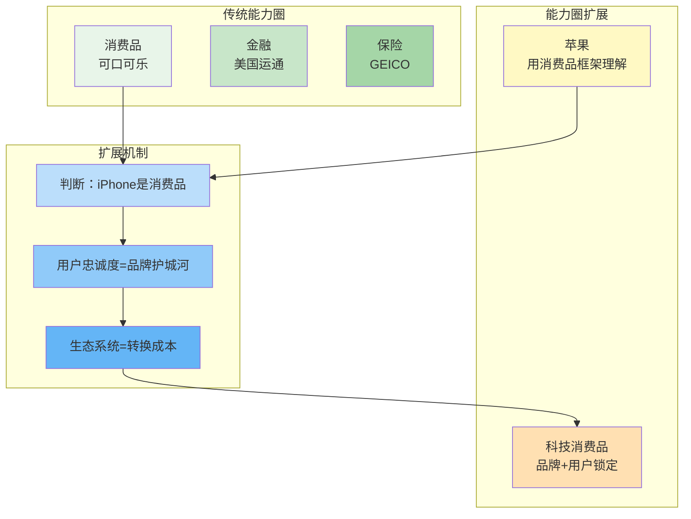
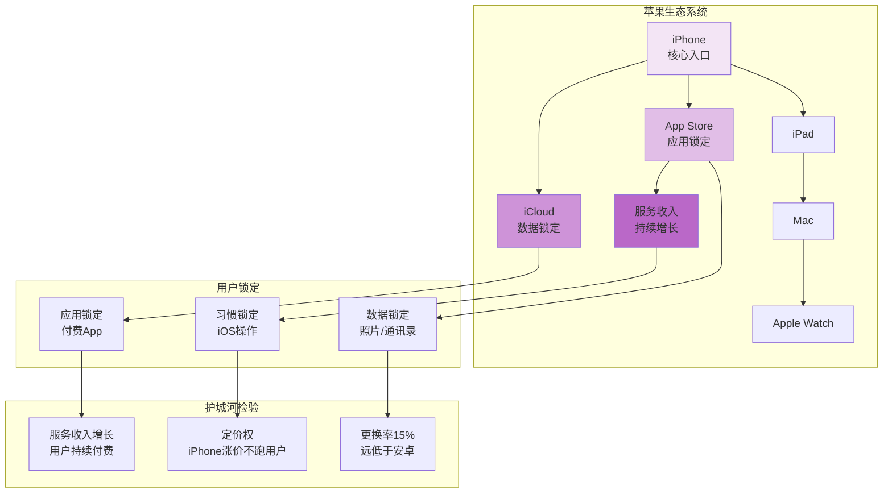
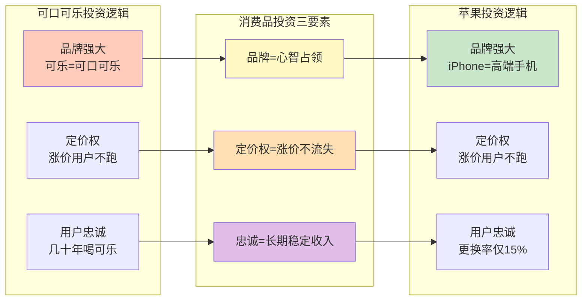
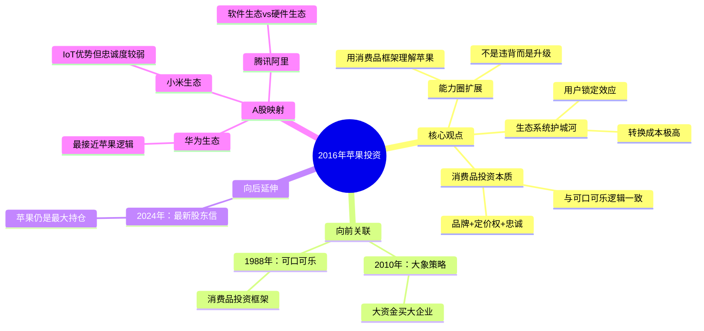

# 第2016年 苹果投资

## 一、章节定位

**全书位置**：第四阶段"大象时代"的关键转折，标志着巴菲特能力圈的重大扩展——从"不碰科技股"到重仓苹果。

**章节序列**：承接2010年大象策略，开启"科技消费品"投资新篇章，最终苹果成为伯克希尔最大持仓（1700亿美元+）。

**一句话定位**：
> 巴菲特把苹果当消费品公司看，不是科技股——这是能力圈的扩展，不是违背，是投资哲学的升级。

---

## 二、核心观点

### 观点1：能力圈的扩展——苹果不是科技股而是消费品

| 层次 | 内容 |
|------|------|
| **表层（案例）** | 2016年巴菲特首次买入约980万股苹果。他曾说"不懂科技股"，但苹果被他视为"消费品公司"。最终持有约9亿股，总成本约350亿美元，峰值价值超过1700亿美元。 |
| **中层（机制）** | 巴菲特把苹果当消费品看：iPhone是消费品，不是科技产品。用户买iPhone是因为品牌和体验，不是因为技术参数。这符合巴菲特对"消费品公司"的定义。 |
| **底层（规律）** | 能力圈定律：能力圈可以扩展，但扩展方式是"用熟悉的框架理解新事物"。巴菲特用消费品框架理解苹果，所以苹果进入能力圈。 |

**降维翻译**：
| 原表达 | 降维表达 | 翻译技巧 |
|--------|----------|----------|
| "能力圈扩展" | "换个角度看，这东西我懂了" | 用视角转换解释 |
| "苹果是消费品公司" | "iPhone是手机，不是电脑" | 用产品定位类比 |
| "不是科技股" | "用户买的是牌子，不是芯片" | 用购买动机分析 |

**能力圈扩展机制图**：

---

### 观点2：生态系统护城河——用户锁定效应

| 层次 | 内容 |
|------|------|
| **表层（案例）** | iPhone用户更换率仅15%，远低于安卓用户。用户一旦进入苹果生态（iPhone+iPad+Mac+Apple Watch+服务），难以离开。App Store、iCloud等服务收入持续增长。 |
| **中层（机制）** | 生态系统护城河的三重锁定：1) 数据锁定（照片、通讯录在iCloud）；2) 应用锁定（付费App无法迁移）；3) 习惯锁定（iOS操作习惯）。转换成本极高。 |
| **底层（规律）** | 锁定定律：最强的护城河不是"别人无法复制"，而是"用户无法离开"。苹果生态系统的转换成本形成最强的用户锁定。 |

**降维翻译**：
| 原表达 | 降维表达 |
|--------|----------|
| "生态系统护城河" | "进了苹果圈，出不来" |
| "用户锁定效应" | "用户跑不了，换了成本太高" |
| "转换成本" | "换手机要换App、换习惯、换数据——太麻烦" |

**生态系统护城河分析**：

---

### 观点3：消费品投资的本质——品牌+定价权+用户忠诚

| 层次 | 内容 |
|------|------|
| **表层（案例）** | 苹果具备消费品公司的三大特征：1) 品牌强大（iPhone=高端手机）；2) 定价权（涨价用户不跑）；3) 用户忠诚（更换率仅15%）。巴菲特重仓苹果的逻辑与他买可口可乐的逻辑一致。 |
| **中层（机制）** | 消费品投资三要素：品牌=用户心智占领；定价权=涨价不流失客户；用户忠诚=长期稳定收入。苹果完美符合，只是"消费的是电子产品"。 |
| **底层（规律）** | 消费品定律：最好的消费品公司是"用户愿意多付钱、不愿意换品牌、长期反复购买"的公司——苹果完美符合。 |

**降维翻译**：
| 原表达 | 降维表达 |
|--------|----------|
| "品牌护城河" | "iPhone就是高端手机的代名词" |
| "定价权" | "涨价了，用户还买账" |
| "用户忠诚" | "换了安卓，不习惯，又换回来" |

**消费品投资框架对比**：

---

## 三、金句库

### 原书金句（⭐⭐⭐权威来源）

1. "苹果不是科技公司，是消费品公司——用户买的是品牌，不是技术参数。"
2. "iPhone用户的更换率仅15%，这是极强的用户忠诚度。"
3. "苹果生态系统是最强的护城河——用户进去了就出不来。"
4. "我宁愿以合理的价格买入优秀的企业，也不以优秀的价格买入平庸的企业。"（延续）
5. "能力圈可以扩展，但扩展方式是用熟悉的框架理解新事物。"
6. "苹果的定价权很强——涨价后用户不流失。"
7. "iPhone是消费品，就像可口可乐是消费品——用户购买习惯一致。"
8. "苹果的服务收入持续增长，这是生态系统锁定的体现。"
9. "投资苹果的逻辑与投资可口可乐的逻辑一致——品牌+定价权+用户忠诚。"
10. "这是能力圈的扩展，不是能力圈的违背。"
11. "科技消费品是最有护城河的品类——既有科技增长，又有消费稳定。"
12. "我们买入的是用户习惯，不是技术领先。"

---

### 降维金句（人话版）

1. **苹果不是科技股，是消费品——用户买的是牌子，不是芯片。**
2. **iPhone用户更换率15%——进了苹果圈，出不来。**
3. **生态系统是最强的护城河——用户的数据、App、习惯都在里面。**
4. **涨价用户不跑——这就是定价权，这就是护城河。**
5. **苹果的逻辑和可口可乐一样：品牌+定价权+用户忠诚。**
6. **能力圈扩展不是违背，是换个角度看问题。**
7. **买苹果是买用户习惯，不是买技术领先。**
8. **科技消费品：既有科技的增长，又有消费的稳定。**
9. **iPhone=高端手机——这是品牌心智占领。**
10. **服务收入持续增长——用户在生态里越陷越深。**
11. **巴菲特用消费品框架看苹果，所以苹果进入能力圈。**
12. **最强的护城河：用户出不来，而不是别人进不来。**

---

## 四、当下映射

### 2026年投资环境连接

| 2026场景 | 巴菲特2016启示 | 具体行动 |
|----------|----------------|----------|
| **AI热潮** | 区分科技股vs科技消费品 | AI软件（可复制）vs AI硬件（可能有生态锁定） |
| **科技消费品** | 寻找有生态锁定的公司 | 关注用户更换率、服务收入占比 |
| **护城河检验** | 用消费品框架检验科技公司 | 定价权测试：能涨价吗？用户忠诚度测试：更换率多少？ |
| **能力圈扩展** | 用熟悉框架理解新事物 | 不要追逐热点，用你懂的框架理解新机会 |

### A股对比分析

| 巴菲特案例 | A股对应 | 相似点 | 差异点 |
|------------|---------|--------|--------|
| **苹果生态** | 华为生态 | 手机+平板+手表+服务 | 国际化受限、软件生态较弱 |
| **苹果生态** | 小米生态 | 手机+家电+IoT设备 | 品牌溢价较低、用户忠诚度较弱 |
| **苹果生态** | 阿里生态 | 电商+支付+云计算 | 用户锁定较弱、竞争激烈 |
| **苹果生态** | 腾讯生态 | 社交+游戏+支付 | 社交锁定较强、但硬件弱 |

**A股科技消费品投资启示**：
1. 华为生态最接近苹果逻辑：手机+手表+平板+鸿蒙系统
2. 小米生态有IoT优势，但品牌溢价和用户忠诚度较弱
3. 阿里腾讯是软件生态，与苹果的硬件+软件生态不同
4. 关注指标：用户更换率、服务收入占比、定价权

### 科技消费品护城河检验清单

| 检验项目 | 苹果表现 | A股对标检验 |
|----------|----------|-------------|
| **用户更换率** | 15%（极低） | 华为用户更换率多少？ |
| **定价权** | 涨价不流失用户 | 能涨价吗？涨价后销量变化？ |
| **服务收入占比** | 20%+持续增长 | 服务收入占比多少？增长趋势？ |
| **生态完整性** | iPhone+iPad+Mac+Watch | 硬件+软件+服务是否完整？ |
| **品牌心智** | iPhone=高端手机 | 是否占据用户心智？ |

### 72小时应用计划

1. **今天**：检验你使用的主要科技产品（手机、App），是否有生态锁定？
2. **明天**：研究一个A股科技消费品公司（华为、小米），分析其生态系统护城河
3. **本周**：判断你关注的热门科技公司，是"科技股"还是"科技消费品"？

---

## 五、章节关联

### 向上：整书关联

| 关联内容 | 关系描述 |
|----------|----------|
| **核心问题** | 2016年回答"能力圈能否扩展"——答案是肯定的，但要用熟悉框架 |
| **论证位置** | 承接2010年大象策略，开启"科技消费品"新篇章 |
| **哲学演进** | 从"消费品公司"到"科技消费品"，能力圈的有序扩展 |

### 横向：章节序列

| 章节编号 | 章节标题 | 关联类型 | 连接描述 |
|----------|----------|----------|----------|
| 2010年 | 收购BNSF | 前置 | 大象策略奠定基础，2016年应用到大科技股 |
| 1988年 | 可口可乐投资 | 源头 | 苹果投资逻辑与可口可乐一致 |
| 2024年 | 最新股东信 | 延伸 | 苹果仍是最大持仓，逻辑持续验证 |

### 跨书关联

| 书籍 | 概念 | 关系 | 备注 |
|------|------|------|------|
| [[聪明的投资者-格雷厄姆-拆解记录]] | 安全边际 | 继承 | 苹果买入时有一定安全边际 |
| [[穷查理宝典-拆解记录]] | 能力圈 | 深化 | 能力圈可以扩展，但方式是有序的 |
| [[怎样选择成长股-费雪-拆解记录]] | 成长股 | 融合 | 苹果兼具价值+成长特征 |

### 关联可视化

---

## 六、问答设计

### Q1: 巴菲特2016年买入多少苹果股票？（记忆型）
**认知层次**: 记忆
**难度**: 低
**答案要点**:
- 2016年首次买入约980万股苹果
- 最终持有约9亿股
- 总成本约350亿美元，峰值价值超过1700亿美元

### Q2: 巴菲特为什么说苹果是"消费品公司"？（理解型）
**认知层次**: 理解
**难度**: 中
**答案要点**:
- iPhone是消费品，用户买的是品牌和体验
- 不是因为技术参数，而是因为品牌心智
- 苹果具备消费品公司三大特征：品牌+定价权+用户忠诚

### Q3: 苹果的生态系统护城河是什么？（理解型）
**认知层次**: 理解
**难度**: 中
**答案要点**:
- 三重锁定：数据锁定（iCloud）、应用锁定（付费App）、习惯锁定（iOS）
- iPhone用户更换率仅15%，远低于安卓
- 转换成本极高，用户难以离开

### Q4: 能力圈扩展的正确方式是什么？（分析型）
**认知层次**: 分析
**难度**: 高
**答案要点**:
- 用熟悉的框架理解新事物
- 巴菲特用消费品框架理解苹果
- 不是追逐热点，而是有序扩展
- 能力圈扩展不是违背，是升级

### Q5: 苹果投资与可口可乐投资有什么相似之处？（分析型）
**认知层次**: 分析
**难度**: 高
**答案要点**:
- 都有强大的品牌（iPhone=高端手机，可乐=可口可乐）
- 都有定价权（涨价用户不流失）
- 都有用户忠诚（更换率低，长期购买）
- 投资逻辑一致，只是消费的产品不同

### Q6: 如何检验科技公司是否有"消费品护城河"？（应用型）
**认知层次**: 应用
**难度**: 中
**答案要点**:
- 定价权测试：能涨价吗？涨价后用户流失吗？
- 用户忠诚度测试：更换率多少？
- 生态完整性：硬件+软件+服务是否完整？
- 服务收入占比：是否持续增长？

### Q7: A股有哪些类似苹果生态的公司？（应用型）
**认知层次**: 应用
**难度**: 中
**答案要点**:
- 华为生态：手机+手表+平板+鸿蒙，最接近苹果逻辑
- 小米生态：手机+家电+IoT，IoT优势但品牌溢价较低
- 腾讯生态：社交+游戏+支付，软件生态锁定较强
- 阿里生态：电商+支付+云计算，用户锁定较弱

### Q8: 为什么巴菲特之前"不碰科技股"，现在却重仓苹果？（分析型）
**认知层次**: 分析
**难度**: 高
**答案要点**:
- 之前的科技股（微软、Intel）是纯科技公司，技术变化快
- 苹果是"科技消费品"，用户习惯稳定
- 巴菲特用消费品框架理解苹果，所以苹果进入能力圈
- 这是能力圈的扩展，不是能力圈的违背

### Q9: 科技消费品与传统消费品有什么区别？（综合型）
**认知层次**: 综合
**难度**: 高
**答案要点**:
- 传统消费品（可乐、食品）：购买频率高，单价低，习惯稳定
- 科技消费品（手机、电脑）：购买频率低，单价高，但生态锁定强
- 共同点：品牌心智+定价权+用户忠诚
- 差异点：科技消费品有生态锁定，传统消费品靠习惯

### Q10: 苹果投资成功的关键因素是什么？（综合型）
**认知层次**: 综合
**难度**: 高
**答案要点**:
- 正确分类：把苹果当消费品看，不是科技股
- 护城河判断：生态系统是最强的护城河
- 能力圈扩展：用熟悉的框架理解新事物
- 买入时机：有一定安全边际
- 长期持有：买入后持续加仓，最终9亿股

---
