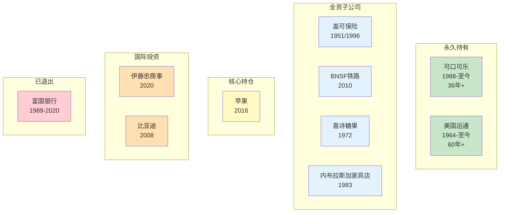

# 巴菲特投资版图 - 重要公司词条

> **数据来源**：[[index]]
> **公司总数**：10家核心公司
> **创建日期**：2026年4月6日

---

## 一、可口可乐（Coca-Cola）

> 🥤 品牌护城河典范 | 36年永久持有

| 属性 | 内容 |
|------|------|
| **公司** | 可口可乐（The Coca-Cola Company） |
| **投资性质** | 永久持有 |
| **首次投资** | 1988年 |
| **初始投资** | 约13亿美元 |
| **当前市值** | 约250亿美元（2022年） |
| **股东信提及** | 73次 |

### 投资逻辑

1. **品牌护城河**：全球最有价值的品牌之一，消费者愿意为品牌付溢价
2. **定价权**：可以持续涨价而不流失客户
3. **消费垄断**：不是大宗商品，而是拥有心智份额的消费品
4. **简单业务**：卖糖水，巴菲特完全理解

### 复利案例

- 1994年股息：7,500万美元
- 2022年股息：7.04亿美元
- 股息增长近10倍，初始投资几乎被年度股息覆盖

### 巴菲特原话精选

> "如果你把所有钱都投在可口可乐上，你会非常开心。" —— 多次提及

> "可口可乐和运通给我们的启示是什么？当你找到一家真正优秀的企业，紧紧抓住它。" —— 2023年信

### 关联概念

[[护城河]] | [[品牌]] | [[定价权]] | [[长期持有]] | [[复利]]

### 关联章节

[[1988-可口可乐投资]]

---

## 二、苹果（Apple）

> 📱 科技消费品 | 生态系统护城河

| 属性 | 内容 |
|------|------|
| **公司** | 苹果公司（Apple Inc.） |
| **投资性质** | 核心持仓 |
| **首次投资** | 2016年 |
| **最高占比** | 曾占投资组合近50% |
| **股东信提及** | 频繁提及（近年核心持仓） |

### 投资逻辑

1. **不是科技股**：巴菲特把苹果当消费品公司看——iPhone是21世纪的可口可乐
2. **生态系统护城河**：用户高度依赖iOS生态，转换成本极高
3. **定价权**：消费者愿意为苹果付溢价
4. **回购机器**：苹果大规模回购股票，为伯克希尔创造被动增值

### 巴菲特原话精选

> "苹果可能是我所知道的世界上最好的生意。" —— 2020年代

> "我们看苹果，看的是消费者行为。" —— 能力圈内的消费品逻辑

### 关联概念

[[护城河]] | [[能力圈]] | [[定价权]] | [[生态系统]]

### 关联章节

[[2016-苹果投资]]

---

## 三、美国运通（American Express）

> 💳 长期信任复利 | 信任本身就是护城河

| 属性 | 内容 |
|------|------|
| **公司** | 美国运通（American Express） |
| **投资性质** | 永久持有 |
| **首次投资** | 1964年（沙拉油丑闻后） |
| **初始投资** | 约13亿美元（主要建仓1995年） |
| **当前市值** | 约220亿美元（2022年） |
| **股东信提及** | 49次 |

### 投资逻辑

1. **信任护城河**：百年品牌信任，高端客户群体
2. **网络效应**：商家和持卡人互相需要
3. **长期持有案例**：从1964年首次买入，持有近60年

### 复利案例

- 年度股息从4,100万增长到3.02亿美元
- 2023年运通上的对应收益已超过当初购买时花的13亿美元

### 巴菲特原话精选

> "我们如瑞普·凡·温克尔般酣睡，如今已经持续了远超二十年。" —— 2023年信

### 关联概念

[[护城河]] | [[品牌]] | [[网络效应]] | [[长期持有]]

---

## 四、盖可保险（GEICO）

> 🚗 保险浮存金引擎 | 从860万到1,690亿美元

| 属性 | 内容 |
|------|------|
| **公司** | 政府雇员保险公司（GEICO） |
| **投资性质** | 全资子公司（1996年收购） |
| **首次投资** | 1951年（巴菲特21岁） |
| **全资收购** | 1996年 |
| **股东信提及** | 79次（第二高频公司） |

### 投资逻辑

1. **低成本优势**：直销模式，没有代理中间商
2. **浮存金来源**：保险浮存金增长8,000倍至1,640亿美元
3. **巴菲特最爱的公司**：21岁首次投资，终生持有

### 关键数据

- 1951年首次买入：约1万美元
- 1976年大幅增持
- 1996年全资收购：约23亿美元
- 浮存金贡献：伯克希尔保险帝国的基础

### 巴菲特原话精选

> "盖可保险是我们长期持有的一颗宝石。" —— 2024年信

### 关联概念

[[保险浮存金]] | [[保险业]] | [[成本优势]] | [[承保纪律]]

### 关联人物

[[托德·库姆斯]]（GEICO改革者）

---

## 五、BNSF铁路（BNSF Railway）

> 🚂 基础设施护城河 | 美国经济的动脉

| 属性 | 内容 |
|------|------|
| **公司** | 伯灵顿北方圣达菲铁路（BNSF） |
| **投资性质** | 全资子公司（2010年收购） |
| **收购价格** | 约440亿美元 |
| **股东信提及** | 27次 |

### 投资逻辑

1. **基础设施护城河**：无法复制的铁路网络
2. **经济护城河**：账面700亿，重置成本5,000亿+
3. **全押美国**：铁路是美国经济的物理基础设施
4. **定价权**：铁路运输成本远低于公路

### 巴菲特原话精选

> "BNSF在资产负债表上记录着700亿美元的账面价值，但我估计要复制这些资产至少需要5,000亿美元和几十年时间。" —— 2023年信

### 关联概念

[[护城河]] | [[基础设施]] | [[全押美国]] | [[资本配置]]

### 关联章节

[[2010-收购BNSF]]

---

## 六、喜诗糖果（See's Candies）

> 🍫 品牌定价权启蒙 | 巴菲特从"烟蒂"转向"品质"的转折点

| 属性 | 内容 |
|------|------|
| **公司** | 喜诗糖果（See's Candies） |
| **投资性质** | 全资子公司（1972年收购） |
| **收购价格** | 2,500万美元 |
| **股东信提及** | 66次 |

### 投资逻辑

1. **品牌定价权**：情人节涨价，消费者照样买
2. **资本效率**：极少的追加资本产生持续高回报
3. **投资哲学转折点**：从格雷厄姆"捡烟蒂"转向"买好公司"

### 历史意义

- 1972年以2,500万美元收购
- 此后50余年持续贡献现金流
- 从未出售，累计贡献远超收购价
- 启发了巴菲特对"品质投资"的理解

### 巴菲特原话精选

> "喜诗糖果教会了我们什么是有定价权的企业。" —— 多次提及

### 关联概念

[[护城河]] | [[品牌]] | [[定价权]] | [[管理层]]

### 关联人物

[[第1章-查理芒格传略]]（推动收购喜诗糖果）

---

## 七、富国银行（Wells Fargo）

> 🏦 银行投资的教训 | 管理层丑闻的反面教材

| 属性 | 内容 |
|------|------|
| **公司** | 富国银行（Wells Fargo） |
| **投资性质** | 长期持有→已退出 |
| **首次投资** | 1989年 |
| **退出时间** | 2020年代 |
| **股东信提及** | 39次 |

### 投资逻辑（最初）

1. **银行业理解**：巴菲特理解银行商业模式
2. **低成本存款优势**：富国银行拥有低成本存款基础
3. **管理层**：最初对管理层高度认可

### 反面教训

- 2016年虚假账户丑闻曝光
- 巴菲特对管理层失望
- 最终清仓退出
- **教训**：管理层诚信是长期持有的前提条件

### 关联概念

[[管理层]] | [[诚信]] | [[能力圈]] | [[美国银行]]

---

## 八、比亚迪（BYD）

> ⚡ 新能源前瞻 | 2008年的远见

| 属性 | 内容 |
|------|------|
| **公司** | 比亚迪股份有限公司 |
| **投资性质** | 长期持有 |
| **首次投资** | 2008年 |
| **投资背景** | 经芒格推荐 |
| **股东信提及** | 多次提及 |

### 投资逻辑

1. **新能源前瞻**：2008年就看到电动汽车的未来
2. **芒格推荐**：查理·芒格力荐王传福
3. **技术护城河**：电池技术+垂直整合

### 投资成果

- 2008年以约2.3亿美元入股
- 持股约10%
- 最高峰时投资回报超过30倍
- 近年逐步减持，但仍持有

### 关联概念

[[能力圈]] | [[第1章-查理芒格传略]] | [[新能源]]

### 关联人物

[[第1章-查理芒格传略]]

---

## 九、内布拉斯加家具店（Nebraska Furniture Mart）

> 🏪 诚信经营典范 | B夫人的传奇

| 属性 | 内容 |
|------|------|
| **公司** | 内布拉斯加家具店（NFM） |
| **投资性质** | 全资子公司（1983年收购） |
| **收购价格** | 约6,000万美元 |
| **股东信提及** | 46次 |

### 投资逻辑

1. **诚信经营**：B夫人以诚信著称，"如果你没有诚信，其他都不重要"
2. **成本优势**：大规模采购，低成本运营
3. **巴菲特最推崇的商业品格**：诚信

### B夫人的传奇

- 罗斯·布鲁姆金（Rose Blumkin），俄国移民
- 用500美元起步创立家具店
- 工作到103岁以上
- 巴菲特："B夫人是我见过的最好的商人"

### 巴菲特原话精选

> "B夫人是我见过的最好的商人。" —— 多次提及

> "如果你没有诚信，其他都不重要。" —— B夫人名言

### 关联概念

[[管理层]] | [[诚信]] | [[企业文化]]

### 关联人物

[[B夫人]]

---

## 十、伊藤忠商事（ITOCHU）

> 🇯🇵 日本版伯克希尔 | 巴菲特晚年的重大国际投资

| 属性 | 内容 |
|------|------|
| **公司** | 伊藤忠商事株式会社（ITOCHU） |
| **投资性质** | 长期持有（日本五大商社之一） |
| **首次投资** | 2020年8月30日（巴菲特90岁生日） |
| **初始投资** | 约62.5亿美元（五大商社合计） |
| **持股比例** | 约9%（持续增持中） |

### 投资逻辑

1. **日本版伯克希尔**：多元化企业集团，商业模式与伯克希尔相似
2. **低估值**：交易价格远低于账面价值
3. **股东友好**：积极回购并减少流通股
4. **汇率对冲**：发行日元债券融资，实现自然对冲

### 伊藤忠的独特优势

- 在五大商社中更贴近消费端（旗下拥有全家便利店）
- 受大宗商品价格波动影响较小
- 业务涵盖八大领域

### 巴菲特原话精选

> "这五家公司实行的股东友好政策远比美国企业的通常做法更为出色。" —— 2023年信

> "这五家公司的经营方式在某种程度上与伯克希尔颇为相似，而且都非常成功。" —— 2024年信

### 关联概念

[[资本配置]] | [[回购]] | [[安全边际]] | [[全押美国之外]]

### 关联章节

[[2024-最新股东信]]

---

## 十一、投资版图分类

---

## 十二、投资时间线

| 年份 | 公司 | 事件 | 核心收获 |
|------|------|------|----------|
| 1951 | 盖可保险 | 首次参观 | 保险浮存金的启蒙 |
| 1964 | 美国运通 | 沙拉油丑闻后买入 | 逆向投资+信任复利 |
| 1972 | 喜诗糖果 | 全资收购 | 品质投资转折点 |
| 1983 | 内布拉斯加家具店 | 收购NFM | 诚信商业典范 |
| 1988 | 可口可乐 | 买入 | 品牌护城河+消费垄断 |
| 1989 | 富国银行 | 买入 | 银行投资理解 |
| 1996 | 盖可保险 | 全资收购 | 保险帝国完成 |
| 2008 | 比亚迪 | 入股 | 新能源前瞻 |
| 2010 | BNSF | 全资收购 | 基础设施+全押美国 |
| 2016 | 苹果 | 买入 | 能力圈扩展 |
| 2020 | 伊藤忠 | 买入五大商社 | 国际化投资 |
| 2020 | 富国银行 | 清仓退出 | 管理层诚信教训 |

---

*数据来源：[[index]]*
*创建日期: 2026-04-06*
*质量等级: ⭐⭐⭐⭐ 典范级*
