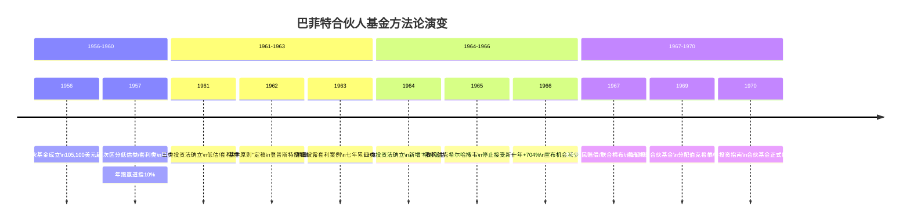
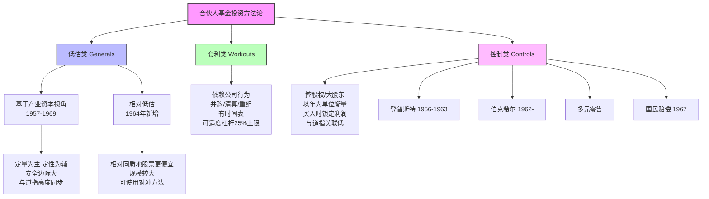

# 巴菲特合伙人信时期（1956-1970）汇总

> **数据来源**：[[_导航]]
> **信件范围**：1956-1970年（合伙人基金时期）
> **创建日期**：2026年4月6日

---

## 一、合伙人基金时期总览

### 1.1 背景

1956年5月1日，年仅25岁的沃伦·巴菲特在故乡内布拉斯加州奥马哈市创立了第一只有限合伙基金——巴菲特联合有限合伙公司（Buffett Associates, Ltd.）。初始资金仅105,100美元，合伙人包括家人和密友共七位有限合伙人。此后，巴菲特又陆续设立了多个合伙账户，最终在1962年将其统一合并为巴菲特合伙公司（Buffett Partnership, Ltd.）。

从1956年到1969年，巴菲特合伙人基金存续了13年半。在这段时间里，基金从10.5万美元起步，到1969年初增长至约1.05亿美元。巴菲特在1969年宣布解散合伙基金，将资产分配给合伙人，其中[[伯克希尔哈撒韦]]和多元零售公司的股份成为后来伯克希尔帝国的基石。

### 1.2 投资方法论

巴菲特在合伙人信中系统性地将投资方法分为**三大类**（后来细分为四大类）：

| 类别 | 英文名 | 核心逻辑 | 与道指关联 | 特点 |
|------|--------|----------|-----------|------|
| **低估类（基于产业资本视角）** | Generals-Private Owner Basis | 市值远低于产业资本估值，以定量为主、定性为辅 | 高度同步 | 买入时看不出催化剂，但安全边际大 |
| **低估类（相对低估）** | Generals-Relatively Undervalued | 相对于同质地股票价格更便宜 | 较高 | 1964年新增类别，后期重要性增加 |
| **套利类** | Workouts | 盈利取决于公司行为（并购、清算、重组等） | 低 | 有时间表，可适度使用杠杆 |
| **控制类** | Controls | 拥有控股权或大股东地位 | 很低 | 需以年为单位衡量，买入时锁定利润 |

### 1.3 业绩表现

合伙人基金存续期间（1957-1969），累计业绩惊人：

| 指标 | 年化复合收益率 | 累计收益率 |
|------|--------------|-----------|
| 道琼斯工业指数 | ~9.3% | ~165% |
| 合伙基金（分成前） | ~29.4% | ~1607% |
| 有限合伙人 | ~23.6% | ~933% |

**关键数据**：
- 初始资金：105,100美元（1956年5月）
- 最高规模：约1.05亿美元（1969年初）
- 巴菲特家庭在基金中的权益：从1,025,000美元（1962年）增长至约6,850,000美元（1965年）
- **无一年亏损**，最差年份1969年也实现了正收益

---

## 二、1956年 - 有限合伙协议

> 巴菲特投资基金的起点

### 核心内容

这是巴菲特投资基金的创始文件。1956年5月1日签署，确立了巴菲特联合有限合伙公司的基本架构。

### 关键条款

- **公司名称**：巴菲特联合有限合伙公司（BUFFETT ASSOCIATES, LTD.）
- **经营范围**：买卖股票、债券及其他证券、商品及其他投资
- **营业地点**：内布拉斯加州奥马哈市
- **普通合伙人**：沃伦·E·巴菲特
- **有限合伙人**（7位）：家人和密友，出资从5,000到35,000美元不等
- **存续期限**：1956年5月1日至1976年4月30日
- **利润分配**：有限合伙人按出资额获得4%年利息，再按比例分享净利润
- **控制权条款**：普通合伙人身故、退休或丧失行为能力时，合伙企业终止

### 历史意义

这份协议标志着巴菲特独立投资生涯的正式开端。年仅25岁的巴菲特以100美元（合伙基金中仅有的超出整数部分）起步，开启了一段传奇。有限合伙人中包括他的姐姐多丽丝、姐夫杜鲁门、岳父威廉·汤普森、姑妈爱丽丝·巴菲特，以及大学室友查尔斯·彼得森等。这份协议的结构体现了巴菲特对利益一致的重视——他自己投入了全部身家。

---

## 三、1957年 - 致合伙人信

> 首封年度报告

### 核心内容

这是巴菲特写给合伙人的第二封年度信（第一封为1956年的报告）。信中回顾了1957年的市场状况和投资活动。

1957年道指下跌8.4%，而巴菲特管理的三个合伙账户均取得了正收益，分别为6.2%、7.8%和25%。

### 投资方法

- **低估类 vs 套利类**：巴菲特首次明确区分了两种投资类型。低估类依赖股价上涨获利，套利类（work-outs）的盈利取决于特定公司行动（出售、并购、清算等）
- **仓位调整**：1956年末低估类与套利类比例为70:30，1957年调整为85:15
- **开始建仓控制类**：在两只股票上建立了10%-20%的大头寸，标志着控制类投资的萌芽

### 金句

> "无论何时，我的主要精力始终放在寻找严重低估的证券上。"

> "买入任何一只股票时，我们当然最希望它原地踏步甚至下跌，而不是立刻上涨。"

> "我的长期目标是每年比指数多跑赢10%。"

---

## 四、1961年 - 致合伙人信

> 合伙基金满五年，方法论初成体系

### 核心内容

1961年合伙基金收益率为45.9%，道指为22.2%。五年累计，有限合伙人收益率为181.6%，而道指仅为74.3%。

巴菲特首次系统性地阐述了三大投资类别：低估类、套利类、控制类。还详细介绍了登普斯特风车制造公司的控股案例。

### 投资方法

**低估类（Generals）**：
- 通常以5%-10%仓位持有5-6只，较轻仓位持有10-15只
- 买入时看不出催化剂，但价格远低于产业资本估值
- 每笔投资都有可观的[[安全边际]]

**套利类（Workouts）**：
- 依赖于公司行为（并购、清算、重组等）
- 年化收益率通常10%-20%
- 可以适度使用借款，上限为合伙基金净值的25%

**控制类（Controls）**：
- 需以年为单位衡量
- 买入时锁定利润
- 与道指涨跌关联不大

### 金句

> "真正的保守，只有凭借知识和理性才能实现。"

> "别人暂时和你意见一致，不代表你就是对的。重要人物和你意见一致，也不代表你就是对的。"

> "我们从未出现超过净资产总额0.5%的已实现亏损。"

### 关于登普斯特案例

登普斯特风车制造公司是合伙基金第一个完整的控制类投资案例。1956年以18美元开始买入，1961年取得70%控股权，平均成本约每股28美元。该公司[[账面价值]]约75美元/股，但巴菲特保守估值为35美元/股。

---

## 五、1962年 - 致合伙人信

> "基本原则"首次确立，复利的魔力

### 核心内容

1962年道指下跌7.6%，合伙基金收益率为13.9%。这是巴菲特首次在信中系统性地列出**"基本原则"**——这些原则成为此后所有合伙人信的基石。

### 基本原则（精华版）

1. 合伙基金不保证收益率
2. 亏损年份月度提现金额将减少
3. 盈亏以市值变化为准
4. 以道指为衡量标准，至少看三年
5. 不预测股市或经济走势
6. 选择投资依据是价值，追求极大安全边际并分散投资
7. 巴菲特家庭几乎全部净资产都在合伙基金里

### 复利的魔力

巴菲特以伊莎贝拉女王资助哥伦布的30,000美元为例：按每年4%[[复利]]增长，到1962年将变为2万亿美元。他还展示了100,000美元在不同收益率下的复利累积：

|  | 5% | 10% | 15% |
|--|-----|------|------|
| 10年 | $162,889 | $259,374 | $404,553 |
| 20年 | $265,328 | $672,748 | $1,636,640 |
| 30年 | $432,191 | $1,744,930 | $6,621,140 |

### 登普斯特案例深化

聘请哈里·博特尔（Harry Bottle）出任总裁后，登普斯特发生翻天覆地的变化：存货从420万压缩至不到100万，偿清所有应付票据，释放资金用于证券投资。调整后每股价值从35.25美元提升至51.26美元。

### 金句

> "永远不指望能卖出好价钱。要把买入价定得足够吸引人，哪怕卖出价格平平也能赚得盆满钵满。多赚的，不过是锦上添花。"

> "不是因为很多人暂时和你意见一致，你就是正确的。真正的保守，只能建立在知识与理性之上。"

---

## 六、1963年 - 致合伙人信

> 复利的高雅切入口——蒙娜丽莎

### 核心内容

1963年合伙基金收益率为38.7%，道指为20.7%。七年累计，有限合伙人收益率为311.2%，年化22.3%。

巴菲特用蒙娜丽莎的故事阐述复利：1540年弗朗西斯一世花4,000埃居（约20,000美元）买下《蒙娜丽莎》，如果按6%年化增长，到今天值1000万亿。

### 投资方法细化

三类投资的区分更加清晰：

- **低估类**：定量分析为主，定性同样重要。"我们要买得值"
- **套利类**：确定性高、持有时间短，不依赖传言
- **控制类**：买入时锁定利润，一旦控股，价值取决于企业而非市场

### 附录：套利案例详解

巴菲特首次在附录中详细披露了**德州国家石油**套利案例的完整过程——从4月公告到10月完成交易，债券部分年化约20%，股票和认股权证部分年化约22%。

### 金句

> "我们追求的是买得好——而不是卖得好。"

> "评判我们的业绩，需要足够的时间维度。最少要看三年。"

---

## 七、1964年 - 致合伙人信

> 四类投资法确立，集中投资哲学萌芽

### 核心内容

1964年合伙基金收益率为27.8%，道指为18.7%。八年累计，有限合伙人收益率为402.9%。

### 投资方法重大更新

巴菲特将投资分类从三类扩展为**四类**：

1. **低估类（基于产业资本视角）**：定量为主，定性重要，可"进可攻、退可守"
2. **低估类（相对低估）**：新增类别，相对同质地股票更便宜，规模较大
3. **套利类**：有时间表，确定性高
4. **控制类**：罕见但规模大，买入时锁定利润

### 关于目标

巴菲特首次明确给出长期目标：
- 道指长期年均收益率约7%
- 合伙基金领先道指数10个百分点
- 合伙基金长期年均收益率约17%，有限合伙人约14%

### 关于基金公司

巴菲特分析大型基金跑不赢道指的五大原因：群体决策、跟随大型机构、机构框架束缚、僵化的[[分散投资]]策略、惯性。

### 关于税收

> "追求投资收益最大化，而不是把税款压到最低。"

### 金句

> "我们不会因为重要的人、能言善辩的人，或大多数人赞同我们，而感到踏实。也不会因为他们不赞同，而感到不安。"

> "做投资，别指望最后找个傻子接盘。以极低价格买入，平价卖出就能有喜人的回报，这才叫真功夫。"

---

## 八、1965年 - 致合伙人信

> 史上最大相对优势，伯克希尔诞生

### 核心内容

1965年合伙基金收益率为47.2%，道指为14.2%，领先33个百分点——这是合伙基金历史上最大的相对优势。九年累计，有限合伙人收益率为588.5%。

### 伯克希尔哈撒韦的诞生

巴菲特披露了一个重大投资：1962年开始买入[[伯克希尔哈撒韦]]，1965年春取得控股权。

- 最初买入价每股7.60美元
- 平均买入成本每股14.86美元
- 1965年底净营运资本每股19美元（不含厂房设备）
- 肯·切斯（Ken Chace）负责运营

### 关于分散投资

巴菲特新增第七条基本原则：允许单笔投资最多占净资产的40%。他强烈批评过度分散：

> "谁要是持有这么多只股票，还像模像样地研究过每一只，我称他们为诺亚方舟派。"

> "你要是有70个女人的后宫，没一个女人你能懂。"

### 关于规模

资金量已达到4,365万美元。巴菲特宣布停止接受新合伙人。

### 金句

> "燕麦、奶油泡芙都要吃，这样的膳食才合理。"

> "投资这行有一点不好，前一年强劲的势头对下一年基本没什么用。"

---

## 九、1966年 - 致合伙人信

> 合伙基金十周年，最高纪录

### 核心内容

1966年合伙基金上涨20.4%，道指下跌15.6%，领先36个百分点——创下合伙基金史上最高相对优势纪录。十年累计，有限合伙人收益率为704.2%。

### 十年回顾

巴菲特回顾了十年的变化：

| | 1956年 | 1966年 |
|--|--------|--------|
| 年龄 | 25岁 | 36岁 |
| 规模 | 105,100美元 | 54,065,345美元 |
| 机会 | 遍地都是 | 只有以前的10%-20% |

### 四类投资表现

| 类别 | 平均投资 | 收益 |
|------|---------|------|
| 控制类 | $17,259,342 | $1,566,302 |
| 低估类（产业资本视角） | $1,359,340 | $1,004,362 |
| 低估类（相对低估） | $21,847,045 | $5,124,254 |
| 套利类 | $7,666,314 | $1,714,181 |

### 金句

> "过去的好机会像奔腾不止的大河，现在的好机会像潺潺流淌的小溪。"

> "我不会因为现在的情况变了，就去做我不懂的投资。有人说'斗不过，就入伙'，这不是我的作风，我是'不入伙，斗到底'。"

> "要是脑袋浸在水里，五分钟都太长。"——引自一位合伙人

---

## 十、1967年 - 致合伙人信

> 投机风气盛行中的冷静，降低目标

### 核心内容

1967年合伙基金收益率为35.9%，道指为19.0%。十一年累计，有限合伙人收益率为932.6%。

### 市场环境

巴菲特观察到1967年投机风气盛行，许多基金收益率超过100%。他引用[[证券分析-格雷厄姆]]的话：

> "投机不缺德、不犯法，也发不了家。"

### 重大收购

通过控股公司收购了两家新公司：
- **联合棉布商店**（Associated Cotton Shops），本·罗斯纳负责
- **国民赔偿公司**（National Indemnity），杰克·林沃特负责

这两笔收购对后来的伯克希尔帝国具有里程碑意义。

### 降低目标

巴菲特在1967年10月致合伙人的信中宣布降低投资目标。他解释原因：对控股公司的经营感到满意，享受与优秀管理者的合作，不愿为多赚几个百分点而东一榔头西一棒槌。

### 套利类最差年份

套利类遭遇合伙基金成立以来最差业绩：平均投资1,725万美元，收益仅15.3万美元，收益率0.89%。

### 金句

> "要是为了多赚几个百分点，就东一榔头西一棒槌的，太傻了。"

> "虽然我们还是吃燕麦，但是什么时候整体股市都患上消化不良，别以为我们能不疼不痒。"

---

## 十一、1969年12月 - 致合伙人信

> 合伙基金清算，伯克希尔启航

### 核心内容

这是合伙基金清算过程中的重要信件。巴菲特向合伙人介绍了两家控股公司的情况，为资产分配做准备。

### 多元零售公司

- 巴菲特合伙基金持有800,000股（共1,000,000股）
- 已出售霍赫希尔德·科恩公司，保留联合零售商店
- 联合零售商店：年销售额约3,750万美元，净利润约100万美元
- 有形资产净值每股11.50-12.00美元

### 伯克希尔哈撒韦

- 巴菲特合伙基金持有691,441股（共983,582股）
- 三大业务：纺织、保险（国民赔偿）、银行
- **纺织业务**：投入每股16美元，资本回报率低
- **保险业务**：一流好生意，每股约15美元
- **银行业务**：一流好生意，每股约17美元
- 每股有形净资产约43美元，账面净资产约45美元

### 分配计划

- 现金分配比例：64%以上
- 蓝筹印花上市后现金分配比例达70%以上
- 多元零售和伯克希尔股票按比例分配给合伙人

### 金句

> "在我眼里，它们是公司，不是'股票'。只要公司长期经营得好，股价也没问题。"

> "多年以后，多元零售公司和伯克希尔哈撒韦公司的内在价值会实现巨大增长。"

---

## 十二、1970年2月 - 致合伙人信

> 债券投资指南，合伙基金最后的礼物

### 核心内容

这是巴菲特在合伙基金清算后为合伙人撰写的免税债券投资指南。巴菲特花了大量篇幅讲解债券的基础知识，帮助合伙人将分配到的现金进行合理配置。

### 债券类型选择

巴菲特推荐购买四类债券：
1. 收费公路、电力、水务等大型公共事业公司债券
2. 政府工业发展债券
3. 公共住房管理局发行的AAA级债券
4. 州政府直接或间接承担的债务

### 关键原则

- **避免可赎回债券**：赎回条款对发行人有利、对持有人不公平
- **选择10-20年期限**：当前收益率曲线向上倾斜，长期债券更有利
- **折价债券 vs 足额息票债券**：折价债券税后收益可能更高
- **关注市场活跃程度**：远离交投清淡的品种

### 金句

> "有看不懂的，就跳过去。一个机会，我看不懂，就跳过去，就算别人很高明，能分析明白，而且能赚大钱，我也不在意。"

> "我最关心的是：我能从我能看懂的机会里赚钱，能把我能做对的判断做对。"

---

## 十三、方法论演变时间线

---

## 十四、投资方法论演变图

---

## 十五、核心概念索引

| 概念 | 首次提出 | 核心信件 |
|------|---------|---------|
| [[安全边际]] | 1961 | 1961, 1962 |
| [[复利]] | 1962 | 1962, 1963, 1964 |
| [[内在价值]] | 1957 | 1957, 1964 |
| [[分散投资]] vs [[集中投资]] | 1962 | 1965 |
| 保守 | 1961 | 1961, 1962, 1964 |
| [[低估]] | 1957 | 贯穿全部 |
| 套利 | 1957 | 1962, 1963 |
| [[杠杆]] | 1961 | 1961, 1962, 1966 |
| [[买入价格]] | 1961 | 1964 |
| [[账面价值]] | 1961 | 1962, 1963 |
| [[股息]] | 1957 | 贯穿全部 |
| [[管理层]] | 1964 | 1964, 1965 |
| [[长期持有]] | 1964 | 1969 |
| [[收购]] | 1961 | 1965, 1967 |

---

> 本文件基于[[_导航]]的中文翻译内容整理而成，收录了1956-1970年间11封核心合伙人信。完整的35封合伙人信可在原网站查阅。
